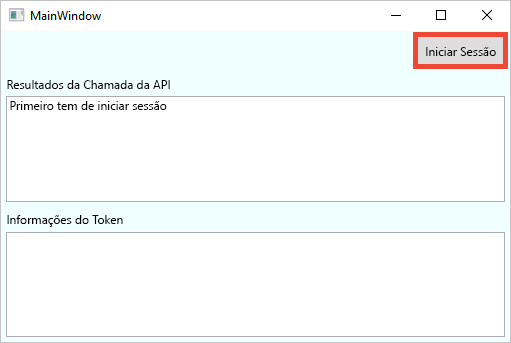
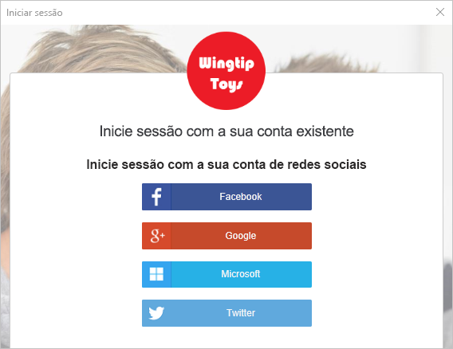
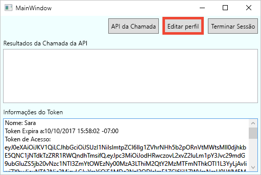
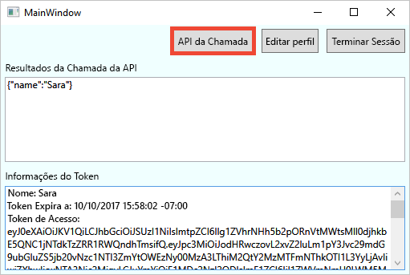

# <a name="quickstart-set-up-sign-in-for-a-desktop-app-using-azure-active-directory-b2c"></a>Início Rápido: configurar o início de sessão para uma aplicação de ambiente de trabalho através do Azure Active Directory B2C

Azure Active Directory B2C (Azure AD B2C) provides cloud identity management to keep your application, business, and customers protected. O Azure AD B2C permite às aplicações fazer a autenticação em contas de redes sociais e contas empresariais, através de protocolos padrão abertos. Neste início rápido, vai utilizar uma aplicação de ambiente de trabalho do Windows Presentation Foundation (WPF) para iniciar sessão através de um fornecedor de identidade de redes sociais e chamar uma API Web protegida pelo Azure AD B2C.

[!INCLUDE [quickstarts-free-trial-note](../../includes/quickstarts-free-trial-note.md)]

## <a name="prerequisites"></a>Pré-requisitos

- [Visual Studio 2019](https://www.visualstudio.com/downloads/) with the **ASP.NET and web development** workload.
- A social account from either Facebook, Google, or Microsoft.
- [Transfira um ficheiro zip](https://github.com/Azure-Samples/active-directory-b2c-dotnet-desktop/archive/master.zip) ou clone a aplicação Web de exemplo a partir do GitHub.

    ```
    git clone https://github.com/Azure-Samples/active-directory-b2c-dotnet-desktop.git
    ```

## <a name="run-the-application-in-visual-studio"></a>Executar a aplicação no Visual Studio

1. Na pasta de projeto da aplicação de exemplo, abra a solução **active-directory-b2c-wpf.sln** no Visual Studio.
2. Prima **F5** para depurar a aplicação.

## <a name="sign-in-using-your-account"></a>Iniciar sessão com a sua conta

1. Clique em **Iniciar sessão** para iniciar o fluxo de trabalho **Inscrever-se ou Iniciar Sessão**.

    

    The sample supports several sign-up options. These options include using a social identity provider or creating a local account using an email address. For this quickstart, use a social identity provider account from either Facebook, Google, or Microsoft.


2. Azure AD B2C presents a sign-in page for a fictitious company called Fabrikam for the sample web application. Para inscrever-se através de um fornecedor de identidade de redes sociais, clique no botão do fornecedor de identidade que pretende utilizar.

    

    You authenticate (sign in) using your social account credentials and authorize the application to read information from your social account. Ao conceder acesso, a aplicação pode obter as informações do perfil da conta de rede social, como o nome e a localidade.

2. Conclua o processo de início de sessão para o fornecedor de identidade.

    Os detalhes do perfil da nova conta são pré-preenchidos com as informações da sua conta da rede social.

## <a name="edit-your-profile"></a>Editar o seu perfil

O Azure AD B2C fornece funcionalidades para permitir que os utilizadores atualizem os seus perfis. The sample web app uses an Azure AD B2C edit profile user flow for the workflow.

1. Na barra de menus da aplicação, clique em **Editar perfil** para editar o perfil que criou.

    

2. Escolha o fornecedor de identidade associado à conta que criou. For example, if you used Facebook as the identity provider when you created your account, choose Facebook to modify the associated profile details.

3. Altere o **Nome a apresentar** ou a **Cidade** e, em seguida, clique em **Continuar**.

    É apresentado um novo token de acesso na caixa de acesso *Informações do token*. Se pretender verificar as alterações ao seu perfil, copie e cole o token de acesso no descodificador de token https://jwt.ms.

## <a name="access-a-protected-api-resource"></a>Aceder a um recurso protegido da API

Clique em **Chamar API** para fazer um pedido ao recurso protegido.

    

    The application includes the Azure AD access token in the request to the protected web API resource. The web API sends back the display name contained in the access token.

Utilizou com êxito a conta de utilizador do Azure AD B2C para fazer uma chamada autorizada para uma API Web protegida pelo Azure AD B2C.

## <a name="clean-up-resources"></a>Limpar recursos

Pode utilizar o inquilino do Azure AD B2C se planeia experimentar outros inícios rápidos ou tutoriais do Azure AD B2C. Quando já não for necessário, pode [eliminar o inquilino do Azure AD B2C](active-directory-b2c-faqs.md#how-do-i-delete-my-azure-ad-b2c-tenant).

## <a name="next-steps"></a>Passos seguintes

In this quickstart, you used a sample desktop application to:

* Sign in with a custom login page
* Sign in with a social identity provider
* Create an Azure AD B2C account
* Call a web API protected by Azure AD B2C

Comece a criar o seu próprio inquilino do Azure AD B2C.

> [!div class="nextstepaction"]
> [Criar um inquilino do Azure Active Directory B2C no portal do Azure](tutorial-create-tenant.md)
