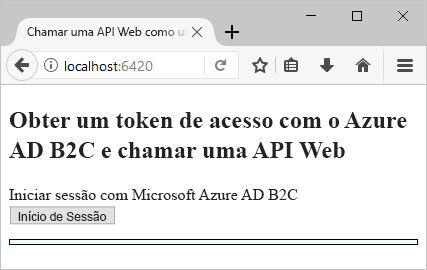
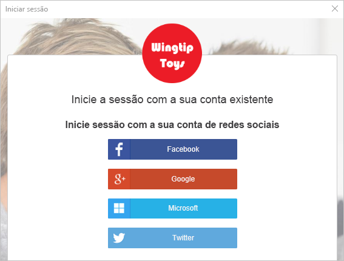
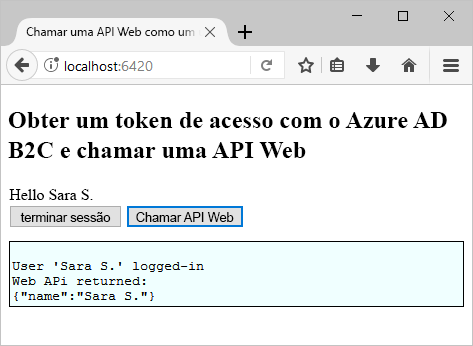

# <a name="quickstart-set-up-sign-in-for-a-single-page-app-using-azure-active-directory-b2c"></a>Início rápido: Configurar o início de sessão para uma aplicação de página única com o Azure Active Directory B2C

O Azure Active Directory (Azure AD) B2C fornece gestão de identidades na cloud para manter as aplicações, as empresas e os clientes protegidos. O Azure AD B2C permite às aplicações fazer a autenticação em contas de redes sociais e contas empresariais, através de protocolos padrão abertos. Neste início rápido, vai utilizar uma aplicação de página única para iniciar sessão com um fornecedor de identidade de redes sociais e chamar uma API Web protegida pelo Azure AD B2C.

[!INCLUDE [quickstarts-free-trial-note](../../includes/quickstarts-free-trial-note.md)]

## <a name="prerequisites"></a>Pré-requisitos

- [Visual Studio 2019](https://www.visualstudio.com/downloads/) com o **desenvolvimento na web e ASP.NET** carga de trabalho.
- Instalar o [Node. js](https://nodejs.org/en/download/)
- Uma conta de rede social do Facebook, Google, Microsoft ou Twitter.
- [Transfira um ficheiro zip](https://github.com/Azure-Samples/active-directory-b2c-javascript-msal-singlepageapp/archive/master.zip) ou clone a aplicação Web de exemplo a partir do GitHub.

    ```
    git clone https://github.com/Azure-Samples/active-directory-b2c-javascript-msal-singlepageapp.git
    ```

## <a name="run-the-application"></a>Executar a aplicação

1. Inicie o servidor ao executar os seguintes comandos na linha de comandos do Node.js:

    ```
    cd active-directory-b2c-javascript-msal-singlepageapp
    npm install && npm update
    node server.js
    ```

    O Server.js produz o número de porta na qual está a escutar no localhost.

    ```
    Listening on port 6420...
    ```

2. Navegue para o URL da aplicação. Por exemplo, `http://localhost:6420`.

## <a name="sign-in-using-your-account"></a>Iniciar sessão com a sua conta

1. Clique em **Iniciar sessão** para iniciar o fluxo de trabalho.

    

    O exemplo suporta várias opções de inscrição, incluindo através de um fornecedor de identidade de redes sociais ou criando uma conta local com um endereço de e-mail. Neste início rápido, utilize uma conta de fornecedor de identidade de redes sociais do Facebook, Google, Microsoft ou Twitter.

2. O Azure AD B2C apresenta uma página de início de sessão personalizada para uma marca fictícia com o nome Wingtip Toys para a aplicação Web de exemplo. Para inscrever-se através de um fornecedor de identidade de redes sociais, clique no botão do fornecedor de identidade que pretende utilizar.

    

    Autentica (início de sessão) com sua conta de redes sociais, credenciais e autorize a aplicação para ler as informações da sua conta de redes sociais. Ao conceder acesso, a aplicação pode obter as informações do perfil da conta de rede social, como o nome e a localidade.

3. Conclua o processo de início de sessão para o fornecedor de identidade.

## <a name="access-a-protected-api-resource"></a>Aceder a um recurso protegido da API

Clique em **Chamar API Web** para que o nome a apresentar seja devolvido na chamada da API Web como um objeto JSON.



A aplicação de página única de exemplo inclui um token de acesso no pedido ao recurso protegido da API Web.

## <a name="clean-up-resources"></a>Limpar recursos

Pode utilizar o inquilino do Azure AD B2C se planeia experimentar outros inícios rápidos ou tutoriais do Azure AD B2C. Quando já não for necessário, pode [eliminar o inquilino do Azure AD B2C](active-directory-b2c-faqs.md#how-do-i-delete-my-azure-ad-b2c-tenant).

## <a name="next-steps"></a>Passos Seguintes

Neste início rápido, utilizou um aplicativo de página única de exemplo para:

* Inicie sessão com uma página de início de sessão personalizado
* Inicie sessão com um fornecedor de identidade social
* Criar uma conta do Azure AD B2C
* Chamar uma API web protegida pelo Azure AD B2C

Comece a criar o seu próprio inquilino do Azure AD B2C.

> [!div class="nextstepaction"]
> [Criar um inquilino do Azure Active Directory B2C no portal do Azure](tutorial-create-tenant.md)
