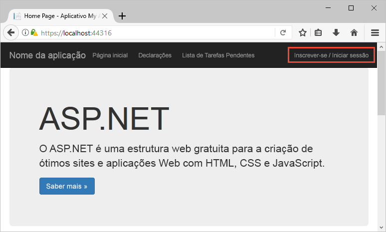
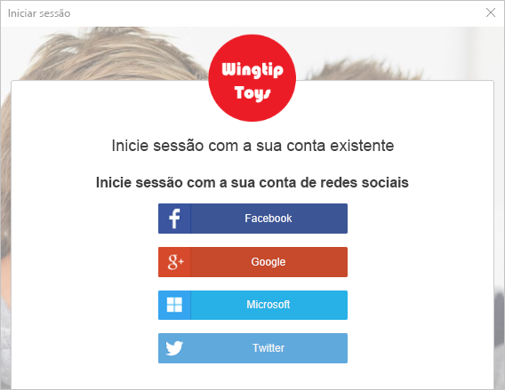
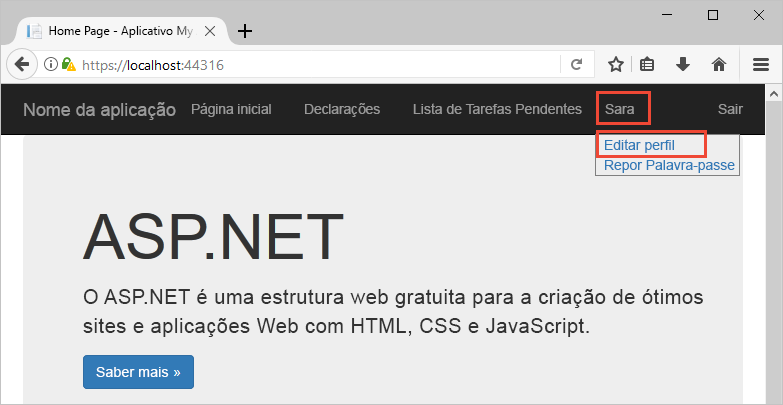
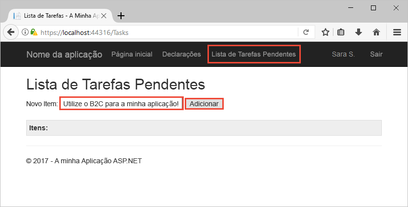

# <a name="quickstart-set-up-sign-in-for-an-aspnet-application-using-azure-active-directory-b2c"></a>Início rápido: configurar a entrada para um aplicativo ASP.NET usando Azure Active Directory B2C

O Azure Active Directory B2C (Azure AD B2C) fornece gerenciamento de identidade de nuvem para manter seus aplicativos, negócios e clientes protegidos. O Azure AD B2C permite às aplicações fazer a autenticação em contas de redes sociais e contas empresariais, através de protocolos padrão abertos. Neste início rápido, vai utilizar uma aplicação ASP.NET para iniciar sessão com um fornecedor de identidade de redes sociais e chamar uma API Web protegida pelo Azure AD B2C.

[!INCLUDE [quickstarts-free-trial-note](../../includes/quickstarts-free-trial-note.md)]

## <a name="prerequisites"></a>Pré-requisitos

- [Visual Studio 2019](https://www.visualstudio.com/downloads/) com a ASP.net e a carga de trabalho de **desenvolvimento da Web** .
- Uma conta social do Facebook, do Google ou da Microsoft.
- [Transfira um ficheiro zip](https://github.com/Azure-Samples/active-directory-b2c-dotnet-webapp-and-webapi/archive/master.zip) ou clone a aplicação Web de exemplo a partir do GitHub.

    ```
    git clone https://github.com/Azure-Samples/active-directory-b2c-dotnet-webapp-and-webapi.git
    ```

    Há dois projetos na solução de exemplo:

    - **TaskWebApp** - uma aplicação Web que cria e edita uma lista de tarefas. O aplicativo Web usa o fluxo de usuário de inscrição **ou de entrada** para inscrever-se ou conectar usuários.
    - **TaskService** - uma API Web que suporta a funcionalidade de criação, leitura, atualização e eliminação da lista de tarefas. A API Web é protegida pelo Azure AD B2C e chamada pela aplicação Web.

## <a name="run-the-application-in-visual-studio"></a>Executar a aplicação no Visual Studio

1. Na pasta de projeto da aplicação de exemplo, abra a solução **B2C-WebAPI-DotNet.sln** no Visual Studio.
2. Para este início rápido, vai executar ambos os projetos **TaskWebApp** e **TaskService** em simultâneo. Clique com o botão direito do rato na solução **B2C-WebAPI-DotNet** no Explorador de Soluções e, em seguida, selecione **Definir Projetos de Arranque**.
3. Selecione **Vários projetos de arranque** e altere a **Ação** de ambos os projetos para **Iniciar**.
4. Clique em **OK**.
5. Prima **F5** para depurar as duas aplicações. Cada aplicação abre no seu próprio separador do browser:

    - `https://localhost:44316/` - aplicação Web ASP.NET. No início rápido, interage diretamente com esta aplicação.
    - `https://localhost:44332/` - a API Web que é chamada pela aplicação Web ASP.NET.

## <a name="sign-in-using-your-account"></a>Iniciar sessão com a sua conta

1. Clique em **Inscrever-se / Iniciar sessão** na aplicação Web ASP.NET para iniciar o fluxo de trabalho.

    

    O exemplo suporta várias opções de inscrição, incluindo através de um fornecedor de identidade de redes sociais ou criando uma conta local com um endereço de e-mail. Para este guia de início rápido, use uma conta de provedor de identidade social do Facebook, do Google ou da Microsoft.

2. Azure AD B2C apresenta uma página de entrada para uma empresa fictícia chamada Fabrikam para o aplicativo Web de exemplo. Para inscrever-se através de um fornecedor de identidade de redes sociais, clique no botão do fornecedor de identidade que pretende utilizar.

    

    Você autentica (entra) usando suas credenciais de conta social e autoriza o aplicativo a ler informações de sua conta social. Ao conceder acesso, a aplicação pode obter as informações do perfil da conta de rede social, como o nome e a localidade.

3. Conclua o processo de início de sessão para o fornecedor de identidade.

## <a name="edit-your-profile"></a>Editar o seu perfil

O Azure Active Directory B2C fornece funcionalidades para permitir que os utilizadores atualizem os seus perfis. O aplicativo Web de exemplo usa um fluxo de usuário de Azure AD B2C Editar perfil para o fluxo de trabalho.

1. Na barra de menus da aplicação, clique no nome do perfil e selecione **Editar perfil** para editar o perfil que criou.

    

2. Altere o seu **Nome a apresentar** ou **Cidade** e, em seguida, clique em **Continuar** para atualizar o seu perfil.

    A alteração é apresentada na parte superior direita da home page da aplicação Web.

## <a name="access-a-protected-api-resource"></a>Aceder a um recurso protegido da API

1. Clique em **Lista de Tarefas** para introduzir e modificar os itens da lista de tarefas.

2. Introduza texto na caixa de texto **Novo Item**. Clique em **Adicionar** para chamar a API Web protegida pelo Azure AD B2C, que adiciona um item da lista de tarefas.

    

    A aplicação Web ASP.NET inclui um token de acesso do Azure AD no pedido para o recurso da API Web protegido para executar operações nos itens da lista de tarefas do utilizador.

Utilizou com êxito a conta de utilizador do Azure AD B2C para fazer uma chamada autorizada para uma API Web protegida pelo Azure AD B2C.

## <a name="clean-up-resources"></a>Limpar recursos

Pode utilizar o inquilino do Azure AD B2C se planeia experimentar outros inícios rápidos ou tutoriais do Azure AD B2C. Quando já não for necessário, pode [eliminar o inquilino do Azure AD B2C](active-directory-b2c-faqs.md#how-do-i-delete-my-azure-ad-b2c-tenant).

## <a name="next-steps"></a>Passos seguintes

Neste guia de início rápido, você usou um aplicativo ASP.NET de exemplo para:

* Entrar com uma página de logon personalizada
* Entrar com um provedor de identidade social
* Criar uma conta de Azure AD B2C
* Chamar uma API da Web protegida por Azure AD B2C

Comece a criar o seu próprio inquilino do Azure AD B2C.

> [!div class="nextstepaction"]
> [Criar um inquilino do Azure Active Directory B2C no portal do Azure](tutorial-create-tenant.md)
