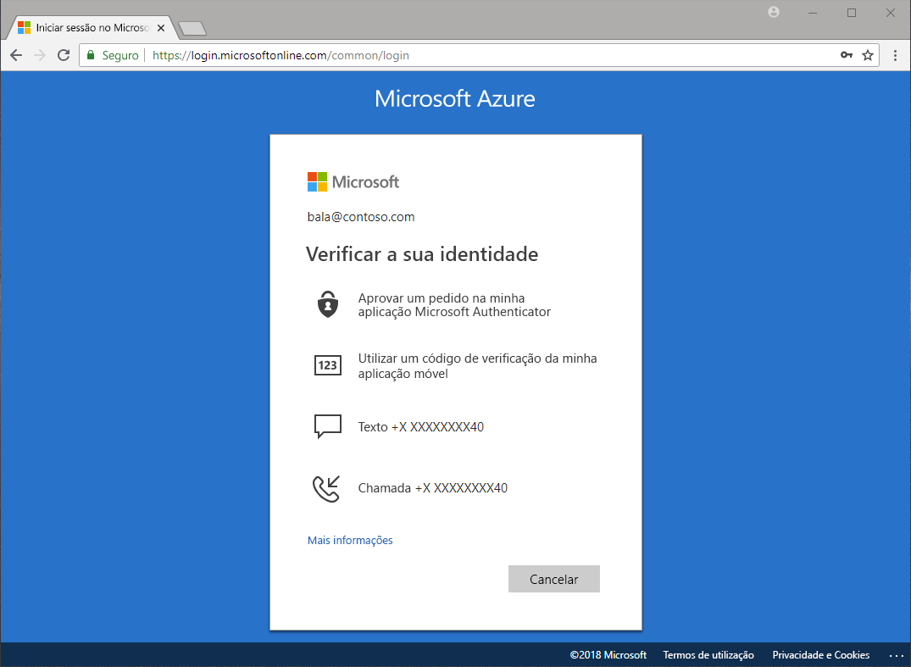

# Que métodos de autenticação estão disponíveis?

Ouvimos nas notícias que as palavras-passe estão a ser roubadas e as identidades comprometidas. Um segundo fator além de uma palavra-passe aumenta imediatamente a segurança da sua organização. O Microsoft Azure Active Directory (Azure AD) inclui funcionalidades, como o Multi-Factor Authentication do Azure (MFA do Azure) e a reposição personalizada de palavra-passe (SSPR) do Azure AD, para ajudar os administradores a proteger as suas organizações e utilizadores com métodos de autenticação adicionais.

Há muitos cenários que incluem: entrar em um aplicativo, redefinir sua senha, habilitar o Windows Hello e outros, os usuários podem ser solicitados a fornecer verificação adicional de que eles dizem serem.

A verificação adicional pode ser na forma de métodos de autenticação, como:

* Um código fornecido numa mensagem de texto ou e-mail
* Uma chamada telefónica
* Uma notificação ou código no telemóvel
* Respostas às perguntas de segurança

O MFA do Azure e a reposição personalizada de palavra-passe do Azure AD permitem aos administradores controlar a configuração, política, monitorização e relatórios com o Azure AD e o portal do Azure para proteger as suas organizações.

## Reposição personalizada de palavra-passe

A reposição personalizada de palavra-passe permite aos utilizadores repor a palavra-passe, sem qualquer intervenção do administrador, quando e onde precisarem.

> [!VIDEO https://www.youtube.com/embed/hc97Yx5PJiM]

A reposição personalizada de palavra-passe inclui:

* **Alteração da palavra-passe:** sei qual é a minha palavra-passe, mas quero alterá-la para uma nova.
* **Reposição da palavra-passe:** não consigo iniciar sessão e quero repor a minha palavra-passe através de um ou mais métodos de autenticação aprovados.
* **Desbloqueio da conta:** não consigo iniciar sessão porque a minha conta está bloqueada e quero desbloqueá-la através de um ou mais métodos de autenticação aprovados.

## Multi-Factor Authentication

A Azure Multi-Factor Authentication (MFA) é uma solução de verificação em dois passos da Microsoft. Ao utilizar métodos de autenticação aprovados pelo administrador, o MFA do Azure ajuda a salvaguardar o acesso a dados e aplicações, enquanto cumpre a exigência de um processo de início de sessão simples.

## Requisitos de licença

[!INCLUDE [Active Directory P1 license](../../../includes/active-directory-p1-license.md)]

## Passos seguintes

O passo seguinte é configurar a reposição personalizada de palavra-passe e o Multi-Factor Authentication do Azure.

Para começar a utilizar a reposição personalizada de palavra-passe, veja o artigo de início rápido [Ativar a SSPR](quickstart-sspr.md).

Saiba mais sobre a reposição personalizada de palavra-passe no artigo, [Como funciona: reposição personalizada de palavra-passe do Azure AD](concept-sspr-howitworks.md)

Saiba mais sobre o Multi-Factor Authentication do Azure no artigo [Como funciona: Multi-Factor Authentication do Azure](concept-mfa-howitworks.md)
