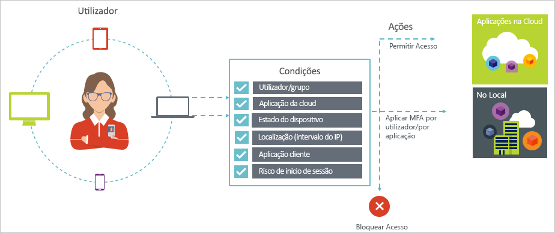
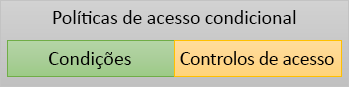

# O que é o Acesso Condicional?

A segurança é uma das principais preocupações para as organizações que utilizam a cloud. Um dos principais aspetos da segurança na cloud é a identidade e o acesso no que diz respeito a gerir os recursos na cloud. Num mundo “mobile-first, cloud-first”, os utilizadores podem aceder aos recursos da sua organização com diversos dispositivos e aplicações em qualquer local. Como resultado, limitar-se a concentrar-se apenas em quem pode aceder a um recurso já não é suficiente. Para controlar o equilíbrio entre segurança e produtividade, também tem de ter em conta de que forma é que se acede a um determinado recurso numa decisão de controlo de acesso. Com o acesso condicional do Azure Active Directory (Azure AD), pode solucionar este requisito. Acesso condicional é um recurso do Azure Active Directory. Com acesso condicional, é possível implementar as decisões de controlo de acesso automatizado para aceder às suas aplicações na cloud que se baseiam em condições.

Políticas de acesso condicional são aplicadas após o primeiro--factor authentication foi concluído. Por conseguinte, acesso condicional não se destina como uma defesa de linha de primeira para cenários como denial-of-service (DoS) distribuídos, mas pode utilizar os sinais desses eventos (por exemplo, o nível de risco de início de sessão, a localização do pedido e assim por diante) para determinar o acesso.  

Este artigo fornece uma descrição geral conceptual do acesso condicional no Azure AD.

## Cenários comuns

Num mundo “mobile-first, cloud-first”, o Azure Active Directory proporciona o início de sessão único em dispositivos, aplicações e serviços, em qualquer local. Com a proliferação de dispositivos (incluindo dispositivos BYOD), do trabalho fora das redes das empresas e das aplicações SaaS de terceiros, as equipas de TI estão perante dois objetivos opostos:

- Capacitar os utilizadores a ser produtivos em qualquer local e em qualquer momento
- Proteger os recursos da empresa em todos os momentos

Ao utilizar políticas de acesso condicional, é possível aplicar os controlos de acesso corretas sob as condições necessárias. De acesso condicional do AD do Azure fornece segurança adicional quando for necessário e permanece fora de forma do utilizador quando não estiver.

Seguem-se algumas preocupações comuns de acesso que o acesso condicional pode ajudá-lo com:

- **[Início de sessão de risco](conditions.md#sign-in-risk)** : O Azure AD Identity Protection Deteta os riscos de início de sessão. Como restringe o acesso se um risco de início de sessão detetado indicar um ator malicioso? E se quiser ter provas mais sólidas de que um início de sessão foi feito por um utilizador legítimo? E se as suas dúvidas forem tão fundamentadas para o levarem inclusivamente a impedir utilizadores específicos de aceder a uma aplicação?  
- **[Localização de rede](location-condition.md)** : O Azure AD é acessível em qualquer lugar. E se alguém tentar aceder numa localização de rede que não está sob o controlo do seu departamento de TI? A combinação de nome de utilizador e palavra-passe pode ser uma prova de identidade suficientemente forte para tentativas de acesso feitas a partir da rede da sua empresa. E se precisar de uma prova de identidade mais sólida para as tentativas de acesso que são iniciadas noutros países ou regiões do mundo inesperados? E se quiser até bloquear tentativas de acesso em determinadas localizações?  
- **[Gestão de dispositivos](conditions.md#device-platforms)** : No Azure AD, os utilizadores podem aceder a aplicações de cloud contra uma grande variedade de dispositivos, incluindo dispositivos móveis e também dispositivos pessoais. E se quiser que as tentativas de acesso sejam feitas apenas com dispositivos geridos pelo seu departamento de TI? E se quiser inclusivamente impedir determinados tipos de dispositivos de aceder às aplicações na cloud no seu ambiente?
- **[Aplicação de cliente](conditions.md#client-apps)** : Hoje em dia, pode aceder a muitas aplicações na cloud com tipos de aplicações diferentes, como aplicações baseadas na web, aplicações móveis ou aplicativos de desktop. E se for feita uma tentativa de acesso com um tipo de aplicação cliente que origina problemas conhecidos? E se quiser que seja utilizado um dispositivo gerido pelo departamento de TI para determinados tipos de aplicações?

Essas perguntas e respostas relacionadas representam cenários comuns de acesso para o acesso condicional do Azure AD.
Acesso condicional é um recurso do Azure Active Directory permite-lhe manipular os cenários de acesso usando uma abordagem baseada em políticas.

> [!VIDEO https://www.youtube.com/embed/eLAYBwjCGoA]

## Políticas de acesso condicional

Uma política de acesso condicional é uma definição de um cenário de acesso usando o seguinte padrão:

**When this happens** (Quando isto acontece) define o motivo para acionar a política. Esse motivo é caracterizado por um conjunto de condições que foram verificadas. No acesso condicional do Azure AD, as condições de atribuição de dois um papel especial:

- **[Os utilizadores](conditions.md#users-and-groups)** : Os usuários que realizarem uma tentativa de acesso (**quem**).
- **[Aplicações na cloud](conditions.md#cloud-apps-and-actions)** : Os destinos de uma tentativa de acesso (**o que**).

Estas duas condições são obrigatórias numa política de acesso condicional. Para além dessas duas condições obrigatórias, também pode incluir outras que descrevem a forma como a tentativa de acesso é feita. Os exemplos mais comuns são utilizar dispositivos móveis ou localizações fora da rede da sua empresa. Para obter mais informações, consulte [condições no Azure Active Directory condicional acesso](conditions.md).

A combinação de condições com controlos de acesso representa uma política de acesso condicional.

Com acesso condicional do Azure AD, pode controlar os utilizadores autorizados como pode aceder às suas aplicações na cloud. O objetivo de uma política de acesso condicional é impor controlos de acesso adicional sobre uma tentativa de acesso a uma aplicação da cloud com base na forma como é efetuada uma tentativa de acesso.

Uma abordagem baseada em políticas para proteger o acesso às aplicações na cloud é começar a desenhar os requisitos das políticas para o seu ambiente com a estrutura descrita neste artigo sem se preocupar com a implementação técnica.

## Acesso condicional do Azure AD e autenticação federada

Políticas de acesso condicional funcionam perfeitamente com [autenticação federada](../../security/azure-ad-choose-authn.md#federated-authentication). Este suporte inclui condições todos com suporte e controles e visibilidade para a aplicação para utilizador ativo inícios de sessão através da política [relatórios do Azure AD](../reports-monitoring/concept-sign-ins.md).

*Autenticação federada com o Azure AD* significa que um serviço de autenticação fidedigno processa a autenticação do utilizador no Azure AD. Um serviço de autenticação fidedigno é, por exemplo, o Active Directory Federation Services (AD FS) ou qualquer outro serviço de federação. Nesta configuração, a autenticação de utilizador principal é executada no serviço e, em seguida, o Azure AD é utilizado para iniciar sessão em aplicações individuais. Acesso condicional do Azure AD é aplicado antes do acesso é concedido ao aplicativo que o usuário está acessando. 

Quando a política de acesso condicional configurada requer autenticação multifator, o Azure AD está predefinido para utilizar o MFA do Azure. Se utilizar o serviço de federação para MFA, pode configurar o Azure AD para redirecionar para o serviço de federação quando for necessário MFA, ao definir `-SupportsMFA` como `$true` no [PowerShell](https://docs.microsoft.com/powershell/module/msonline/set-msoldomainfederationsettings). Esta definição funciona para os serviços de autenticação federada que suportam o pedido de desafio MFA emitido pelo Azure AD com `wauth= http://schemas.microsoft.com/claims/multipleauthn`.

Depois de o utilizador ter iniciado sessão no serviço de autenticação federada, o Azure AD processa outros requisitos de política, como a conformidade do dispositivo ou uma aplicação aprovada.

## Requisitos de licença

[!INCLUDE [Active Directory P1 license](../../../includes/active-directory-p1-license.md)]

Os clientes com [licenças do Microsoft 365 empresas](https://docs.microsoft.com/office365/servicedescriptions/microsoft-365-business-service-description) também tem acesso a funcionalidades de acesso condicional. 

## Passos Seguintes

Para saber como implementar o acesso condicional no seu ambiente, consulte [planear a implementação de acesso condicional no Azure Active Directory](plan-conditional-access.md).
