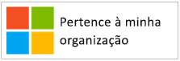
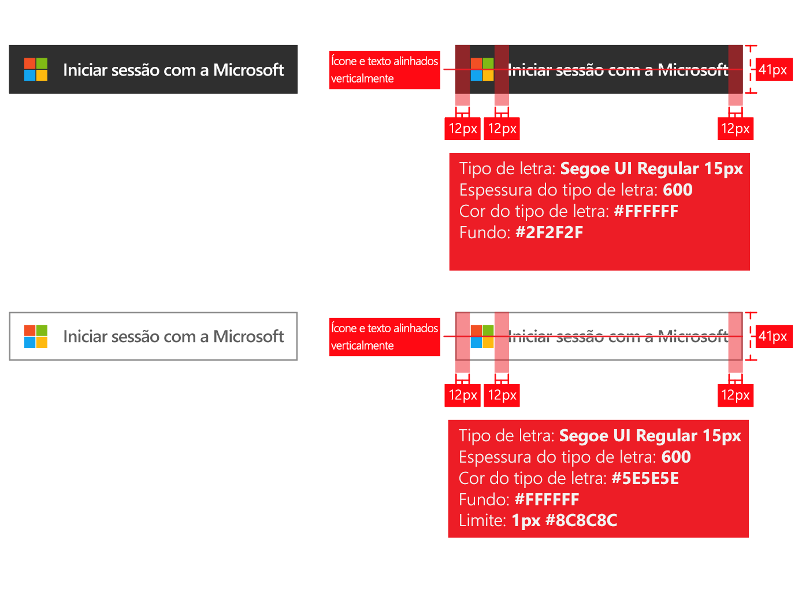
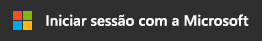
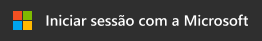
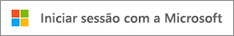
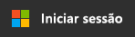
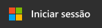

# Diretrizes de imagem corporativa para aplicações

Ao desenvolver aplicações com a plataforma de identidade da Microsoft, terá de direcionar os seus clientes quando quiserem utilizar a sua conta de trabalho ou escola (gerida em Azure AD), ou a sua conta pessoal para se inscrever e iniciar sing-in na sua aplicação.

Neste artigo, vai:

- Aprender sobre os dois tipos de contas de utilizador geridas pela Microsoft e como fazer referência a contas do Azure AD na sua aplicação
- Conheça os requisitos para a utilização do logótipo da Microsoft na sua aplicação
- Transfira as imagens **Iniciar sessão** ou **Iniciar sessão com a Microsoft** oficiais para utilizar na sua aplicação
- Saiba mais sobre os prós e contras da imagem corporativa e da navegação

## Contas pessoais versus contas escolares ou profissionais da Microsoft

A Microsoft gere dois tipos de contas de utilizador:

- **Contas pessoais** (anteriormente conhecidas como Windows Live ID). Estas contas representam a relação entre utilizadores *individuais* e a Microsoft e servem para aceder a dispositivos de consumo e a serviços da Microsoft. Estas contas foram concebidas para utilização pessoal.
- **Contas escolares ou profissionais.** Estas contas são geridas pela Microsoft em nome de organizações que utilizam o Azure Active Directory. Estas contas são usadas para iniciar sôms no Microsoft 365 e outros serviços empresariais da Microsoft.

As contas escolares ou profissionais da Microsoft são, normalmente, atribuídas a utilizadores finais (colaboradores, estudantes, colaboradores do governo) pelas suas organizações (empresa, escola, agência governamental). Estas contas são dominadas diretamente na nuvem (na plataforma AD Azure) ou sincronizadas com Azure AD a partir de um diretório no local, como o Windows Server Ative Directory. A Microsoft é o *conservador* das contas escolares ou profissionais, mas as contas são detidas e controladas pela organização.

## Fazer referência a contas do Azure AD na sua aplicação

A Microsoft não expõe os utilizadores finais às marcas Azure ou Active Directory e o utilizador também não deve fazê-lo.

- Assim que os utilizadores iniciarem sessão, utilize o nome e o logótipo da organização tanto quanto possível. É melhor do que utilizar termos genéricos como "a sua organização".
- Quando os utilizadores não têm sessão iniciada, faça referência às respetivas contas como "Contas escolares ou profissionais" e utilize o logótipo da Microsoft para transmitir que a Microsoft gere estas contas. Não utilize termos como "conta empresarial", "conta de negócio" ou "conta de empresa", porque confundem o utilizador.

## Pictograma de conta de utilizador

Numa versão anterior destas diretrizes, recomendámos utilizar um pictograma de um "distintivo azul". Com base nos comentários dos utilizadores e programadores, recomendamos agora a utilização do logótipo da Microsoft. O logótipo da Microsoft ajudará os utilizadores a entender que podem reutilizar a conta que utilizam com o Microsoft 365 ou outros serviços empresariais da Microsoft para iniciar scontabilidade na sua aplicação.

## Inscrever-se e iniciar sessão com o Azure AD

A sua aplicação pode apresentar caminhos diferentes para inscrição e início de sessão e as secções seguintes fornecem orientação visual para ambos os cenários.

**Se a aplicação suportar a inscrição de utilizadores finais (por exemplo, modelo Freemium ou de avaliação gratuita)**: pode mostrar um botão de **início de sessão** que permite aos utilizadores acederem à aplicação com a sua conta profissional ou a sua conta pessoal. O Azure AD irá mostrar um pedido de consentimento na primeira vez que acederem à aplicação.

**Se a aplicação exigir permissões a que apenas os administradores podem dar consentimento ou se a aplicação exigir licenciamento organizacional**: separe a aquisição de administrador do início de sessão do utilizador. O **botão "obter esta aplicação"** redireciona os administradores para o início de sessão e, em seguida, pede-lhes para darem consentimento em nome dos utilizadores na respetiva organização, o que tem o benefício adicional de suprimir os pedidos de consentimento do utilizador final para a sua aplicação.

## Documentação de orientação visual para aquisição de aplicações

A hiperligação "obter a aplicação" tem de redirecionar o utilizador para a página de concessão de acesso (autorização) do Azure AD, para permitir que o administrador de uma organização autorize que a sua aplicação tenha acesso aos dados da respetiva organização, que são alojados pela Microsoft. O artigo [Integrar aplicações com o Azure Active Directory](./quickstart-register-app.md) inclui detalhes sobre como pedir acesso.

Após o consentimento dos administradores para a sua aplicação, podem optar por adicioná-la à experiência do lançador de aplicações Microsoft 365 dos seus utilizadores (acessível a partir do waffle e a partir de [https://portal.office.com/myapps](https://portal.office.com/myapps) ). Se quiser anunciar esta capacidade, pode utilizar termos como "Adicionar esta aplicação à sua organização" e mostrar um botão como no exemplo seguinte:

No entanto, recomendamos que escreva um texto explicativo em vez de utilizar botões. Por exemplo:

> *Se já utilizar o Microsoft 365 ou outro serviço comercial da Microsoft, pode conceder<your_app_name> acesso aos dados da sua organização. Isto permitirá que os seus utilizadores acedam a <your_app_name> com as suas contas de trabalho existentes.*

Para transferir o logótipo oficial da Microsoft para utilizar na sua aplicação, clique com o botão direito do rato naquele que pretende utilizar e, em seguida, guarde-o no seu computador.

| Recurso                                | Formato PNG | Formato SVG |
| ------------------------------------ | ---------- | ---------- |
| Logótipo da Microsoft  |  |  |

## Orientação visual para início de sessão

A sua aplicação deve apresentar um botão de início de sessão que redirecione os utilizadores para o ponto final de início de sessão que corresponde ao protocolo que utiliza para fazer a integração com o Azure AD. A secção seguinte fornece detalhes sobre o aspeto que esse botão deve ter.

### Pictograma e “Iniciar sessão com a Microsoft”

É a associação do logótipo da Microsoft e dos termos "Iniciar sessão com a Microsoft" que representam exclusivamente o Azure AD entre outros fornecedores de identidade que a sua aplicação pode suportar. Se não tiver espaço suficiente para "Iniciar sessão com a Microsoft", pode encurtar para "Iniciar sessão". Pode utilizar um esquema de cores claras ou escuras para os botões.

O diagrama seguinte mostra as marcas de revisão recomendadas pela Microsoft ao utilizar os recursos com a sua aplicação. As marcas de revisão aplicam-se a "Iniciar sessão com a Microsoft" ou à versão "Iniciar sessão" mais curta.

Para transferir as imagens oficiais da Microsoft para utilizar na sua aplicação, clique com o botão direito do rato naquela que pretende utilizar e, em seguida, guarde-a no seu computador.

| Recurso                                | Formato PNG | Formato SVG |
| ------------------------------------ | ---------- | ---------- |
| Iniciar sessão com a Microsoft (tema escuro)  |  |  |
| Iniciar sessão com a Microsoft (tema claro) |  |  |
| Iniciar sessão (tema escuro)                 |  |  |
| Iniciar sessão (tema claro)                |  |  |

## O que fazer e não fazer com a imagem corporativa

**UTILIZE** "conta escolar ou profissional" em combinação com o botão "Iniciar sessão com a Microsoft" para fornecer uma explicação adicional para ajudar os utilizadores finais a reconhecerem se podem utilizá-lo. **NÃO** utilize outros termos como "conta empresarial", "conta de negócio" ou "conta de empresa".

**NÃO** utilize "Microsoft 365 ID" ou "Azure ID". O Microsoft 365 é também o nome de uma oferta de consumidores da Microsoft, que não utiliza Azure AD para autenticação.

**NÃO** altere o logótipo da Microsoft.

**NÃO** exponha os utilizadores finais às marcas Azure ou Active Directory. No entanto, pode utilizar estes termos com programadores, profissionais de TI e administradores.

## O que fazer e não fazer com a navegação

**PROPORCIONE** uma forma para os utilizadores terminarem sessão e mudarem para outra conta de utilizador. Embora a maioria das pessoas tenha uma única conta pessoal da Microsoft/Facebook/Google/Twitter, as pessoas costumam estar associadas a mais do que uma organização. O suporte de vários utilizadores com sessão iniciada estará disponível em breve.
