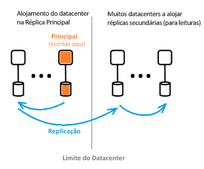

# O que é a arquitetura do Diretório Ativo Azure?

O Azure Active Directory (Azure AD) permite-lhe gerir de forma segura o acesso dos seus utilizadores aos serviços e recursos do Azure. Incluído com o Azure AD está um conjunto completo de capacidades de gestão de identidades. Para obter informações sobre as funcionalidades do Azure AD, veja [What is Azure Active Directory?](active-directory-whatis.md) (O que é o Azure Active Directory?)

Com o Azure AD, pode criar e gerir utilizadores e grupos e ativar permissões para permitir e recusar o acesso a recursos empresariais. Para obter informações sobre a gestão de identidades, veja [The fundamentals of Azure identity management](active-directory-whatis.md) (Noções básicas da gestão de identidades do Azure).

## Arquitetura do Azure AD

A arquitetura geograficamente distribuída da AD AD combina amplas capacidades de monitorização, reencaminhamento automatizado, failover e recuperação, que proporcionam disponibilidade e desempenho a toda a empresa aos clientes.

Este artigo cobre os elementos da arquitetura seguintes:

*   Design da arquitetura do serviço
*   Escalabilidade
*   Disponibilidade contínua
*   Datacenters

### Design da arquitetura do serviço

A forma mais comum de construir um sistema acessível e utilizável, rico em dados é através de blocos de construção independentes ou unidades de escala. Para o nível de dados AD Azure, as unidades de escala são chamadas *de divisórias*.

A camada de dados tem vários serviços front-end que proporcionam a capacidade de leitura/escrita. O diagrama abaixo mostra como os componentes de uma partição de diretório único são entregues em todos os centros de dados distribuídos geograficamente.

  

Os componentes da arquitetura do Azure AD incluem uma réplica primária e réplicas secundárias.

#### Réplica primária

A *réplica primária* recebe todas as *escritas* da partição a que pertence. Qualquer operação de escrita é replicada imediatamente numa réplica secundária noutro datacenter antes de devolver com êxito para o chamador, garantindo, assim, a durabilidade geograficamente redundante das escritas.

#### Réplicas secundárias

Todas as leituras de *diretório* são servidas a partir de *réplicas secundárias,* que estão em datacenters que estão fisicamente localizados em diferentes geografias. Existem muitas réplicas secundárias, uma vez que os dados são replicados de forma assíncrona. As leituras do diretório, como pedidos de autenticação, são servidas a partir de datacenters que são próximos dos clientes. As réplicas secundárias são responsáveis pela escalabilidade das leituras.

### Escalabilidade

A escalabilidade é a capacidade de um serviço se expandir para satisfazer o aumento da procura pelo desempenho. A escalabilidade das escritas é obtida ao particionar os dados. A escalabilidade das leituras é obtida ao replicar dados de uma partição para várias réplicas secundárias distribuídas em todo o mundo.

Os pedidos de pedidos de diretório são encaminhados para o datacenter ao que estão fisicamente mais próximos. As escritas são redirecionadas, de forma transparente, para a réplica primária, de modo a proporcionar consistência de leitura/escrita. As réplicas secundárias ampliam significativamente a escala das partições, porque, regra geral, na maior parte do tempo, os diretórios estão a servir leituras.

As aplicações de diretório ligam-se aos datacenters mais próximos. Esta ligação melhora o desempenho e, portanto, a escala é possível. Uma vez que as partições de diretório podem ter muitas réplicas secundárias, estas podem ser colocadas mais perto dos clientes dos diretórios. Apenas os componentes do serviço de diretório internos que sejam de escrita intensiva segmentam diretamente a réplica primária ativa.

### Disponibilidade contínua

A disponibilidade (ou tempo de atividade) define a capacidade de um sistema de funcionar sem interrupções. A chave para a alta disponibilidade da AZure AD é que os serviços podem transferir rapidamente o tráfego através de vários centros de dados distribuídos geograficamente. Cada datacenter é independente, o que permite modos de falha des correlacionados. Através deste design de alta disponibilidade, o Azure AD não requer tempo de inatividade para atividades de manutenção.

O design de partição da AD AD é simplificado em comparação com o design de AD da empresa, usando um design mono-mestre que inclui um processo de falha de réplica primária cuidadosamente orquestrado e determinístico.

#### Tolerância a falhas

Os sistemas estão mais disponíveis se forem tolerantes a falhas de hardware, rede e software. Para cada partição no diretório, existe uma réplica principal de elevada disponibilidade: a réplica primária. Só são realizadas nesta réplica as escritas para a partição. Esta réplica é monitorizada continuamente e de perto e as escritas podem ser alternadas imediatamente para outra réplica (que se torna na primária nova) caso seja detetada uma falha. Durante a ativação pós-falha, poderá haver uma perda de disponibilidade de escrita de cerca de 1 a 2 minutos, geralmente. A disponibilidade de leitura não é afetada durante este período.

As operações de leitura (que superam em muito as escritas) só vão para as réplicas secundárias. Uma vez que as réplicas secundárias são idempotentes, a perda de qualquer réplica numa determinada partição é facilmente compensada mediante o direcionamento das leituras para outra réplica, normalmente no mesmo datacenter.

#### Durabilidade de dados

Uma escrita é duramente comprometida com pelo menos dois datacenters antes de ser reconhecida. Isto acontece primeiro cometendo a escrita sobre o primário, e depois replicando imediatamente a escrita para pelo menos um outro datacenter. Esta ação de escrita garante que uma potencial perda catastrófica do datacenter que hospeda o primário não resulte em perda de dados.

A Azure AD mantém um Objetivo de Tempo de Recuperação zero [(RTO)](https://en.wikipedia.org/wiki/Recovery_time_objective) para não perder dados sobre falhas. O que está incluído:

* Leituras de emissão de token e diretório
* Permitindo apenas cerca de 5 minutos rto para listas escritas

### Datacenters

As réplicas do Azure AD são armazenadas nos datacenters localizados em todo o mundo. Para mais informações, consulte [a infraestrutura global da Azure.](https://azure.microsoft.com/global-infrastructure/)

A Azure AD opera em centros de dados com as seguintes características:

* A autenticação, gráfico e outros serviços de AD residem por trás do serviço Gateway. O Gateway gere o balanceamento de carga destes serviços. Falhará automaticamente se quaisquer servidores não saudáveis forem detetados usando sondas de saúde transacional. Com base nestas sondas de saúde, o Gateway liga dinamicamente o tráfego para centros de dados saudáveis.
* Para *leituras,* o diretório tem réplicas secundárias e serviços frontais correspondentes numa configuração ativa que opera em vários centros de dados. Em caso de falha de todo um datacenter, o tráfego será automaticamente encaminhado para um centro de dados diferente.
 *Para *as escritas,* o diretório falhará sobre a réplica primária (mestre) através de datacenters através de procedimentos planeados (o novo primário é sincronizado com os procedimentos primários antigos) ou os procedimentos de falha de emergência. A durabilidade dos dados é conseguida replicando qualquer compromisso com pelo menos dois datacenters.

#### Consistência de dados

O modelo de diretório é uma das eventuais consistências. Um problema típico com sistemas de replicação assíncrona distribuídos é que os dados devolvidos de uma réplica "particular" podem não estar atualizados. 

O Azure AD proporciona consistência de leitura/escrita às aplicações que segmentam réplicas secundárias ao encaminhar as respetivas escritas para a réplica primária e ao enviá-las de forma síncrona novamente para a réplica secundária.

As aplicações escritas utilizando a API do Microsoft Graph API de Azure AD são resumidas de manter a afinidade a uma réplica de diretório para a consistência da leitura-escrita. O serviço Microsoft Graph API mantém uma sessão lógica, que tem afinidade com uma réplica secundária utilizada para leituras; A afinidade é capturada num "símbolo de réplica" que o serviço caches usando uma cache distribuída no centro de dados de réplica secundária. Este token é, depois, utilizado para operações subsequentes na mesma sessão lógica. Para continuar a utilizar a mesma sessão lógica, os pedidos subsequentes devem ser encaminhados para o mesmo centro de dados Azure AD. Não é possível continuar uma sessão lógica se os pedidos do cliente do diretório estiverem a ser encaminhados para vários centros de dados AZure AD; se isso acontecer, então o cliente tem múltiplas sessões lógicas que têm consistências de leitura-escrita independentes.

 >[!NOTE]
 >As escritas são replicadas imediatamente na réplica secundária para a qual as leituras da sessão lógica foram emitidas.

#### Proteção de cópia de segurança

O diretório implementa eliminações de forma recuperável, em vez de eliminações definitivas, para utilizadores e inquilinos para recuperação fácil em caso de eliminações acidentais por parte de um cliente. Se o administrador do seu inquilino eliminar acidentalmente os utilizadores, eles podem facilmente desfazer e restaurar os utilizadores eliminados.

O Azure AD implementa cópias de segurança diárias de todos os dados, pelo que consegue restaurar com autoridade dados, em caso de eliminações lógicas ou danos nos dados. O nível de dados emprega códigos de correção de erros, para que possa verificar erros e corrigir automaticamente determinados tipos de erros de disco.

#### Métricas e monitores

A execução de um serviço de elevada disponibilidade requer capacidades de métricas e monitorização de topo. O Azure AD analisa e comunica, de forma contínua, as métricas-chave de estado de funcionamento e os critérios de sucesso relativos a cada um dos seus serviços. Há também desenvolvimento contínuo e afinação de métricas e monitorização e alerta para cada cenário, dentro de cada serviço AD Azure e em todos os serviços.

Se qualquer serviço AD Azure não estiver a funcionar como esperado, serão tomadas medidas imediatas para restaurar a funcionalidade o mais rapidamente possível. A faixa métrica mais importante do AZure AD é a rapidez com que os problemas do site ao vivo podem ser detetados e atenuados para os clientes. Investimos significativamente na monitorização e nos alertas para minimizar o tempo de deteção (TTD de Destino: <5 minutos) e a prontidão operacional para minimizar o tempo para mitigar (TTM de Destino: <30 minutos).

#### Operações seguras

Utilizando controlos operacionais como a autenticação de vários fatores (MFA) para qualquer operação, bem como a auditoria de todas as operações. Além disso, utilizar um sistema de elevação just-in-time para conceder o acesso temporário necessário a qualquer tarefa operacional a pedido numa base contínua. Para obter mais informações, veja [A Cloud de Confiança](https://azure.microsoft.com/support/trust-center).

## Passos seguintes

[Guia para programadores do Azure Active Directory](../develop/index.yml)