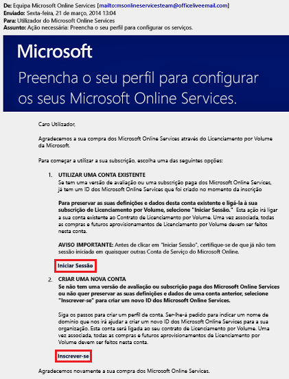
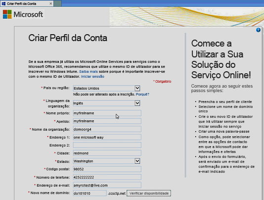
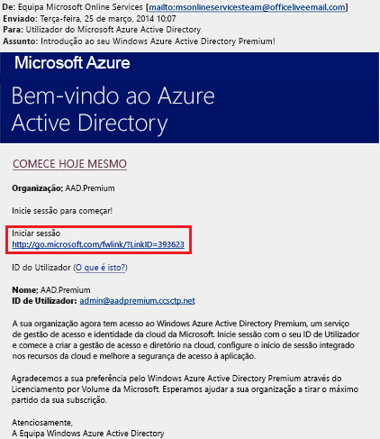
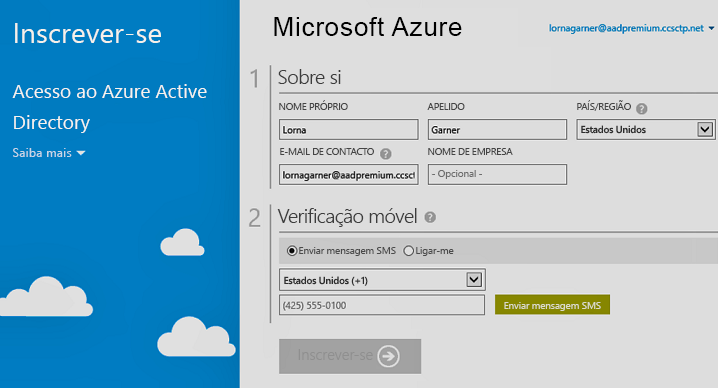

# Inscrever-se nas edições Premium do Azure Active Directory
Pode adquirir e associar edições premium do Azure Ative Directory (Azure AD) com a sua assinatura Azure. Se tiver de criar uma subscrição nova do Azure, também terá de ativar o plano de licenciamento e o acesso ao serviço Microsoft Azure AD.

Para se inscrever no Active Directory Premium 1 ou Premium 2, tem de determinar primeiro que subscrição ou plano existente planeia utilizar:

- Através da subscrição Azure ou Microsoft 365 existente

- Através do seu plano de licenciamento Enterprise Mobility + Security

- Através de um plano de Licenciamento em Volume da Microsoft

Ao inscrever-se com a sua subscrição do Azure com licenças do Microsoft Azure AD anteriormente compradas e ativadas, ativa automaticamente as licenças no mesmo diretório. Se não for esse o caso, ainda terá de ativar o plano de licenciamento e o acesso ao Microsoft Azure AD. Para obter mais informações sobre como ativar o plano de licenciamento, veja [Ativar o novo plano de licença](#activate-your-new-license-plan). Para obter mais informações sobre como ativar o acesso ao Microsoft Azure AD, veja [Ativar o acesso ao Microsoft Azure AD](#activate-your-azure-ad-access). 

## Inscreva-se usando a subscrição Azure ou Microsoft 365 existente
Como assinante do Azure ou microsoft 365, pode adquirir online as edições Azure Ative Directory Premium. Para etapas detalhadas, consulte [Como Comprar Azure Ative Directory Premium - Novos Clientes](https://channel9.msdn.com/Series/Azure-Active-Directory-Videos-Demos/How-to-Purchase-Azure-Active-Directory-Premium-New-Customers).

## Inscrever-se através do seu plano de licenciamento Enterprise Mobility + Security
Enterprise Mobility + Security é uma suite composta por Azure AD Premium, Azure Information Protection e Microsoft Intune. Se já tiver uma licença do EMS, poderá começar a utilizar o Microsoft Azure AD, com uma destas opções de licenciamento:

Para obter mais informações, veja o [site do Enterprise Mobility + Security](https://www.microsoft.com/cloud-platform/enterprise-mobility-security).

- Experimentar o EMS com uma [subscrição de avaliação gratuita do Enterprise Mobility + Security E5](https://signup.microsoft.com/Signup?OfferId=87dd2714-d452-48a0-a809-d2f58c4f68b7&ali=1)

- Comprar [licenças do Enterprise Mobility + Security E5](https://signup.microsoft.com/Signup?OfferId=e6de2192-536a-4dc3-afdc-9e2602b6c790&ali=1)

- Comprar [licenças do Enterprise Mobility + Security E3](https://signup.microsoft.com/Signup?OfferId=4BBA281F-95E8-4136-8B0F-037D6062F54C&ali=1)

## Inscrever-se através do seu plano de Licenciamento em Volume da Microsoft
Através do seu plano de Licenciamento em Volume da Microsoft, pode inscrever-se no Azure AD Premium através de um destes dois programas, com base no número de licenças que pretende obter:

- **Para 250 ou mais licenças.** [Microsoft Enterprise Agreement](https://www.microsoft.com/en-us/licensing/licensing-programs/enterprise.aspx)

- **Para 5 a 250 licenças.** [Abrir Licença de Volume](https://www.microsoft.com/en-us/licensing/licensing-programs/open-license.aspx)

Pode obter mais informações sobre as opções de compra do licenciamento em volume, veja [How to purchase through Volume Licensing](https://www.microsoft.com/en-us/licensing/how-to-buy/how-to-buy.aspx) (Como comprar através do Licenciamento em Volume).

## Ativar o novo plano de licenciamento
Se iniciou sessão com um novo plano de licença do Microsoft Azure AD, terá de o ativar para a sua organização através do e-mail de confirmação enviado após a compra.

### Para ativar o plano de licenciamento
- Abra o e-mail de confirmação que recebeu da Microsoft depois de se inscrever e, em seguida, clique em **Iniciar Sessão** ou em **Inscrever-se**.
   
    

    - **Iniciar sessão.** Escolha esta ligação se tiver um inquilino existente e, em seguida, inicie sessão com a sua conta de administrador existente. Deve ser um administrador global do inquilino onde as licenças estão a ser ativadas.

    - **Registar-me.** Escolha esta ligação se quiser abrir a página **Criar Perfil de Conta** e crie um novo inquilino do Microsoft Azure AD para o seu plano de licenciamento.

        

Quando tiver terminado, verá uma caixa de confirmação a agradecer por ter ativado o plano de licença para o seu inquilino.

## Ativar o acesso ao Microsoft Azure AD
Se adicionar licenças do Azure AD Premium novas a uma subscrição já existente, o acesso ao Microsoft Azure AD já deverá estar ativado. Caso contrário, tem de ativar o acesso do Azure AD depois de receber o **E-mail de boas-vindas**.  

Depois de as suas licenças compradas serem aprovisionadas no diretório, receberá um **E-mail de boas-vindas**. Este e-mail confirma que pode começar a gerir as licenças e funcionalidades do Azure AD Premium ou do Enterprise Mobility + Security. 

> [!TIP]
> Não poderá aceder ao Microsoft Azure AD do inquilino novo enquanto não ativar o acesso ao diretório do Microsoft Azure AD através do e-mail de boas-vindas.

### Para ativar o acesso ao Microsoft Azure AD

1. Abra o **E-mail de boas-vindas** e, em seguida, clique em **Iniciar Sessão**.
   
    

2. Depois de iniciar sessão com êxito, deverá proceder à verificação de dois passos num dispositivo móvel.
   
    

Normalmente, o processo de ativação demora apenas alguns minutos e, em seguida, pode utilizar o inquilino do Microsoft Azure AD. 

## Passos seguintes
Agora que tem o Azure AD Premium, pode [personalizar o seu domínio](add-custom-domain.md), adicionar a sua [imagem corporativa](customize-branding.md), [criar um inquilino](active-directory-access-create-new-tenant.md) e [adicionar grupos](active-directory-groups-create-azure-portal.md) e [utilizadores](add-users-azure-active-directory.md).
