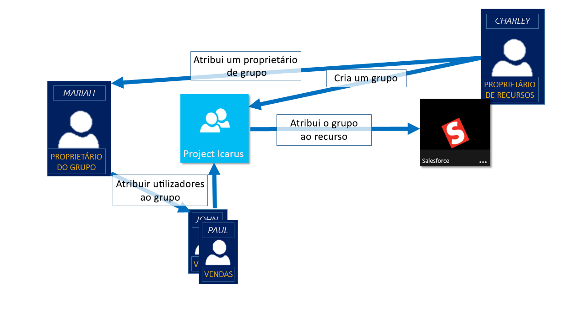
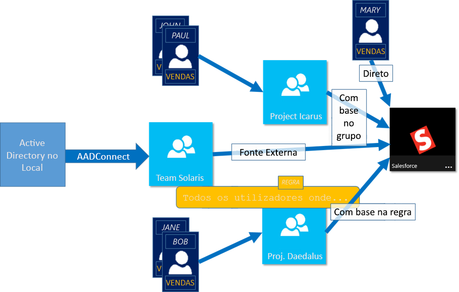

# Gerir o acesso a aplicações e recursos com grupos do Azure Active Directory
O Azure Ative Directory (Azure AD) permite-lhe utilizar grupos para gerir o acesso às suas aplicações baseadas na nuvem, aplicações no local e nos seus recursos. Os seus recursos podem fazer parte da organização Azure AD, tais como permissões para gerir objetos através de funções em AZure AD, ou externas à organização, tais como para aplicações de Software como um Serviço (SaaS), serviços Azure, sites SharePoint e recursos no local.

>[!NOTE]
> No portal Azure, pode ver alguns grupos cujos detalhes de adesão e grupo não consegue gerir no portal:
>
> - Grupos sincronizados a partir de diretório ativo no local só podem ser geridos no ative directy no local.
> - Outros tipos de grupo, tais como listas de distribuição e grupos de segurança via correio, são geridos apenas no Centro de Administração Exchange ou no Centro de Administração microsoft 365. Tem de iniciar sôms no Centro de Administração Exchange ou no Centro de Administração microsoft 365 para gerir estes grupos.

## Como funciona a gestão de acessos em Azure AD

O Azure AD ajuda-o a dar acesso aos recursos da sua organização, fornecendo direitos de acesso a um único utilizador ou a todo um grupo Azure AD. A utilização de grupos permite que o proprietário do recurso (ou o proprietário do diretório do Azure AD) atribua um conjunto de permissões de acesso a todos os membros do grupo, em vez de ter de fornecer os direitos um a um. O titular do recurso ou do diretório também pode dar direitos de gestão para a lista de membros a outra pessoa, como um gerente de departamento ou um administrador da Helpdesk, permitindo que essa pessoa adicione e remova membros, conforme necessário. Para obter mais informações sobre como gerir os proprietários do grupo, consulte [Gerir os proprietários do grupo](active-directory-accessmanagement-managing-group-owners.md)

## Formas de atribuir direitos de acesso

Existem quatro formas de atribuir direitos de acesso a recursos aos seus utilizadores:

- **Atribuição direta.** O titular do recurso atribui diretamente o utilizador ao recurso.

- **Missão de grupo.** O proprietário do recurso atribui um grupo AD Azure ao recurso, que automaticamente dá acesso a todos os membros do grupo ao recurso. A adesão ao grupo é gerida tanto pelo proprietário do grupo como pelo proprietário do recurso, permitindo que o proprietário adicione ou remova os membros do grupo. Para obter mais informações sobre a adição ou remoção da adesão ao grupo, consulte [Como: Adicionar ou remover um grupo de outro grupo utilizando o portal Azure Ative Directory](active-directory-groups-membership-azure-portal.md). 

- **Atribuição baseada em regras.** O proprietário do recurso cria um grupo e utiliza uma regra para definir quais os utilizadores que são atribuídos a um recurso específico. A regra baseia-se em atributos atribuídos a utilizadores individuais. O titular do recurso gere a regra, determinando quais os atributos e valores necessários para permitir o acesso ao recurso. Para obter mais informações, consulte [Criar um grupo dinâmico e verificar o estado](../enterprise-users/groups-create-rule.md).

    Também pode ver este pequeno vídeo para obter uma explicação rápida sobre a criação e utilização de grupos dinâmicos:

    >[!VIDEO https://channel9.msdn.com/Series/Azure-Active-Directory-Videos-Demos/Azure-AD--Introduction-to-Dynamic-Memberships-for-Groups/player]

- **Atribuição de autoridade externa.** O acesso provém de uma fonte externa, como um diretório no local ou uma aplicação SaaS. Nesta situação, o titular do recurso designa um grupo para fornecer acesso ao recurso e, em seguida, a fonte externa gere os membros do grupo.

   

## Os utilizadores podem juntar-se a grupos sem serem designados?
O proprietário do grupo pode permitir que os utilizadores encontrem os seus próprios grupos para aderir, em vez de atribuí-los. O proprietário também pode configurar o grupo para aceitar automaticamente todos os utilizadores que aderirem ou exigirem aprovação.

Após um pedido de acesso a um grupo, o pedido é reencaminhado para o proprietário do grupo. Se for necessário, o proprietário pode aprovar o pedido e o utilizador é notificado da adesão ao grupo. No entanto, se tiver vários proprietários e um deles não aprovar, o utilizador é notificado, mas não é adicionado ao grupo. Para obter mais informações e instruções sobre como permitir que os seus utilizadores solicitem aderir a grupos, consulte [Configurar AZure AD para que os utilizadores possam solicitar para se juntarem a grupos](../enterprise-users/groups-self-service-management.md)

## Passos seguintes
Agora que tem uma pequena introdução à gestão de acessos usando grupos, começa a gerir os seus recursos e apps.

- [Criar um novo grupo utilizando o Azure Ative Directory](active-directory-groups-create-azure-portal.md) ou [Criar e gerir um novo grupo usando cmdlets PowerShell](../enterprise-users/groups-settings-v2-cmdlets.md)

- [Utilize grupos para atribuir acesso a uma aplicação Integrada SaaS](../enterprise-users/groups-saasapps.md)

- [Sync um grupo no local para Azure usando Azure AD Connect](../hybrid/whatis-hybrid-identity.md)
