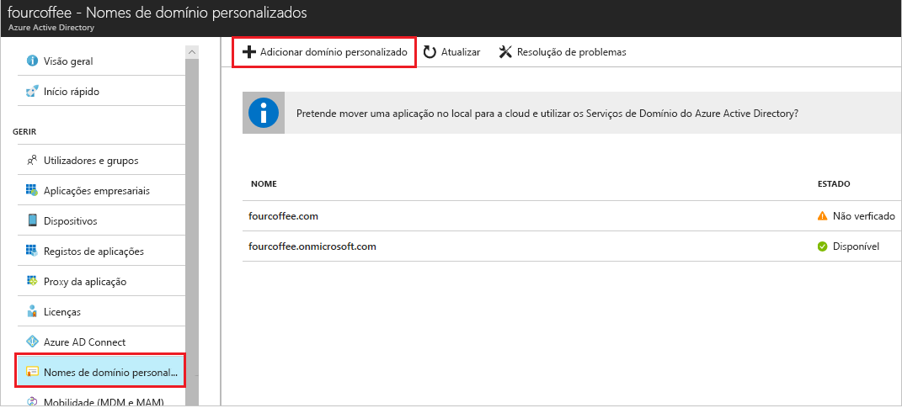

# Adicione o seu nome de domínio personalizado usando o portal Azure Ative Directory

Cada novo inquilino da AD AZure vem com um nome de domínio inicial, * \<domainname> .onmicrosoft.com*. Não é possível alterar ou apagar o nome de domínio inicial, mas pode adicionar os nomes da sua organização. A adição de nomes de domínio personalizados ajuda-o a criar nomes de utilizadores familiares aos seus utilizadores, como *alain \@ contoso.com*.

## Antes de começar

Antes de poder adicionar um nome de domínio personalizado, crie o seu nome de domínio com um registo de domínio. Para um registrador de domínio acreditado, consulte [os registos acreditados da ICANN.](https://www.icann.org/registrar-reports/accredited-list.html)

## Crie o seu diretório em Azure AD

Depois de obter o seu nome de domínio, pode criar o seu primeiro diretório AD Azure. Inscreva-se no portal Azure para o seu diretório, utilizando uma conta com a função **Proprietário** para a subscrição.

Crie o seu novo diretório seguindo os passos na [Criar um novo inquilino para a sua organização.](active-directory-access-create-new-tenant.md#create-a-new-tenant-for-your-organization)

>[!IMPORTANT]
>A pessoa que cria o inquilino é automaticamente o administrador global para aquele inquilino. O administrador global pode adicionar administradores adicionais ao inquilino.

Para obter mais informações sobre as funções de subscrição, consulte [as funções Azure](../../role-based-access-control/rbac-and-directory-admin-roles.md#azure-roles).

>[!TIP]
> Se planeia federar o seu Windows Server AD no local com Azure AD, então tem de selecionar **que planeio configurar este domínio para um único sinal com o meu Diretório Ativo local** quando executar a ferramenta Azure AD Connect para sincronizar os seus diretórios.
>
> Também tem de registar o mesmo nome de domínio que seleciona para a federação com o seu diretório no local no passo **Domínio do Azure AD** no assistente. Para ver como é a configuração, consulte [verifique o domínio AD Azure selecionado para a federação](../hybrid/how-to-connect-install-custom.md#verify-the-azure-ad-domain-selected-for-federation). Se não tiver a ferramenta Azure AD Connect, pode [descarregá-la aqui.](https://go.microsoft.com/fwlink/?LinkId=615771)

## Adicione o seu nome de domínio personalizado ao Azure AD

Depois de criar o seu diretório, pode adicionar o seu nome de domínio personalizado.

1. Inicie sessão no [portal do Azure](https://portal.azure.com/) com uma conta de Administrador global do diretório.

1. Procure e selecione *Azure Ative Directory* a partir de qualquer página. Em seguida, selecione **nomes de domínio**  >  **personalizadoS Adicione domínio personalizado**.

    

1. Em **nome de domínio personalizado,** insira o novo nome da sua organização, neste exemplo, *contoso.com*. Selecione **Adicionar domínio**.

    

    >[!IMPORTANT]
    >Deve incluir *.com*, *.net*ou qualquer outra extensão de nível superior para que funcione corretamente.

    O domínio não verificado é adicionado. A página **contoso.com** aparece mostrando as informações do DNS. Guarde esta informação. Precisa mais tarde para criar um registo TXT para configurar o DNS.

    

## Adicionar as informações de DNS à entidade de registo de domínios

Depois de adicionar o seu nome de domínio personalizado ao Azure AD, deve voltar ao seu registo de domínio e adicionar as informações de DNS AD Azure do seu ficheiro TXT copiado. A criação deste registo TXT para o seu domínio verifica a propriedade do seu nome de domínio.

Volte para o seu registo de domínio e crie um novo registo TXT para o seu domínio com base nas informações de DNS copiadas. Desaça a hora de viver (TTL) para 3600 segundos (60 minutos) e, em seguida, guarde o recorde.

>[!IMPORTANT]
>Pode registar os nomes de domínio que quiser. No entanto, cada domínio obtém o seu próprio registo TXT da Azure AD. Tenha cuidado ao introduzir as informações do ficheiro TXT no registo de domínio. Se introduzir a informação errada ou duplicar por engano, terá de esperar até que o TTL fique fora (60 minutos) antes de poder tentar novamente.

## Verifique o nome de domínio personalizado

Depois de registar o seu nome de domínio personalizado, certifique-se de que é válido em Azure AD. A propagação do seu registo de domínio para Azure AD pode ser instantânea ou pode levar alguns dias, dependendo do seu registo de domínio.

Para verificar o nome de domínio personalizado, siga estes passos:

1. Inicie sessão no [portal do Azure](https://portal.azure.com/) com uma conta de Administrador global do diretório.

1. Procure e selecione *O Diretório Ativo Azure* a partir de qualquer página e, em seguida, selecione **nomes de domínio personalizados**.

1. Em **nomes de domínio personalizados,** selecione o nome de domínio personalizado. Neste exemplo, selecione **contoso.com**.

    

1. Na página **contoso.com,** **selecione Verifique** se o seu domínio personalizado está devidamente registado e é válido para Azure AD.

    

Depois de verificar o nome de domínio personalizado, pode eliminar o seu ficheiro TXT ou MX de verificação.

## Questões comuns de verificação

Se a Azure AD não puder verificar um nome de domínio personalizado, experimente as seguintes sugestões:

- **Espere pelo menos uma hora e tente de novo.** Os registos DNS têm de ser propagados antes de o Azure AD poder verificar o domínio. Este processo pode demorar uma hora ou mais.

- **Certifique-se de que o registo dns está correto.** Volte para o site de registo de nome de domínio. Certifique-se de que a entrada está lá e que corresponde às informações de entrada de DNS fornecidas pela Azure AD.

  Se não conseguir atualizar o registo no site do registo, partilhe a entrada com alguém que tenha permissões para adicionar a entrada e verificar se está correta.

- **Certifique-se de que o nome de domínio já não está a ser utilizado noutro diretório.** Um nome de domínio só pode ser verificado num diretório. Se o seu nome de domínio for verificado em outro diretório, também não pode ser verificado no novo diretório. Para corrigir este problema de duplicação, deve eliminar o nome de domínio do antigo diretório. Para obter mais informações sobre a eliminação de nomes de domínio, consulte [Gerir os nomes de domínio personalizados](../users-groups-roles/domains-manage.md).

- **Certifique-se de não ter nenhum inquilino de Bi de energia não gerido.** Se os seus utilizadores ativaram o Power BI através de uma inscrição de self-service e criaram um inquilino não gerido para a sua organização, deve assumir a gestão como administrador interno ou externo, utilizando o PowerShell. Para obter mais informações, veja [Take over an unmanaged directory as administrator in Azure Active Directory](../users-groups-roles/domains-admin-takeover.md) (Assumir um diretório não gerido como administrador no Azure Active Directory).

## Passos seguintes

- Adicione outro administrador global ao seu diretório. Para obter mais informações, consulte [Como atribuir funções e administradores.](active-directory-users-assign-role-azure-portal.md)

- Adicione os utilizadores ao seu domínio. Para obter mais informações, consulte [Como adicionar ou eliminar utilizadores.](add-users-azure-active-directory.md)

- Gerencie as informações sobre o nome de domínio no Azure AD. Para obter mais informações, consulte [gerir nomes de domínio personalizados.](../users-groups-roles/domains-manage.md)

- Se tiver versões no local do Windows Server que pretende utilizar ao lado do Azure Ative Directory, consulte [Integrar os seus diretórios no local com o Azure Ative Directory](../hybrid/whatis-hybrid-identity.md).