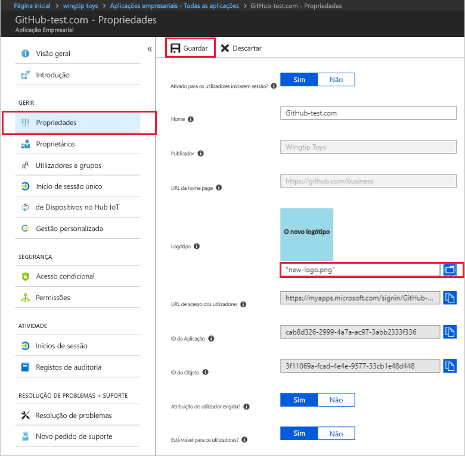

# Quickstart: Configure propriedades para uma aplicação no seu inquilino Azure Ative (Azure AD)

No quickstart anterior, adicionou um pedido ao seu inquilino Azure Ative Directory (Azure AD). Quando você adiciona uma aplicação, você está deixando o seu inquilino Azure AD saber que é o fornecedor de identidade para a app. Agora vai configurar algumas das propriedades da aplicação.
 
## Pré-requisitos

Para configurar as propriedades de uma aplicação no seu inquilino AZure AD, você precisa:

- Uma conta Azure com uma subscrição ativa. [Crie uma conta gratuita.](https://azure.microsoft.com/free/?WT.mc_id=A261C142F)
- Uma das seguintes funções: Administrador Global, Administrador de Aplicação cloud, Administrador de Aplicação ou proprietário do principal de serviço.
- Opcional: Conclusão de [Ver as suas apps.](view-applications-portal.md)
- Opcional: Conclusão de [Adicionar uma aplicação.](add-application-portal.md)

>[!IMPORTANT]
>Utilize um ambiente de não produção para testar os passos neste arranque rápido.

## Configure propriedades de aplicativos

Quando terminar de adicionar uma aplicação ao seu inquilino Azure AD, a página geral aparece. Se está a configurar uma aplicação que já foi adicionada, olhe para o primeiro quickstart. Acompanha-o a ver as candidaturas adicionadas ao seu inquilino. 

Para editar as propriedades da aplicação:

1. No portal AD Azure, selecione **aplicações Enterprise**. Em seguida, encontre e selecione a aplicação que pretende configurar.
1. Na secção **Gerir,** selecione **Propriedades** para abrir o painel **propriedades** para edição.

    

1. Aproveite um momento para entender as opções disponíveis para configurar:
    - **Habilitado para os utilizadores fazerem o s.a.?** determina se os utilizadores designados para a aplicação podem iniciar sessão.
    - **Atribuição de utilizadores necessária?** determina se os utilizadores que não estão atribuídos à aplicação podem iniciar sessão.
    - **Visível para os utilizadores?** determina se os utilizadores atribuídos a uma aplicação podem vê-la no painel de [acesso](https://myapps.microsoft.com) e no lançador de aplicações office 365. (Consulte o menu de waffles no canto superior esquerdo de um site do Office 365 ou microsoft 365.)
1. Use as seguintes tabelas para ajudá-lo a escolher as melhores opções para as suas necessidades.

   - Comportamento para utilizadores *atribuídos*:

       | Propriedade de aplicação | Propriedade de aplicação | Propriedade de aplicação | Experiência para utilizadores atribuídos | Experiência para utilizadores atribuídos |
       |---|---|---|---|---|
       | Habilitado para os utilizadores fazerem o s.a.? | Atribuição do utilizador necessária? | Visível para os utilizadores? | Os utilizadores atribuídos podem iniciar sessão? | Os utilizadores atribuídos podem ver a aplicação?* |
       | Sim | Sim | Sim | Sim | Sim  |
       | Sim | Sim | Não  | Sim | Não   |
       | Sim | Não  | Sim | Sim | Sim  |
       | Sim | Não  | Não  | Sim | Não   |
       | Não  | Sim | Sim | Não  | Não   |
       | Não  | Sim | Não  | Não  | Não   |
       | Não  | Não  | Sim | Não  | Não   |
       | Não  | Não  | Não  | Não  | Não   |

   - Comportamento para utilizadores *não atribuídos*:

       | Propriedade de aplicação | Propriedade de aplicação | Propriedade de aplicação | Experiência para utilizadores não atribuídos | Experiência para utilizadores não atribuídos |
       |---|---|---|---|---|
       | Habilitado para os utilizadores fazerem o s.a.? | Atribuição do utilizador necessária? | Visível para os utilizadores? | Os utilizadores não atribuídos podem iniciar sessão? | Os utilizadores não atribuídos podem ver a aplicação?* |
       | Sim | Sim | Sim | Não  | Não   |
       | Sim | Sim | Não  | Não  | Não   |
       | Sim | Não  | Sim | Sim | Não   |
       | Sim | Não  | Não  | Sim | Não   |
       | Não  | Sim | Sim | Não  | Não   |
       | Não  | Sim | Não  | Não  | Não   |
       | Não  | Não  | Sim | Não  | Não   |
       | Não  | Não  | Não  | Não  | Não   |

     *O utilizador pode ver a aplicação no painel de acesso e no iniciador de aplicações do Office 365?

## Utilizar um logótipo personalizado

Para utilizar um logótipo personalizado:

1. Crie um logótipo que seja de 215 por 215 pixels e guarde-o em formato .png.
1. No portal AD Azure, selecione **aplicações Enterprise**. Em seguida, encontre e selecione a aplicação que pretende configurar.
1. Na secção **Gerir,** selecione **Propriedades** para abrir o painel **propriedades** para edição. 
1. Selecione o ícone para carregar o logotipo.
1. Quando terminar, **selecione Save**.

    

   > [!NOTE]
   > A miniatura exibida neste painel **de propriedades** não atualiza imediatamente. Pode fechar e reabrir o painel **de propriedades** para ver o ícone atualizado.

## Passos seguintes

Agora que configuraste as propriedades de uma aplicação, podes continuar a configurar uma única inscrição.

- [Configurar o início de sessão único](add-application-portal-setup-sso.md)
- [Eliminar uma aplicação](delete-application-portal.md)