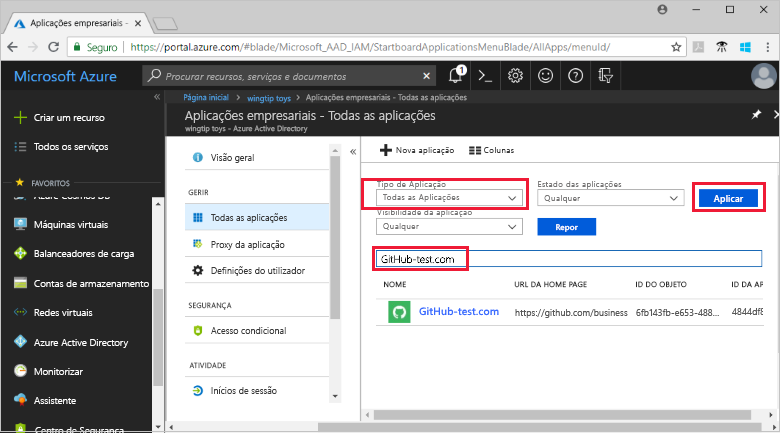
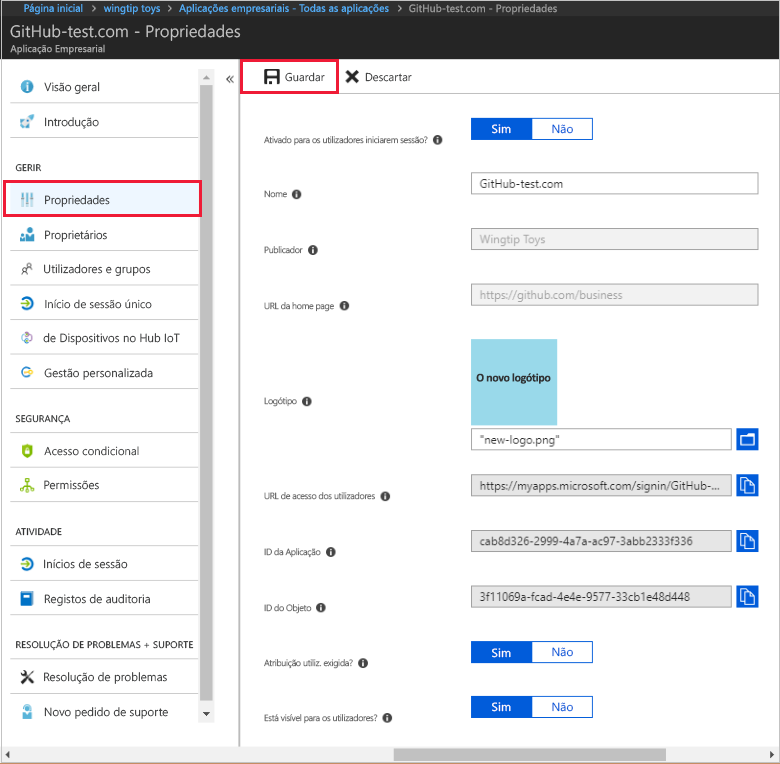
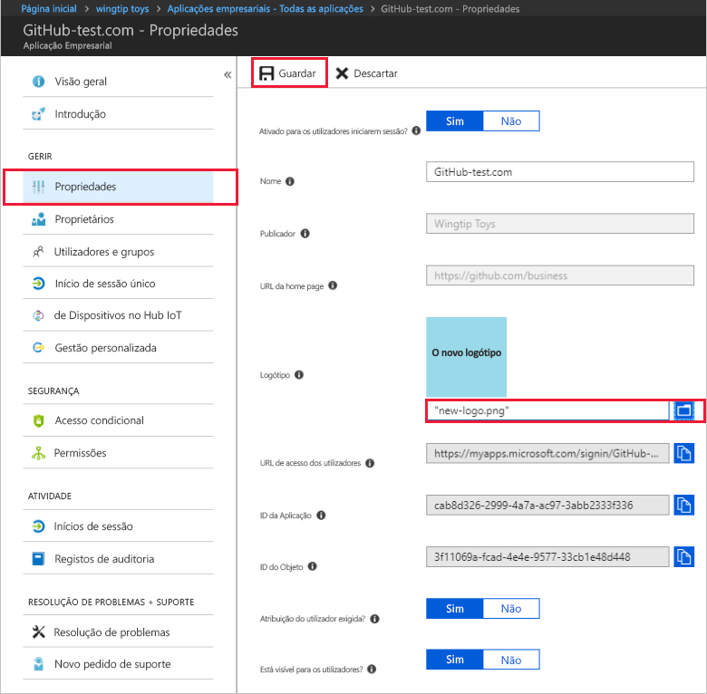

# Início Rápido: Adicionar uma aplicação ao seu inquilino do Azure Active Directory

O Azure Active Directory (Azure AD) tem uma galeria que contém milhares de aplicações pré-integradas. É provável que algumas das aplicações que a sua organização utiliza estão na galeria. Este início rápido utiliza o portal do Azure para adicionar uma aplicação da galeria ao seu inquilino do Azure Active Directory (Azure AD).

Após a adição de uma aplicação ao seu inquilino do Azure AD, pode:

- Gerir o acesso do utilizador à aplicação com uma política de Acesso Condicional.
- Configurar utilizadores para o início de sessão único na aplicação com as contas do Azure AD deles.

## Antes de começar

Para adicionar uma aplicação ao seu inquilino, precisa de:

- Uma subscrição do Azure
- Uma subscrição com início de sessão único ativado para a aplicação

Inicie sessão no [portal do Azure](https://portal.azure.com) como administrador global do inquilino do Azure AD, administrador de uma aplicação na cloud ou administrador de uma aplicação.

Para testar os passos neste tutorial, recomendamos utilizar um ambiente de não produção. Se não tiver um ambiente de não produção do Azure AD, pode [obter uma avaliação de um mês](https://azure.microsoft.com/pricing/free-trial/).

## Adicionar uma aplicação ao seu inquilino

Para adicionar uma aplicação da galeria ao seu inquilino do Azure AD:

1. No [portal Azure,](https://portal.azure.com)no painel de navegação à esquerda, selecione **Azure Ative Directory**.

2. No painel de **diretório ativo Azure,** selecione **aplicações Enterprise**. O painel **de aplicações All Applications** abre e exibe uma amostra aleatória das aplicações no seu inquilino AZure AD.

3. Para adicionar uma aplicação de galeria ao seu inquilino, selecione **Nova aplicação.** 

    

 4. Mude para a nova experiência de pré-visualização da galeria: No banner no topo da página de **aplicação Add**, selecione o link que diz **Click aqui para experimentar a nova e melhorada galeria de aplicações**.

5. O painel **Browse AD Gallery (Preview)** abre e exibe azulejos para plataformas em nuvem, aplicações no local e aplicações em destaque. Note que as aplicações listadas na secção **de aplicações em destaque** têm ícones que indicam se suportam um único sign-on federado (SSO) e provisionamento.

    

6. Pode navegar na galeria para a aplicação que pretende adicionar, ou procurar a aplicação introduzindo o seu nome na caixa de pesquisa. Em seguida, selecione a aplicação a partir dos resultados. No formulário, pode editar o nome da aplicação para corresponder às necessidades da sua organização. Neste exemplo, mudamos o nome para **teste GitHub.**

    

7. Selecione **Criar**. É apresentada uma página de introdução com as opções para configurar a aplicação para a sua organização.

Terminou de adicionar a sua candidatura. As secções seguintes mostram-lhe como alterar o logótipo e editar outras propriedades da aplicação.

## Localizar a aplicação do seu inquilino do Azure AD

Vamos supor que teve de se ausentar e que voltou agora para retomar a configuração da aplicação. A primeira coisa a fazer é encontrar a sua candidatura.

1. No **[portal Azure,](https://portal.azure.com)** no painel de navegação à esquerda, selecione **Azure Ative Directory**.
1. No painel de **diretório ativo Azure,** selecione **aplicações Enterprise**.
1. A partir do menu drop-down do Tipo de **Aplicação,** selecione **Todas as Aplicações**e, em seguida, selecione **Apply**. Para saber mais sobre as opções de visualização, veja [View tenant applications](view-applications-portal.md) (Ver aplicações do inquilino).
1. Agora, pode ver uma lista com todas as aplicações no seu inquilino do Azure AD. A lista é uma amostra aleatória. Para ver mais aplicações, **selecione Mostrar mais** uma ou mais vezes.
1. Para encontrar rapidamente uma aplicação no seu inquilino, insira o nome da aplicação na caixa de pesquisa e selecione **Apply**. Este exemplo encontra a aplicação de teste GitHub adicionada anteriormente.

    

## Configurar as propriedades de início de sessão do utilizador

Agora que encontrou a aplicação, pode abri-la e configurar propriedades de aplicações.

Para editar as propriedades da aplicação:

1. Selecione a aplicação para abri-la.
2. Selecione **Propriedades** para abrir o painel de propriedades para edição.

    

3. Dispense alguns momentos para compreender as opções de início de sessão. As opções determinam como os utilizadores que estão atribuídos ou não designados para a aplicação podem assinar na aplicação. E, as opções também determinam se um utilizador pode ver a aplicação no painel de acesso.

    - **Habilitado para os utilizadores fazerem o seu s-in?** determina se os utilizadores designados para a aplicação podem iniciar sessão.
    - **Atribuição de utilizadores necessária?** determina se os utilizadores que não estão atribuídos à aplicação podem iniciar sessão.
    - **Visível para os utilizadores?** determina se os utilizadores atribuídos a uma aplicação podem vê-la no painel de acesso e no lançador O365.

4. Use as seguintes tabelas para ajudá-lo a escolher as melhores opções para as suas necessidades.

   - Comportamento para utilizadores **atribuídos**:

       | Propriedade de aplicação | Propriedade de aplicação | Propriedade de aplicação | Experiência para utilizadores atribuídos | Experiência para utilizadores atribuídos |
       |---|---|---|---|---|
       | Ativado para os utilizadores iniciarem sessão? | Atribuição do utilizador necessária? | Visível para os utilizadores? | Os utilizadores atribuídos podem iniciar sessão? | Os utilizadores atribuídos podem ver a aplicação?* |
       | sim | sim | sim | sim | sim  |
       | sim | sim | não  | sim | não   |
       | sim | não  | sim | sim | sim  |
       | sim | não  | não  | sim | não   |
       | não  | sim | sim | não  | não   |
       | não  | sim | não  | não  | não   |
       | não  | não  | sim | não  | não   |
       | não  | não  | não  | não  | não   |

   - Comportamento para utilizadores **não atribuídos**:

       | Propriedade de aplicação | Propriedade de aplicação | Propriedade de aplicação | Experiência para utilizadores não atribuídos | Experiência para utilizadores não atribuídos |
       |---|---|---|---|---|
       | Habilitado para os utilizadores fazerem o s.a.? | Atribuição do utilizador necessária? | Visível para os utilizadores? | Os utilizadores não atribuídos podem iniciar sessão? | Os utilizadores não atribuídos podem ver a aplicação?* |
       | sim | sim | sim | não  | não   |
       | sim | sim | não  | não  | não   |
       | sim | não  | sim | sim | não   |
       | sim | não  | não  | sim | não   |
       | não  | sim | sim | não  | não   |
       | não  | sim | não  | não  | não   |
       | não  | não  | sim | não  | não   |
       | não  | não  | não  | não  | não   |

     *O utilizador pode ver a aplicação no painel de acesso e no iniciador de aplicações do Office 365?

## Utilizar um logótipo personalizado

Para utilizar um logótipo personalizado:

1. Crie um logótipo com 215 por 215 píxeis e guarde-o no formato PNG.
1. Uma vez que já encontrou a sua candidatura, selecione a aplicação.
1. No painel esquerdo, selecione **Propriedades.**
1. Atualize o logótipo.
1. Quando terminar, **selecione Save**. 

    

   > [!NOTE]
   > A miniatura exibida neste painel **de propriedades** não atualiza imediatamente. Pode fechar e reabrir as propriedades para ver o ícone atualizado.

## Passos seguintes

Agora que adicionou a aplicação à sua organização Azure AD, [escolha um único método de inscrição](what-is-single-sign-on.md#choosing-a-single-sign-on-method) que pretende utilizar e consulte o artigo apropriado abaixo:

- [Configurar o início de sessão único baseado em SAML](configure-single-sign-on-non-gallery-applications.md)
- [Configurar o sign-on único da palavra-passe](configure-password-single-sign-on-non-gallery-applications.md)
- [Configurar o início de sessão ligado](configure-linked-sign-on.md)
