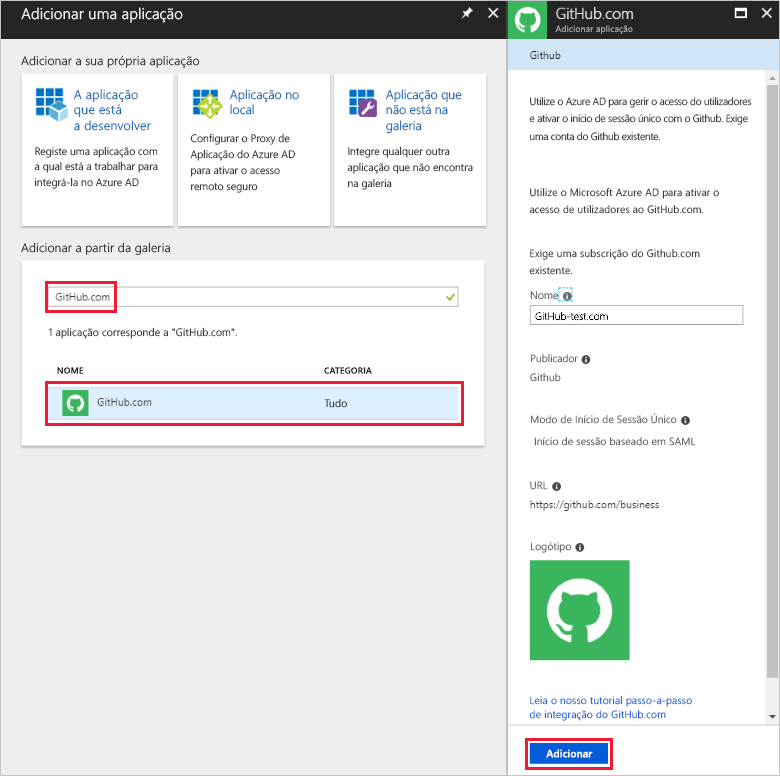

# Início rápido: Adicionar uma aplicação com o seu inquilino do Azure Active Directory

O Azure Active Directory (Azure AD) tem uma galeria que contém milhares de aplicações pré-integradas. É provável que algumas das aplicações que a sua organização utiliza estão na galeria. Este início rápido utiliza o portal do Azure para adicionar uma aplicação da galeria ao seu inquilino do Azure Active Directory (Azure AD).

Após a adição de uma aplicação ao seu inquilino do Azure AD, pode:

- Gerir o acesso dos utilizadores à aplicação com uma política de acesso condicional.
- Configurar utilizadores para o início de sessão único na aplicação com as contas do Azure AD deles.

## Antes de começar

Para adicionar uma aplicação ao seu inquilino, precisa de:

- Uma subscrição do Azure
- Uma subscrição com início de sessão único ativado para a aplicação

Inicie sessão no [portal do Azure](https://portal.azure.com) como administrador global do inquilino do Azure AD, administrador de uma aplicação na cloud ou administrador de uma aplicação.

Para testar os passos neste tutorial, recomendamos utilizar um ambiente de não produção. Se não tiver um ambiente de não produção do Azure AD, pode [obter uma avaliação de um mês](https://azure.microsoft.com/pricing/free-trial/).

## Adicionar uma aplicação ao seu inquilino

Para adicionar uma aplicação da galeria ao seu inquilino do Azure AD:

1. Na [portal do Azure](https://portal.azure.com), no painel de navegação esquerdo, selecione **Azure Active Directory**.

1. Na **do Azure Active Directory** painel, selecione **aplicações empresariais**.

    

1. O **todos os aplicativos** painel abre-se para mostrar uma amostra aleatória das aplicações no seu inquilino do Azure AD. Selecione **nova aplicação** na parte superior a **todos os aplicativos** painel.

    

1. Na **categorias** painel, verá ícones sob o **em destaque aplicativos** área que são uma amostra aleatória das aplicações de galeria.  Para ver mais aplicações, pode selecionar **mostrar mais**. No entanto, não é recomendada a pesquisa desta forma, uma vez que existem milhares de aplicações na galeria.

    

1. Para procurar num aplicativo **adicionar a partir da galeria**, introduza o nome da aplicação que pretende adicionar. Selecione a aplicação a partir de resultados e selecione **adicionar**. A exemplo a seguir mostra a **Adicionar aplicação** formulário que aparece a seguir a procurar github.com.

    

1. No formulário específico da aplicação, pode alterar as informações de propriedade. Por exemplo, pode editar o nome da aplicação para satisfazer as necessidades da sua organização. Este exemplo utiliza o nome **GitHub-test**.

1. Quando terminar de efetuar alterações às propriedades, selecione **adicionar**.

1. É apresentada uma página de introdução com as opções para configurar a aplicação para a sua organização.

Terminar de adicionar a sua aplicação. Aproveite para descansar. As secções seguintes mostram-lhe como alterar o logótipo e editar outras propriedades da aplicação.

## Localizar a aplicação do seu inquilino do Azure AD

Vamos supor que teve de se ausentar e que voltou agora para retomar a configuração da aplicação. A primeira coisa a fazer é encontrar o seu aplicativo.

1. Na  **[portal do Azure](https://portal.azure.com)**, no painel de navegação esquerdo, selecione **Azure Active Directory**.

1. Na **do Azure Active Directory** painel, selecione **aplicações empresariais**.

1. Partir do **tipo de aplicação** menu pendente, selecione **todos os aplicativos**e, em seguida, selecione **aplicar**. Para saber mais sobre as opções de visualização, veja [View tenant applications](view-applications-portal.md) (Ver aplicações do inquilino).

1. Agora, pode ver uma lista com todas as aplicações no seu inquilino do Azure AD. A lista é uma amostra aleatória. Para ver mais aplicações, selecione **mostrar mais** uma ou mais vezes.

1. Para encontrar rapidamente uma aplicação no seu inquilino, introduza o nome da aplicação na caixa de pesquisa e selecione **aplicar**. Neste exemplo localiza o aplicativo de teste do GitHub adicionado anteriormente.

    

## Configurar as propriedades de início de sessão do utilizador

Agora que encontrar a aplicação, pode abri-lo e configurar as propriedades da aplicação.

Para editar as propriedades da aplicação:

1. Selecione a aplicação para abri-lo.
1. Selecione **propriedades** para abrir o painel de propriedades para edição.

    

1. Dispense alguns momentos para compreender as opções de início de sessão. As opções de determinam como os utilizadores que são atribuídos ou não atribuídos à aplicação podem iniciar sessão na aplicação. Além disso, as opções também determinam se um utilizador pode ver a aplicação no painel de acesso.

    - **Ativada para os utilizadores iniciarem sessão** determina se os utilizadores atribuídos à aplicação podem iniciar sessão.
    - **Atribuição utiliz. necessária** determina se os utilizadores que não estão atribuídos à aplicação podem iniciar sessão.
    - **Visível para o utilizador** determina se os utilizadores atribuídos a uma aplicação podem vê-la no painel de acesso e no iniciador do O365.

1. Utilize as tabelas seguintes para ajudar a escolher as opções melhores para as suas necessidades.

   - Comportamento para utilizadores **atribuídos**:

       | Definições da propriedades da aplicação | | | Experiência para utilizadores atribuídos | |
       |---|---|---|---|---|
       | Ativado para os utilizadores iniciarem sessão? | Atribuição do utilizador necessária? | Visível para os utilizadores? | Os utilizadores atribuídos podem iniciar sessão? | Os utilizadores atribuídos podem ver a aplicação?* |
       | sim | sim | sim | sim | sim  |
       | sim | sim | não  | sim | não   |
       | sim | não  | sim | sim | sim  |
       | sim | não  | não  | sim | não   |
       | não  | sim | sim | não  | não   |
       | não  | sim | não  | não  | não   |
       | não  | não  | sim | não  | não   |
       | não  | não  | não  | não  | não   |

   - Comportamento para utilizadores **não atribuídos**:

       | Definições da propriedades da aplicação | | | Experiência para utilizadores não atribuídos | |
       |---|---|---|---|---|
       | Ativado para os utilizadores iniciem sessão? | Atribuição do utilizador necessária? | Visível para os utilizadores? | Os utilizadores não atribuídos podem iniciar sessão? | Os utilizadores não atribuídos podem ver a aplicação?* |
       | sim | sim | sim | não  | não   |
       | sim | sim | não  | não  | não   |
       | sim | não  | sim | sim | não   |
       | sim | não  | não  | sim | não   |
       | não  | sim | sim | não  | não   |
       | não  | sim | não  | não  | não   |
       | não  | não  | sim | não  | não   |
       | não  | não  | não  | não  | não   |

     *O utilizador pode ver a aplicação no painel de acesso e no iniciador de aplicações do Office 365?

## Utilizar um logótipo personalizado

Para utilizar um logótipo personalizado:

1. Crie um logótipo com 215 por 215 píxeis e guarde-o no formato PNG.
1. Uma vez que já encontrar seu aplicativo, selecione a aplicação.
1. No painel esquerdo, selecione **propriedades**.
1. Atualize o logótipo.
1. Quando tiver terminado, selecione **guardar**.

    

## Passos Seguintes

Neste início rápido, aprendeu a adicionar uma aplicação da galeria ao seu inquilino do Azure AD. Aprendeu a editar as propriedades da aplicação.

Agora, está pronto para configurar a aplicação para início de sessão único.

> [!div class="nextstepaction"]
> [Configure single sign-on](configure-single-sign-on-portal.md) (Configurar o início de sessão único)

