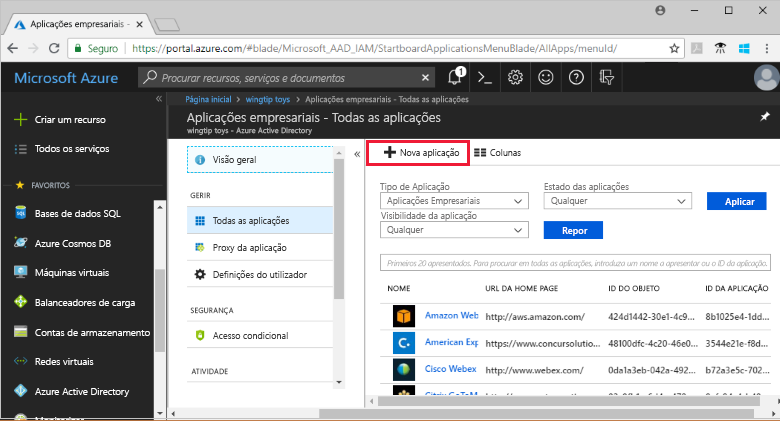

# Quickstart: Adicione uma aplicação ao seu inquilino Azure Ative (Azure AD)

O Azure Active Directory (Azure AD) tem uma galeria que contém milhares de aplicações pré-integradas. Muitas das aplicações que a sua organização usa provavelmente já estão na galeria.

Após a adição de uma aplicação ao seu inquilino do Azure AD, pode:

- Configure propriedades para a aplicação.
- Gerir o acesso do utilizador à aplicação com uma política de Acesso Condicional.
- Configure um único sinal para que os utilizadores possam iniciar súm na aplicação com as suas credenciais AD AZure.

## Pré-requisitos

Para adicionar uma aplicação ao seu inquilino AZure AD, você precisa:

- Uma conta Azure com uma subscrição ativa. [Crie uma conta gratuita.](https://azure.microsoft.com/free/?WT.mc_id=A261C142F)
- Uma das seguintes funções: Administrador Global, Administrador de Aplicação cloud, Administrador de Aplicação ou proprietário do principal de serviço.
- (Opcional: Conclusão de Visualização das [suas apps).](view-applications-portal.md)

>[!IMPORTANT]
>Recomendamos a utilização de um ambiente de não produção para testar os passos neste arranque rápido.

## Adicione uma app ao seu inquilino AZure AD

Para adicionar uma aplicação ao seu inquilino AZure AD:

1. No [portal Azure,](https://portal.azure.com)no painel de navegação à esquerda, selecione **Azure Ative Directory**.
2. No painel de **diretório ativo Azure,** selecione **aplicações Enterprise**. O painel **de aplicações All Applications** abre e exibe uma amostra aleatória das aplicações no seu inquilino AZure AD.
3. No painel de **aplicações** da Enterprise, selecione **Nova aplicação**. 
    
4. Mude para a nova experiência de pré-visualização da galeria: No banner no topo da página de **aplicação Add**, selecione o link que diz **Click aqui para experimentar a nova e melhorada galeria de aplicações**.
5. O painel **Browse AD Gallery (Preview)** abre e exibe azulejos para plataformas em nuvem, aplicações no local e aplicações em destaque. As aplicações listadas na secção **de aplicações em destaque** têm ícones que indicam se suportam um único sign-on federado (SSO) e provisionamento. 
    
6. Pode navegar na galeria para a aplicação que pretende adicionar, ou procurar a aplicação introduzindo o seu nome na caixa de pesquisa. Em seguida, selecione a aplicação a partir dos resultados. 
7. O passo seguinte depende da forma como o desenvolvedor da aplicação implementou um único sign-on (SSO). Um único s-on pode ser implementado pelos desenvolvedores de aplicações de quatro maneiras. As quatro formas são SAML, OpenID Connect, Password e Linked. Quando adiciona uma aplicação, pode optar por filtrar e ver apenas aplicações usando uma determinada implementação SSO, como mostrado na imagem. Por exemplo, um padrão popular para implementar SSO é chamado de Linguagem de Marcação de Afirmação de Segurança (SAML). Outro padrão que é popular é chamado OpenId Connect (OIDC). A forma como configura o SSO com estes padrões é diferente, por isso tome nota do tipo de SSO que é implementado pela app que está a adicionar.

    :::image type="content" source="media/add-application-portal/sso-types.png" alt-text="A screenshot mostra o seletor de tipos SSO." lightbox="media/add-application-portal/sso-types.png":::

    - Se o desenvolvedor da aplicação usou a **norma OIDC** para SSO, então selecione **'Iniciar S-Up'.** Aparece uma página de configuração. Em seguida, vá ao quickstart na configuração de um único sign-on baseado no OIDC.
    :::image type="content" source="media/add-application-portal/sign-up-oidc-sso.png" alt-text="O Screenshot mostra a adição de uma aplicação SSO baseada em OIDC.":::

    - Se o desenvolvedor da aplicação usou a **norma SAML** para SSO, então selecione **Create**. É apresentada uma página de introdução com as opções para configurar a aplicação para a sua organização. No formulário, pode editar o nome da aplicação para corresponder às necessidades da sua organização. Em seguida, vá ao quickstart na configuração de um único sinal baseado em SAML.
    :::image type="content" source="media/add-application-portal/create-application.png" alt-text="A Screenshot mostra a adição de uma aplicação SSO baseada em SAML.":::

> [!IMPORTANT]
> Existem algumas diferenças fundamentais entre as implementações SSO baseadas em SAML e OIDC. Com aplicações baseadas em SAML pode adicionar várias instâncias da mesma aplicação. Por exemplo, GitHub1, GitHub2, etc.. Para aplicações baseadas em OIDC, só é possível adicionar uma instância de uma aplicação. Se já adicionou uma aplicação baseada no OIDC e tentar adicionar novamente a mesma app e fornecer o consentimento duas vezes, não será adicionada novamente no arrendatário.

Se a aplicação que procura não estiver na galeria, então pode selecionar o link Criar a **sua própria aplicação** e, em seguida, em **O que pretende fazer com a sua aplicação?** Escolha **Integrar qualquer outra aplicação que não encontre na galeria.** A Microsoft já trabalhou com muitos desenvolvedores de aplicações para pré-configurar os mesmos para trabalhar com a Azure AD. As aplicações pré-configuradas aparecem na galeria. Mas se a app que pretende adicionar não estiver listada, então pode criar uma nova aplicação genérica e, em seguida, configurá-la por si mesmo ou com a orientação do desenvolvedor que a criou.

Terminou de adicionar uma candidatura. O próximo quickstart mostra-lhe como alterar o logótipo e editar outras propriedades para a sua aplicação.

> [!TIP]
> Pode automatizar a gestão de aplicações utilizando a API do Gráfico, ver [Gestão de aplicações do Automamate com a Microsoft Graph API](/graph/application-saml-sso-configure-api).

## Limpar os recursos

Se não vai continuar com a série quickstart, então considere apagar a app para limpar o seu inquilino de teste. A eliminação da aplicação é abrangida pelo último quickstart desta série, ver [Delete uma aplicação](delete-application-portal.md).

## Passos seguintes

Avance para o próximo artigo para aprender a configurar uma aplicação.
> [!div class="nextstepaction"]
> [Configurar uma aplicação](add-application-portal-configure.md)