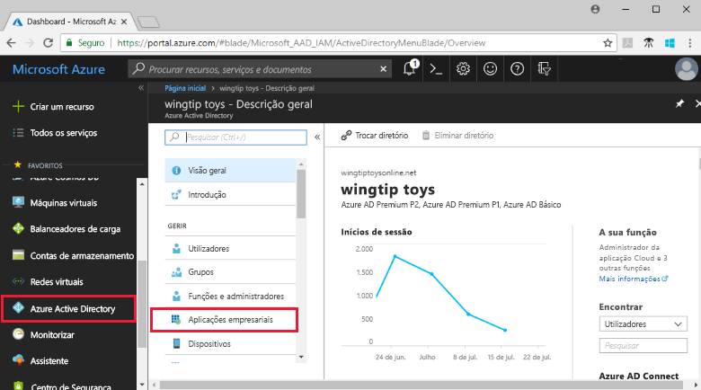
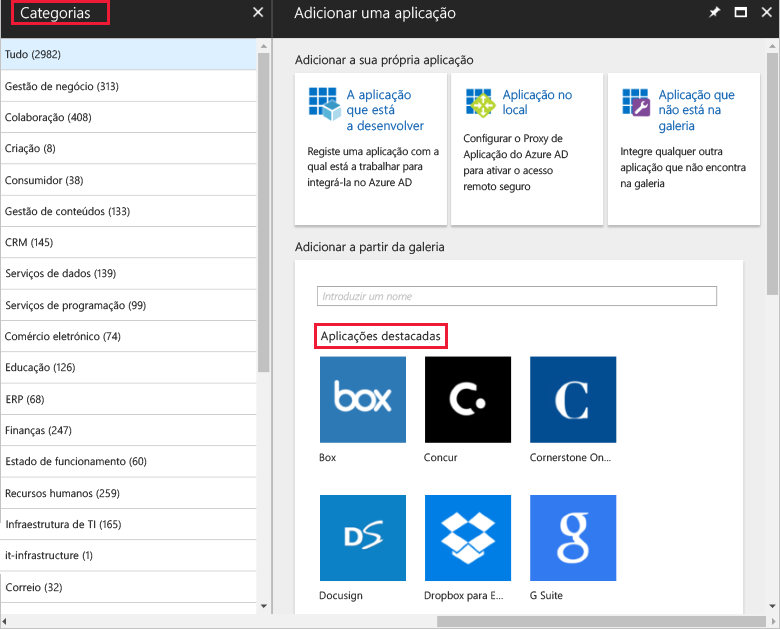

# Adicionar um aplicativo da Galeria à sua organização do Azure AD

O Azure Active Directory (AD do Azure) tem uma galeria que contém milhares de aplicativos previamente integrados que são habilitados com o logon único corporativo. Este artigo descreve as etapas gerais para adicionar um aplicativo da Galeria à sua organização do Azure AD.

> [!IMPORTANT]
> Primeiro, verifique seu aplicativo na [lista de tutoriais sobre como integrar aplicativos SaaS com Azure Active Directory](https://azure.microsoft.com/documentation/articles/active-directory-saas-tutorial-list/). Você provavelmente encontrará orientações passo a passo para adicionar e configurar o aplicativo da galeria que deseja adicionar.

## Adicionar um aplicativo de galeria

1. Inicie sessão no [portal do Azure](https://portal.azure.com) como administrador global do inquilino do Azure AD, administrador de uma aplicação na cloud ou administrador de uma aplicação.

1. No [portal do Azure](https://portal.azure.com), no painel de navegação à esquerda, selecione **Azure Active Directory**.

1. No painel de **Azure Active Directory** , selecione **aplicativos empresariais**.

    

1. Selecione **Nova aplicação**.

    

1. Em **Adicionar da Galeria**, na caixa de pesquisa, digite o nome do aplicativo que você deseja adicionar. 

    

1. Selecione o aplicativo nos resultados.

1. Adicional No formulário específico do aplicativo, você pode editar o nome do aplicativo para corresponder às necessidades da sua organização.

1. Selecione **Adicionar**. A página **visão geral** do aplicativo é aberta.

## Configurar as propriedades de início de sessão do utilizador

1. Selecione **Propriedades** para abrir o painel Propriedades para edição.

    

1. Defina as opções a seguir para determinar como os usuários atribuídos ou não atribuídos ao aplicativo poderão entrar no aplicativo e se um usuário puder ver o aplicativo no painel de acesso.

    - **Ativada para os utilizadores iniciarem sessão** determina se os utilizadores atribuídos à aplicação podem iniciar sessão.
    - **Atribuição de usuário necessária** determina se os usuários que não estão atribuídos ao aplicativo podem entrar.
    - **Visível para o utilizador** determina se os utilizadores atribuídos a uma aplicação podem vê-la no painel de acesso e no iniciador do O365.

      Comportamento para utilizadores **atribuídos**:

       | Definições da propriedades da aplicação | | | Experiência para utilizadores atribuídos | |
       |---|---|---|---|---|
       | Ativado para os utilizadores iniciarem sessão? | Atribuição do utilizador necessária? | Visível para os utilizadores? | Os utilizadores atribuídos podem iniciar sessão? | Os utilizadores atribuídos podem ver a aplicação?* |
       | sim | sim | sim | sim | sim  |
       | sim | sim | não  | sim | não   |
       | sim | não  | sim | sim | sim  |
       | sim | não  | não  | sim | não   |
       | não  | sim | sim | não  | não   |
       | não  | sim | não  | não  | não   |
       | não  | não  | sim | não  | não   |
       | não  | não  | não  | não  | não   |

      Comportamento para utilizadores **não atribuídos**:

       | Definições da propriedades da aplicação | | | Experiência para utilizadores não atribuídos | |
       |---|---|---|---|---|
       | Habilitado para os usuários entrarem? | Atribuição utiliz. necessária? | Visível para os utilizadores? | Os utilizadores não atribuídos podem iniciar sessão? | Os utilizadores não atribuídos podem ver a aplicação?* |
       | sim | sim | sim | não  | não   |
       | sim | sim | não  | não  | não   |
       | sim | não  | sim | sim | não   |
       | sim | não  | não  | sim | não   |
       | não  | sim | sim | não  | não   |
       | não  | sim | não  | não  | não   |
       | não  | não  | sim | não  | não   |
       | não  | não  | não  | não  | não   |

     *O utilizador pode ver a aplicação no painel de acesso e no iniciador de aplicações do Office 365?

1. Para usar um logotipo personalizado, crie um logotipo que seja 215 por 215 pixels e salve-o no formato PNG. Em seguida, navegue até o logotipo e carregue-o.

    

1. Quando tiver terminado, selecione **salvar**.

## Passos seguintes

Agora que você adicionou o aplicativo à sua organização do Azure AD, [escolha um método de logon único](what-is-single-sign-on.md#choosing-a-single-sign-on-method) que você deseja usar e consulte o artigo apropriado abaixo:

- [Configurar o logon único baseado em SAML](configure-single-sign-on-portal.md)
- [Configurar o logon único com senha](configure-password-single-sign-on-non-gallery-applications.md)
- [Configurar logon vinculado](configure-linked-sign-on.md)

