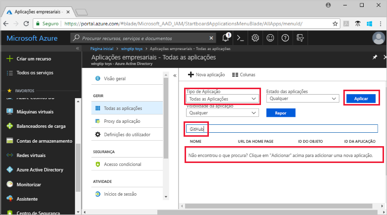
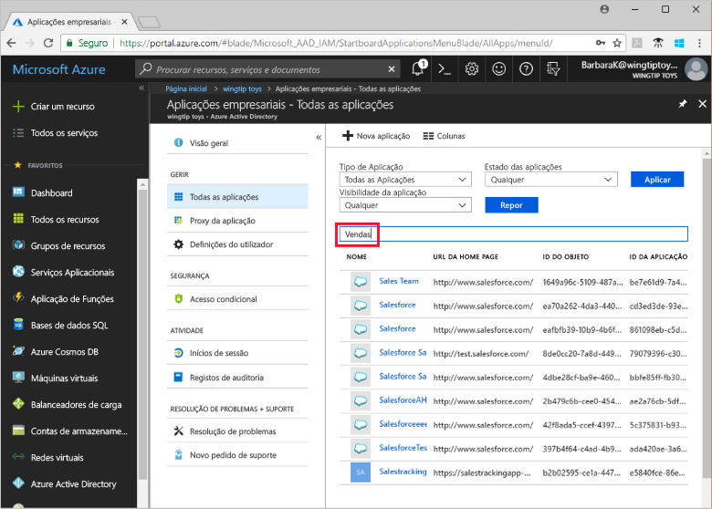

# Quickstart: Veja a lista de aplicações que estão a usar o seu inquilino Azure Ative (Azure AD) para gestão de identidade

Começa a usar o Azure AD como o seu sistema de Gestão de Identidade e Acesso (IAM) para as aplicações que a sua organização utiliza. Neste quickstart você verá as aplicações, também conhecidas como apps, que já estão configuradas para usar o seu inquilino AZURE AD como seu Fornecedor de Identidade (IdP).

## Pré-requisitos

Para visualizar as aplicações que foram registadas no seu inquilino AZure AD, você precisa:

- Uma conta do Azure. [Crie uma conta gratuita.](https://azure.microsoft.com/free/?WT.mc_id=A261C142F)

>[!IMPORTANT]
>Recomendamos a utilização de um ambiente de não produção para testar os passos neste arranque rápido.

## Encontre a lista de candidaturas no seu inquilino

As aplicações registadas no seu inquilino Azure AD são visualizadas na secção de **aplicações da Enterprise** do portal Azure.

Para visualizar as candidaturas registadas no seu inquilino:

1. Inscreva-se no seu [portal Azure](https://portal.azure.com).
2. No painel de navegação esquerdo, selecione **Azure Ative Directory**.
3. No painel de **diretório ativo Azure,** selecione **aplicações Enterprise**.
4. A partir do menu drop-down do Tipo de **Aplicação,** selecione **Todas as Aplicações** e escolha **Aplicar**. É apresentada uma amostra aleatória das aplicações do seu inquilino.
5. Para ver mais aplicações, **selecione Carregar mais** na parte inferior da lista. Se houver inúmeras aplicações no seu inquilino, pode ser mais fácil procurar uma determinada aplicação em vez de percorrer a lista. A procura de uma aplicação específica é abordada mais tarde neste arranque rápido.

## Selecionar as opções de visualização

Selecione opções de acordo com o que procura.

1. Pode ver as aplicações por **Tipo de Aplicação,** **Estado de Aplicação** e **visibilidade da aplicação.**
2. Em **Tipo de Aplicação**, escolha uma das seguintes opções:
    - **Aplicações Empresariais** mostra aplicações não Microsoft.
    - **Aplicações da Microsoft** mostra aplicações da Microsoft.
    - **Todas as Aplicações** mostra aplicações não Microsoft e Microsoft.
3. Em **Estado da Aplicação**, escolha **Qualquer**, **Desativada** ou **Ativada**. A opção **Qualquer** inclui aplicações desativadas e ativadas.
4. Em **Visibilidade da Aplicação**, escolha **Qualquer** ou **Oculta**. A opção **Oculta** mostra aplicações que estão no arrendatário, mas não são visíveis para os utilizadores.
5. Depois de escolher as opções desejada, **selecione Aplicar**.

## Procurar uma aplicação

Para procurar uma determinada aplicação:

1. No menu **'Tipo de Aplicação',** selecione **Todas as aplicações** e escolha **Aplicar**.
2. Introduza o nome da aplicação que quer encontrar. Se o pedido foi adicionado ao seu inquilino Azure AD, aparece nos resultados da pesquisa. Este exemplo mostra que o GitHub não foi adicionado aos pedidos de inquilinos.
    
3. Experimente introduzir as primeiras letras do nome de uma aplicação. Este exemplo mostra todas as aplicações que começam com **Sales**.
    

> [!TIP]
> Pode automatizar a gestão de aplicações utilizando a API do Gráfico, ver [Gestão de aplicações do Automamate com a Microsoft Graph API](/graph/application-saml-sso-configure-api).

## Limpar os recursos

Não criou novos recursos neste arranque rápido, por isso não há nada para limpar.

## Passos seguintes

Avance para o próximo artigo para aprender a usar a Azure AD como fornecedor de identidade para uma aplicação.
> [!div class="nextstepaction"]
> [Adicionar uma aplicação](add-application-portal.md)