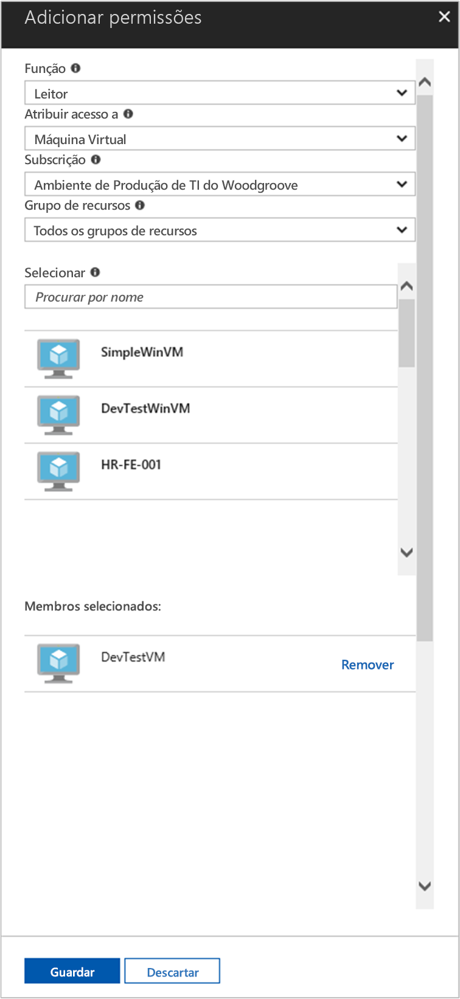

# <a name="use-a-linux-vm-system-assigned-managed-identity-to-access-azure-resource-manager"></a>Utilizar uma identidade gerida atribuída pelo sistema de VM do Linux para aceder ao Azure Resource Manager

[!INCLUDE [preview-notice](../../../includes/active-directory-msi-preview-notice.md)]

Este início rápido mostra como utilizar uma identidade atribuída pelo sistema da Máquina Virtual (VM) do Linux para aceder ao à API do Azure Resource Manager. As identidades geridas dos recursos do Azure são geridas automaticamente pelo Azure e permitem que se autentique perante serviços que suportem Autenticação do Azure AD sem que seja necessário inserir as credenciais no seu código. Saiba como:

> [!div class="checklist"]
> * Conceder o acesso da VM a um Grupo de Recursos no Azure Resource Manager 
> * Obter um token de acesso com a identidade da VM e utilizá-lo para chamar o Azure Resource Manager 

## <a name="prerequisites"></a>Pré-requisitos

- Uma compreensão das identidades geridas. Se não estiver familiarizado com a funcionalidade das identidades geridas para os recursos do Azure, veja esta [descrição geral](overview.md). 
- Uma conta Azure, [inscreva-se para uma conta gratuita.](https://azure.microsoft.com/free/)
- Também precisa de uma máquina Virtual Linux que tenha o sistema atribuído a identidades geridas ativadas.
  - Se precisar de criar uma máquina virtual para este tutorial, pode seguir o artigo intitulado [Criar uma máquina virtual Linux com o portal Azure](../../virtual-machines/linux/quick-create-portal.md#create-virtual-machine)

## <a name="grant-access"></a>Conceder acesso

Com as identidades geridas para recursos do Azure, o seu código pode obter tokens de acesso para autenticação perante recursos que suportem a Autenticação do Azure AD. A API do Azure Resource Manager suporta a autenticação do Azure AD. Primeiro, temos de conceder acesso de identidade a esta VM a um recurso no Azure Resource Manager, neste caso, o Grupo de Recursos no qual a VM está contida.  

1. Navegue até ao separador para **Grupos de Recursos**.
2. Selecione o **Grupo de Recursos** específico que utilizou para a sua máquina virtual.
3. Aceda a **Controlo de acesso (IAM)** no painel esquerdo.
4. Clique para **Adicionar** uma nova atribuição de função à sua VM. Selecione **Função** como **Leitor**.
5. No próximo dropdown, **atribua acesso à** **Máquina Virtual** de recurso.
6. Em seguida, certifique-se de que está listada a subscrição correta na lista pendente **Subscrição**. Para **Grupo de Recursos**, selecione **Todos os grupos de recursos**.
7. Por fim, em **Selecionar**, selecione a sua Máquina Virtual do Linux na lista pendente e clique em **Guardar**.

    

## <a name="get-an-access-token-using-the-vms-system-assigned-managed-identity-and-use-it-to-call-resource-manager"></a>Obter um token de acesso através da identidade gerida atribuída pelo sistema da VM e utilizá-lo para chamar o Resource Manager

Para concluir estes passos, precisará de um cliente SSH. Se estiver a utilizar o Windows, pode utilizar o cliente SSH no [Subsistema Windows para Linux](/windows/wsl/about). Se precisar de ajuda para configurar as chaves do seu cliente SSH, veja [Como utilizar chaves SSH com o Windows no Azure](../../virtual-machines/linux/ssh-from-windows.md) ou [Como criar e utilizar um par de chaves SSH públicas e privadas para VMs do Linux no Azure](../../virtual-machines/linux/mac-create-ssh-keys.md).

1. No portal, navegue para a VM do Linux e, em **Descrição Geral**, clique em **Ligar**.  
2. Clique em **Ligar** para ligar à VM com o cliente SSH que escolheu. 
3. Na janela do terminal, `curl` utilizando, faça um pedido às identidades geridas locais para que o ponto final dos recursos Azure obtenha um token de acesso para O Gestor de Recursos Azure.  
 
    O `curl` pedido para o token de acesso está abaixo.  
    
    ```bash
    curl 'http://169.254.169.254/metadata/identity/oauth2/token?api-version=2018-02-01&resource=https://management.azure.com/' -H Metadata:true   
    ```
    
    > [!NOTE]
    > O valor do parâmetro "recurso" tem de ser uma correspondência exata para o que é esperado pelo Azure AD.  No caso do ID de recurso do Resource Manager, tem de incluir a barra à direita no URI. 
    
    A resposta inclui o token de acesso necessário para aceder ao Azure Resource Manager. 
    
    Resposta:  

    ```bash
    {"access_token":"eyJ0eXAiOi...",
    "refresh_token":"",
    "expires_in":"3599",
    "expires_on":"1504130527",
    "not_before":"1504126627",
    "resource":"https://management.azure.com",
    "token_type":"Bearer"} 
    ```
    
    Pode utilizar este token de acesso para aceder ao Azure Resource Manager, por exemplo, para ler os detalhes do Grupo de Recursos ao qual concedeu anteriormente este acesso de VM. Substitua os valores de \<SUBSCRIPTION ID\> , e pelos que criou \<RESOURCE GROUP\> \<ACCESS TOKEN\> anteriormente. 
    
    > [!NOTE]
    > O URL é sensível às maiúsculas de minúsculas, por isso, certifique-se de que utiliza as mesmas maiúsculas e minúsculas que utilizou anteriormente, quando atribuiu o nome ao Grupo de Recursos e a maiúscula "G" em "resourceGroup".  
    
    ```bash 
    curl https://management.azure.com/subscriptions/<SUBSCRIPTION ID>/resourceGroups/<RESOURCE GROUP>?api-version=2016-09-01 -H "Authorization: Bearer <ACCESS TOKEN>" 
    ```
    
    A resposta devolve as informações específicas do Grupo de Recursos: 
     
    ```bash
    {"id":"/subscriptions/98f51385-2edc-4b79-bed9-7718de4cb861/resourceGroups/DevTest","name":"DevTest","location":"westus","properties":{"provisioningState":"Succeeded"}} 
    ```

## <a name="next-steps"></a>Passos seguintes

Este início rápido mostra como utilizar uma identidade gerida atribuída pelo sistema para aceder à API do Azure Resource Manager.  Para saber mais sobre o Azure Resource Manager, veja:

> [!div class="nextstepaction"]
>Gestor de [Recursos Azure](../../azure-resource-manager/management/overview.md) 
> [Criar, listar ou eliminar uma identidade gerida atribuída pelo utilizador utilizando a Azure PowerShell](how-to-manage-ua-identity-powershell.md)