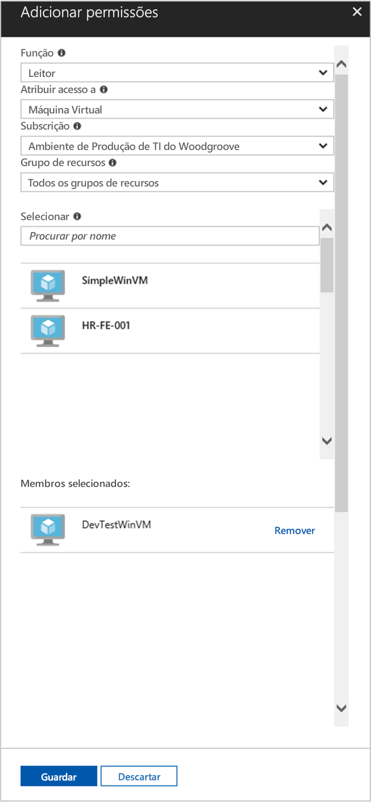

# <a name="use-a-windows-vm-system-assigned-managed-identity-to-access-resource-manager"></a>Utilizar uma identidade gerida atribuída pelo sistema de VM do Windows para aceder ao Resource Manager

[!INCLUDE [preview-notice](../../../includes/active-directory-msi-preview-notice.md)]

Este início rápido mostra como aceder à API do Azure Resource Manager através de uma máquina virtual do Windows com a identidade gerida atribuída pelo sistema ativada. As identidades geridas dos recursos do Azure são geridas automaticamente pelo Azure e permitem que se autentique perante serviços que suportem Autenticação do Azure AD sem que seja necessário inserir as credenciais no seu código. Saiba como:

> [!div class="checklist"] 
> * Conceder o acesso da VM a um Grupo de Recursos no Azure Resource Manager 
> * Obter um token de acesso com a identidade da VM e utilizá-lo para chamar o Azure Resource Manager

## <a name="prerequisites"></a>Pré-requisitos

[!INCLUDE [msi-tut-prereqs](../../../includes/active-directory-msi-tut-prereqs.md)]

## <a name="grant-your-vm-access-to-a-resource-group-in-resource-manager"></a>Conceder o acesso da VM a um grupo de recursos no Resource Manager

Com as identidades geridas para recursos do Azure, o seu código pode obter tokens de acesso para autenticação perante recursos que suportem a Autenticação do Azure AD.  O Azure Resource Manager suporta a autenticação do Azure AD.  Primeiro, temos de conceder a esta identidade gerida atribuída pelo sistema da VM acesso a um recurso do Resource Manager, neste caso, ao Grupo de Recursos que contém a VM.  

1.  Navegue até ao separador para **Grupos de Recursos**. 
2.  Selecione o **Grupo de Recursos** específico que criou para a sua **VM do Windows**. 
3.  Aceda a **Controlo de acesso (IAM)** no painel esquerdo. 
4.  Em **seguida, adicione** uma nova atribuição de função para o seu **Windows VM**.  Selecione **Função** como **Leitor**. 
5.  Na lista pendente seguinte, defina **Atribuir acesso a** para o recurso **Máquina Virtual**. 
6.  Em seguida, certifique-se de que está listada a subscrição correta na lista pendente **Subscrição**. Para **Grupo de Recursos** , selecione **Todos os grupos de recursos**. 
7.  Por fim, em **Selecionar** , selecione a sua VM do Windows na lista pendente e clique em **Guardar**.

    

## <a name="get-an-access-token-using-the-vms-system-assigned-managed-identity-and-use-it-to-call-azure-resource-manager"></a>Obter um token de acesso através da identidade gerida atribuída pelo sistema da VM do Linux e utilizá-lo para chamar o Azure Resource Manager 

Terá de utilizar o **PowerShell** nesta parte.  Se não tiver o **PowerShell** instalado, transfira-o [aqui](/powershell/azure/). 

1.  No portal, navegue para **Máquinas Virtuais** , aceda à sua máquina virtual do Windows e, em **Descrição Geral** , clique em **Ligar**. 
2.  Introduza o seu **Nome de Utilizador** e a **Palavra-passe** que adicionou quando criou a VM do Windows. 
3.  Agora que criou uma **Ligação de Ambiente de Trabalho Remoto** com a máquina virtual, abra o **PowerShell** na sessão remota. 
4.  Utilizando o Invoke-WebRequest cmdlet, faça um pedido à identidade gerida local para que o ponto final dos recursos Azure obtenha um sinal de acesso para o Gestor de Recursos Azure.

    ```powershell
       $response = Invoke-WebRequest -Uri 'http://169.254.169.254/metadata/identity/oauth2/token?api-version=2018-02-01&resource=https://management.azure.com/' -Method GET -Headers @{Metadata="true"}
    ```
    
    > [!NOTE]
    > No pedido anterior, o valor do parâmetro "recurso" tem de ser uma correspondência exata para o que é esperado pelo Azure AD. Ao utilizar o ID de recurso do Azure Resource Manager, tem de incluir a barra à direita no URI.
    
    Em seguida, extraia a resposta completa, que é armazenada como uma cadeia formatada do JavaScript Object Notation (JSON) no objeto $response. 
    
    ```powershell
    $content = $response.Content | ConvertFrom-Json
    ```
    Em seguida, extraia o token de acesso da resposta.
    
    ```powershell
    $ArmToken = $content.access_token
    ```
    
    Por fim, chame o Azure Resource Manager com o token de acesso. Neste exemplo, também estamos a usar o Invoke-WebRequest cmdlet para fazer a chamada para O Gestor de Recursos Azure, e incluir o token de acesso no cabeçalho de Autorização.
    
    ```powershell
    (Invoke-WebRequest -Uri https://management.azure.com/subscriptions/<SUBSCRIPTION ID>/resourceGroups/<RESOURCE GROUP>?api-version=2016-06-01 -Method GET -ContentType "application/json" -Headers @{ Authorization ="Bearer $ArmToken"}).content
    ```
    > [!NOTE] 
    > O URL é sensível às maiúsculas de minúsculas, por isso, certifique-se de que utiliza as mesmas maiúsculas e minúsculas que utilizou anteriormente, quando atribuiu o nome ao Grupo de Recursos e a maiúscula "G" em "resourceGroups".
        
    O comando seguinte devolve os detalhes do Grupo de Recursos:

    ```powershell
    {"id":"/subscriptions/98f51385-2edc-4b79-bed9-7718de4cb861/resourceGroups/DevTest","name":"DevTest","location":"westus","properties":{"provisioningState":"Succeeded"}}
    ```

## <a name="next-steps"></a>Próximos passos

Este início rápido mostra como utilizar uma identidade gerida atribuída pelo sistema para aceder à API do Azure Resource Manager.  Para saber mais sobre o Azure Resource Manager, veja:

> [!div class="nextstepaction"]
>[Azure Resource Manager](../../azure-resource-manager/management/overview.md)