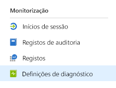
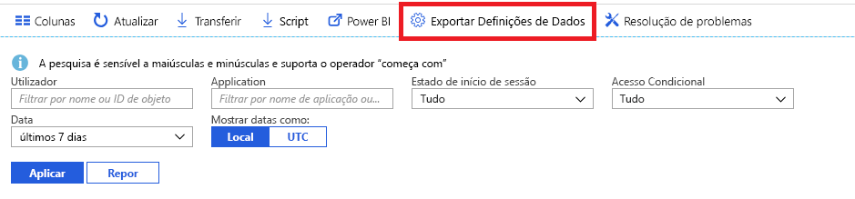

# O que é a monitorização do Azure Active Directory?

Com a monitorização do Azure Active Directory (Azure AD), pode agora encaminhar os registos de atividades do Azure AD para diferentes pontos finais. Em seguida, pode retê-los para utilização a longo prazo ou integrá-los com ferramentas de Gestão de Informações e Eventos de Segurança (SIEM) de terceiros para obter informações sobre o seu ambiente.

Atualmente, pode encaminhar os registos para:

- Uma conta de armazenamento do Azure.
- Um hub de eventos do Azure, para que possa integrar em instâncias do Splunk e do Sumologic.
- A área de trabalho do Azure Log Analytics, onde pode analisar os dados, criar o dashboard e alertar sobre eventos específicos

**Papel pré-requisito**: Administração Global

> [!VIDEO https://www.youtube.com/embed/syT-9KNfug8]

[!INCLUDE [azure-monitor-log-analytics-rebrand](../../../includes/azure-monitor-log-analytics-rebrand.md)]

## Licenciamento e pré-requisitos para a informação e monitorização da Azure AD

Você precisará de uma licença AD AD AD para aceder ao sinal AZURE AD em registos.

Para informações detalhadas sobre funcionalidades e licenciamentos no [guia de preços do Azure Ative Directory](https://azure.microsoft.com/pricing/details/active-directory/).

Para implementar a monitorização e reportagem da Azure, precisará de um utilizador que seja administrador global ou administrador de segurança para o inquilino da AD Azure.

Dependendo do destino final dos seus dados de registo, necessitará de um dos seguintes dados:

* Uma conta de armazenamento do Azure, para a qual tenha permissões ListKeys. Recomendamos que utilize uma conta de armazenamento para fins gerais e não uma conta de armazenamento de Blobs. Para obter informações sobre os preços de armazenamento, veja a [Calculadora de preços do Armazenamento do Azure](https://azure.microsoft.com/pricing/calculator/?service=storage).

* Um espaço de nome azure Event Hubs para integrar com soluções SIEM de terceiros.

* Um espaço de trabalho Azure Log Analytics para enviar registos para registos do Monitor Azure.

## Configuração de definições de diagnóstico

Para configurar definições de monitorização para registos de atividades do Azure AD, primeiro inicie sessão no [portal do Azure](https://portal.azure.com) e, em seguida, selecione **Azure Active Directory**. A partir daqui, pode aceder à página de configuração de definições de diagnóstico de duas formas:

* Selecione **Definições de diagnóstico** na secção **Monitorização**.

    
    
* Selecione **Registos de Auditoria** ou **Inícios de Sessão** e, em seguida, selecione **Exportar definições**. 

    

## Encaminhar registos para a conta de armazenamento

Ao encaminhar os registos para uma conta de armazenamento do Azure, pode mantê-los durante mais tempo do que o período de retenção predefinido descrito nas nossas [políticas de retenção](reference-reports-data-retention.md). Saiba como [encaminhar dados para a sua conta de armazenamento](quickstart-azure-monitor-route-logs-to-storage-account.md).

## Transmitir registos no hub de eventos

O encaminhamento de registos para um hub de eventos do Azure permite-lhe integrar com ferramentas SIEM de terceiros, como o Sumologic e o Splunk. Esta integração permite-lhe combinar dados de registo de atividade Azure AD com outros dados geridos pelo seu SIEM, para fornecer informações mais ricas sobre o seu ambiente. Saiba como [transmitir registos a um hub de eventos](tutorial-azure-monitor-stream-logs-to-event-hub.md).

## Enviar registos para registos do Monitor Azure

[Os registos do Azure Monitor](../../azure-monitor/log-query/log-query-overview.md) são uma solução que consolida dados de monitorização de diferentes fontes e fornece um motor de linguagem e análise de consulta que lhe dá informações sobre o funcionamento das suas aplicações e recursos. Ao enviar registos de atividade azure AD para registos do Azure Monitor, pode rapidamente recuperar, monitorizar e alertar os dados recolhidos. Saiba como [enviar dados para os registos do Azure Monitor](howto-integrate-activity-logs-with-log-analytics.md).

Também pode instalar as vistas pré-criadas para os registos de atividades do Azure AD para monitorizar cenários comuns que envolvem inícios de sessão e eventos de auditoria. Saiba como [instalar e utilizar vistas de análise de registos para registos de atividades Azure AD](howto-install-use-log-analytics-views.md).

## Passos seguintes

* [Registos de atividades no Azure Monitor](concept-activity-logs-azure-monitor.md)
* [Transmitir registos no hub de eventos](tutorial-azure-monitor-stream-logs-to-event-hub.md)
* [Enviar registos para registos do Monitor Azure](howto-integrate-activity-logs-with-log-analytics.md)
