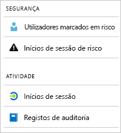

# O que são os relatórios do Azure Active Directory?

Os relatórios azure Ative Directory (Azure AD) proporcionam uma visão abrangente da atividade no seu ambiente. Os dados fornecidos permite-lhe:

- Determinar de que forma é que os utilizadores utilizam os seus serviços e aplicações
- Detetar potenciais riscos que afetem o estado de funcionamento do ambiente
- Resolver problemas que impedem os utilizadores de trabalhar  

A arquitetura dos relatórios baseia-se em dois pilares principais:

- [Relatórios de segurança](#security-reports)
- [Relatórios de atividade](#activity-reports)

## Relatórios de segurança

Os relatórios de segurança ajudam-no a proteger as identidades da sua organização. Existem dois tipos de relatórios de segurança:

- **Utilizadores sinalizados para risco** - com o [relatório de segurança de utilizadores sinalizados para risco](concept-user-at-risk.md), obtém uma descrição geral das contas de utilizador que possam ter sido comprometidas.

- **Inícios de sessão de risco** - com o [relatório de segurança de inícios de sessão de risco](concept-risky-sign-ins.md), obtém um indicador para tentativas de início de sessão que possam ter sido realizados por alguém que não seja o legítimo proprietário das contas de utilizador. 

### De que licença do Azure AD precisa para aceder a um relatório de segurança?  

Todas as edições da Azure AD fornecem-lhe utilizadores sinalizados para relatórios de inscrição de risco e de risco. No entanto, o nível de granularidade dos relatórios varia entre as edições: 

- Nas **edições Azure Ative Directory Free and Basic,** obtém-se uma lista de utilizadores sinalizados para inscrições de risco e de risco. 

- A edição **Azure Ative Directory Premium 1** alarga este modelo, permitindo-lhe também examinar algumas das deteções de risco subjacentes que foram detetadas para cada relatório. 

- A edição **Azure Ative Directory Premium 2** fornece-lhe as informações mais detalhadas sobre as deteções de risco subjacentes e também lhe permite configurar políticas de segurança que respondem automaticamente aos níveis de risco configurados.

## Relatórios de atividade

Os relatórios de atividade ajudam-no a compreender o comportamento dos utilizadores na sua organização. Existem dois tipos de relatórios de atividade saqueados em Azure AD:

- **Registos de auditoria** - o [relatório de atividade de registos de auditoria](concept-audit-logs.md) dá-lhe acesso ao histórico de cada tarefa executada no seu inquilino.

- **Inícios de sessão** – com o [relatório de atividade de inícios de sessão](concept-sign-ins.md), pode saber quem realizou as tarefas reportadas no relatório de registos de auditoria.

### Relatório de registos de auditoria 

O [relatório de registos de auditoria](concept-audit-logs.md) disponibiliza-lhe registos das atividades do sistema para efeitos de conformidade. Estes dados permitem-lhe abordar cenários comuns, tais como:

- Um utilizador no meu inquilino obteve acesso a um grupo de administração. Quem lhe deu acesso? 

- Quero ver uma lista dos utilizadores que iniciam sessão numa determinada aplicação, porque incluía-a recentemente e quero saber se está a funcionar bem.

- Quero saber quantas reposições de palavras-passe ocorrem no meu inquilino.

#### De que licença do Azure AD precisa para aceder aos relatórios de registos de auditoria?  

O relatório de registos de auditoria está disponível para as funcionalidades para as quais tem licenças. Se tiver uma licença para uma funcionalidade específica, também tem acesso às informações de registo de auditoria relativas à mesma. Para mais detalhes, consulte as [funcionalidades e capacidades do Diretório Ativo do Azure.](https://www.microsoft.com/cloud-platform/azure-active-directory-features)   

### Relatório de inscrição

O [relatório de inscrição](concept-sign-ins.md) permite-lhe encontrar respostas a questões como:

- O que é o padrão de início de sessão de um utilizador?
- Quantos utilizadores iniciaram sessão ao longo de uma semana?
- Qual é o estado destes inícios de sessão?

#### De que licença do Azure AD precisa para aceder aos relatórios de atividade de inícios de sessão?  

Para aceder aos relatórios de atividade de inícios de sessão, o seu inquilino tem de ter uma licença do Azure AD Premium associada ao mesmo.

## Acesso programático

Além da interface de utilizador, o Azure AD também lhe fornece [acesso programático](concept-reporting-api.md) aos dados dos relatórios, através de um conjunto de APIs baseados em REST. Pode chamar estas APIs a partir de várias linguagens e ferramentas de programação. 

## Passos seguintes

- [Relatório de inícios de sessão de risco](concept-risky-sign-ins.md)
- [Relatório de registos de auditoria](concept-audit-logs.md)
- [Relatório de registos de inícios de sessão](concept-sign-ins.md)
