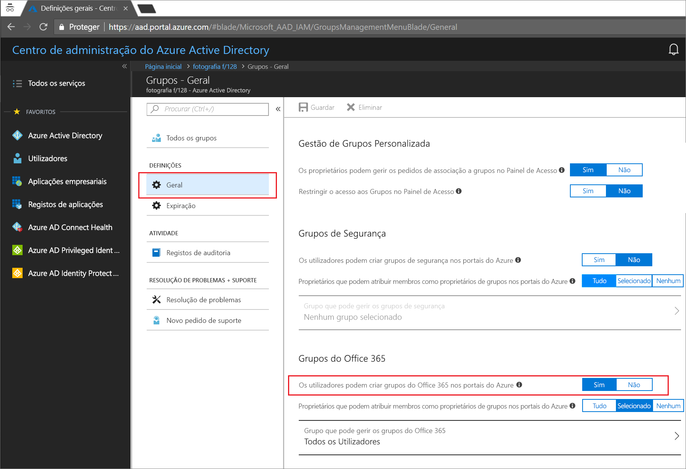
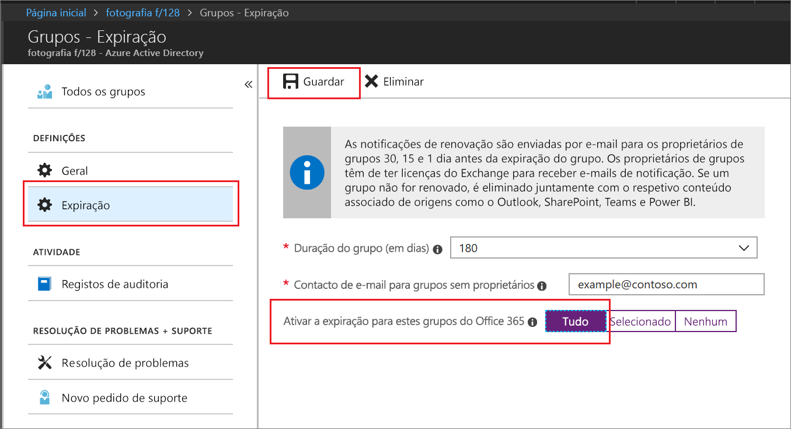

# Início rápido: definir a expiração de grupos do Office 365 no Azure Active Directory

Neste início rápido, vai definir a política de expiração dos seus grupos do Office 365. Quando os utilizadores podem configurar os seus próprios grupos, os grupos não utilizados podem multiplicar-se. Uma forma de gerir os grupos não utilizados é defini-los para expirarem, de forma a reduzir a manutenção de eliminar manualmente os grupos.

A política de expiração é simples:

- Grupos com atividades do usuário são renovados automaticamente à medida que a expiração é próxima
- Os proprietários do grupo são notificados para renovar um grupo prestes a expirar
- Um grupo que não seja renovado é eliminado
- Um grupo do Office 365 eliminado pode ser restaurado dentro de 30 dias por um proprietário do grupo ou por um administrador do Azure AD

> [!NOTE]
> Os grupos agora usam a inteligência do Azure AD para renovar automaticamente com base no uso recente. Essa decisão de renovação se baseia na atividade do usuário em grupos entre os serviços do Office 365, como Outlook, SharePoint, Teams, Yammer e outros.

Se não tiver uma subscrição do Azure, [crie uma conta gratuita](https://azure.microsoft.com/free/) antes de começar.

## Pré-requisito

 A função com privilégios mínimos necessária para configurar a expiração do grupo é o administrador do usuário na organização.

## Ativar a criação de utilizadores para grupos

1. Entre no [portal do Azure](https://portal.azure.com) com uma conta de administrador de usuário.

2. Selecione **Grupos** e, em seguida, selecione **Geral**.
  
   

3. Defina **Os utilizadores podem criar grupos do Office 365** como **Sim**.

4. Selecione **Guardar** para guardar as definições dos grupos quando terminar.

## Definir a expiração do grupo

1. Entre no [portal do Azure](https://portal.azure.com), selecione **Azure Active Directory** **grupos** de >  > **expiração** para abrir as configurações de expiração.
  
   

2. Defina o intervalo de expiração. Selecione um valor predefinido ou introduza um valor personalizado num período superior a 31 dias. 

3. Forneça um endereço de e-mail para onde as notificações de expiração devem ser enviadas quando um grupo não tiver proprietário.

4. Neste início rápido, defina **Ativar a expiração para estes grupos do Office 365** como **Todos**.

5. Selecione **Guardar** para guardar as definições de expiração quando terminar.

Já está! Neste início rápido, definiu com êxito a política de expiração dos grupos do Office 365 selecionados.

## Limpar recursos

### Para remover a política de expiração

1. Certifique-se de que inicia sessão no [portal do Azure](https://portal.azure.com) com uma conta que seja um Administrador Global do inquilino.
2. Selecione **Azure Active Directory** > **Grupos** > **Expiração**.
3. Defina **Ativar a expiração para estes grupos do Office 365** como **Nenhum**.

### Para desativar a criação de grupos de usuários

1. Selecione **Azure Active Directory** > **Grupos** > **Geral**. 
2. Defina **Os utilizadores podem criar grupos do Office 365 em portais do Azure** como **Não**.

## Passos seguintes

Para obter mais informações sobre expiração, incluindo instruções do PowerShell e restrições técnicas, consulte o seguinte artigo:

> [!div class="nextstepaction"]
> [PowerShell de política de expiração](groups-lifecycle.md)
