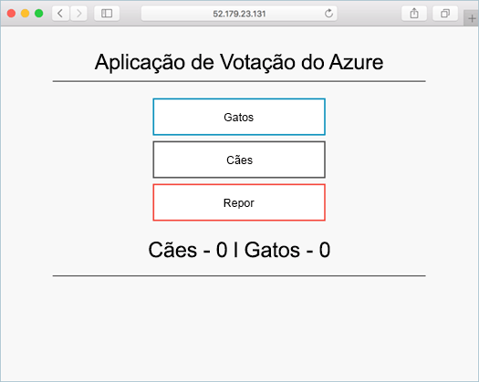

# <a name="quickstart-deploy-an-azure-kubernetes-service-aks-cluster-using-the-azure-portal"></a>Início rápido: Implantar um cluster do AKS (serviço kubernetes do Azure) usando o portal do Azure

O AKS (serviço kubernetes do Azure) é um serviço gerenciado kubernetes que permite implantar e gerenciar clusters rapidamente. Neste guia de introdução, vai implementar um cluster do AKS com o portal do Azure. Um aplicativo de vários contêineres que inclui um front-end da Web e uma instância Redis é executado no cluster. Em seguida, você verá como monitorar a integridade do cluster e os pods que executam seu aplicativo.



Este guia de introdução parte do princípio de que possui conhecimentos básicos dos conceitos do Kubernetes. Para obter mais informações, consulte [kubernetes Core Concepts for Azure kubernetes Service (AKs)][kubernetes-concepts].

Se não tiver uma subscrição do Azure, crie uma [conta gratuita](https://azure.microsoft.com/free/?WT.mc_id=A261C142F) antes de começar.

## <a name="sign-in-to-azure"></a>Iniciar sessão no Azure

Inicie sessão no portal do Azure em https://portal.azure.com.

## <a name="create-an-aks-cluster"></a>Criar um cluster do AKS (Create an AKS cluster)

No canto superior esquerdo da portal do Azure, selecione **+ criar um** > **contêiner** >  de recursos**kubernetes serviço**.

Para criar um cluster do AKS, execute os passos seguintes:

1. Na página **noções básicas** , configure as seguintes opções:
   - *DETALHES DO PROJETO*: Selecione uma assinatura do Azure e, em seguida, selecione ou crie um grupo de recursos do Azure, como *MyResource*Group. Introduza um **nome para o cluster do Kubernetes**, como *myAKSCluster*.
   - *DETALHES DO CLUSTER*: Selecione uma região, uma versão kubernetes e um prefixo de nome DNS para o cluster AKS.
   - **Pool de nós primário**: selecione um tamanho de VM para os nós AKs. O tamanho da VM **não pode** ser alterado após a implementação de um cluster de AKS. 
       - Selecione o número de nós a implementar no cluster. Neste início rápido, defina **Contagem de nós** como *1*. O número de nós **pode** ser ajustado após a implementação do cluster.
    
     

     Selecione **avançar: Dimensionar** ao concluir.

2. Na página **escala** , mantenha as opções padrão. Na parte inferior da tela, clique em **Avançar: autenticação**.
> [!CAUTION]
> A criação de novas entidades de serviço do AAD pode levar vários minutos para ser propagada e disponibilizada, fazendo com que a entidade de serviço não encontrou erros e falhas de validação no portal do Azure. Se você tiver obtido isso, visite [aqui](troubleshooting.md#im-receiving-errors-that-my-service-principal-was-not-found-when-i-try-to-create-a-new-cluster-without-passing-in-an-existing-one) para obter mitigações.
3. Na página **autenticação** , configure as seguintes opções:
   - Crie uma nova entidade de serviço deixando o campo de **entidade de serviço** com a **entidade de serviço padrão (novo)** . Ou você pode escolher *Configurar a entidade de serviço* para usar uma existente. Se você usar um existente, será necessário fornecer a ID e o segredo do cliente SPN.
   - Ative a opção para os controlos de acesso baseado em funções (RBAC) do Kubernetes. Isso fornecerá um controle mais refinado sobre o acesso aos recursos kubernetes implantados em seu cluster AKS.

Por padrão, a rede *básica* é usada e Azure monitor para contêineres está habilitado. Clique em **revisar + criar** e em **criar** quando a validação for concluída.

Leva alguns minutos para criar o cluster AKS. Quando a implantação for concluída, clique em **ir para recurso**ou navegue até o grupo de recursos de cluster AKs, como *MyResource*Group, e selecione o recurso AKs, como *myAKSCluster*. O painel do cluster AKS é mostrado, como neste exemplo:


## <a name="connect-to-the-cluster"></a>Ligar ao cluster

Para gerenciar um cluster kubernetes, você usa [kubectl][kubectl], o cliente de linha de comando kubernetes. O cliente `kubectl` está pré-instalado no Azure Cloud Shell.

Abra Cloud shell usando o `>_` botão na parte superior da portal do Azure.


Para configurar `kubectl` o para se conectar ao cluster do kubernetes, use o comando [AZ AKs Get-Credentials][az-aks-get-credentials] . Esse comando baixa as credenciais e configura a CLI do kubernetes para usá-las. O exemplo seguinte obtém credenciais para o nome do cluster *myAKSCluster* no grupo de recursos denominado *myResourceGroup*:

```azurecli-interactive
az aks get-credentials --resource-group myResourceGroup --name myAKSCluster
```

Para verificar a ligação ao cluster, utilize o comando [kubectl get][kubectl-get] para devolver uma lista de nós do cluster.

```azurecli-interactive
kubectl get nodes
```

A saída de exemplo seguinte mostra o nó único criado nos passos anteriores. Verifique se o status do nó está *pronto*:

```
NAME                       STATUS    ROLES     AGE       VERSION
aks-agentpool-14693408-0   Ready     agent     15m       v1.11.5
```

## <a name="run-the-application"></a>Executar a aplicação

Um arquivo de manifesto kubernetes define um estado desejado para o cluster, como quais imagens de contêiner executar. Neste início rápido, é utilizado um manifesto para criar todos os objetos necessários para executar a aplicação Azure Vote. Esse manifesto inclui duas [implantações de kubernetes][kubernetes-deployment] – uma para os aplicativos Python de exemplo do Azure e a outra para uma instância Redis. Dois [Serviços Kubernetess][kubernetes-service] também são criados – um serviço interno para a instância do Redis e um serviço externo para acessar o aplicativo Azure vote da Internet.

> [!TIP]
> Neste início rápido, crie e implemente manualmente os seus manifestos de aplicação para o cluster do AKS. Em cenários mais reais, você pode usar [Azure dev Spaces][azure-dev-spaces] para iterar e depurar rapidamente seu código diretamente no cluster AKs. Pode utilizar o Dev Spaces em várias plataformas do SO e ambientes de desenvolvimento, e trabalhar em conjunto com outras pessoas na sua equipa.

No Cloud Shell, use `nano` ou `vi` para criar um arquivo chamado `azure-vote.yaml` e copie na seguinte definição de YAML:

```yaml
apiVersion: apps/v1
kind: Deployment
metadata:
  name: azure-vote-back
spec:
  replicas: 1
  selector:
    matchLabels:
      app: azure-vote-back
  template:
    metadata:
      labels:
        app: azure-vote-back
    spec:
      nodeSelector:
        "beta.kubernetes.io/os": linux
      containers:
      - name: azure-vote-back
        image: redis
        resources:
          requests:
            cpu: 100m
            memory: 128Mi
          limits:
            cpu: 250m
            memory: 256Mi
        ports:
        - containerPort: 6379
          name: redis
---
apiVersion: v1
kind: Service
metadata:
  name: azure-vote-back
spec:
  ports:
  - port: 6379
  selector:
    app: azure-vote-back
---
apiVersion: apps/v1
kind: Deployment
metadata:
  name: azure-vote-front
spec:
  replicas: 1
  selector:
    matchLabels:
      app: azure-vote-front
  template:
    metadata:
      labels:
        app: azure-vote-front
    spec:
      nodeSelector:
        "beta.kubernetes.io/os": linux
      containers:
      - name: azure-vote-front
        image: microsoft/azure-vote-front:v1
        resources:
          requests:
            cpu: 100m
            memory: 128Mi
          limits:
            cpu: 250m
            memory: 256Mi
        ports:
        - containerPort: 80
        env:
        - name: REDIS
          value: "azure-vote-back"
---
apiVersion: v1
kind: Service
metadata:
  name: azure-vote-front
spec:
  type: LoadBalancer
  ports:
  - port: 80
  selector:
    app: azure-vote-front
```

Implante o aplicativo usando o comando [kubectl Apply][kubectl-apply] e especifique o nome do seu manifesto YAML:

```azurecli-interactive
kubectl apply -f azure-vote.yaml
```

A saída de exemplo a seguir mostra as implantações e os serviços criados com êxito:

```
deployment "azure-vote-back" created
service "azure-vote-back" created
deployment "azure-vote-front" created
service "azure-vote-front" created
```

## <a name="test-the-application"></a>Testar a aplicação

Quando o aplicativo é executado, um serviço kubernetes expõe o front-end do aplicativo à Internet. Este processo pode demorar alguns minutos a concluir.

Para monitorizar o progresso, utilize o comando [kubectl get service][kubectl-get] com o argumento `--watch`.

```azurecli-interactive
kubectl get service azure-vote-front --watch
```

Inicialmente, o *IP externo* para o serviço *Azure-vote-front* é mostrado como *pendente*.

```
NAME               TYPE           CLUSTER-IP   EXTERNAL-IP   PORT(S)        AGE
azure-vote-front   LoadBalancer   10.0.37.27   <pending>     80:30572/TCP   6s
```

Quando o endereço *IP externo* for alterado de *pendente* para um endereço IP público real, use `CTRL-C` para interromper o `kubectl` processo de inspeção. A saída de exemplo a seguir mostra um endereço IP público válido atribuído ao serviço:

```
azure-vote-front   LoadBalancer   10.0.37.27   52.179.23.131   80:30572/TCP   2m
```

Para ver o aplicativo de voto do Azure em ação, abra um navegador da Web para o endereço IP externo do seu serviço.


## <a name="monitor-health-and-logs"></a>Monitorizar o estado de funcionamento e os registos

Quando você criou o cluster, o Azure Monitor para contêineres foi habilitado. Esta funcionalidade de monitorização proporciona métricas de estado de funcionamento para o cluster do AKS e para pods em execução no mesmo.

Pode demorar alguns minutos até que estes dados sejam povoados no portal do Azure. Para ver o estado atual, o tempo de atividade e a utilização de recursos relativamente aos pods do Azure Vote, regresse ao recurso do AKS no portal do Azure, como *myAKSCluster*. Em seguida, pode aceder ao estado de funcionamento da seguinte forma:

1. Em **monitoramento** no lado esquerdo, escolha **informações**
1. Na parte superior, opte por **+ Adicionar Filtro**
1. Selecione *Espaço de nomes* como a propriedade e, em seguida, escolha *\<Todas, exceto o sistema kube\>*
1. Selecione para ver os **Contentores**.

Os contentores *azure-vote-back* e *azure-vote-front* são apresentados, conforme mostrado no exemplo seguinte:


Para ver os registos relativos ao pod `azure-vote-front`, selecione a ligação **Ver registos de contentor** no lado direito da lista de contentores. Esses registos incluem os fluxos *stdout* e *stderr* do contentor.


## <a name="delete-cluster"></a>Eliminar cluster

Quando o cluster já não for necessário, elimine o recurso do cluster, o que, por sua vez, elimina todos os recursos associados. Esta operação pode ser levada a cabo no portal do Azure através da seleção do botão **Eliminar** no dashboard do cluster do AKS. Como alternativa, o comando [AZ AKs Delete][az-aks-delete] pode ser usado no Cloud Shell:

```azurecli-interactive
az aks delete --resource-group myResourceGroup --name myAKSCluster --no-wait
```

> [!NOTE]
> Quando elimina o cluster, o principal de serviço do Azure Active Directory utilizado pelo cluster do AKS não é removido. Para obter as etapas sobre como remover a entidade de serviço, consulte [considerações e exclusão da entidade de serviço AKs][sp-delete].

## <a name="get-the-code"></a>Obter o código

Neste guia de início rápido, as imagens de contêiner criadas previamente foram usadas para criar uma implantação do kubernetes. O código da aplicação relacionado, o Dockerfile, e o ficheiro de manifesto do Kubernetes, estão disponíveis no GitHub.

[https://github.com/Azure-Samples/azure-voting-app-redis][azure-vote-app]

## <a name="next-steps"></a>Passos seguintes

Neste guia de início rápido, implementou um cluster do Kubernetes e implementou uma aplicação de vários contentores no mesmo.

Para saber mais sobre o AKS e ver um exemplo completo de código para implementação, avance para o tutorial dos clusters de Kubernetes.

> [!div class="nextstepaction"]
> [Tutorial do AKS][aks-tutorial]

<!-- LINKS - external -->
[azure-vote-app]: https://github.com/Azure-Samples/azure-voting-app-redis.git
[kubectl]: https://kubernetes.io/docs/user-guide/kubectl/
[kubectl-apply]: https://kubernetes.io/docs/reference/generated/kubectl/kubectl-commands#apply
[kubectl-get]: https://kubernetes.io/docs/reference/generated/kubectl/kubectl-commands#get
[kubernetes-documentation]: https://kubernetes.io/docs/home/

<!-- LINKS - internal -->
[kubernetes-concepts]: concepts-clusters-workloads.md
[az-aks-get-credentials]: /cli/azure/aks?view=azure-cli-latest#az-aks-get-credentials
[az-aks-delete]: /cli/azure/aks#az-aks-delete
[aks-monitor]: ../monitoring/monitoring-container-health.md
[aks-network]: ./concepts-network.md
[aks-tutorial]: ./tutorial-kubernetes-prepare-app.md
[http-routing]: ./http-application-routing.md
[sp-delete]: kubernetes-service-principal.md#additional-considerations
[azure-dev-spaces]: https://docs.microsoft.com/azure/dev-spaces/
[kubernetes-deployment]: concepts-clusters-workloads.md#deployments-and-yaml-manifests
[kubernetes-service]: concepts-network.md#services
