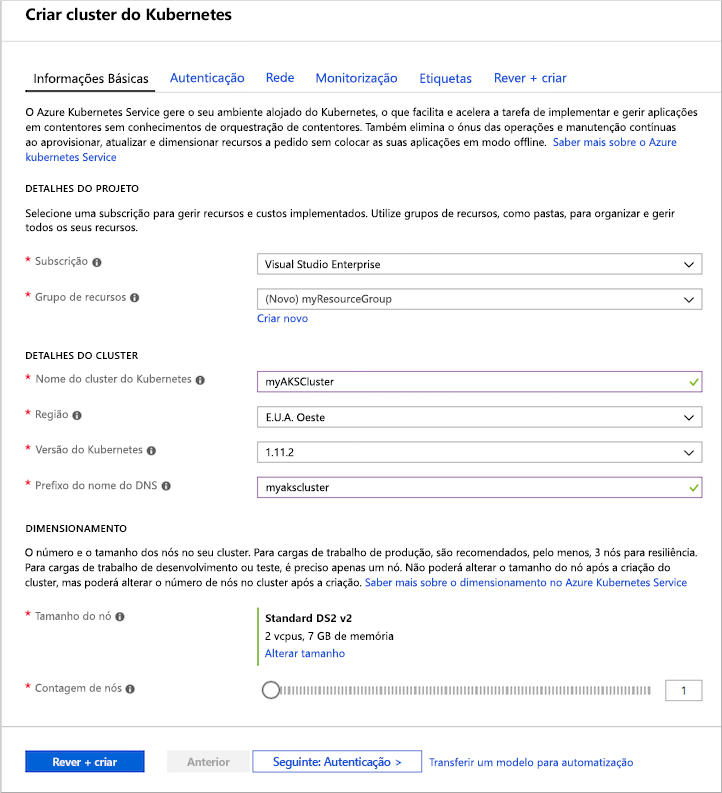
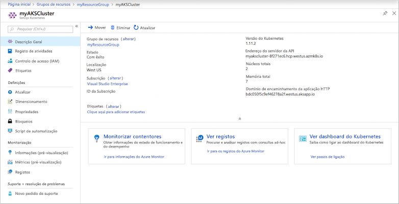
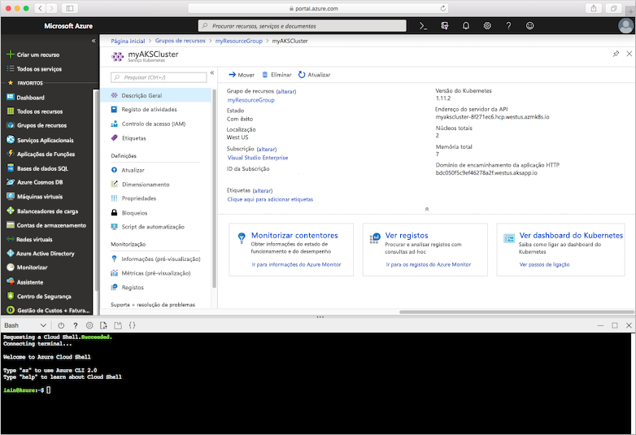
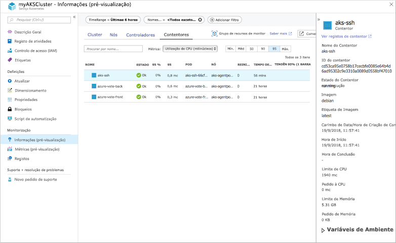
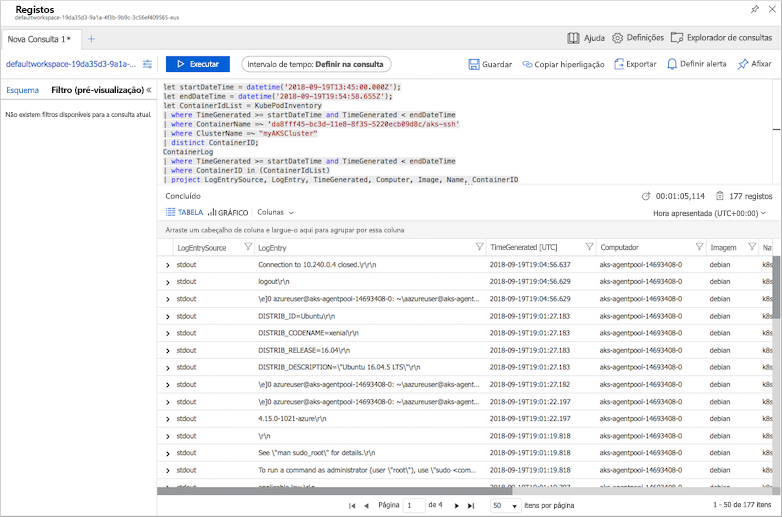

# <a name="quickstart-deploy-an-azure-kubernetes-service-aks-cluster-using-the-azure-portal"></a>Quickstart: Implementar um cluster Azure Kubernetes Service (AKS) utilizando o portal Azure

O Azure Kubernetes Service (AKS) é um serviço gerido pela Kubernetes que permite implementar e gerir rapidamente clusters. Neste guia de introdução, vai implementar um cluster do AKS com o portal do Azure. Uma aplicação multi-contentor que inclui uma extremidade frontal web e uma instância Redis é executada no cluster. Em seguida, você vê como monitorizar a saúde do cluster e pods que executam a sua aplicação.


Este guia de introdução parte do princípio de que possui conhecimentos básicos dos conceitos do Kubernetes. Para obter mais informações, consulte [os conceitos fundamentais da Kubernetes para o Serviço Azure Kubernetes (AKS)][kubernetes-concepts].

Se não tiver uma subscrição do Azure, crie uma [conta gratuita](https://azure.microsoft.com/free/?WT.mc_id=A261C142F) antes de começar.

## <a name="sign-in-to-azure"></a>Iniciar sessão no Azure

Inicie sessão no Portal do Azure em [https://portal.azure.com](https://portal.azure.com).

## <a name="create-an-aks-cluster"></a>Criar um cluster do AKS

Para criar um cluster do AKS, execute os seguintes passos:

1. No menu do portal do Azure ou a partir da **Home Page**, selecione **Criar um recurso**.

2. Selecione **Contentores** >  **Serviço do Kubernetes**.

3. Na página **Informações Básicas**, configure as opções seguintes:
    - **Detalhes do projeto**: Selecione uma **subscrição** Azure, em seguida, selecione ou crie um **grupo de Recursos** Azure , como o *myResourceGroup*.
    - **Detalhes do cluster**: Introduza um **nome de cluster Kubernetes,** como *myAKSCluster*. Selecione uma **versão Região** e **Kubernetes** para o cluster AKS.
    - **Piscina de nó primário**: Selecione um **tamanho de nó** VM para os nós AKS. O tamanho VM *não pode* ser alterado uma vez que um cluster AKS foi implantado.
            - Selecione o número de nós para implantar no cluster. Neste início rápido, defina **Contagem de nós** como *1*. O número de nós *pode* ser ajustado após a implementação do cluster.
    
    

    Selecione **Seguinte: Piscinas de nó quando concluídas.**

4. Na página de **piscinas de nó,** mantenha as opções predefinidos. Na parte inferior do ecrã, clique em **Seguinte: Autenticação**.
    > [!CAUTION]
    > A criação de novos diretores de serviços AAD pode demorar vários minutos a propagar-se e a tornar-se disponível, não tendo sido encontrados erros e falhas de validação no portal Azure. Se você chegar a isso, por favor, visite [aqui](troubleshooting.md#received-an-error-saying-my-service-principal-wasnt-found-or-is-invalid-when-i-try-to-create-a-new-cluster) para mitigação.

5. Na página **Autenticação**, configure as opções seguintes:
    - Criar um novo principal de serviço ao deixar o campo **Principal de Serviço** com **(novo) principal de serviço predefinido**. Em alternativa, pode selecionar *Configurar o principal de serviço* para utilizar um que já exista. Se utilizar um existente, terá de fornecer o ID do cliente SPN e o segredo.
    - Ative a opção para o controlo de acesso baseado em funções de Kubernetes (Kubernetes RBAC). Deste modo, obtém um controlo mais detalhado sobre o acesso aos recursos do Kubernetes implementados no cluster do AKS.

    Em alternativa, pode utilizar uma identidade gerida em vez de um principal de serviço. Consulte [as identidades geridas para](use-managed-identity.md) obter mais informações.

Por predefinição, é utilizada a rede *básica* e o Monitor Azure para contentores está ativado. Clique em **Rever + criar** e, em seguida, em **Criar** quando a validação for concluída.

A criação do cluster do AKS demora alguns minutos. Quando a sua implementação estiver concluída, clique em **Ir para** o recurso , ou navegue no grupo de recursos do cluster AKS, como *o myResourceGroup,* e selecione o recurso AKS, como o *myAKSCluster*. O painel de cluster AKS é mostrado, como neste exemplo:



## <a name="connect-to-the-cluster"></a>Ligar ao cluster

Para gerir um cluster Kubernetes, você usa [kubectl,][kubectl]o cliente da linha de comando Kubernetes. O cliente `kubectl` está pré-instalado no Azure Cloud Shell.

Open Cloud Shell utilizando o `>_` botão na parte superior do portal Azure.



Para configurar `kubectl` para se ligar ao cluster do Kubernetes, utilize o comando [az aks get-credentials][az-aks-get-credentials]. Este comando descarrega credenciais e configura o CLI de Kubernetes para usá-las. O exemplo seguinte obtém credenciais para o nome do cluster *myAKSCluster* no grupo de recursos denominado *myResourceGroup*:

```azurecli
az aks get-credentials --resource-group myResourceGroup --name myAKSCluster
```

Para verificar a ligação ao cluster, utilize o comando [kubectl get][kubectl-get] para devolver uma lista de nós do cluster.

```console
kubectl get nodes
```

A saída de exemplo seguinte mostra o nó único criado nos passos anteriores. Certifique-se de que o estado do nó está *pronto:*

```output
NAME                       STATUS    ROLES     AGE       VERSION
aks-agentpool-14693408-0   Ready     agent     15m       v1.11.5
```

## <a name="run-the-application"></a>Executar a aplicação

Um ficheiro manifesto kubernetes define um estado desejado para o cluster, como as imagens do recipiente a executar. Neste início rápido, é utilizado um manifesto para criar todos os objetos necessários para executar a aplicação Azure Vote. Este manifesto inclui [duas implementações de Kubernetes][kubernetes-deployment] - uma para a amostra aplicações Azure Vote Python, e outra para um caso Redis. São também criados dois [Serviços Kubernetes][kubernetes-service] - um serviço interno para a instância Redis, e um serviço externo para aceder à aplicação Azure Vote a partir da internet.

Na Cloud Shell, utilize um editor para criar um ficheiro chamado `azure-vote.yaml` , como , ou `code azure-vote.yaml` `nano azure-vote.yaml` `vi azure-vote.yaml` . Em seguida, copiar na seguinte definição YAML:

```yaml
apiVersion: apps/v1
kind: Deployment
metadata:
  name: azure-vote-back
spec:
  replicas: 1
  selector:
    matchLabels:
      app: azure-vote-back
  template:
    metadata:
      labels:
        app: azure-vote-back
    spec:
      nodeSelector:
        "beta.kubernetes.io/os": linux
      containers:
      - name: azure-vote-back
        image: mcr.microsoft.com/oss/bitnami/redis:6.0.8
        env:
        - name: ALLOW_EMPTY_PASSWORD
          value: "yes"
        resources:
          requests:
            cpu: 100m
            memory: 128Mi
          limits:
            cpu: 250m
            memory: 256Mi
        ports:
        - containerPort: 6379
          name: redis
---
apiVersion: v1
kind: Service
metadata:
  name: azure-vote-back
spec:
  ports:
  - port: 6379
  selector:
    app: azure-vote-back
---
apiVersion: apps/v1
kind: Deployment
metadata:
  name: azure-vote-front
spec:
  replicas: 1
  selector:
    matchLabels:
      app: azure-vote-front
  template:
    metadata:
      labels:
        app: azure-vote-front
    spec:
      nodeSelector:
        "beta.kubernetes.io/os": linux
      containers:
      - name: azure-vote-front
        image: mcr.microsoft.com/azuredocs/azure-vote-front:v1
        resources:
          requests:
            cpu: 100m
            memory: 128Mi
          limits:
            cpu: 250m
            memory: 256Mi
        ports:
        - containerPort: 80
        env:
        - name: REDIS
          value: "azure-vote-back"
---
apiVersion: v1
kind: Service
metadata:
  name: azure-vote-front
spec:
  type: LoadBalancer
  ports:
  - port: 80
  selector:
    app: azure-vote-front
```

Implemente a aplicação utilizando o comando [de aplicação de kubectl][kubectl-apply] e especifique o nome do seu manifesto YAML:

```console
kubectl apply -f azure-vote.yaml
```

A saída de exemplo a seguir mostra as Implementações e Serviços criados com sucesso:

```output
deployment "azure-vote-back" created
service "azure-vote-back" created
deployment "azure-vote-front" created
service "azure-vote-front" created
```

## <a name="test-the-application"></a>Testar a aplicação

Quando a aplicação é executado, um serviço Kubernetes expõe a linha frontal da aplicação para a internet. Este processo pode demorar alguns minutos a concluir.

Para monitorizar o progresso, utilize o comando [kubectl get service][kubectl-get] com o argumento `--watch`.

```console
kubectl get service azure-vote-front --watch
```

Inicialmente, o *IP EXTERNO* para o serviço de frente de *voto azul* é apresentado como *pendente*.

```output
NAME               TYPE           CLUSTER-IP   EXTERNAL-IP   PORT(S)        AGE
azure-vote-front   LoadBalancer   10.0.37.27   <pending>     80:30572/TCP   6s
```

Quando o endereço *EXTERNAL-IP* mudar de *pendente* para um endereço IP público real, use `CTRL-C` para parar o processo do `kubectl` relógio. A saída de exemplo a seguir mostra um endereço IP público válido atribuído ao serviço:

```output
azure-vote-front   LoadBalancer   10.0.37.27   52.179.23.131   80:30572/TCP   2m
```

Para ver a aplicação Azure Vote em ação, abra um navegador web para o endereço IP externo do seu serviço.


## <a name="monitor-health-and-logs"></a>Monitorizar o estado de funcionamento e os registos

Quando criou o cluster, o Azure Monitor para contentores estava ativado. Esta funcionalidade de monitorização proporciona métricas de estado de funcionamento para o cluster do AKS e para pods em execução no mesmo.

Pode demorar alguns minutos até que estes dados sejam povoados no portal do Azure. Para ver o estado atual, o tempo de atividade e a utilização de recursos relativamente aos pods do Azure Vote, regresse ao recurso do AKS no portal do Azure, como *myAKSCluster*. Em seguida, pode aceder ao estado de funcionamento da seguinte forma:

1. Em **Monitorização** no lado esquerdo, escolha **Insights**
1. Na parte superior, opte por **+ Adicionar Filtro**
1. Selecione *Namespace* como a propriedade, em seguida, escolha *\<All but kube-system\>*
1. Selecione para ver os **Contentores**.

Os contentores *azure-vote-back* e *azure-vote-front* são apresentados, conforme mostrado no exemplo seguinte:



Para ver os registos da `azure-vote-front` cápsula, selecione os registos de **contentores 'Ver'** a partir da descida da lista de contentores. Estes troncos incluem os fluxos *de stderr* e *stderr* do recipiente.



## <a name="delete-cluster"></a>Eliminar o cluster

Quando o cluster já não for necessário, elimine o recurso do cluster, o que, por sua vez, elimina todos os recursos associados. Esta operação pode ser concluída no portal Azure selecionando o botão **Eliminar** no painel de instrumentos AKS. Alternativamente, o comando [az aks apagar][az-aks-delete] pode ser usado na Cloud Shell:

```azurecli
az aks delete --resource-group myResourceGroup --name myAKSCluster --no-wait
```

> [!NOTE]
> Quando elimina o cluster, o principal de serviço do Azure Active Directory utilizado pelo cluster do AKS não é removido. Para obter passos sobre como remover o principal de serviço, consulte [Considerações sobre e eliminação do principal de serviço AKS][sp-delete]. Se usou uma identidade gerida, a identidade é gerida pela plataforma e não necessita de remoção.

## <a name="get-the-code"></a>Obter o código

Neste início rápido, imagens de contentores pré-criadas foram usadas para criar uma implantação de Kubernetes. O código da aplicação relacionado, o Dockerfile, e o ficheiro de manifesto do Kubernetes, estão disponíveis no GitHub.

[https://github.com/Azure-Samples/azure-voting-app-redis][azure-vote-app]

## <a name="next-steps"></a>Passos seguintes

Neste guia de início rápido, implementou um cluster do Kubernetes e implementou uma aplicação de vários contentores no mesmo.

Para saber mais sobre o AKS e ver um exemplo completo de código para implementação, avance para o tutorial dos clusters de Kubernetes.

> [!div class="nextstepaction"]
> [Tutorial AKS][aks-tutorial]

<!-- LINKS - external -->
[azure-vote-app]: https://github.com/Azure-Samples/azure-voting-app-redis.git
[kubectl]: https://kubernetes.io/docs/user-guide/kubectl/
[kubectl-apply]: https://kubernetes.io/docs/reference/generated/kubectl/kubectl-commands#apply
[kubectl-get]: https://kubernetes.io/docs/reference/generated/kubectl/kubectl-commands#get
[kubernetes-documentation]: https://kubernetes.io/docs/home/

<!-- LINKS - internal -->
[kubernetes-concepts]: concepts-clusters-workloads.md
[az-aks-get-credentials]: /cli/azure/aks?view=azure-cli-latest#az-aks-get-credentials
[az-aks-delete]: /cli/azure/aks#az-aks-delete
[aks-monitor]: ../azure-monitor/insights/container-insights-overview.md
[aks-network]: ./concepts-network.md
[aks-tutorial]: ./tutorial-kubernetes-prepare-app.md
[http-routing]: ./http-application-routing.md
[sp-delete]: kubernetes-service-principal.md#additional-considerations
[azure-dev-spaces]: ../dev-spaces/index.yml
[kubernetes-deployment]: concepts-clusters-workloads.md#deployments-and-yaml-manifests
[kubernetes-service]: concepts-network.md#services
