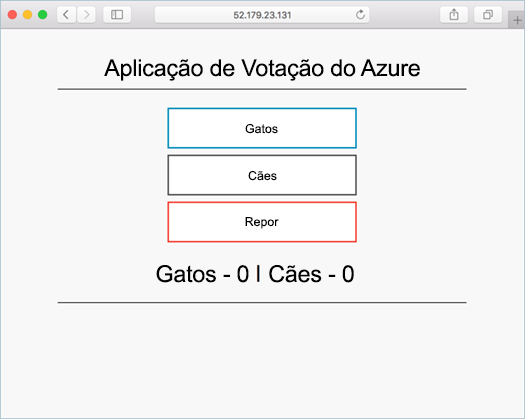

# <a name="tutorial-run-applications-in-azure-kubernetes-service-aks"></a>Tutorial: Executar aplicações no Serviço Kubernetes do Azure (AKS)

O Kubernetes fornece uma plataforma distribuída para aplicações em contentores. Cria e implementa as suas próprias aplicações e serviços num cluster do Kubernetes, e permite que o cluster gira a disponibilidade e a conectividade. Neste tutorial, parte quatro de sete, a aplicação de exemplo é implementada num cluster do Kubernetes. Saiba como:

> [!div class="checklist"]
> * Atualizar um arquivo de manifesto kubernetes
> * Executar uma aplicação no Kubernetes
> * Testar a aplicação

Em Tutoriais adicionais, esse aplicativo é escalado horizontalmente e atualizado.

Este guia de introdução parte do princípio de que possui conhecimentos básicos dos conceitos do Kubernetes. Para obter mais informações, consulte [kubernetes Core Concepts for Azure kubernetes Service (AKs)][kubernetes-concepts].

## <a name="before-you-begin"></a>Antes de começar

Nos tutoriais anteriores, foi compactada uma aplicação numa imagem de contentor, a imagem foi carregada para o Azure Container Registry e foi criado um cluster de Kubernetes.

Para concluir este tutorial, precisa do ficheiro de manifesto previamente criado do Kubernetes `azure-vote-all-in-one-redis.yaml`. Este ficheiro foi transferido com o código de origem da aplicação num tutorial anterior. Verifique se você clonou o repositório e se você alterou os diretórios no repositório clonado. Se você ainda não realizou essas etapas e gostaria de acompanhar, comece com o [tutorial 1 – criar imagens de contêiner][aks-tutorial-prepare-app].

Este tutorial requer que você esteja executando o CLI do Azure versão 2.0.53 ou posterior. Executar `az --version` para localizar a versão. Se precisar de instalar ou atualizar, veja [Instalar a CLI do Azure][azure-cli-install].

## <a name="update-the-manifest-file"></a>Atualizar o ficheiro de manifesto

Nestes tutoriais, uma instância do Azure Container Registry (ACR) armazena a imagem de contentor no exemplo de aplicação. Para implementar a aplicação, tem de atualizar o nome da imagem no ficheiro de manifesto do Kubernetes para incluir o nome de servidor de início de sessão do ACR.

Obtenha o nome do servidor de logon do ACR usando o comando [AZ ACR List][az-acr-list] da seguinte maneira:

```azurecli
az acr list --resource-group myResourceGroup --query "[].{acrLoginServer:loginServer}" --output table
```

O ficheiro de manifesto de exemplo do repositório git clonado no primeiro tutorial utiliza o nome do servidor de início de sessão da *microsoft*. Verifique se você está no diretório clonado *do Azure-votação-app-Redis* e, em seguida, abra o arquivo de manifesto com um editor de texto, como `vi`:

```console
vi azure-vote-all-in-one-redis.yaml
```

Substitua *microsoft* pelo seu nome de servidor de início de sessão do ACR. O nome da imagem é encontrado na linha 51 do arquivo de manifesto. O seguinte exemplo mostra o nome da imagem predefinida:

```yaml
containers:
- name: azure-vote-front
  image: microsoft/azure-vote-front:v1
```

Indique o seu próprio nome de servidor de início de sessão do ACR para que o ficheiro de manifesto seja semelhante ao seguinte exemplo:

```yaml
containers:
- name: azure-vote-front
  image: <acrName>.azurecr.io/azure-vote-front:v1
```

Guarde e feche o ficheiro. Em `vi`, use `:wq`.

## <a name="deploy-the-application"></a>Implementar a aplicação

Para implantar seu aplicativo, use o comando [kubectl Apply][kubectl-apply] . Este comando analisa o ficheiro de manifesto e cria os objetos de Kubernetes definidos. Especifique o ficheiro de manifesto de exemplo, conforme mostrado no exemplo a seguir:

```console
kubectl apply -f azure-vote-all-in-one-redis.yaml
```

A saída de exemplo a seguir mostra os recursos criados com êxito no cluster AKS:

```
$ kubectl apply -f azure-vote-all-in-one-redis.yaml

deployment "azure-vote-back" created
service "azure-vote-back" created
deployment "azure-vote-front" created
service "azure-vote-front" created
```

## <a name="test-the-application"></a>Testar a aplicação

Quando o aplicativo é executado, um serviço kubernetes expõe o front-end do aplicativo à Internet. Este processo pode demorar alguns minutos a concluir.

Para monitorizar o progresso, utilize o comando [kubectl get service][kubectl-get] com o argumento `--watch`.

```console
kubectl get service azure-vote-front --watch
```

Inicialmente, o *IP externo* para o serviço *Azure-vote-front* é mostrado como *pendente*:

```
azure-vote-front   LoadBalancer   10.0.34.242   <pending>     80:30676/TCP   5s
```

Quando o endereço *IP externo* for alterado de *pendente* para um endereço IP público real, use `CTRL-C` para interromper o processo de inspeção `kubectl`. A saída de exemplo a seguir mostra um endereço IP público válido atribuído ao serviço:

```
azure-vote-front   LoadBalancer   10.0.34.242   52.179.23.131   80:30676/TCP   67s
```

Para ver o aplicativo em ação, abra um navegador da Web para o endereço IP externo do seu serviço:



Se o aplicativo não foi carregado, pode ser devido a um problema de autorização com o registro da imagem. Para ver o estado dos seus contentores, utilize o comando `kubectl get pods`. Se as imagens de contêiner não puderem ser puxadas, consulte [autenticar com o registro de contêiner do Azure do serviço kubernetes do Azure](cluster-container-registry-integration.md).

## <a name="next-steps"></a>Passos seguintes

Neste tutorial, um aplicativo de exemplo do Azure vote foi implantado em um cluster kubernetes no AKS. Aprendeu a:

> [!div class="checklist"]
> * Atualizar ficheiros de manifesto Kubernetes
> * Executar uma aplicação no Kubernetes
> * Testar a aplicação

Avance para o próximo tutorial para saber como dimensionar uma aplicação Kubernetes e a infraestrutura de Kubernetes subjacente.

> [!div class="nextstepaction"]
> [Dimensionar a aplicação e infraestrutura do Kubernetes][aks-tutorial-scale]

<!-- LINKS - external -->
[kubectl-apply]: https://kubernetes.io/docs/reference/generated/kubectl/kubectl-commands#apply
[kubectl-create]: https://kubernetes.io/docs/reference/generated/kubectl/kubectl-commands#create
[kubectl-get]: https://kubernetes.io/docs/reference/generated/kubectl/kubectl-commands#get

<!-- LINKS - internal -->
[aks-tutorial-prepare-app]: ./tutorial-kubernetes-prepare-app.md
[aks-tutorial-scale]: ./tutorial-kubernetes-scale.md
[az-acr-list]: /cli/azure/acr
[azure-cli-install]: /cli/azure/install-azure-cli
[kubernetes-concepts]: concepts-clusters-workloads.md
[kubernetes-service]: concepts-network.md#services
