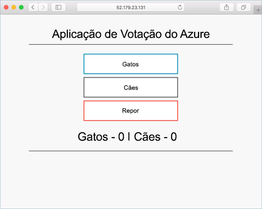

# <a name="tutorial-prepare-an-application-for-azure-kubernetes-service-aks"></a>Tutorial: Preparar uma aplicação para o Azure Kubernetes Service (AKS)

Neste tutorial, a parte um de sete, uma aplicação de contentores múltiplos é preparada para utilização com o Kubernetes. As ferramentas de desenvolvimento existentes, como o Docker Compose são utilizadas para criar e testar uma aplicação localmente. Saiba como:

> [!div class="checklist"]
> * Clonar uma origem de exemplo de aplicação a partir do GitHub
> * Criar uma imagem de contentor a partir da origem de exemplo de aplicação
> * Testar a aplicação de vários contentores num ambiente local do Docker

Depois de concluída, a aplicação seguinte é executada no seu ambiente de desenvolvimento local:



Em tutoriais adicionais, a imagem do contentor é enviada para um registo de contentores Azure e depois implantada num cluster AKS.

## <a name="before-you-begin"></a>Antes de começar

Este tutorial pressupõe conhecimentos básicos dos principais conceitos do Docker, como contentores, imagens de contentor e comandos do `docker`. Para obter noções básicas sobre os contentores, veja [Introdução ao Docker][docker-get-started].

Para concluir este tutorial, precisa de um ambiente de desenvolvimento local do Docker que execute contentores do Linux. O Docker disponibiliza pacotes que o configuram num sistema [Mac][docker-for-mac], [Windows][docker-for-windows] ou [Linux][docker-for-linux].

O Azure Cloud Shell não inclui os componentes do Docker que são precisos para concluir todos os passos nestes tutoriais. Por conseguinte, recomendamos a utilização de um ambiente de desenvolvimento completo do Docker.

## <a name="get-application-code"></a>Obter o código da aplicação

O exemplo de aplicação neste tutorial é uma aplicação de votos básica. A aplicação consiste num componente Web front-end e uma instância do Redis em back-end. O componente Web é compactado numa imagem personalizada de contentor. A instância do Redis utiliza uma imagem inalterada do Hub do Docker.

Utilize o [git][] para clonar o exemplo de aplicação para o seu ambiente de desenvolvimento:

```console
git clone https://github.com/Azure-Samples/azure-voting-app-redis.git
```

Mude para o diretório clonado.

```console
cd azure-voting-app-redis
```

Dentro do diretório estão: o código de origem da aplicação, um ficheiro de composição do Docker e um ficheiro de manifesto do Kubernetes. Estes ficheiros são utilizados em todo o tutorial.

## <a name="create-container-images"></a>Criar imagens de contentor

[O Docker Compose][docker-compose] pode servir para automatizar a compilação de imagens de contentor e a implementação de aplicações com vários contentores.

Utilize o ficheiro `docker-compose.yaml` de exemplo para criar a imagem de contentor, transferir a imagem de Redis e iniciar a aplicação:

```console
docker-compose up -d
```

Ao concluir, utilize o comando [docker images][docker-images] para ver as imagens criadas. Foram transferidas ou criadas três imagens. A imagem *azure-vote-front-contém* a aplicação frontal e usa a imagem *nginx-lúdola* como base. A imagem *redis* é usada para iniciar uma instância Redis.

```
$ docker images

REPOSITORY                                     TAG                 IMAGE ID            CREATED             SIZE
mcr.microsoft.com/azuredocs/azure-vote-front   v1                  84b41c268ad9        9 seconds ago       944MB
mcr.microsoft.com/oss/bitnami/redis            6.0.8               3a54a920bb6c        2 days ago          103MB
tiangolo/uwsgi-nginx-flask                     python3.6           a16ce562e863        6 weeks ago         944MB
```

Executar o [comando do PS][docker-ps] para ver os contentores de funcionamento:

```
$ docker ps

CONTAINER ID        IMAGE                                             COMMAND                  CREATED             STATUS              PORTS                           NAMES
d10e5244f237        mcr.microsoft.com/azuredocs/azure-vote-front:v1   "/entrypoint.sh /sta…"   3 minutes ago       Up 3 minutes        443/tcp, 0.0.0.0:8080->80/tcp   azure-vote-front
21574cb38c1f        mcr.microsoft.com/oss/bitnami/redis:6.0.8         "/opt/bitnami/script…"   3 minutes ago       Up 3 minutes        0.0.0.0:6379->6379/tcp          azure-vote-back
```

## <a name="test-application-locally"></a>Testar a aplicação localmente

Para ver a aplicação em execução, introduza `http://localhost:8080` num navegador Web local. O exemplo de aplicação é carregado, conforme mostrado no exemplo seguinte:


## <a name="clean-up-resources"></a>Limpar os recursos

Agora que a funcionalidade da aplicação foi validada, os contentores em execução podem ser parados e removidos. Não elimine as imagens de contentor - no tutorial seguinte, a imagem *azure-vote-front* é carregada para uma instância do Azure Container Registry.

Pare e remova as instâncias de contentor e os recursos com o comando [docker-compose down][docker-compose-down]:

```console
docker-compose down
```

Quando a aplicação local for removida, você tem uma imagem docker que contém o pedido de voto *Azure, azure-vote-front*, para ser usado com o próximo tutorial.

## <a name="next-steps"></a>Passos seguintes

Neste tutorial, uma aplicação foi testada e imagens de contentor foram criadas para a aplicação. Aprendeu a:

> [!div class="checklist"]
> * Clonar uma origem de exemplo de aplicação a partir do GitHub
> * Criar uma imagem de contentor a partir da origem de exemplo de aplicação
> * Testar a aplicação de vários contentores num ambiente local do Docker

Avance para o próximo tutorial para saber como armazenar imagens de contentores no Azure Container Registry.

> [!div class="nextstepaction"]
> [Enviar imagens para o Azure Container Registry][aks-tutorial-prepare-acr]

<!-- LINKS - external -->
[docker-compose]: https://docs.docker.com/compose/
[docker-for-linux]: https://docs.docker.com/engine/installation/#supported-platforms
[docker-for-mac]: https://docs.docker.com/docker-for-mac/
[docker-for-windows]: https://docs.docker.com/docker-for-windows/
[docker-get-started]: https://docs.docker.com/get-started/
[docker-images]: https://docs.docker.com/engine/reference/commandline/images/
[docker-ps]: https://docs.docker.com/engine/reference/commandline/ps/
[docker-compose-down]: https://docs.docker.com/compose/reference/down
[git]: https://git-scm.com/downloads

<!-- LINKS - internal -->
[aks-tutorial-prepare-acr]: ./tutorial-kubernetes-prepare-acr.md
