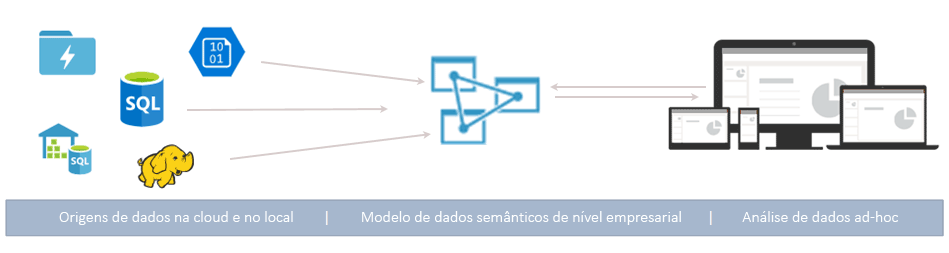
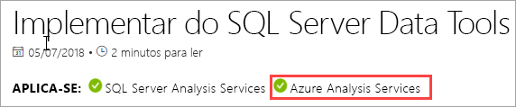

# O que é o Azure Analysis Services?

O Azure Analysis Services é uma plataforma como serviço (PaaS) totalmente gerida que fornece modelos de dados de nível empresarial na cloud. Utilize funcionalidades avançadas de mashup e modelos para combinar dados de várias origens, definir métricas e proteger os dados num único modelo de dados em tabela semântico fidedigno. O modelo de dados fornece uma forma mais fácil e rápida para os utilizadores realizarem análises de dados ad hoc usando ferramentas como o Power BI e o Excel.

**Vídeo:** veja [Azure Analysis Services Overview](https://sec.ch9.ms/ch9/d6dd/a1cda46b-ef03-4cea-8f11-68da23c5d6dd/AzureASoverview_high.mp4) (Descrição geral do Azure Analysis Services) para saber como o Azure Analysis Services se enquadra nas capacidades globais de BI da Microsoft.

## Comece a trabalhar rapidamente

No portal do Azure, pode [criar um servidor](analysis-services-create-server.md) numa questão de minutos. Além disso, com os [modelos](../azure-resource-manager/templates/quickstart-create-templates-use-the-portal.md) do Azure Resource Manager e o PowerShell, pode criar modelos declarativos para aprovisionar servidores. Com um só modelo, pode implementar recursos de servidor juntamente com outros componentes do Azure, como contas de armazenamento e Funções do Azure. 

**Vídeo:** veja [Automatização da implementação](https://channel9.msdn.com/series/Azure-Analysis-Services/AzureAnalysisServicesAutomation) para saber mais sobre como pode utilizar a Automatização do Azure para acelerar a criação de servidores.

O Azure Analysis Services integra-se em muitos serviços do Azure, o que lhe permite criar soluções de análise sofisticadas. A integração com o [Azure Active Directory](../active-directory/fundamentals/active-directory-whatis.md) fornece acesso seguro e baseado em funções aos seus dados críticos. Faça a integração com pipelines do [Azure Data Factory](../data-factory/introduction.md) ao incluir uma atividade que carrega dados para o modelo. A [Automatização do Azure](../automation/automation-intro.md) e as [Funções do Azure](../azure-functions/functions-overview.md) podem ser utilizadas para orquestrações leves de modelos através de código personalizado. 

## O escalão certo quando precisa

O Azure Analysis Services está disponível nos escalões **Programador**, **Básico** e **Standard**. Dentro de cada nível, os custos do plano variam de acordo com o poder de processamento, as Unidades de Processamento de Consultas (QPUs) e o tamanho da memória. Quando criar um servidor, selecione um plano de dentro de uma camada. Pode mudar para níveis superiores ou inferiores no mesmo escalão ou atualizar para um escalão superior, mas não pode passar de um escalão superior para um mais baixo.

### Escalão de programador

Este escalão é recomendado para cenários de avaliação, desenvolvimento e teste. Um único plano inclui as mesmas funcionalidades do escalão standard, mas a capacidade de processamento, as QPUs e o tamanho da memória são limitados. A escala de réplica de consulta *não está disponível* para este nível. Este escalão não oferece um SLA.

|Planear  |QPUs  |Memória (GB)  |
|---------|---------|---------|
|D1    |    20     |    3     |

### Escalão básico

Este nível é recomendado para soluções de produção com modelos tabulares mais pequenos, conuncy limitada do utilizador e requisitos simples de atualização de dados. A escala de réplica de consulta *não está disponível* para este nível. As perspetivas, partições múltiplas e funcionalidades de modelos em tabela do DirectQuery *não são suportadas* neste escalão.  

|Planear  |QPUs  |Memória (GB)  |
|---------|---------|---------|
|B1    |    40     |    10     |
|B2    |    80     |    16     |

### Escalão standard

Este escalão destina-se a aplicações de produção críticas para o negócio, que requerem simultaneidade de utilizadores elástica e têm modelos de dados em rápido crescimento. Suporta a atualização de dados avançada para atualizações de modelos de dados quase em tempo real, bem como todas as funcionalidades de modelos em tabela.

|Planear  |QPUs  |Memória (GB)  |
|---------|---------|---------|
|S0    |    40     |    10     |
|S1    |    100     |    25     |
|S2    |    200     |    50     |
|S4    |    400     |    100     |
|S8 [1](#naar), [2](#rec)   |    320    |    200     |
|S9 [1](#naar), [2](#rec)    |    640    |    400     |
|S8v2  [1](#naar)   |    640     |    200     |
|S9v2  [1](#naar)    |    1280    |    400     |

<a name="naar">1</a> - Não disponível em todas as regiões.   
<a name="rec">2</a> - S8 e S9 são [preprecados](https://azure.microsoft.com/updates/azure-s8-and-s9-analysis-services-skus-retiring-on-31-august-2023/). v2 é recomendado. 

## Armazenamento por região

O Azure Analysis Services é suportado em várias regiões em todo o mundo. A disponibilidade da réplica de consulta e dos planos suportados varia consoante a região que escolher. A disponibilidade da réplica de consulta e dos plano pode alterar consoante a necessidade e os recursos disponíveis para cada região. 

### Américas

|Região  | Planos suportados | Réplicas de consulta (Apenas planos standard) |
|---------|---------|:---------:|
|Sul do Brasil     |    B1, B2, S0, S1, S2, S4, D1     |     1    |
|Canadá Central    |     B1, B2, S0, S1, S2, S4, D1    |     1    |
|E.U.A. Leste     |     B1, B2, S0, S1, S2, S4, D1    |    1     |
|E.U.A. Leste 2     |     B1, B2, S0, S1, S2, S4, D1   |    7    |
|E.U.A. Leste 2     |     S8v2, S9v2   |    1    |
|E.U.A. Centro-Norte     |     B1, B2, S0, S1, S2, S4, D1     |    1     |
|E.U.A. Centro-Norte     |     S8v2, S9v2    |    1     |
|E.U.A. Central     |    B1, B2, S0, S1, S2, S4, D1     |    1     |
|E.U.A. Central     |    S8v2, S9v2     |    1     |
|E.U.A. Centro-Sul     |    B1, B2, S0, S1, S2, S4, D1     |    1     |
|E.U.A. Centro-Oeste   |     B1, B2, S0, S1, S2, S4, D1    |    3     |
|E.U.A. Oeste     |    B1, B2, S0, S1, S2, S4, D1    |    7   |
|E.U.A. Oeste     |    S8v2, S9v2   |    2  |
|E.U.A. Oeste 2    |    B1, B2, S0, S1, S2, S4, D1    |    3   |
|E.U.A. Oeste 2    |    S8v2, S9v2  |    1     |

### Europe

|Região  | Planos suportados | Réplicas de consulta (Apenas planos standard) |
|---------|---------|:---------:|
|Europa do Norte     |    B1, B2, S0, S1, S2, S4, D1      |    7     |
|Europa do Norte     |    S8v2, S9v2      |    3     |
|Sul do Reino Unido     |    B1, B2, S0, S1, S2, S4, D1      |     1    |
|Europa Ocidental     |    B1, B2, S0, S1, S2, S4, D1   |    7    |
|Europa Ocidental    |   S8v2, S9v2  |  1  |

### Ásia-Pacífico 

|Região  | Planos suportados | Réplicas de consulta (Apenas planos standard) |
|---------|---------|:---------:|
|Leste da Austrália     |    B1, B2, S0, S1, S2, S4     |    3     |
|Leste da Austrália     |    S8v2, S9v2    |    1     |
|Sudeste da Austrália     | B1, B2, S0, S1, S2, S4, D1       |    1     |
|Leste do Japão     |   B1, B2, S0, S1, S2, S4, D1       |    1     |
|Sudeste Asiático     |     B1, B2, S0, S1, S2, S4, D1     |   1      |
|Sudeste Asiático     |     S8v2, S9v2     |   1      |
|Oeste da Índia     |    B1, B2, S0, S1, S2, S4, D1     |    1     |

## Dimensionar para as suas necessidades

### Aumentar/reduzir verticalmente, interromper ou retomar

Aumente ou reduza verticalmente o seu servidor ou interrompa-o. Utilize o portal do Azure ou utilize o PowerShell para ter controlo num instante. Só paga o que utilizar.  

### Aumente recursos horizontalmente para obter repostas de consultas rápidas

Com o aumento horizontal, as consultas de clientes são distribuídas entre várias *réplicas de consultas* num conjunto de consultas. As réplicas de consulta têm cópias sincronizadas dos seus modelos em tabela. Ao propagar a carga de trabalho da consulta, os tempos de resposta durante as cargas de trabalho de consulta elevadas podem ser reduzidos. As operações de processamento de modelos podem ser separadas do conjunto de consultas, garantindo que as consultas de cliente não são afetadas negativamente por essas operações de processamento. 

Pode criar um conjunto de consultas com um máximo de sete réplicas de consultas adicionais (oito no total, incluindo o seu servidor). O número de réplicas de consultas que pode ter no seu conjunto varia consoante o plano e a região que escolher. As réplicas de consultas não podem ser expandidas para fora da região do seu servidor. As réplicas de consultas são faturadas com a mesma tarifa do seu servidor.

Tal como com alterar o escalão, pode aumentar horizontalmente as réplicas de consultas consoante as suas necessidades. Configure o aumento horizontal no portal ou através das APIs REST. Para saber mais, veja [Azure Analysis Services scale-out](analysis-services-scale-out.md) (Aumento horizontal no Azure Analysis Services).

## Preços

O custo total depende de uma série de fatores. Por exemplo, a sua região escolhida, tier, réplicas de consulta e pausa/currículo. Utilize a calculadora de [Preços de Azure Analysis Services](https://azure.microsoft.com/pricing/details/analysis-services/) para determinar os preços normais para a sua região. Esta ferramenta calcula os preços de uma instância de servidor único para uma região. Tenha em atenção que as réplicas de consultas são faturadas com a mesma tarifa do servidor. 

## Baseado no SQL Server Analysis Services

O Azure Analysis Services é compatível com inúmeras funcionalidades excelentes já existentes no SQL Server Analysis Services Enterprise Edition. O Azure Analysis Services suporta modelos em tabela nos [níveis de compatibilidade](/analysis-services/tabular-models/compatibility-level-for-tabular-models-in-analysis-services) 1200 ou superiores. Os modelos em tabela são construções de modelos relacionais (modelos, tabelas, colunas) articulados em definições de objetos de metadados tabulares em Linguagem de Scripting de Modelos Tabulares (TMSL) e código de Modelo de Objetos Tabulares (TOM). As divisórias, perspetivas, segurança ao nível da linha, relações biducionais e traduções são todas \* apoiadas. Os modelos multidimensionais e o PowerPivot para o SharePoint *não são* suportados nos Serviços de Análise Azure.

Os modelos em tabela nos modos dentro da memória e DirectQuery são suportados. Os modelos em tabela em modo dentro da memória (predefinição) suportam várias origens de dados. Uma vez que os dados de modelos são altamente comprimidos e colocados em cache na memória. Este modo proporciona a resposta de consulta mais rápida em grandes quantidades de dados. Também proporciona a maior flexibilidade para consultas e conjuntos de dados complexos. 

A criação de partições permite carregamentos incrementais, aumenta a paralelização e reduz o consumo de memória. Outras funcionalidades avançadas de modelação de dados, como tabelas calculadas e todas as funções DAX, são suportadas. Os modelos dentro da memória têm de ser atualizados (processados) para atualizar os dados em cache das origens de dados. Com o suporte principal do serviço Azure, operações de atualização sem supervisão utilizando PowerShell, TOM, TMSL e REST oferecem flexibilidade para garantir que os dados do seu modelo estão sempre atualizados. 

O modo DirectQuery* tira partido da base de dados relacional de back-end para armazenamento e execução de consultas. São suportados conjuntos de dados extremamente grandes em únicos servidores SQL, SQL Server Data Warehouse, Azure SQL Database, Azure Synapse Analytics, Oracle e Teradata. Os conjuntos de dados de back-end podem ultrapassar a memória dos recursos de servidores disponíveis. Não são necessários cenários complexos de atualização de modelos de dados. Existem também algumas restrições, tais como tipos limitados de fonte de dados, limitações de fórmula DAX, e algumas funcionalidades avançadas de modelação de dados não são suportadas. Antes de determinar o modo mais adequado para si, veja o [modo do Direct Query](/analysis-services/tabular-models/directquery-mode-ssas-tabular).

\* A disponibilidade das funcionalidades varia consoante o escalão.

## Supported data sources (Origens de dados suportadas)

Os modelos em tabela no Azure Analysis Services suportam uma grande variedade de origens de dados, desde ficheiros de texto simples a Macrodados no Azure Data Lake Store. Para saber mais, veja [Data sources supported in Azure Analysis Services](analysis-services-datasource.md) (Origens de dados suportadas no Azure Analysis Services).

## Nível de compatibilidade

O nível de compatibilidade refere-se a comportamentos específicos de libertação no motor dos Serviços de Análise. O Azure Analysis Services suporta modelos em tabela nos níveis de compatibilidade 1200 ou superiores. Para saber mais, consulte [o nível de compatibilidade para modelos tabulares.](/analysis-services/tabular-models/compatibility-level-for-tabular-models-in-analysis-services)

## Os dados estão seguros

O Azure Analysis Services proporciona segurança para os seus dados confidenciais a diversos níveis. Como um serviço Azure, os Serviços de Análise fornecem o nível **básico** de ataques de negação de serviço distribuídos (DDoS) automaticamente ativados como parte da plataforma Azure. Para saber mais, consulte [a visão geral da Norma de Proteção DDoS do Azure](../ddos-protection/ddos-protection-overview.md). 

Ao nível do servidor, os Serviços de Análise fornecem firewall, autenticação Azure, funções de administrador de servidor e Server-Side Encriptação. Ao nível do modelo de dados, as funções do utilizador, a segurança ao nível da linha e do nível de objetos garantem que os seus dados são seguros e são vistos apenas pelos utilizadores que os devem ver.

### Firewall

A Firewall do Azure Analysis Services bloqueia todas as ligações de cliente que não as dos endereços IP especificados nas regras. Por predefinição, a proteção contra firewall não está ativada para novos servidores. Recomenda-se que a proteção contra firewall esteja ativada e as regras são configuradas como parte de um script de provisionamento do servidor ou no portal imediatamente após a criação do servidor. Configure regras que especifiquem endereços IP permitidos por IPs de cliente individuais ou por intervalo. Também podem ser permitidas ou bloqueadas ligações do Power BI (serviço). Configure a firewall e as regras no portal ou através do PowerShell. Para saber mais, veja [Configure a server firewall](analysis-services-qs-firewall.md) (Configurar uma firewall de servidor).

### Autenticação

O [Azure Active Directory (AAD)](../active-directory/fundamentals/active-directory-whatis.md) lida com a autenticação dos utilizadores. Ao iniciar sessão, os utilizadores recorrem a uma identidade de conta da organização, com acesso à base de dados baseado em funções. As identidades de utilizador têm de ser membros do Azure Active Directory predefinido da subscrição em que o servidor se encontra. Para saber mais, veja [Authentication and user permissions](analysis-services-manage-users.md) (Permissões de autenticação e utilizador).

### Segurança de dados

O Azure Analysis Services utiliza o Armazenamento de blobs do Azure para persistir o armazenamento e os metadados das bases de dados do Analysis Services. Os ficheiros de dados dentro do Blob são encriptados utilizando a encriptação do lado do servidor do [servidor Azure Blob (SSE)](../storage/common/storage-service-encryption.md). Ao utilizar o modo DirectQuery, só são armazenados os metadados. Os dados propriamente ditos são acedidos através de protocolos encriptados a partir da origem de dados no momento da consulta.

Pode instalar e configurar um [Gateway de dados no local](analysis-services-gateway.md) para proteger o acesso às origens de dados no local na sua organização. Os gateways fornecem acesso aos dados, tanto para o modo DirectQuery, e para o modo dentro da memória.

### Funções

O Analysis Services utiliza a [autorização baseada em funções](/analysis-services/tabular-models/roles-ssas-tabular) que concede acesso às operações de servidor e operações de base de dados modelo, objetos e dados. Todos os utilizadores que acedem a um servidor ou base de dados fazem-no com a conta do Azure AD dentro de uma função atribuída. A função de administrador de servidor está ao nível dos recursos de servidor. Por predefinição, a conta utilizada ao criar um servidor é automaticamente incluída na função de Administradores de Servidor. As contas de utilizadores e grupos adicionais são adicionadas através do portal, SQL Server Management Studio ou PowerShell.
  
Os utilizadores finais não administrativos que consultam dados têm acesso através das funções de base de dados. Uma função de base de dados é criada como um objeto separado na base de dados e aplica-se apenas à base de dados na qual essa função é criada. As funções de base de dados são definidas pelas permissões (de base de dados) de Administrador, Leitura e Leitura e Processo. As contas de utilizadores e grupos são adicionadas através do SQL Server Management Studio ou PowerShell.

### Row-level security

Os modelos em tabela em todos os modelos de compatibilidade suportam a segurança ao nível da linha. A segurança ao nível da linha é configurada no modelo através de expressões DAX que definem as linhas numa tabela e as linhas nas direções de uma tabela relacionada que um utilizador pode consultar. Os filtros de linhas que utilizem expressões DAX são definidos para as permissões de Leitura e Leitura e Processo. 

### Segurança ao nível do objeto 

Os modelos em tabela no nível de compatibilidade 1400 suportam a segurança ao nível do objeto, a qual inclui a segurança ao nível da tabela e a segurança ao nível da coluna. A segurança ao nível de objetos é definida nos metadados baseados em JSON no ficheiro Model.bim através de TMSL ou TOM. Para saber mais, veja [Object-level security](/analysis-services/tabular-models/object-level-security) (Segurança ao nível de objetos).

### Automação através de diretores de serviço

Os principais de serviço são um recurso de aplicações do Azure Active Directory que pode criar no seu inquilino para efetuar operações automáticas de recursos e níveis de serviço. Os principais de serviço são utilizados com a Automatização do Azure, o modo automático do PowerShell, as aplicações cliente personalizadas e as aplicações Web para automatizar tarefas comuns como atualização de dados, aumento/redução vertical e interromper/retomar. As permissões são atribuídas aos principais de serviço através da associação a funções. Para saber mais, veja [Automatização com principais de serviço](analysis-services-service-principal.md).

### Governação do Azure

O Azure Analysis Services é regido pelos [Termos do Microsoft Online Services](https://www.microsoftvolumelicensing.com/DocumentSearch.aspx?Mode=3&DocumentTypeId=31) e pela [Declaração de Privacidade da Microsoft](https://privacy.microsoft.com/privacystatement).
Para saber mais sobre a Segurança do Azure, veja o [Centro de Fidedignidade do Azure](https://www.microsoft.com/trustcenter).

## Utilizar as ferramentas que já conhece

### Visual Studio

Desenvolver e implementar modelos com projetos visual studio com serviços de análise. A extensão dos projetos dos Serviços de Análise inclui modelos e assistentes que o elepõem e vão rapidamente. O ambiente de autoria do modelo no Visual Studio inclui agora a moderna consulta de fonte de dados get data e funcionalidade de mashup para modelos tabulares 1400 e mais altos. Se estiver familiarizado com Obter Dados no Power BI Desktop e no Excel 2016, já sabe como é fácil criar consultas de origens de dados altamente personalizadas. 

Os Microsoft Analysis Services Projects estão disponíveis como um pacote VSIX instalado gratuitamente. [Transferir do Marketplace](https://marketplace.visualstudio.com/items?itemName=ProBITools.MicrosoftAnalysisServicesModelingProjects). A extensão funciona com qualquer versão do Visual Studio 2017 e mais tarde, incluindo a edição comunitária gratuita.

### SQL Server Management Studio

Faça a gestão dos seus servidores e das suas bases de dados de modelos com o [SQL Server Management Studio (SSMS)](/sql/ssms/download-sql-server-management-studio-ssms). Ligue aos seus servidores na cloud. Execute scripts TMSL diretamente na janela de consultas XMLA e utilize-os, bem como o PowerShell, para automatizar tarefas. As funcionalidades e funções novas são disponibilizadas rapidamente - o SSMS é atualizado todos os meses.

### Ferramentas de código aberto

Os Serviços de Análise têm uma comunidade vibrante de desenvolvedores que criam ferramentas. Não se esqueça de consultar o [Tabular Editor](https://tabulareditor.github.io/), uma ferramenta de código aberto para criar, manter e gerir modelos tabulares usando um editor intuitivo e leve. [O DAX Studio](https://daxstudio.org/)é uma excelente ferramenta de código aberto para a autoria, diagnóstico, afinação de desempenho e análise do DAX.

### PowerShell

Tarefas de gestão de recursos do servidor como criar recursos do servidor, suspender ou retomar as operações do servidor ou alterar o nível de serviço (tier) usam cmdlets Azure PowerShell. Outras tarefas para gerir bases de dados, como adicionar ou remover membros de funções, processar ou executar scripts TMSL, utilizam os cmdlets do módulo SqlServer. Para saber mais, veja [Gerir o Azure Analysis Services com o PowerShell](analysis-services-powershell.md).

### Scripting e modelos de objetos

Os modelos em tabela proporcionam desenvolvimento rápido e são altamente personalizáveis. Estes modelos incluem o [Modelo de Objeto em Tabela](/analysis-services/tom/introduction-to-the-tabular-object-model-tom-in-analysis-services-amo) (TOM) para descrever os objetos de modelos. O TOM é exposto em JSON, através da [linguagem TMSL (Tabular Model Scripting Language)](/analysis-services/tmsl/tabular-model-scripting-language-tmsl-reference) ,e da linguagem de definição de dados AMO, através do espaço de nomes [Microsoft.AnalysisServices.Tabular](/dotnet/api/microsoft.analysisservices.tabular). 

## Suporta as ferramentas de cliente mais recentes

As ferramentas modernas de exploração e visualização de dados, como o Power BI, o Excel, o Reporting Services e ferramentas de terceiros são todas suportadas, proporcionando aos utilizadores informações altamente interativas e visualmente ricas relativamente aos dados do seu modelo. 

## Monitorização e diagnóstico

Os Serviços de Análise Azure estão integrados com as métricas do Azure Monitor, fornecendo um vasto número de métricas específicas de recursos para ajudá-lo a monitorizar o desempenho e a saúde dos seus servidores. Para saber mais, consulte as [métricas do servidor de Monitorização](analysis-services-monitor.md). Registar métricas com [registos de plataformas de recursos](../azure-monitor/platform/platform-logs-overview.md). Monitorize e envie registos para [o Azure Storage,](https://azure.microsoft.com/services/storage/)transmita-os para [Azure Event Hubs,](https://azure.microsoft.com/services/event-hubs/)e exporte-os para [registos do Azure Monitor](https://azure.microsoft.com/services/log-analytics/), um serviço de [Azure](https://www.microsoft.com/cloud-platform/operations-management-suite). Para saber mais, veja [Configurar o registo de diagnósticos](analysis-services-logging.md).

O Azure Analysis Services também suporta a utilização de [Vistas de Gestão Dinâmica (DMVs)](/analysis-services/instances/use-dynamic-management-views-dmvs-to-monitor-analysis-services). Com base na sintaxe do SQL, os conjuntos de linhas de esquema de interface dos DMVs devolvem metadados e informações de monitorização sobre a instância do servidor.

## Documentação

Esta secção inclui documentação específica do Azure Analysis Services. Utilize o índice no lado esquerdo do ecrã do browser para localizar artigos. 

Como os modelos tabulares nos Serviços de Análise Azure são praticamente os mesmos que os modelos tabulares nos Serviços de Análise de Servidores SQL e conjuntos de dados Power BI Premium, há uma extensa biblioteca de tutoriais de modelação de dados partilhados, conceptuais, processuais, desenvolvedores e artigos de referência na [documentação dos Serviços de Análise.](/analysis-services/?view=azure-analysis-services-current&preserve-view=true) Os artigos na documentação dos Serviços de Análise partilhada mostram se também se aplicam aos Serviços de Análise Azure por um banner APPLY TO por baixo do título. Também pode utilizar o seletor de versão acima da tabela de conteúdos para ver apenas os artigos que se aplicam à plataforma que está a utilizar.

### Contribua!

Documentação dos Serviços de Análise, como este artigo, é fonte aberta. Para saber mais sobre como pode contribuir, consulte o guia de colaboradores do [Docs.](/contribute/) 

A documentação do Azure Analysis Services também utiliza os [Problemas do GitHub](/teamblog/a-new-feedback-system-is-coming-to-docs). Pode fornecer feedback sobre o produto ou a documentação. Utilize a opção **Comentários** na parte inferior de um artigo. As questões do GitHub não estão ativadas para a documentação dos Serviços de Análise Partilhada. 

## Blogues

As coisas evoluem rapidamente. Obtenha as últimas informações no [blog Power BI](https://powerbi.microsoft.com/blog/category/analysis-services/) e no blog [Azure.](https://azure.microsoft.com/blog/)

## Comunidade

O Analysis Services tem uma vibrante comunidade de utilizadores. Junte-se à conversa no [fórum do Azure Analysis Services](https://aka.ms/azureanalysisservicesforum).

## Passos seguintes

> [!div class="nextstepaction"]
> [Inscreva-se numa Avaliação Gratuita do Azure](https://azure.microsoft.com/offers/ms-azr-0044p/)   

> [!div class="nextstepaction"]
> [Início Rápido: Criar um servidor – Portal](analysis-services-create-server.md)   

> [!div class="nextstepaction"]
> [Início Rápido: Criar um servidor – PowerShell](analysis-services-create-powershell.md)
