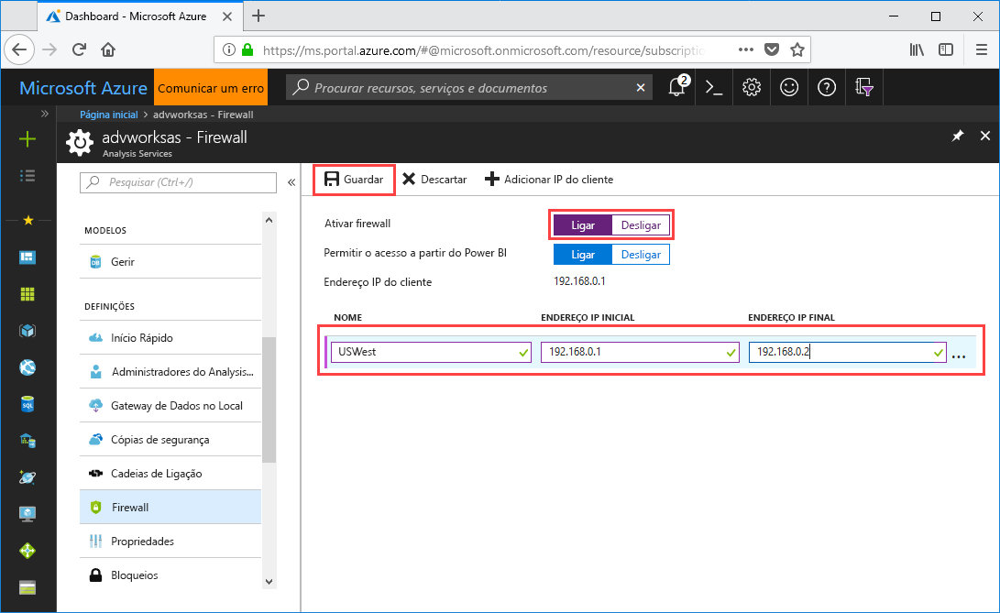

# Início Rápido: Configurar a firewall do servidor – Portal

Este início rápido ajuda-o a configurar uma firewall para o servidor do Analysis Services do Azure. Ativar uma firewall e configurar os intervalos dos endereços IP apenas para os computadores que acedem ao seu servidor são uma parte importante para proteger o servidor e os dados.

## Pré-requisitos

- Um servidor do Analysis Services na subscrição. Para obter mais informações, veja [Início Rápido: Criar um servidor – Portal](analysis-services-create-server.md) ou [Início Rápido: Criar um servidor – PowerShell](analysis-services-create-powershell.md)
- Intervalos de endereços IP de um ou mais computadores cliente (se necessário).

> [!NOTE]
> As ligações de importação de dados (atualização) e de relatório paginado do Power BI Premium na Microsoft Cloud Germany não são atualmente suportadas quando uma firewall está ativada, mesmo quando o acesso do Enable a partir da definição power BI está definido para On.

## Iniciar sessão no portal do Azure 

[Inscreva-se no portal](https://portal.azure.com)

## Configurar uma firewall

1. Clique no servidor para abrir a página Descrição geral. 
2. Em **DEFINIÇÕES**  >  **Firewall**  >  **Ative firewall**, selecione **On**.
3. Para ativar as ligações a partir do Power BI e power BI Premium, em **Permitir o acesso a partir de Power BI**, selecione **On**.  
4. (Opcional) Especifique um ou mais intervalos de endereços IP. Introduza um nome, um endereço IP de início e de fim para cada intervalo. O nome da regra de firewall deve ser limitado a 128 caracteres e só pode conter caracteres maiúsculas, caracteres minúsculos, números, sublinhados e hífen. Não são permitidos espaços em branco e outros caracteres especiais.
5. Clique em **Guardar**.

     

## Limpar os recursos

Quando já não forem necessários, elimine os intervalos de endereços IP ou desative a firewall.

## Passos seguintes
Neste guia de início rápido, aprendeu a configurar uma firewall para o servidor. Agora que tem o servidor protegido com uma firewall, pode adicionar um modelo de dados básicos de exemplo a partir do portal. Ter um modelo de exemplo é útil para saber como configurar as funções de base de dados do modelo e testar as ligações de cliente. Para obter mais informações, avance para o tutorial para adicionar um modelo de exemplo.

> [!div class="nextstepaction"]
> [Tutorial: Adicionar um modelo de exemplo ao servidor](analysis-services-create-sample-model.md)
