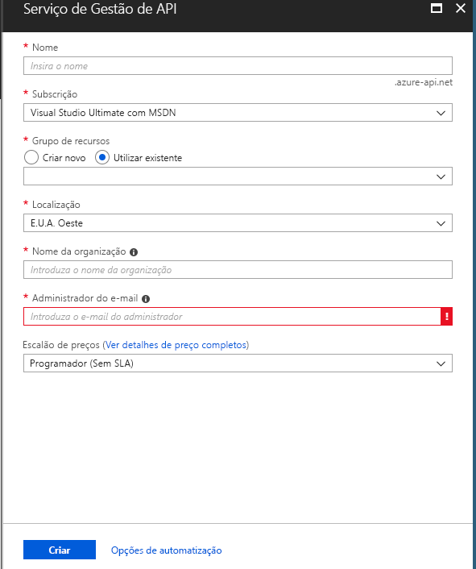

# Criar uma nova instância de serviço da Gestão de API do Azure

A Gestão de API (APIM) do Azure ajuda as organizações a publicar APIs para programadores externos, parceiros e internos, de modo a que estes possam explorar ao máximo o potencial dos seus dados e serviços. A Gestão de API fornece as competências essenciais para garantir um programa de API bem-sucedido através do envolvimento dos programadores, das informações de negócio, da análise, da segurança e da proteção. A APIM permite-lhe criar e gerir gateways de API modernos para serviços de back-end existentes alojados em qualquer lado. Para obter mais informações, consulte o tópico [Descrição Geral](api-management-key-concepts.md).

Este início rápido descreve os passos para a criação de uma nova instância de serviço da Gestão de API através do portal do Azure.

[!INCLUDE [quickstarts-free-trial-note](../../includes/quickstarts-free-trial-note.md)]

## Iniciar sessão no Azure

Iniciar sessão no [portal do Azure](https://portal.azure.com).

## Criar um novo serviço

1. No menu portal do Azure, selecione **criar um recurso**. Você também pode selecionar **criar um recurso** na **Home** Page do Azure. 
   
   
   
1. Na **nova** tela, selecione **integração** e, em seguida, selecione **Gerenciamento de API**.
   
   
   
1. Na tela **serviço de gerenciamento de API** , insira configurações.
   
   
   
   | Definição                 | Valor sugerido                               | Descrição                                                                                                                                                                                                                                                                                                                         |
|-------------------------|-----------------------------------------------|-------------------------------------------------------------------------------------------------------------------------------------------------------------------------------------------------------------------------------------------------------------------------------------------------------------------------------------|
| **Nome**                | Um nome exclusivo para o serviço de Gestão de API | O nome não pode ser alterado mais tarde. O nome do serviço é utilizado para gerar um nome de domínio predefinido na forma de *{nome}.azure-api.net.* Se gostaria de utilizar um nome de domínio personalizado, consulte [Configurar um domínio personalizado](configure-custom-domain.md).   O nome de serviço é utilizado para fazer referência ao serviço e ao recurso do Azure correspondente. |
| **Subscrição**        | A sua subscrição                             | A subscrição sob a qual esta nova instância do serviço será criada. Pode selecionar a subscrição entre as diferentes subscrições do Azure disponíveis para si.                                                                                                                                                            |
| **Grupo de Recursos**      | *apimResourceGroup*                           | Pode selecionar um recurso novo ou existente. Um grupo de recursos é uma coleção de recursos que partilham o ciclo de vida, as permissões e as políticas. Obtenha mais informações [aqui](../azure-resource-manager/resource-group-overview.md#resource-groups).                                                                                                  |
| **Localização**            | *EUA Oeste*                                    | Selecione a região geográfica perto de si. Apenas as regiões de serviço de Gestão de API disponíveis são apresentadas na caixa de lista pendente.                                                                                                                                                                                                          |
| **Nome da organização**   | O nome da sua organização                 | Este nome é utilizado em vários sítios, incluindo o título do portal do programador e o remetente de e-mails de notificação.                                                                                                                                                                                                             |
| **E-mail do administrador** | *administrador\@org.com*                               | Defina um endereço de e-mail para o qual serão enviadas todas as notificações da **Gestão de API**.                                                                                                                                                                                                                                              |
| **Escalão de preço**        | *Programador*                                   | Defina o escalão de **Programador** para avaliar o serviço. Este escalão não é para utilização em produção. Para obter mais informações sobre o dimensionamento dos escalões da Gestão de API, consulte [Atualização de versão do software e dimensionamento](upgrade-and-scale.md).                                                                                                                                    |

3. Escolha **Criar**.

    > [!TIP]
    > Normalmente, demora entre 20 e 30 minutos a criar um serviço de Gestão de API. Ao selecionar **Afixar ao dashboard**, é mais fácil localizar um serviço criado recentemente.

[!INCLUDE [api-management-navigate-to-instance](../../includes/api-management-navigate-to-instance.md)]

## Limpar recursos

Quando já não for necessário, pode remover o grupo de recursos e todos os recursos relacionados seguindo estes passos:

1. Na portal do Azure, procure e selecione grupos de **recursos**. Você também pode selecionar **grupos de recursos** na **Home** Page. 

   

1. Na página **grupos de recursos** , selecione o grupo de recursos.

   

1. Na página grupo de recursos, selecione **excluir grupo de recursos**. 
   
1. Digite o nome do seu grupo de recursos e, em seguida, selecione **excluir**.

   

## Passos seguintes

> [!div class="nextstepaction"]
> [Importar e publicar a sua primeira API](import-and-publish.md)
