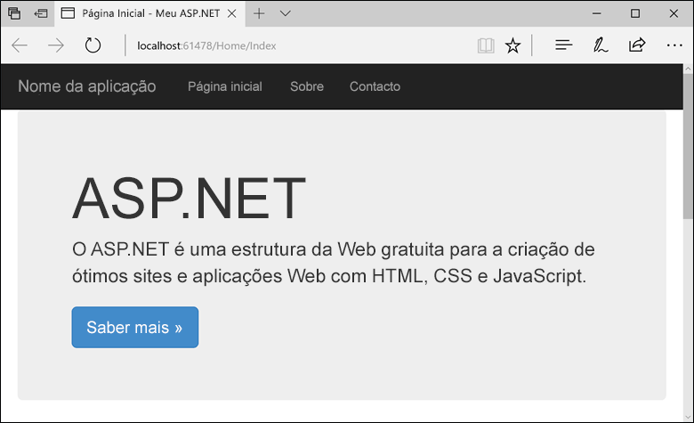
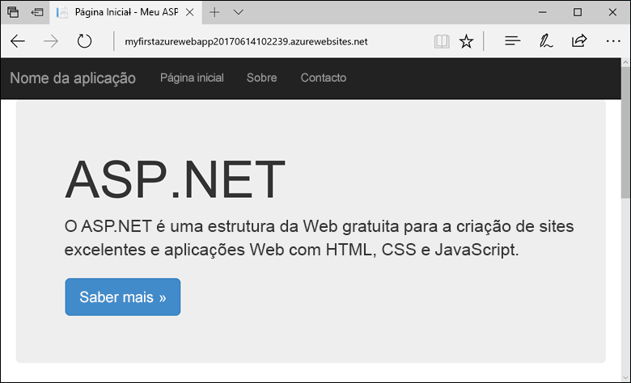
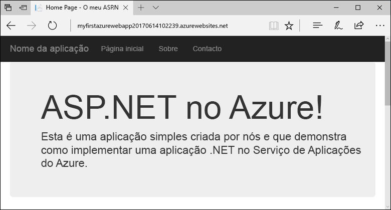

# <a name="create-an-aspnet-framework-web-app-in-azure"></a>Criar uma aplicação Web ASP.NET Framework no Azure

O [Serviço de Aplicações do Azure](overview.md) oferece um serviço de alojamento na Web altamente dimensionável e com correção automática.

Este guia de início rápido mostra como implantar seu primeiro aplicativo Web ASP.NET no serviço Azure App. Quando tiver terminado, você terá um plano do serviço de aplicativo. Você também terá um aplicativo do serviço de aplicativo com um aplicativo Web implantado.

[!INCLUDE [quickstarts-free-trial-note](../../includes/quickstarts-free-trial-note.md)]

## <a name="prerequisites"></a>Pré-requisitos

Para concluir este tutorial, instale o <a href="https://www.visualstudio.com/downloads/" target="_blank">Visual Studio 2019</a> com a carga de trabalho de **desenvolvimento da web e do ASP.net** .

Se você já instalou o Visual Studio 2019:

- Instale as atualizações mais recentes no Visual Studio selecionando **ajuda** > **verificar se há atualizações**.
- Adicione a carga de trabalho selecionando **ferramentas** > **obter ferramentas e recursos**.

## Criar um aplicativo Web ASP.NET<a name="create-and-publish-the-web-app"></a>

Crie um aplicativo Web ASP.NET seguindo estas etapas:

1. Abra o Visual Studio e, em seguida, selecione **criar um novo projeto**.

2. Em **criar um novo projeto**, localize e escolha **ASP.NET aplicativo Web (.NET Framework)** e, em seguida, selecione **Avançar**.

3. Em **configurar seu novo projeto**, nomeie o aplicativo _myFirstAzureWebApp_e, em seguida, selecione **criar**.

   

4. Pode implementar qualquer tipo de aplicação Web ASP.NET no Azure. Para este guia de início rápido, escolha o modelo **MVC** .

5. Verifique se a autenticação está definida como **sem autenticação**. Selecione **Criar**.

   

6. No menu do Visual Studio, selecione **depurar** > **Iniciar sem Depurar** para executar o aplicativo Web localmente.

   

## Publicar seu aplicativo Web<a name="launch-the-publish-wizard"></a>

1. Em **Gerenciador de soluções**, clique com o botão direito do mouse no projeto **MyFirstAzureWebApp** e selecione **publicar**.

1. Escolha **serviço de aplicativo** e altere **Criar perfil** para **publicar**.

   

1. No **serviço de aplicativo criar novo**, suas opções dependem se você já entrou no Azure e se tem uma conta do Visual Studio vinculada a uma conta do Azure. Selecione **Adicionar uma conta** ou **entrar** para entrar em sua assinatura do Azure. Se você já tiver entrado, selecione a conta desejada.

   > [!NOTE]
   > Se já tiver sessão iniciada, não selecione ainda **Criar**.
   >
   >

   

   [!INCLUDE [resource group intro text](../../includes/resource-group.md)]

1. Para **grupo de recursos**, selecione **novo**.

1. Em **novo nome do grupo de recursos**, insira *MyResource* Group e selecione **OK**.

   [!INCLUDE [app-service-plan](../../includes/app-service-plan.md)]

1. Para o **plano de hospedagem**, selecione **novo**.

1. Na caixa de diálogo **Configurar plano de hospedagem** , insira os valores da tabela a seguir e selecione **OK**.

   | Definição | Valor sugerido | Descrição |
   |-|-|-|
   |Plano do Serviço de Aplicações| myAppServicePlan | Nome do plano de serviço de aplicações. |
   | Localização | Europa Ocidental | O centro de dados onde o a aplicação Web está alojada. |
   | Tamanho | Gratuito | O [escalão de preço](https://azure.microsoft.com/pricing/details/app-service/?ref=microsoft.com&utm_source=microsoft.com&utm_medium=docs&utm_campaign=visualstudio) determina as funcionalidades do alojamento. |

   

1. Em **nome**, insira um nome de aplicativo exclusivo que inclua somente os caracteres válidos são `a-z`, `A-Z`, `0-9`e `-`. Você pode aceitar o nome exclusivo gerado automaticamente. O URL da aplicação Web é `http://<app_name>.azurewebsites.net`, em que `<app_name>` é o nome da aplicação.

2. Selecione **Criar** para começar a criar os recursos do Azure.

   

Depois de concluir o assistente, este publica a aplicação Web ASP.NET no Azure e, em seguida, inicia a aplicação no browser predefinido.



O nome do aplicativo especificado na página **criar novo do serviço de aplicativo** é usado como o prefixo de URL no formato `http://<app_name>.azurewebsites.net`.

**Parabéns!** Seu aplicativo Web ASP.NET está em execução no serviço Azure App.

## <a name="update-the-app-and-redeploy"></a>Atualizar a aplicação e reimplementar

1. No **Gerenciador de soluções**, em seu projeto, abra **exibições** > **Home** > **index. cshtml**.

1. Localize a etiqueta HTML `<div class="jumbotron">` na parte superior e substitua todo o elemento pelo código seguinte:

   ```HTML
   <div class="jumbotron">
       <h1>ASP.NET in Azure!</h1>
       <p class="lead">This is a simple app that we’ve built that demonstrates how to deploy a .NET app to Azure App Service.</p>
   </div>
   ```

1. Para voltar a implementar no Azure, clique com o botão direito do rato no projeto **myFirstAzureWebApp**, no **Explorador de Soluções** e selecione **Publicar**. Em seguida, selecione **publicar**.

Quando a publicação estiver concluída, o Visual Studio inicia um browser para o URL da aplicação Web.



## <a name="manage-the-azure-app"></a>Gerenciar o aplicativo do Azure

1. Para gerenciar o aplicativo Web, vá para o [portal do Azure](https://portal.azure.com)e procure e selecione serviços de **aplicativos**.

   

2. Na página **serviços de aplicativos** , selecione o nome do seu aplicativo Web.

   

   É apresentada a página de descrição geral da sua aplicação Web. Aqui, você pode fazer gerenciamento básico, como procurar, parar, iniciar, reiniciar e excluir.

   

   O menu à esquerda fornece diferentes páginas para configurar a sua aplicação.

## <a name="next-steps"></a>Passos seguintes

> [!div class="nextstepaction"]
> [ASP.NET com Base de Dados SQL](app-service-web-tutorial-dotnet-sqldatabase.md)
