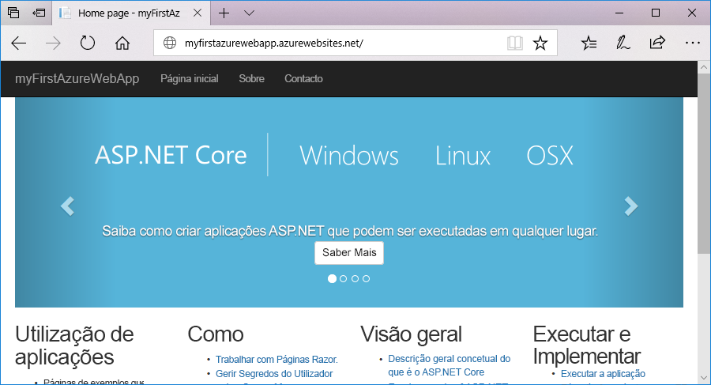

# <a name="create-an-aspnet-core-web-app-in-azure"></a>Criar uma aplicação Web ASP.NET Core no Azure

> [!NOTE]
> Este artigo implementa uma aplicação no Serviço de Aplicações no Windows. Para implementar um Serviço de Aplicações no _Linux_, consulte [Criar uma aplicação Web .NET Core no Serviço de Aplicações no Linux](./containers/quickstart-dotnetcore.md).
>

O [Serviço de Aplicações do Azure](overview.md) oferece um serviço de alojamento na Web altamente dimensionável e com correção automática.

Este quickstart mostra como implementar a sua primeira ASP.NET aplicação web Core para o Azure App Service. Quando terminar, terá um grupo de recursos que consiste num plano de Serviço de Aplicações e numa aplicação do App Service com uma aplicação web implementada.

[!INCLUDE [quickstarts-free-trial-note](../../includes/quickstarts-free-trial-note.md)]

## <a name="prerequisites"></a>Pré-requisitos

Para completar este tutorial, instale o <a href="https://www.visualstudio.com/downloads/" target="_blank">Visual Studio 2019</a> com a ASP.NET e a carga de trabalho de **desenvolvimento web.**

Se já instalou o Visual Studio 2019:

- Instale as últimas atualizações no Estúdio Visual selecionando **ajuda** > **verificar se há atualizações**.
- Adicione a carga de trabalho selecionando **ferramentas** > **obter ferramentas e funcionalidades**.

## <a name="create-an-aspnet-core-web-app"></a>Criar uma aplicação Web ASP.NET Core

Crie uma ASP.NET aplicação web Core seguindo estes passos:

1. Abra o Estúdio Visual e, em seguida, selecione **Criar um novo projeto**.

1. Em **Criar um novo projeto,** encontre e escolha ASP.NET **Aplicação Web Core** para, C#em seguida, selecione **Next**.

1. No **Configure o seu novo projeto,** nomeie a aplicação _myFirstAzureWebApp_, e depois selecione **Create**.

   

1. Para este arranque rápido, escolha o modelo de **Aplicação Web.** Certifique-se de que a autenticação está definida para **não autenticação** e não é selecionada outra opção. Selecione **Criar**.

   

    Pode implementar qualquer tipo de aplicação Web ASP.NET Core no Azure.

1. A partir do menu do Estúdio Visual, selecione **Debug** > **Start Without Debugging** para executar a aplicação web localmente.

   

## <a name="publish-your-web-app"></a>Publique a sua aplicação web

1. No **Solution Explorer,** clique à direita no projeto **myFirstAzureWebApp** e selecione **Publish**.

1. Escolha **o Serviço de Aplicações** e, em seguida, selecione **Publicar**.

   

1. No **Serviço de Aplicações Criar novas**, as suas opções dependem se já está inscrito no Azure e se tem uma conta visual studio ligada a uma conta Azure. Selecione **Adicionar uma conta** ou **iniciar** sessão para iniciar sessão na subscrição do Azure. Se já assinou, selecione a conta que deseja.

   > [!NOTE]
   > Se já tiver sessão iniciada, não selecione ainda **Criar**.
   >

   

   [!INCLUDE [resource group intro text](../../includes/resource-group.md)]

1. Para **o grupo Recursos,** selecione **New**.

1. Em novo nome de **grupo de recursos,** insira *o myResourceGroup* e selecione **OK**.

   [!INCLUDE [app-service-plan](../../includes/app-service-plan.md)]

1. Para o **Plano de Hospedagem,** selecione **New**.

1. No diálogo do Plano de **Hospedagem Configurar,** introduza os valores a partir da tabela seguinte e, em seguida, selecione **OK**.

   | Definição | Valor sugerido | Descrição |
   |-|-|-|
   |Plano do Serviço de Aplicações| myAppServicePlan | Nome do plano de serviço de aplicações. |
   | Localização | Europa Ocidental | O centro de dados onde o a aplicação Web está alojada. |
   | Size | Livre | O [escalão de preço](https://azure.microsoft.com/pricing/details/app-service/?ref=microsoft.com&utm_source=microsoft.com&utm_medium=docs&utm_campaign=visualstudio) determina as funcionalidades do alojamento. |

   

1. Em **Nome**, insira um nome de aplicação único que inclua apenas os caracteres válidos são `a-z`, `A-Z`, `0-9`e `-`. Pode aceitar o nome único gerado automaticamente. O URL da aplicação Web é `http://<app_name>.azurewebsites.net`, em que `<app_name>` é o nome da aplicação.

   

1. Selecione **Criar** para começar a criar os recursos do Azure.

Depois de concluir o assistente, este publica a aplicação Web ASP.NET Core no Azure e, em seguida, inicia a aplicação no browser predefinido.



O nome da aplicação especificado no **Serviço de Aplicações Criar nova** página é usado como prefixo URL no formato `http://<app_name>.azurewebsites.net`.

**Parabéns!** A sua aplicação web ASP.NET Core está a funcionar ao vivo no Azure App Service.

## <a name="update-the-app-and-redeploy"></a>Atualizar a aplicação e reimplementar

1. No **Solution Explorer,** no âmbito do seu projeto, abre **páginas** > **Index.cshtml**.

1. Substitua as duas tags `<div>` pelo seguinte código:

   ```HTML
   <div class="jumbotron">
       <h1>ASP.NET in Azure!</h1>
       <p class="lead">This is a simple app that we’ve built that demonstrates how to deploy a .NET app to Azure App Service.</p>
   </div>
   ```

1. Para voltar a implementar no Azure, clique com o botão direito do rato no projeto **myFirstAzureWebApp**, no **Explorador de Soluções** e selecione **Publicar**.

1. Na página resumo da **Publicação,** selecione **Publicar**.

   

Quando a publicação estiver concluída, o Visual Studio inicia um browser para o URL da aplicação Web.


## <a name="manage-the-azure-app"></a>Gerir a app Azure

Para gerir a aplicação web, vá ao [portal Azure](https://portal.azure.com)e procure e selecione Serviços de **Aplicações.**


Na página de Serviços de **Aplicações,** selecione o nome da sua aplicação web.


É apresentada a página de descrição geral da sua aplicação Web. Aqui, pode fazer gestão básica como navegar, parar, começar, reiniciar e apagar.


O menu à esquerda fornece diferentes páginas para configurar a sua aplicação.

[!INCLUDE [Clean-up section](../../includes/clean-up-section-portal.md)]

## <a name="next-steps"></a>Passos Seguintes

> [!div class="nextstepaction"]
> [ASP.NET Core com a Base de Dados SQL](app-service-web-tutorial-dotnetcore-sqldb.md)
