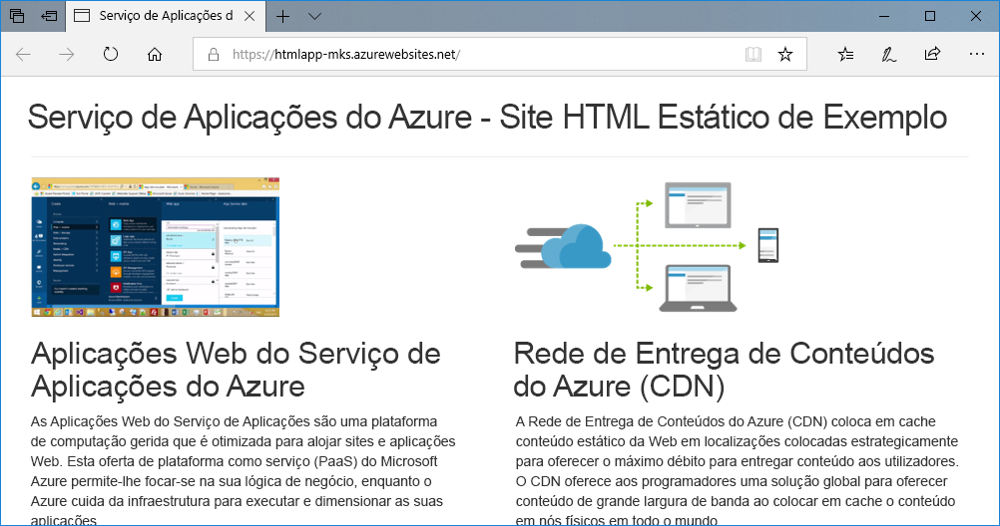
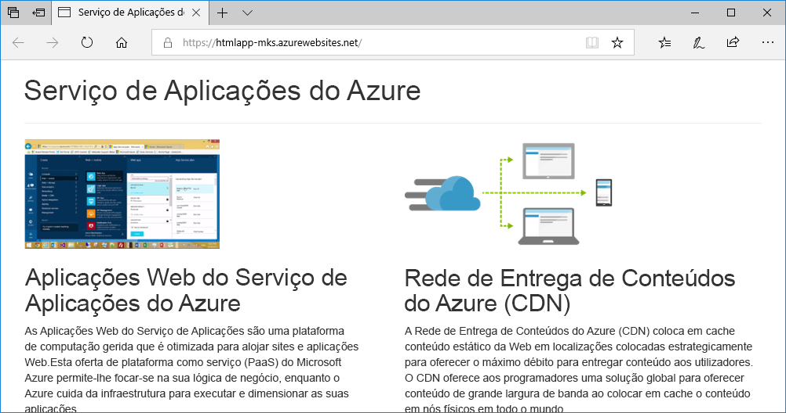
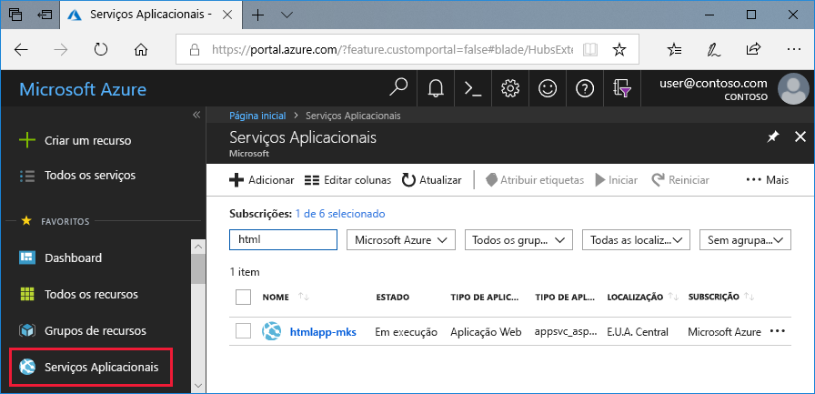
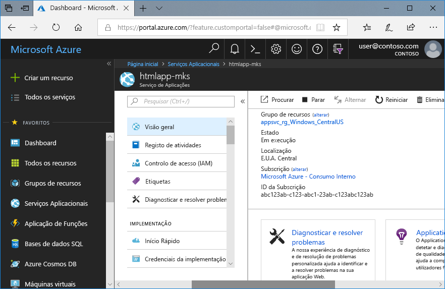

# <a name="create-a-static-html-web-app-in-azure"></a>Criar uma aplicação Web HTML estática no Azure

O [Serviço de Aplicações do Azure](overview.md) oferece um serviço de alojamento na Web altamente dimensionável e com correção automática. Este guia de início rápido mostra como implantar um site HTML + CSS básico em Azure App serviço. Este início rápido deverá ser concluído no [Cloud Shell](https://docs.microsoft.com/azure/cloud-shell/overview), mas também poderá executar estes comandos localmente com a [CLI do Azure](/cli/azure/install-azure-cli).



[!INCLUDE [quickstarts-free-trial-note](../../includes/quickstarts-free-trial-note.md)]

[!INCLUDE [cloud-shell-try-it.md](../../includes/cloud-shell-try-it.md)]

## <a name="download-the-sample"></a>Transferir o exemplo

No Cloud Shell, crie um diretório de início rápido e, em seguida, altere-o.

```bash
mkdir quickstart

cd $HOME/quickstart
```

Em seguida, execute o seguinte comando para clonar o repositório da aplicação de exemplo para o seu diretório de início rápido.

```bash
git clone https://github.com/Azure-Samples/html-docs-hello-world.git
```

## <a name="create-a-web-app"></a>Criar uma aplicação Web

Mude para o diretório que contém o código de exemplo e execute o comando `az webapp up`.

No comando a seguir, substitua <nome_aplicação> por um nome de aplicação exclusivo.

```bash
cd html-docs-hello-world

az webapp up --location westeurope --name <app_name>
```

O comando `az webapp up` executa as seguintes ações:

- Cria um grupo de recursos predefinido.

- Cria um plano do serviço de aplicações predefinido.

- Cria uma aplicação com o nome especificado.

- [Implementa](https://docs.microsoft.com/azure/app-service/deploy-zip) os ficheiros zip do diretório atual de trabalho para a aplicação Web.

Este comando pode demorar alguns minutos a ser executado. Ao executar, apresenta informações semelhantes ao exemplo seguinte:

```json
{
  "app_url": "https://<app_name>.azurewebsites.net",
  "location": "westeurope",
  "name": "<app_name>",
  "os": "Windows",
  "resourcegroup": "appsvc_rg_Windows_westeurope",
  "serverfarm": "appsvc_asp_Windows_westeurope",
  "sku": "FREE",
  "src_path": "/home/<username>/quickstart/html-docs-hello-world ",
  < JSON data removed for brevity. >
}
```

Anote o valor `resourceGroup`. Vai precisar dele na secção [limpar recursos](#clean-up-resources).

## <a name="browse-to-the-app"></a>Navegar para a aplicação

Em um navegador, vá para a URL do aplicativo: `http://<app_name>.azurewebsites.net`.

A página está a ser executada como uma aplicação Web do Serviço de Aplicações do Azure.


**Parabéns!** Implementou a sua primeira aplicação HTML no Serviço de Aplicações.

## <a name="update-and-redeploy-the-app"></a>Atualizar e reimplementar a aplicação

No Cloud Shell, escreva `nano index.html` para abrir o editor de texto nano. No cabeçalho da etiqueta `<h1>`, altere o "Serviço de Aplicações do Azure – Site HTML Estático de Exemplo" para -"Serviço de Aplicações do Azure", conforme mostrado abaixo.


Guarde as alterações e feche o nano. Utilize o comando `^O` para guardar e `^X` para sair.

Agora irá implementar novamente a aplicação com o mesmo comando `az webapp up`.

```bash
az webapp up --location westeurope --name <app_name>
```

Depois de concluída a implementação, volte para a janela do browser aberta que abriu no passo **Navegar para a aplicação** e atualize a página.



## <a name="manage-your-new-azure-app"></a>Gerenciar seu novo aplicativo do Azure

Para gerenciar o aplicativo Web que você criou, na [portal do Azure](https://portal.azure.com), procure e selecione **serviços de aplicativos**. 


Na página **serviços de aplicativos** , selecione o nome do seu aplicativo do Azure.



É apresentada a página de descrição geral da sua aplicação Web. Aqui, pode realizar tarefas de gestão básicas, como navegar, parar, iniciar, reiniciar e eliminar.



O menu à esquerda fornece diferentes páginas para configurar a sua aplicação.

## <a name="clean-up-resources"></a>Limpar recursos

Nos passos anteriores, criou os recursos do Azure num grupo de recursos. Se achar que não vai precisar destes recursos no futuro, execute o seguinte comando no Cloud Shell para eliminar o grupo de recursos. Lembre-se de que o nome do grupo de recursos foi gerado automaticamente para si no passo [criar uma aplicação Web](#create-a-web-app).

```bash
az group delete --name appsvc_rg_Windows_westeurope
```

Este comando pode demorar alguns minutos a ser executado.

## <a name="next-steps"></a>Passos seguintes

> [!div class="nextstepaction"]
> [Mapear domínio personalizado](app-service-web-tutorial-custom-domain.md)
