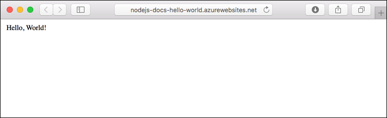
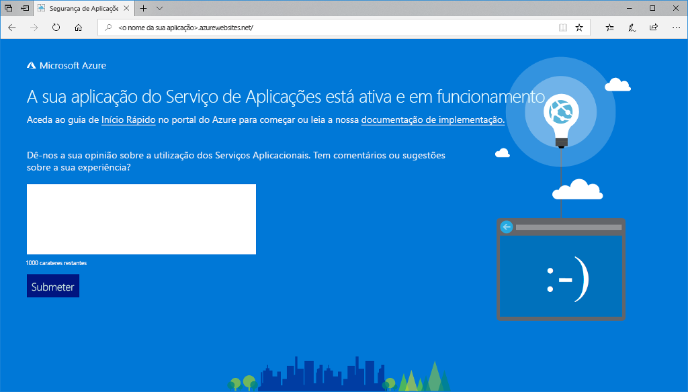
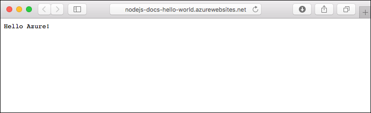
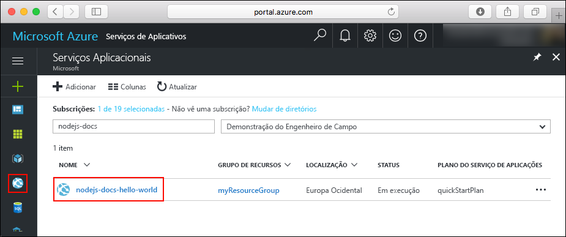
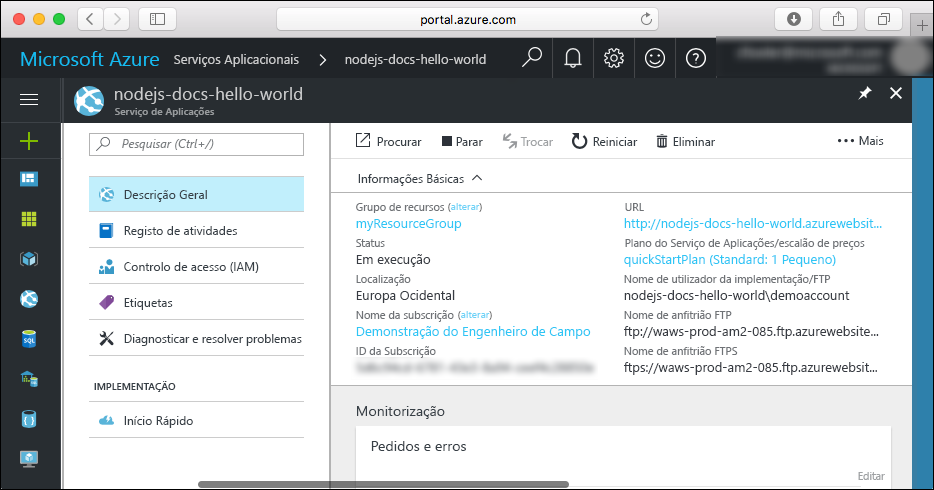

# <a name="create-a-nodejs-web-app-in-azure"></a>Criar uma aplicação Web Node.js no Azure

> [!NOTE]
> Este artigo implementa uma aplicação no Serviço de Aplicações no Windows. Para implementar um Serviço de Aplicações no _Linux_, consulte [Criar uma aplicação Web Node.js no Serviço de Aplicações do Azure no Linux](./containers/quickstart-nodejs.md).
>

O [Serviço de Aplicações do Azure](overview.md) oferece um serviço de alojamento na Web altamente dimensionável e com correção automática.  Este guia de introdução mostra como implementar uma aplicação de node. js no App Service do Azure. Criar a aplicação web com o [Cloud Shell](https://docs.microsoft.com/azure/cloud-shell/overview), mas também pode executar estes comandos localmente com [CLI do Azure](/cli/azure/install-azure-cli). Implementar o código de node. js de exemplo para a aplicação web com o [az webapp config origem de implementação de software-zip](/cli/azure/webapp/deployment/source?view=azure-cli-latest#az-webapp-deployment-source-config-zip) comando.  



Pode seguir os passos aqui indicados num computador Mac, Windows ou Linux. Demora cerca de três minutos para concluir os passos.

[!INCLUDE [quickstarts-free-trial-note](../../includes/quickstarts-free-trial-note.md)]

[!INCLUDE [cloud-shell-try-it.md](../../includes/cloud-shell-try-it.md)]

## <a name="download-the-sample"></a>Transferir o exemplo

No Cloud Shell, crie um diretório de início rápido e, em seguida, altere-o.

```azurecli-interactive
mkdir quickstart

cd quickstart
```

Em seguida, execute o seguinte comando para clonar o repositório da aplicação de exemplo para o seu diretório de início rápido.

```azurecli-interactive
git clone https://github.com/Azure-Samples/nodejs-docs-hello-world
```

Ao executar, apresenta informações semelhantes ao exemplo seguinte:

```bash
Cloning into 'nodejs-docs-hello-world'...
remote: Counting objects: 40, done.
remote: Total 40 (delta 0), reused 0 (delta 0), pack-reused 40
Unpacking objects: 100% (40/40), done.
Checking connectivity... done.
```

> [!NOTE]
> O exemplo Index define a porta de escuta para process.env.PORT. Esta variável de ambiente é atribuído pelo serviço de aplicações.
>

[!INCLUDE [Create resource group](../../includes/app-service-web-create-resource-group-scus.md)]

[!INCLUDE [Create app service plan](../../includes/app-service-web-create-app-service-plan-scus.md)]

## <a name="create-a-web-app"></a>Criar uma aplicação Web

No Cloud Shell, crie uma aplicação Web no plano do Serviço de Aplicações `myAppServicePlan` com o comando [`az webapp create`](/cli/azure/webapp?view=azure-cli-latest#az-webapp-create).

No exemplo a seguir, substitua `<app_name>` com um nome de aplicação globalmente exclusivo (os carateres válidos são `a-z`, `0-9` e `-`).

```azurecli-interactive
# Bash and Powershell
az webapp create --resource-group myResourceGroup --plan myAppServicePlan --name <app_name>
```

Quando a aplicação Web tiver sido criada, a CLI do Azure mostra informações semelhantes ao seguinte exemplo:

```json
{
  "availabilityState": "Normal",
  "clientAffinityEnabled": true,
  "clientCertEnabled": false,
  "cloningInfo": null,
  "containerSize": 0,
  "dailyMemoryTimeQuota": 0,
  "defaultHostName": "<app_name>.azurewebsites.net",
  "enabled": true,
  < JSON data removed for brevity. >
}
```

### <a name="set-nodejs-runtime"></a>Definir o runtime do Node.js

Defina o tempo de execução do nó para 10.14.1. Para ver todos os runtimes suportados, execute [`az webapp list-runtimes`](/cli/azure/webapp?view=azure-cli-latest#az-webapp-list-runtimes).

```azurecli-interactive
# Bash and Powershell
az webapp config appsettings set --resource-group myResourceGroup --name <app_name> --settings WEBSITE_NODE_DEFAULT_VERSION=10.14.1
```

Navegue para a sua aplicação Web recentemente criada. Substitua `<app_name>` com um nome de aplicação único.

```
http://<app_name>.azurewebsites.net
```

A aplicação Web deve ter o seguinte aspeto: 

## <a name="deploy-zip-file"></a>Implementar o ficheiro ZIP

No Cloud Shell, navegue até ao diretório de raiz da sua aplicação, crie um novo ficheiro ZIP para o seu projeto de exemplo.

```azurecli-interactive
cd nodejs-docs-hello-world  

zip -r myUpdatedAppFiles.zip *.*
```

Implementar o ficheiro ZIP para a sua aplicação web com o [az webapp config origem de implementação de software-zip](/cli/azure/webapp/deployment/source?view=azure-cli-latest#az-webapp-deployment-source-config-zip) comando.  

```azurecli-interactive
az webapp deployment source config-zip --resource-group myResourceGroup --name <app_name> --src myUpdatedAppFiles.zip
```

Este comando implementa os ficheiros e os diretórios do ficheiro ZIP na pasta de aplicações do Serviço de Aplicações predefinido (`\home\site\wwwroot`) e reinicia a aplicação. Se estiver configurado qualquer processo de compilação personalizado adicional, este é executado corretamente. Para obter mais informações, consulte [documentação de Kudu](https://github.com/projectkudu/kudu/wiki/Deploying-from-a-zip-file).

## <a name="browse-to-the-app"></a>Navegar para a aplicação

Utilize o browser para navegar para a aplicação implementada.

```
http://<app_name>.azurewebsites.net
```

O código Node.js de exemplo está em execução numa aplicação Web do serviço de aplicações do Azure.


> [!NOTE]
> No Serviço de Aplicações do Azure, a aplicação é executada no IIS usando [iisnode](https://github.com/Azure/iisnode). Para ativar a aplicação a ser executada com o iisnode, o diretório da aplicação de raiz contém um arquivo web.config. O ficheiro é lido pelo IIS e as definições relacionadas com o iisnode são documentadas no [repositório do GitHub iisnode](https://github.com/Azure/iisnode/blob/master/src/samples/configuration/web.config).

**Parabéns!** Implementou a sua primeira aplicação Node.js no Serviço de Aplicações.

## <a name="update-and-redeploy-the-code"></a>Atualizar e voltar a implementar o código

No Cloud Shell, escreva `code index.js` para abrir o editor do Cloud Shell.


Faça uma pequena alteração no texto da chamada de `response.end`:

```javascript
response.end("Hello Azure!");
```

Guardar as alterações e sair do editor. Utilize o comando `^S` para guardar e `^Q` para sair.

Criar um ficheiro ZIP e implementá-lo utilizando o [az webapp config origem de implementação de software-zip](/cli/azure/webapp/deployment/source?view=azure-cli-latest#az-webapp-deployment-source-config-zip) comando.  

```azurecli-interactive
# Bash
zip -r myUpdatedAppFiles.zip *.*

az webapp deployment source config-zip --resource-group myResourceGroup --name <app_name> --src myUpdatedAppFiles.zip
```

Volte para a janela do browser aberta que abriu no passo **Navegar para a aplicação** e atualize a página.



## <a name="manage-your-new-azure-app"></a>Gerir a sua nova aplicação do Azure

Aceda ao <a href="https://portal.azure.com" target="_blank">portal do Azure</a> para gerir a aplicação Web que criou.

No menu à esquerda, clique em **dos serviços de aplicações**e, em seguida, clique no nome da sua aplicação do Azure.



É apresentada a página de descrição geral da sua aplicação Web. Aqui, pode realizar tarefas de gestão básicas, como navegar, parar, iniciar, reiniciar e eliminar.



O menu à esquerda fornece diferentes páginas para configurar a sua aplicação.

[!INCLUDE [cli-samples-clean-up](../../includes/cli-samples-clean-up.md)]

## <a name="next-steps"></a>Passos Seguintes

> [!div class="nextstepaction"]
> [Node.js com MongoDB](app-service-web-tutorial-nodejs-mongodb-app.md)
