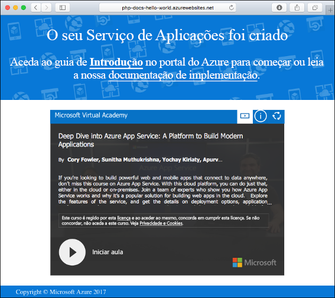
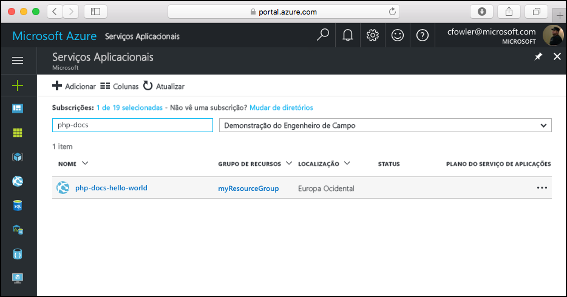

# <a name="create-a-php-web-app-in-azure"></a>Criar uma aplicação Web PHP no Azure

> [!NOTE]
> Este artigo implementa uma aplicação no Serviço de Aplicações no Windows. Para implementar um Serviço de Aplicações no _Linux_, consulte [Criar uma aplicação Web PHP no Serviço de Aplicações no Linux](./containers/quickstart-php.md).
>

O [Serviço de Aplicações do Azure](overview.md) oferece um serviço de alojamento na Web altamente dimensionável e com correção automática.  Este tutorial de arranque rápido mostra como implementar uma aplicação PHP para o Azure App Service. Crie a aplicação Web com a [CLI do Azure](https://docs.microsoft.com/cli/azure/get-started-with-azure-cli) no Cloud Shell e utilize o Git para implementar o código PHP de exemplo para a aplicação Web.


Pode seguir os passos aqui indicados num computador Mac, Windows ou Linux. Depois de instalados os pré-requisitos, demora cerca de cinco minutos a concluir todos os passos.

[!INCLUDE [quickstarts-free-trial-note](../../includes/quickstarts-free-trial-note.md)]

## <a name="prerequisites"></a>Pré-requisitos

Para concluir este guia de início rápido:

* <a href="https://git-scm.com/" target="_blank">Instalar o Git</a>
* <a href="https://php.net/manual/install.php" target="_blank">Instalar PHP</a>

## <a name="download-the-sample-locally"></a>Transferir o exemplo localmente

Numa janela de terminal, execute os comandos seguintes. Desta forma, o exemplo de aplicação é clonado no seu computador local e é encaminhado para o diretório que contém o código de exemplo. 

```bash
git clone https://github.com/Azure-Samples/php-docs-hello-world
cd php-docs-hello-world
```

## <a name="run-the-app-locally"></a>Executar a aplicação localmente

Execute a aplicação localmente, para ver que aspeto deveria ter quando a implemente no Azure. Abra uma janela do terminal e use o comando `php` para iniciar o servidor Web PHP incorporado.

```bash
php -S localhost:8080
```

Abra um browser e navegue para a aplicação de exemplo em `http://localhost:8080`.

Pode ver a mensagem **Olá, mundo!** da aplicação de exemplo apresentada na página.


Na janela do terminal, prima **Ctrl+C** para sair do servidor Web.

[!INCLUDE [cloud-shell-try-it.md](../../includes/cloud-shell-try-it.md)]

[!INCLUDE [Configure deployment user](../../includes/configure-deployment-user.md)]

[!INCLUDE [Create resource group](../../includes/app-service-web-create-resource-group.md)]

[!INCLUDE [Create app service plan](../../includes/app-service-web-create-app-service-plan.md)]

## <a name="create-a-web-app"></a>Criar uma aplicação Web

No Cloud Shell, crie uma aplicação Web no plano do Serviço de Aplicações `myAppServicePlan` com o comando [`az webapp create`](/cli/azure/webapp?view=azure-cli-latest#az-webapp-create). 

No exemplo a seguir, substitua `<app_name>` com um nome de aplicação globalmente exclusivo (os carateres válidos são `a-z`, `0-9` e `-`). O runtime está definido como `PHP|7.0`. Para ver todos os tempos de corrida suportados, corra. [`az webapp list-runtimes`](/cli/azure/webapp?view=azure-cli-latest#az-webapp-list-runtimes) 


```azurecli-interactive
# Bash
az webapp create --resource-group myResourceGroup --plan myAppServicePlan --name <app_name> --runtime "PHP|7.0" --deployment-local-git
# PowerShell
az --% webapp create --resource-group myResourceGroup --plan myAppServicePlan --name <app_name> --runtime "PHP|7.0" --deployment-local-git
```
> [!NOTE]
> O símbolo `(--%)`de stop-parsing, introduzido no PowerShell 3.0, direciona a PowerShell a abster-se de interpretar a entrada como comandos ou expressões PowerShell. 
>

Quando a aplicação Web tiver sido criada, a CLI do Azure mostra informações semelhantes ao seguinte exemplo:

<pre>
Local git is configured with url of 'https://&lt;username&gt;@&lt;app_name&gt;.scm.azurewebsites.net/&lt;app_name&gt;.git'
{
  "availabilityState": "Normal",
  "clientAffinityEnabled": true,
  "clientCertEnabled": false,
  "cloningInfo": null,
  "containerSize": 0,
  "dailyMemoryTimeQuota": 0,
  "defaultHostName": "&lt;app_name&gt;.azurewebsites.net",
  "enabled": true,
  &lt; JSON data removed for brevity. &gt;
}
</pre>

Criou uma nova aplicação vazia, com a implementação de git habilitada.

> [!NOTE]
> O URL do Git remoto é apresentado na propriedade `deploymentLocalGitUrl`, com o formato `https://<username>@<app_name>.scm.azurewebsites.net/<app_name>.git`. Guarde este URL, uma vez que vai precisar dele mais tarde.
>

Navegue para a sua aplicação Web recentemente criada. Substitua o _ &lt;nome da aplicação>_ pelo nome único da aplicação criado no passo anterior.

```bash
http://<app name>.azurewebsites.net
```

A aplicação Web deve ter o seguinte aspeto:



[!INCLUDE [Push to Azure](../../includes/app-service-web-git-push-to-azure.md)] 

```bash
Counting objects: 2, done.
Delta compression using up to 4 threads.
Compressing objects: 100% (2/2), done.
Writing objects: 100% (2/2), 352 bytes | 0 bytes/s, done.
Total 2 (delta 1), reused 0 (delta 0)
remote: Updating branch 'master'.
remote: Updating submodules.
remote: Preparing deployment for commit id '25f18051e9'.
remote: Generating deployment script.
remote: Running deployment command...
remote: Handling Basic Web Site deployment.
remote: Kudu sync from: '/home/site/repository' to: '/home/site/wwwroot'
remote: Copying file: '.gitignore'
remote: Copying file: 'LICENSE'
remote: Copying file: 'README.md'
remote: Copying file: 'index.php'
remote: Ignoring: .git
remote: Finished successfully.
remote: Running post deployment command(s)...
remote: Deployment successful.
To https://<app_name>.scm.azurewebsites.net/<app_name>.git
   cc39b1e..25f1805  master -> master
```

## <a name="browse-to-the-app"></a>Navegar para a aplicação

Utilize o browser para navegar para a aplicação implementada.

```
http://<app_name>.azurewebsites.net
```

O código PHP de exemplo está em execução numa aplicação Web do serviço de aplicações do Azure.


**Parabéns!** Implementou a sua primeira aplicação PHP no Serviço de Aplicações.

## <a name="update-locally-and-redeploy-the-code"></a>Atualizar localmente e reimplementar o código

Utilizando um editor de texto local, abra o ficheiro `index.php` na aplicação PHP e faça uma pequena alteração ao texto na cadeia junto a `echo`:

```php
echo "Hello Azure!";
```

Na janela terminal local, consolide as suas alterações no Git e envie as alterações ao código para o Azure.

```bash
git commit -am "updated output"
git push azure master
```

Depois de concluída a implementação, volte para a janela do browser aberta durante o passo **Navegar para a aplicação** e atualize a página.


## <a name="manage-your-new-azure-app"></a>Gerencie a sua nova app Azure

1. Aceda ao <a href="https://portal.azure.com" target="_blank">portal do Azure</a> para gerir a aplicação Web que criou. Procure e selecione Serviços de **Aplicações**.

    

2. Selecione o nome da sua aplicação Azure.

    

    Será exibida a página **de visão geral** da sua aplicação web. Aqui, pode executar tarefas básicas de gestão como **Navegar,** **Parar,** **Reiniciar**e **Excluir.**

    

    O menu de aplicações web fornece diferentes opções para configurar a sua aplicação. 

[!INCLUDE [cli-samples-clean-up](../../includes/cli-samples-clean-up.md)]

## <a name="next-steps"></a>Passos seguintes

> [!div class="nextstepaction"]
> [PHP com MySQL](app-service-web-tutorial-php-mysql.md)
