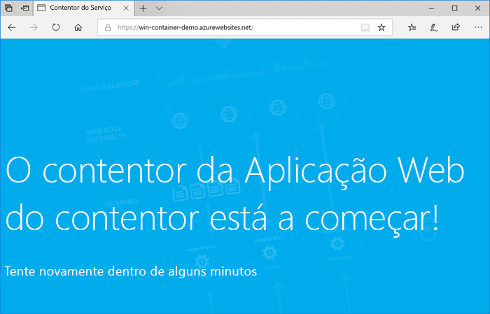
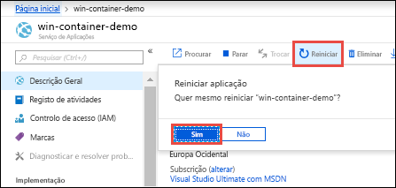

# <a name="run-a-custom-windows-container-in-azure-preview"></a>Executar um contentor do Windows personalizado no Azure (Pré-visualização)

O [Serviço de Aplicações do Azure](overview.md) disponibiliza pilhas de aplicações predefinidas no Windows, como ASP.NET ou Node.js, em execução no IIS. O ambiente pré-configurado do Windows bloqueia o sistema operacional contra acesso administrativo, instalações de software, alterações no cache de assembly global e assim por diante. Para obter mais informações, consulte [funcionalidade do sistema operacional no serviço de Azure app](operating-system-functionality.md). Se a sua aplicação precisar de mais acesso do que aquele que o ambiente pré-configurado permite, pode implementar um contentor do Windows personalizado.

Este guia de início rápido mostra como implantar um aplicativo ASP.NET, em uma imagem do Windows, no [Hub](https://hub.docker.com/) do Docker a partir do Visual Studio. Você executa o aplicativo em um contêiner personalizado no serviço Azure App.

## <a name="prerequisites"></a>Pré-requisitos

Para concluir este tutorial:

- <a href="https://hub.docker.com/" target="_blank">Inscrever numa conta do Docker Hub</a>
- <a href="https://docs.docker.com/docker-for-windows/install/" target="_blank">Instale o Docker para Windows</a>.
- <a href="https://docs.microsoft.com/virtualization/windowscontainers/quick-start/quick-start-windows-10" target="_blank">Mude o Docker para executar contentores do Windows</a>.
- <a href="https://www.visualstudio.com/downloads/" target="_blank">Instale o Visual Studio 2019</a> com as cargas de trabalho **ASP.net e desenvolvimento** para a Web e **desenvolvimento do Azure** . Se você já instalou o Visual Studio 2019:

    - Instale as atualizações mais recentes no Visual Studio selecionando **ajuda** > **para verificar**se há atualizações.
    - Adicione as cargas de trabalho no Visual Studio selecionando **ferramentas** > **obter ferramentas e recursos**.

## <a name="create-an-aspnet-web-app"></a>Criar uma aplicação Web ASP.NET

Crie um aplicativo Web ASP.NET seguindo estas etapas:

1. Abra o Visual Studio e, em seguida, selecione **criar um novo projeto**.

1. Em **criar um novo projeto**, localize e escolha **aplicativo Web ASP.net (.NET Framework)** para C#e, em seguida, selecione **Avançar**.

1. Em **configurar seu novo projeto**, nomeie o aplicativo _myFirstAzureWebApp_e, em seguida, selecione **criar**.

   

1. Pode implementar qualquer tipo de aplicação Web ASP.NET no Azure. Para este guia de início rápido, escolha o modelo **MVC** .

1. Selecione **suporte**do Docker e verifique se a autenticação está definida como **sem autenticação**. Selecione **Criar**.

   

1. Se o ficheiro _Dockerfile_ não se abrir automaticamente, abra-o a partir do **Explorador de Soluções**.

1. Você precisa de uma [imagem pai com suporte](#use-a-different-parent-image). Altere a imagem principal, substituindo a linha `FROM` pelo código seguinte e guarde o ficheiro:

   ```Dockerfile
   FROM mcr.microsoft.com/dotnet/framework/aspnet:4.7.2-windowsservercore-ltsc2019
   ```

1. No menu do Visual Studio, selecione **depurar** > **Iniciar sem Depurar** para executar o aplicativo Web localmente.

   

## <a name="publish-to-docker-hub"></a>Publicar no Hub do Docker

1. Em **Gerenciador de soluções**, clique com o botão direito do mouse no projeto **MyFirstAzureWebApp** e selecione **publicar**.

1. Escolha **serviço de aplicativo** e, em seguida, selecione **publicar**.

1. Em escolher um **destino de publicação**, selecione **registro de contêiner** e Hub do **Docker**e clique em **publicar**.

   

1. Forneça as credenciais de conta do Hub do Docker e selecione **salvar**.

   Aguarde pela conclusão da implementação. A página **publicar** agora mostra o nome do repositório a ser usado mais tarde.

   

1. Copie este nome de repositório para utilizar mais tarde.

## <a name="create-a-windows-container-app"></a>Criar uma aplicação de contentor do Windows

1. Inicie sessão no [portal do Azure]( https://portal.azure.com).

1. Selecione **Criar um recurso**, no canto superior esquerdo do portal do Azure.

1. Na caixa de pesquisa acima da lista de recursos do Azure Marketplace, procure **aplicativo Web para contêineres**e selecione **criar**.

1. Em **criação de aplicativo Web**, escolha sua assinatura e um **grupo de recursos**. Você pode criar um novo grupo de recursos, se necessário.

1. Forneça um nome de aplicativo, como *Win-container-demo* e escolha **Windows** para **sistema operacional**. Selecione **avançar: Docker** para continuar.

   

1. Para **origem da imagem**, escolha **Hub** do Docker e **imagem e marca**, insira o nome do repositório que você copiou em [publicar para o Hub](#publish-to-docker-hub)do Docker.

   

    Se tiver uma imagem personalizada noutra localização para a sua aplicação Web, como no [Azure Container Registry](/azure/container-registry/) ou noutro repositório privado, pode configurá-la aí.

1. Selecione **revisar e criar** e, em seguida, **criar** e aguardar que o Azure crie os recursos necessários.

## <a name="browse-to-the-container-app"></a>Navegar para a aplicação de contentor

Quando a operação do Azure estiver concluída, é apresentada uma caixa de notificação.


1. Clique em **Ir para recurso**.

1. Na visão geral desse recurso, siga o link ao lado de **URL**.

Uma nova página do navegador é aberta na seguinte página:



Aguarde alguns minutos e tente novamente, até ver a home page de ASP.NET predefinida:


**Parabéns!** Está a executar o seu primeiro contentor do Windows personalizado no Serviço de Aplicações do Azure.

## <a name="see-container-start-up-logs"></a>Ver os registos de arranque do contentor

O contentor do Windows poderá demorar algum tempo até ser carregado. Para ver o progresso, navegue para o seguinte URL, substituindo *\<app_name>* pelo nome da sua aplicação.
```
https://<app_name>.scm.azurewebsites.net/api/logstream
```

Os registos transmitidos têm o seguinte aspeto:

```
2018-07-27T12:03:11  Welcome, you are now connected to log-streaming service.
27/07/2018 12:04:10.978 INFO - Site: win-container-demo - Start container succeeded. Container: facbf6cb214de86e58557a6d073396f640bbe2fdec88f8368695c8d1331fc94b
27/07/2018 12:04:16.767 INFO - Site: win-container-demo - Container start complete
27/07/2018 12:05:05.017 INFO - Site: win-container-demo - Container start complete
27/07/2018 12:05:05.020 INFO - Site: win-container-demo - Container started successfully
```

## <a name="update-locally-and-redeploy"></a>Atualizar localmente e reimplementar

1. No Visual Studio, em **Gerenciador de soluções**, abra **views** > **Home** > **index. cshtml**.

1. Localize a etiqueta HTML `<div class="jumbotron">` na parte superior e substitua todo o elemento pelo código seguinte:

   ```HTML
   <div class="jumbotron">
       <h1>ASP.NET in Azure!</h1>
       <p class="lead">This is a simple app that we’ve built that demonstrates how to deploy a .NET app to Azure App Service.</p>
   </div>
   ```

1. Para reimplantar no Azure, clique com o botão direito do mouse no projeto **myFirstAzureWebApp** em **Gerenciador de soluções** e escolha **publicar**.

1. Na página de publicação, selecione **Publicar** e aguarde até a publicação estar concluída.

1. Para dizer ao Serviço de Aplicações para obter a nova imagem do Hub do Docker, reinicie a aplicação. Na página da aplicação no portal, clique em **Reiniciar** > **Sim**.

   

[Navegue novamente para a aplicação de contentor](#browse-to-the-container-app). Quando atualiza a página Web, primeiro, a aplicação deve reverter para a página "A Iniciar" e, em seguida, volta a apresentar a página Web atualizada ao fim de alguns minutos.


## <a name="use-a-different-parent-image"></a>Utilizar uma imagem principal diferente

Você está livre para usar uma imagem personalizada do Docker diferente para executar seu aplicativo. Contudo, tem de escolher a [imagem principal](https://docs.docker.com/develop/develop-images/baseimages/) certa para a arquitetura que pretende:

- Para implantar .NET Framework aplicativos, use uma imagem pai baseada na versão [LTSC (canal de manutenção em longo prazo)](https://docs.microsoft.com/windows-server/get-started-19/servicing-channels-19#long-term-servicing-channel-ltsc) do Windows Server Core 2019. 
- Para implantar aplicativos do .NET Core, use uma imagem pai com base na versão do [SAC (canal de manutenção semestral)](https://docs.microsoft.com/windows-server/get-started-19/servicing-channels-19#semi-annual-channel) do Windows Server nano 1809. 

O carregamento das imagens principais durante o arranque da aplicação demora algum tempo. No entanto, pode utilizar uma das seguintes imagens principais que já estão em cache no Serviço de Aplicações do Azure para reduzir o tempo de arranque:

- [mcr.microsoft.com/dotnet/framework/aspnet](https://hub.docker.com/_/microsoft-dotnet-framework-aspnet/):4.7.2-windowsservercore-ltsc2019
- [MCR.Microsoft.com/Windows/nanoserver](https://hub.docker.com/_/microsoft-windows-nanoserver/): 1809-esta imagem é o contêiner de base usado em imagens do Microsoft Windows Nano Server [ASP.NET Core](https://hub.docker.com/_microsoft-dotnet-cores-aspnet) Microsoft.

## <a name="next-steps"></a>Passos seguintes

> [!div class="nextstepaction"]
> [Migrar para o contentor do Windows no Azure](app-service-web-tutorial-windows-containers-custom-fonts.md)
