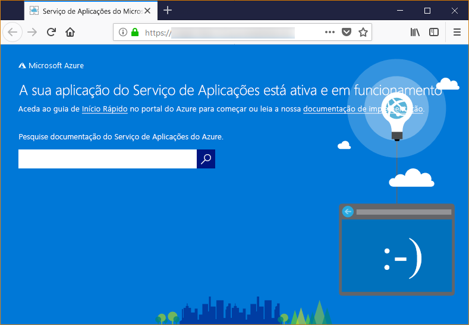

# <a name="configure-a-linux-python-app-for-azure-app-service"></a>Configure um aplicativo Linux Python para o Azure App Service

Este artigo descreve como o [Azure App Service](app-service-linux-intro.md) executa aplicações Python e como pode personalizar o comportamento do App Service quando necessário. As aplicações Python devem ser implantadas com todos os módulos de [pip](https://pypi.org/project/pip/) necessários.

O motor de implantação do Serviço de `pip install -r requirements.txt` Aplicações ativa automaticamente um ambiente virtual e funciona para si quando implementa um [repositório Git](../deploy-local-git.md?toc=%2fazure%2fapp-service%2fcontainers%2ftoc.json), ou um [pacote Zip](../deploy-zip.md?toc=%2fazure%2fapp-service%2fcontainers%2ftoc.json) com processos de construção ligados.

Este guia fornece conceitos e instruções fundamentais para os desenvolvedores de Python que usam um recipiente Linux incorporado no Serviço de Aplicações. Se nunca usou o Azure App Service, deve seguir primeiro o [Python quickstart](quickstart-python.md) e python com o [tutorial PostgreSQL.](tutorial-python-postgresql-app.md)

> [!NOTE]
> O Linux é atualmente a opção recomendada para executar aplicações Python no App Service. Para obter informações sobre a opção Windows, consulte [Python no sabor do Windows do App Service](https://docs.microsoft.com/visualstudio/python/managing-python-on-azure-app-service).
>

## <a name="show-python-version"></a>Ver a versão Python

Para mostrar a versão atual da Python, execute o seguinte comando na [Cloud Shell:](https://shell.azure.com)

```azurecli-interactive
az webapp config show --resource-group <resource-group-name> --name <app-name> --query linuxFxVersion
```

Para mostrar todas as versões Python suportadas, execute o seguinte comando na [Cloud Shell:](https://shell.azure.com)

```azurecli-interactive
az webapp list-runtimes --linux | grep PYTHON
```

Em vez disso, pode executar uma versão não suportada de Python construindo a sua própria imagem de contentor. Para mais informações, consulte [a utilização de uma imagem personalizada do Docker.](tutorial-custom-docker-image.md)

## <a name="set-python-version"></a>Definir versão Python

Executar o seguinte comando na [Cloud Shell](https://shell.azure.com) para definir a versão Python para 3.7:

```azurecli-interactive
az webapp config set --resource-group <resource-group-name> --name <app-name> --linux-fx-version "PYTHON|3.7"
```

## <a name="customize-build-automation"></a>Personalize a automatização de construção

Se implementar a sua aplicação utilizando pacotes Git ou zip com automatização de construção ligada, o Serviço de Aplicações constrói passos de automação através da seguinte sequência:

1. Executar script personalizado se `PRE_BUILD_SCRIPT_PATH`especificado por .
1. Execute `pip install -r requirements.txt`.
1. Se *manage.py* for encontrado na raiz do repositório, execute *manage.py coletas.* No entanto, `DISABLE_COLLECTSTATIC` `true`se for definido, este passo é ignorado.
1. Executar script personalizado se `POST_BUILD_SCRIPT_PATH`especificado por .

`PRE_BUILD_COMMAND`, `POST_BUILD_COMMAND`e `DISABLE_COLLECTSTATIC` são variáveis ambientais que são vazias por defeito. Para executar comandos pré-construção, defina `PRE_BUILD_COMMAND`. Para executar comandos pós-construção, defina `POST_BUILD_COMMAND`. Para desativar a recolha de corrente `DISABLE_COLLECTSTATIC=true`seletática ao construir aplicações Django, coloque .

O exemplo seguinte especifica as duas variáveis a uma série de comandos, separados por vírgulas.

```azurecli-interactive
az webapp config appsettings set --name <app-name> --resource-group <resource-group-name> --settings PRE_BUILD_COMMAND="echo foo, scripts/prebuild.sh"
az webapp config appsettings set --name <app-name> --resource-group <resource-group-name> --settings POST_BUILD_COMMAND="echo foo, scripts/postbuild.sh"
```

Para variáveis ambientais adicionais para personalizar a automatização de construção, consulte a [configuração oryx](https://github.com/microsoft/Oryx/blob/master/doc/configuration.md).

Para obter mais informações sobre como o App Service funciona e constrói aplicações Python em Linux, consulte [documentação oryx: como as aplicações Python são detetadas e construídas.](https://github.com/microsoft/Oryx/blob/master/doc/runtimes/python.md)

## <a name="container-characteristics"></a>Características do contentor

As aplicações Python implantadas para o App Service no Linux funcionam dentro de um contentor Docker que é definido no [repositório Do Serviço de Aplicações Python GitHub](https://github.com/Azure-App-Service/python). Pode encontrar as configurações de imagem dentro dos diretórios específicos da versão.

Este contentor tem as seguintes características:

- As aplicações são executadas com o [Servidor HTTP WSGI do Gunicorn](https://gunicorn.org/), com os argumentos adicionais `--bind=0.0.0.0 --timeout 600`.

- Por predefinição, a imagem base inclui a arquitetura Web Flask, mas o contentor suporta outras arquiteturas compatíveis com o WSGI e o Python 3.7, como o Django.

- Para instalar pacotes adicionais, como o Django, crie um ficheiro [*requirements.txt*](https://pip.pypa.io/en/stable/user_guide/#requirements-files) na raiz do projeto com `pip freeze > requirements.txt`. Em seguida, publique o projeto no Serviço de Aplicações com a implementação do Git, que executa automaticamente `pip install -r requirements.txt` no contentor para instalar as dependências da aplicação.

## <a name="container-startup-process"></a>Processo de arranque de contentores

Durante o arranque, o Serviço de Aplicações no contentor do Linux executa os seguintes passos:

1. Utilize um [comando de arranque personalizado,](#customize-startup-command)se fornecido.
2. Verifique a existência de uma [aplicação Django](#django-app)e lance o Gunicorn para a sua deteção se for detetada.
3. Verifique a existência de uma [aplicação Do Flask](#flask-app)e lance o Gunicorn para a sua deteção.
4. Não se for encontrada nenhuma outra aplicação, iniciar uma aplicação predefinida incorporada no contentor.

As secções seguintes fornecem detalhes adicionais para cada opção.

### <a name="django-app"></a>Aplicação Django

Para aplicações Django, o Serviço de Aplicações procura um ficheiro chamado `wsgi.py` no código da aplicação e, em seguida, executa o Gunicorn com o seguinte comando:

```bash
# <module> is the path to the folder that contains wsgi.py
gunicorn --bind=0.0.0.0 --timeout 600 <module>.wsgi
```

Se quiser um controlo mais específico sobre o comando de arranque, utilize um [comando de arranque personalizado](#customize-startup-command) e substitua `<module>` pelo nome do módulo que contém *wsgi.py*.

### <a name="flask-app"></a>Aplicação Flask

Para o Flask, o App Service procura um ficheiro chamado *application.py* ou *app.py* e inicia o Gunicorn da seguinte forma:

```bash
# If application.py
gunicorn --bind=0.0.0.0 --timeout 600 application:app
# If app.py
gunicorn --bind=0.0.0.0 --timeout 600 app:app
```

Se o módulo da aplicação principal estiver num ficheiro diferente, utilize outro nome para o objeto de aplicação ou se quiser fornecer argumentos adicionais para o Gunicorn, utilize um [comando de arranque personalizado](#customize-startup-command).

### <a name="default-behavior"></a>Comportamento predefinido

Se o Serviço de Aplicações não encontrar um comando personalizado, uma aplicação Django ou uma aplicação Flask, executa uma aplicação só de leitura predefinida, localizada na pasta _opt/defaultsite_. A aplicação predefinida é apresentada da seguinte forma:



## <a name="customize-startup-command"></a>Personalizar o comando de arranque

Pode controlar o comportamento de arranque do contentor ao fornecer um comando de arranque do Gunicorn personalizado. Para tal, executar o seguinte comando na [Cloud Shell:](https://shell.azure.com)

```azurecli-interactive
az webapp config set --resource-group <resource-group-name> --name <app-name> --startup-file "<custom-command>"
```

Por exemplo, se tiver uma aplicação *hello.py* Flask cujo módulo principal é hello.py `myapp`e o objeto de aplicação Flask nesse ficheiro for nomeado , então * \<* o comando personalizado>é o seguinte:

```bash
gunicorn --bind=0.0.0.0 --timeout 600 hello:myapp
```

Se o seu módulo principal estiver numa subpasta, como `website`, especifique essa pasta com o argumento `--chdir`:

```bash
gunicorn --bind=0.0.0.0 --timeout 600 --chdir website hello:myapp
```

Também pode adicionar quaisquer argumentos adicionais para gunicorn `--workers=4`para * \<>de comando personalizado, *tais como . Para obter mais informações, veja [Executar o Gunicorn](https://docs.gunicorn.org/en/stable/run.html) (docs.gunicorn.org).

Para utilizar um servidor não Gunicorn, como o [aiohttp,](https://aiohttp.readthedocs.io/en/stable/web_quickstart.html)pode substituir * \<>de comando personalizado* por algo assim:

```bash
python3.7 -m aiohttp.web -H localhost -P 8080 package.module:init_func
```

> [!Note]
> O Serviço de Aplicações ignora todos os erros ocorridos durante o processamento de um ficheiro de comando personalizado e continua o processo de arranque ao procurar as aplicações Django e Flask. Se não vir o comportamento esperado, verifique se o ficheiro de arranque está implementado no Serviço de Aplicações e não contém quaisquer erros.

## <a name="access-environment-variables"></a>Aceder a variáveis de ambiente

No Serviço de Aplicações, pode [definir as definições](../configure-common.md?toc=%2fazure%2fapp-service%2fcontainers%2ftoc.json#configure-app-settings) de aplicações fora do seu código de aplicações. Depois pode acessá-los usando o padrão [os.environ](https://docs.python.org/3/library/os.html#os.environ) padrão. Por exemplo, para aceder `WEBSITE_SITE_NAME`a uma definição de aplicação chamada , use o seguinte código:

```python
os.environ['WEBSITE_SITE_NAME']
```

## <a name="detect-https-session"></a>Detetar sessão HTTPS

No Serviço de Aplicações, a rescisão do [SSL](https://wikipedia.org/wiki/TLS_termination_proxy) ocorre nos equilibradores de carga da rede, pelo que todos os pedidos HTTPS chegam à sua aplicação como pedidos HTTP não encriptados. Se a lógica da sua aplicação necessitar de verificar se `X-Forwarded-Proto` os pedidos do utilizador estão encriptados ou não, inspecione o cabeçalho.

```python
if 'X-Forwarded-Proto' in request.headers and request.headers['X-Forwarded-Proto'] == 'https':
# Do something when HTTPS is used
```

Os quadros web populares permitem-lhe aceder à `X-Forwarded-*` informação no padrão padrão da sua aplicação. No [CodeIgniter,](https://codeigniter.com/)o [is_https()](https://github.com/bcit-ci/CodeIgniter/blob/master/system/core/Common.php#L338-L365) `X_FORWARDED_PROTO` verifica o valor por defeito.

## <a name="access-diagnostic-logs"></a>Aceder aos registos de diagnósticos

[!INCLUDE [Access diagnostic logs](../../../includes/app-service-web-logs-access-no-h.md)]

## <a name="open-ssh-session-in-browser"></a>Abra a sessão sSH no navegador

[!INCLUDE [Open SSH session in browser](../../../includes/app-service-web-ssh-connect-builtin-no-h.md)]

## <a name="troubleshooting"></a>Resolução de problemas

- **Vê a aplicação predefinida depois de implementar o seu próprio código de aplicação.** A aplicação padrão aparece porque ou não implementou o seu código de aplicação para o App Service, ou o Serviço de Aplicações não encontrou o código da aplicação e executou a aplicação predefinida.
- Reinicie o Serviço de Aplicações, aguarde 15 a 20 segundos e verifique novamente a aplicação.
- Certifique-se de que está a utilizar o Serviço de Aplicações para Linux, em vez de uma instância baseada no Windows. A partir da CLI do Azure, execute o comando `az webapp show --resource-group <resource_group_name> --name <app_service_name> --query kind`, ao substituir `<resource_group_name>` e `<app_service_name>`, respetivamente. Deverá ver `app,linux` como resultado; caso contrário, recrie o Serviço de Aplicações e escolha o Linux.
- Utilize o SSH ou a consola Kudu para ligar diretamente ao Serviço de Aplicações e verifique se os ficheiros existem em *site/wwwroot*. Se os ficheiros não existirem, reveja o processo de implementação e volte a implementar a aplicação.
- Se os ficheiros existirem, o Serviço de Aplicações não conseguiu identificar o ficheiro de arranque específico. Verifique se a aplicação está estruturada como Serviço de Aplicações para o [Django](#django-app) ou o [Flask](#flask-app), ou utilize um [comando de arranque personalizado](#customize-startup-command).
- **Vê a mensagem "Serviço Indisponível" no browser.** O browser esgotou o tempo limite ao aguardar uma resposta do Serviço de Aplicações, o que indica que o Serviço de Aplicações iniciou o servidor do Gunicorn, mas os argumentos que especificam o código da aplicação estão incorretos.
- Atualize o browser, especialmente se estiver a utilizar os escalões de preços mais baixos no seu Plano do Serviço de Aplicações. A aplicação poderá demorar mais tempo a iniciar quando utilizar, por exemplo, escalões gratuitos e responde depois de atualizar o browser.
- Verifique se a aplicação está estruturada como Serviço de Aplicações para o [Django](#django-app) ou o [Flask](#flask-app), ou utilize um [comando de arranque personalizado](#customize-startup-command).
- [Aceda ao fluxo de registos](#access-diagnostic-logs).

## <a name="next-steps"></a>Passos seguintes

> [!div class="nextstepaction"]
> [Tutorial: App Python com PostgreSQL](tutorial-python-postgresql-app.md)

> [!div class="nextstepaction"]
> [Tutorial: Implantação do repositório de contentores privados](tutorial-custom-docker-image.md)

> [!div class="nextstepaction"]
> [Serviço de aplicações Linux FAQ](app-service-linux-faq.md)
