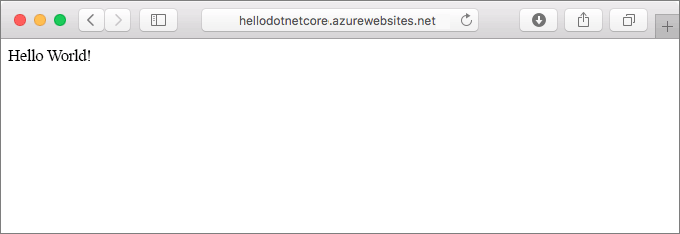
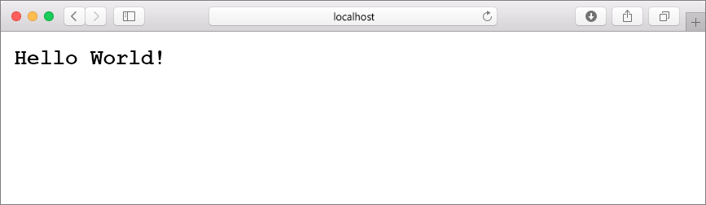
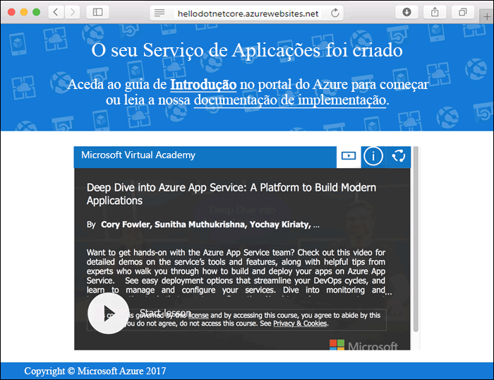
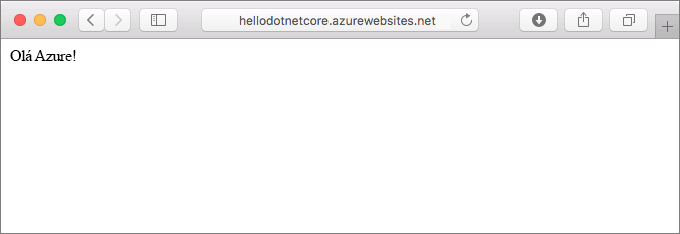
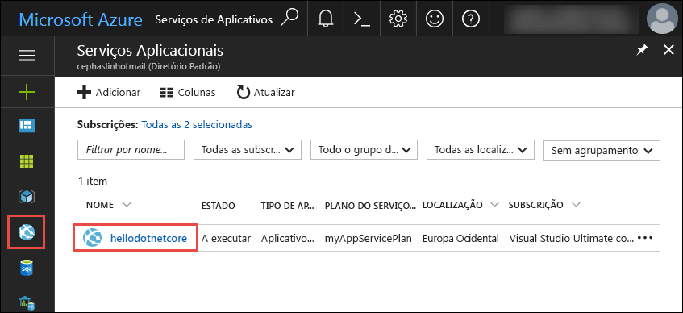
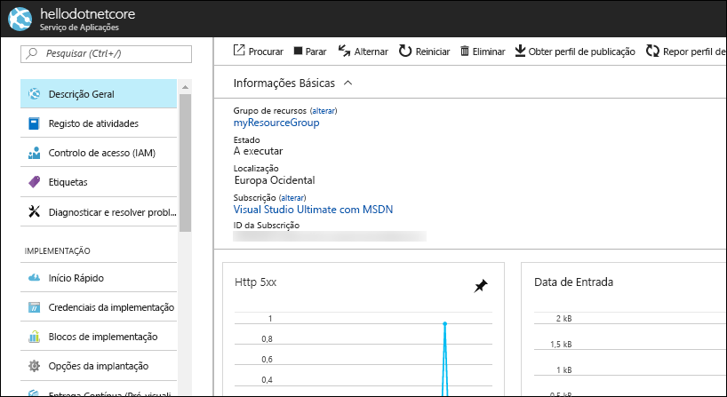

# <a name="create-an-aspnet-core-app-in-app-service-on-linux"></a>Crie uma aplicação ASP.NET Core no App Service no Linux

> [!NOTE]
> Este artigo implementa uma aplicação para o Serviço de Aplicações no Linux. Para ser implementado no Serviço de Aplicações no _Windows,_ consulte [Criar uma aplicação ASP.NET Core no Azure](../app-service-web-get-started-dotnet.md).
>

[O Serviço de Aplicações no Linux](app-service-linux-intro.md) fornece um serviço de hospedagem web altamente escalável e auto-remendado utilizando o sistema operativo Linux. Este guia de introdução mostra como criar uma aplicação [.NET Core](https://docs.microsoft.com/aspnet/core/) no Serviço de Aplicações no Linux. Cria a aplicação utilizando o [Azure CLI,](https://docs.microsoft.com/cli/azure/get-started-with-azure-cli)e utiliza o Git para implementar o código .NET Core para a aplicação.



Pode seguir os passos deste artigo num computador Mac, Windows ou Linux.

[!INCLUDE [quickstarts-free-trial-note](../../../includes/quickstarts-free-trial-note.md)]

## <a name="prerequisites"></a>Pré-requisitos

Para concluir este guia de início rápido:

* <a href="https://git-scm.com/" target="_blank">Instalar o Git</a>
* <a href="https://www.microsoft.com/net/core/" target="_blank">Instalar .NET Core</a>

## <a name="create-the-app-locally"></a>Criou a aplicação localmente

Numa janela de terminal no seu computador, crie um diretório com o nome `hellodotnetcore` e altere o diretório atual para o mesmo.

```bash
mkdir hellodotnetcore
cd hellodotnetcore
```

Crie uma nova aplicação .NET Core.

```bash
dotnet new web
```

## <a name="run-the-app-locally"></a>Executar a aplicação localmente

Execute a aplicação localmente, para ver que aspeto deveria ter quando a implemente no Azure. 

Restaure os pacotes NuGet e execute a aplicação.

```bash
dotnet run
```

Abra um browser e navegue para a aplicação em `http://localhost:5000`.

Pode ver a mensagem **Hello World** da aplicação de exemplo apresentada na página.



Na janela do terminal, prima **Ctrl+C** para sair do servidor Web. Inicialize um repositório de Git para o projeto .NET Core.

```bash
git init
git add .
git commit -m "first commit"
```

[!INCLUDE [cloud-shell-try-it.md](../../../includes/cloud-shell-try-it.md)]

[!INCLUDE [Configure deployment user](../../../includes/configure-deployment-user.md)]

[!INCLUDE [Create resource group](../../../includes/app-service-web-create-resource-group-linux.md)]

[!INCLUDE [Create app service plan](../../../includes/app-service-web-create-app-service-plan-linux.md)]

## <a name="create-a-web-app"></a>Criar uma aplicação Web

[!INCLUDE [Create web app](../../../includes/app-service-web-create-web-app-dotnetcore-linux-no-h.md)]

Navegue na sua aplicação recém-criada. Substitua o _ &lt;>de nome da aplicação_ com o nome da sua aplicação.

```bash
http://<app-name>.azurewebsites.net
```

Aqui está o aspeto da sua nova aplicação:



[!INCLUDE [Push to Azure](../../../includes/app-service-web-git-push-to-azure.md)] 

```bash
Counting objects: 22, done.
Delta compression using up to 8 threads.
Compressing objects: 100% (18/18), done.
Writing objects: 100% (22/22), 51.21 KiB | 3.94 MiB/s, done.
Total 22 (delta 1), reused 0 (delta 0)
remote: Updating branch 'master'.
remote: Updating submodules.
remote: Preparing deployment for commit id '741f16d1db'.
remote: Generating deployment script.
remote: Project file path: ./hellodotnetcore.csproj
remote: Generated deployment script files
remote: Running deployment command...
remote: Handling ASP.NET Core Web Application deployment.
remote: ...............................................................................................
remote:   Restoring packages for /home/site/repository/hellodotnetcore.csproj...
remote: ....................................
remote:   Installing System.Xml.XPath 4.0.1.
remote:   Installing System.Diagnostics.Tracing 4.1.0.
remote:   Installing System.Threading.Tasks.Extensions 4.0.0.
remote:   Installing System.Reflection.Emit.ILGeneration 4.0.1.
remote:   ...
remote: Finished successfully.
remote: Running post deployment command(s)...
remote: Deployment successful.
To https://<app-name>.scm.azurewebsites.net/<app-name>.git
 * [new branch]      master -> master
```

## <a name="browse-to-the-app"></a>Navegar para a aplicação

Utilize o browser para navegar para a aplicação implementada.

```bash
http://<app_name>.azurewebsites.net
```

O código de amostra .NET Core está a ser recorrido no Serviço de Aplicações em Linux com uma imagem incorporada.


**Parabéns!** Implementou a sua primeira aplicação .NET Core no Serviço de Aplicações no Linux.

## <a name="update-and-redeploy-the-code"></a>Atualizar e voltar a implementar o código

No diretório local, abra o ficheiro _Startup.cs_. Faça uma pequena alteração no texto da chamada de método `context.Response.WriteAsync`:

```csharp
await context.Response.WriteAsync("Hello Azure!");
```

Consolide as suas alterações no Git e envie as alterações ao código para o Azure.

```bash
git commit -am "updated output"
git push azure master
```

Uma vez concluída a implementação, volte para a janela do navegador que se abriu na **Navegação até ao** passo da aplicação e acerte a atualização.



## <a name="manage-your-new-azure-app"></a>Gerencie a sua nova app Azure

Vá ao <a href="https://portal.azure.com" target="_blank">portal Azure</a> para gerir a app que criou.

A partir do menu esquerdo, clique em **Serviços de Aplicações**e, em seguida, clique no nome da sua aplicação Azure.



Veja a página de visão geral da sua aplicação. Aqui, pode realizar tarefas de gestão básicas, como navegar, parar, iniciar, reiniciar e eliminar. 



O menu à esquerda fornece diferentes páginas para configurar a sua aplicação. 

[!INCLUDE [cli-samples-clean-up](../../../includes/cli-samples-clean-up.md)]

## <a name="next-steps"></a>Passos seguintes

> [!div class="nextstepaction"]
> [Tutorial: ASP.NET aplicação Core com Base de Dados SQL](tutorial-dotnetcore-sqldb-app.md)

> [!div class="nextstepaction"]
> [Configure ASP.NET core app](configure-language-dotnetcore.md)
