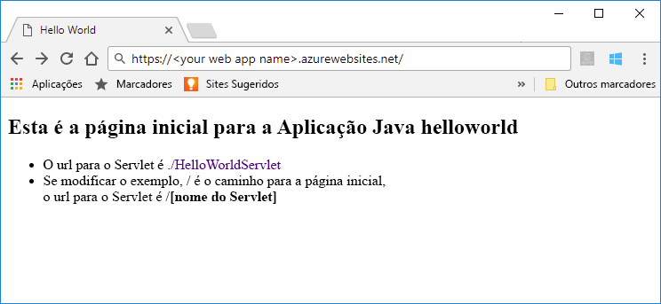

# <a name="quickstart-create-a-java-app-on-azure-app-service-on-linux"></a>Início rápido: Criar um aplicativo Java no serviço de Azure App no Linux

O [Serviço de Aplicações no Linux](app-service-linux-intro.md) oferece um serviço de alojamento na Web altamente dimensionável e com aplicação de patches automática através do sistema operativo Linux. Este guia de início rápido mostra como usar o [CLI do Azure](https://docs.microsoft.com/cli/azure/get-started-with-azure-cli) com o [plug-in do Maven para Azure app Service](https://github.com/Microsoft/azure-maven-plugins/tree/develop/azure-webapp-maven-plugin) para implantar um arquivo War (Java Web Archive) no sistema operacional Linux.

> [!NOTE]
>
> A mesma coisa também pode ser feita usando IDEs populares, como o IntelliJ e o eclipse. Confira nossos documentos semelhantes em [Azure Toolkit for IntelliJ início rápido](/java/azure/intellij/azure-toolkit-for-intellij-create-hello-world-web-app) ou [Azure Toolkit for Eclipse início rápido](/java/azure/eclipse/azure-toolkit-for-eclipse-create-hello-world-web-app).
>


[!INCLUDE [quickstarts-free-trial-note](../../../includes/quickstarts-free-trial-note.md)]

[!INCLUDE [cloud-shell-try-it.md](../../../includes/cloud-shell-try-it.md)]

## <a name="create-a-java-app"></a>Criar uma aplicação em Java

Execute o seguinte comando do Maven no prompt de Cloud Shell para criar um novo aplicativo `helloworld`chamado:

```bash
mvn archetype:generate -DgroupId=example.demo -DartifactId=helloworld -DarchetypeArtifactId=maven-archetype-webapp
```

## <a name="configure-the-maven-plugin"></a>Configurar o plug-in do Maven

Para implementar a partir do Maven, utilize o editor de código no Cloud Shell para abrir o ficheiro do projeto `pom.xml` no diretório `helloworld`. 

```bash
code pom.xml
```

Em seguida, adicione a seguinte definição de plug-in dentro do elemento `<build>` do ficheiro `pom.xml`.

```xml
<plugins>
    <!--*************************************************-->
    <!-- Deploy to Tomcat in App Service Linux           -->
    <!--*************************************************-->
    <plugin>
        <groupId>com.microsoft.azure</groupId>
        <artifactId>azure-webapp-maven-plugin</artifactId>
        <version>1.7.0</version>
        <configuration>
            <!-- Specify v2 schema -->
            <schemaVersion>v2</schemaVersion>
            <!-- App information -->
            <resourceGroup>RESOURCEGROUP_NAME</resourceGroup>
            <appName>WEBAPP_NAME</appName>
            <region>REGION</region>
   
            <!-- Java Runtime Stack for App on Linux-->
            <runtime>
                <os>linux</os>
                <javaVersion>jre8</javaVersion>
                <webContainer>tomcat 8.5</webContainer>
            </runtime> 
            <deployment>
                <resources>
                    <resource>
                        <directory>${project.basedir}/target</directory>
                        <includes>
                            <include>*.war</include>
                        </includes>
                    </resource>
                </resources>
            </deployment>
        </configuration>
    </plugin>
</plugins>
```

O processo de implantação para Azure App serviço usa credenciais de conta do CLI do Azure. [Entre com o CLI do Azure antes de](/cli/azure/authenticate-azure-cli?view=azure-cli-latest) continuar.

```azurecli
az login
```

Em seguida, você pode configurar a implantação, executar o `mvn azure-webapp:config` comando Maven no prompt de comando e usar as configurações padrão pressionando **Enter** até obter o prompt **confirmar (Y/N)** e pressionar **' Y '** e a configuração for concluída .

```cmd
~@Azure:~/helloworld$ mvn azure-webapp:config
[INFO] Scanning for projects...
[INFO]
[INFO] ----------------------< example.demo:helloworld >-----------------------
[INFO] Building helloworld Maven Webapp 1.0-SNAPSHOT
[INFO] --------------------------------[ war ]---------------------------------
[INFO]
[INFO] --- azure-webapp-maven-plugin:1.7.0:config (default-cli) @ helloworld ---
[WARNING] The plugin may not work if you change the os of an existing webapp.
Define value for OS(Default: Linux):
1. linux [*]
2. windows
3. docker
Enter index to use:
Define value for javaVersion(Default: jre8):
1. jre8 [*]
2. java11
Enter index to use:
Define value for runtimeStack(Default: TOMCAT 8.5):
1. TOMCAT 9.0
2. jre8
3. TOMCAT 8.5 [*]
4. WILDFLY 14
Enter index to use:
Please confirm webapp properties
AppName : helloworld-1558400876966
ResourceGroup : helloworld-1558400876966-rg
Region : westeurope
PricingTier : Premium_P1V2
OS : Linux
RuntimeStack : TOMCAT 8.5-jre8
Deploy to slot : false
Confirm (Y/N)? : Y
```

> [!NOTE]
> Neste artigo, estamos a trabalhar apenas com aplicações Java em pacotes de ficheiros WAR. O plug-in também suporta aplicações Web JAR, visite [Implementar um ficheiro JAR do Java SE no Serviço de Aplicações no Linux](https://docs.microsoft.com/java/azure/spring-framework/deploy-spring-boot-java-app-with-maven-plugin?toc=%2fazure%2fapp-service%2fcontainers%2ftoc.json) para experimentar.

Navegue para `pom.xml` novamente para ver se a configuração do plug-in está atualizada, você pode modificar outras configurações do serviço de aplicativo diretamente em seu arquivo POM, se necessário, algumas comuns estão listadas abaixo:

 Propriedade | Requerido | Descrição | Version
---|---|---|---
`<schemaVersion>` | false | Especifique a versão do esquema de configuração. Os valores com suporte `v1`são `v2`:,. | 1.5.2
`<resourceGroup>` | true | Grupo de recursos do Azure para seu aplicativo Web. | 0.1.0 +
`<appName>` | true | O nome do seu aplicativo Web. | 0.1.0 +
[`<region>`](/java/api/overview/azure/maven/azure-webapp-maven-plugin/readme#region) | true | Especifica a região em que seu aplicativo Web será hospedado; o valor padrão é **westus**. Todas as regiões válidas na seção de [regiões com suporte](/java/api/overview/azure/maven/azure-webapp-maven-plugin/readme#region) . | 0.1.0 +
[`<pricingTier>`](/java/api/overview/azure/maven/azure-webapp-maven-plugin/readme##pricingtier) | false | O tipo de preço para seu aplicativo Web. O valor padrão é **P1V2**.| 0.1.0 +
[`<runtime>`](/java/api/overview/azure/maven/azure-webapp-maven-plugin/readme#runtimesetting) | true | A configuração do ambiente de tempo de execução, você pode ver os detalhes [aqui](/java/api/overview/azure/maven/azure-webapp-maven-plugin/readme#runtimesetting). | 0.1.0 +
[`<deployment>`](/java/api/overview/azure/maven/azure-webapp-maven-plugin/readme#deploymentsetting) | true | A configuração de implantação, você pode ver os detalhes [aqui](/java/api/overview/azure/maven/azure-webapp-maven-plugin/readme#deploymentsetting). | 0.1.0 +

## <a name="deploy-the-app"></a>Implementar a aplicação

Implemente a sua aplicação Java no Azure com o seguinte comando:

```bash
mvn package azure-webapp:deploy
```

Uma vez concluída a implementação, navegue para a aplicação implementada com o seguinte URL no seu browser, por exemplo `http://<webapp>.azurewebsites.net`. 


**Parabéns!** Implementou a sua primeira aplicação Java no Serviço de Aplicações no Linux.

## <a name="clean-up-resources"></a>Limpar recursos

Nos passos anteriores, criou os recursos do Azure num grupo de recursos. Se achar que não vai precisar destes recursos no futuro, execute o seguinte comando no Cloud Shell para eliminar o grupo de recursos:

```azurecli-interactive
az group delete --name <your resource group name; for example: helloworld-1558400876966-rg> --yes
```

Este comando pode demorar alguns minutos a ser executado.

## <a name="next-steps"></a>Passos Seguintes

> [!div class="nextstepaction"]
> [Tutorial: Aplicativo empresarial Java com PostgreSQL](tutorial-java-enterprise-postgresql-app.md)

> [!div class="nextstepaction"]
> [Configurar aplicativo Java](configure-custom-container.md)

> [!div class="nextstepaction"]
> [CI/CD com Jenkins](/azure/jenkins/deploy-jenkins-app-service-plugin)

> [!div class="nextstepaction"]
> [Outros recursos do Azure para desenvolvedores de Java](/java/azure/)
