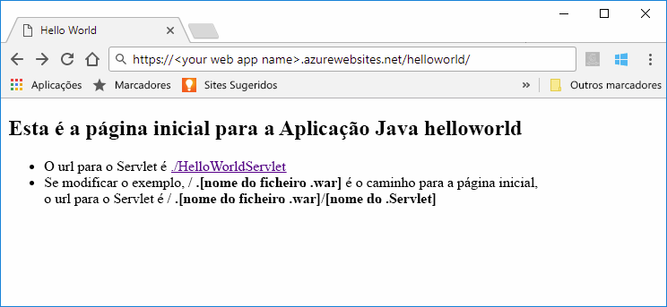

# <a name="quickstart-create-a-java-app-in-app-service-on-linux"></a>Início rápido: Criar uma aplicação Java no serviço de aplicações no Linux

O [Serviço de Aplicações no Linux](app-service-linux-intro.md) oferece um serviço de alojamento na Web altamente dimensionável e com aplicação de patches automática através do sistema operativo Linux. Este início rápido mostra como utilizar o [CLI do Azure](https://docs.microsoft.com/cli/azure/get-started-with-azure-cli) com o [Plug-in do Maven para serviço de aplicações do Azure](https://github.com/Microsoft/azure-maven-plugins/tree/develop/azure-webapp-maven-plugin) para implementar um ficheiro de arquivo (WAR) de web de Java.
> [!NOTE]
>
> Também pode ser feita a mesma coisa com IDEs populares, como o IntelliJ e Eclipse. Confira nossos documentos semelhante às [Azure Toolkit para IntelliJ guia de introdução](/java/azure/intellij/azure-toolkit-for-intellij-create-hello-world-web-app) ou [Azure Toolkit para Eclipse guia de introdução](/java/azure/eclipse/azure-toolkit-for-eclipse-create-hello-world-web-app).
>


[!INCLUDE [quickstarts-free-trial-note](../../../includes/quickstarts-free-trial-note.md)]

[!INCLUDE [cloud-shell-try-it.md](../../../includes/cloud-shell-try-it.md)]

## <a name="create-a-java-app"></a>Criar uma aplicação em Java

Execute o seguinte comando Maven na linha de comandos Cloud Shell para criar uma nova aplicação com o nome `helloworld`:

```bash
mvn archetype:generate -DgroupId=example.demo -DartifactId=helloworld -DarchetypeArtifactId=maven-archetype-webapp
```

## <a name="configure-the-maven-plugin"></a>Configurar o plug-in do Maven

Para implementar a partir do Maven, utilize o editor de código no Cloud Shell para abrir o ficheiro do projeto `pom.xml` no diretório `helloworld`. 

```bash
code pom.xml
```

Em seguida, adicione a seguinte definição de plug-in dentro do elemento `<build>` do ficheiro `pom.xml`.

```xml
<plugins>
    <!--*************************************************-->
    <!-- Deploy to Tomcat in App Service Linux           -->
    <!--*************************************************-->
    <plugin>
        <groupId>com.microsoft.azure</groupId>
        <artifactId>azure-webapp-maven-plugin</artifactId>
        <version>1.5.4</version>
        <configuration>
            <!-- Specify v2 schema -->
            <schemaVersion>v2</schemaVersion>
            <!-- App information -->
            <subscriptionId>${SUBSCRIPTION_ID}</subscriptionId>
            <resourceGroup>${RESOURCEGROUP_NAME}</resourceGroup>
            <appName>${WEBAPP_NAME}</appName>
            <region>${REGION}</region>
   
            <!-- Java Runtime Stack for App on Linux-->
            <runtime>
                <os>linux</os>
                <javaVersion>jre8</javaVersion>
                <webContainer>tomcat 8.5</webContainer>
            </runtime> 
            <deployment>
                <resources>
                    <resource>
                        <directory>${project.basedir}/target</directory>
                        <includes>
                            <include>*.war</include>
                        </includes>
                    </resource>
                </resources>
            </deployment>
        </configuration>
    </plugin>
</plugins>
```    


> [!NOTE] 
> Neste artigo, estamos a trabalhar apenas com aplicações Java em pacotes de ficheiros WAR. O plug-in também suporta aplicações Web JAR, visite [Implementar um ficheiro JAR do Java SE no Serviço de Aplicações no Linux](https://docs.microsoft.com/java/azure/spring-framework/deploy-spring-boot-java-app-with-maven-plugin?toc=%2fazure%2fapp-service%2fcontainers%2ftoc.json) para experimentar.


Atualize os seguintes marcadores de posição na configuração do plug-in:

| Marcador de posição | Descrição |
| ----------- | ----------- |
| `SUBSCRIPTION_ID` | O ID exclusivo da subscrição que pretende implementar a sua aplicação. ID de subscrição de predefinida pode ser encontrado do Cloud Shell ou a CLI com o `az account show` comando. Para todas as subscrições disponíveis, utilize o `az account list` comando.|
| `RESOURCEGROUP_NAME` | Nome do novo grupo de recursos no qual pretende criar a sua aplicação. Ao colocar todos os recursos de uma aplicação num grupo, pode geri-los em conjunto. Por exemplo, eliminar o grupo de recursos eliminará todos os recursos associados à aplicação. Atualize este valor com um nome exclusivo do novo grupo de recursos, como, por exemplo, *TestResources*. Irá utilizar este nome de grupo de recursos para limpar todos os recursos do Azure numa secção posterior. |
| `WEBAPP_NAME` | O nome da aplicação vai fazer parte do nome de anfitrião para a aplicação quando implementada no Azure (WEBAPP_NAME.azurewebsites.net). Atualizar este valor com um nome exclusivo para a nova aplicação de serviço de aplicações, que irá alojar a aplicação de Java, por exemplo *contoso*. |
| `REGION` | Uma região do Azure onde a aplicação está alojada, por exemplo `westus2`. Pode obter uma lista de regiões do Cloud Shell ou da CLI com o comando `az account list-locations`. |

## <a name="deploy-the-app"></a>Implementar a aplicação

Implemente a sua aplicação Java no Azure com o seguinte comando:

```bash
mvn package azure-webapp:deploy
```

Uma vez concluída a implementação, navegue para a aplicação implementada com o seguinte URL no seu browser, por exemplo `http://<webapp>.azurewebsites.net/helloworld`. 



**Parabéns!** Implementou a sua primeira aplicação Java no Serviço de Aplicações no Linux.

[!INCLUDE [cli-samples-clean-up](../../../includes/cli-samples-clean-up.md)]

## <a name="next-steps"></a>Passos Seguintes

> [!div class="nextstepaction"]
> [Tutorial: Aplicação empresarial de Java com PostgreSQL](tutorial-java-enterprise-postgresql-app.md)

> [!div class="nextstepaction"]
> [Configurar a aplicação de Java](configure-custom-container.md)

> [!div class="nextstepaction"]
> [CI/CD com Jenkins](/azure/jenkins/deploy-jenkins-app-service-plugin)

> [!div class="nextstepaction"]
> [Outro Azure para recursos de que os desenvolvedores de Java](/java/azure/)
