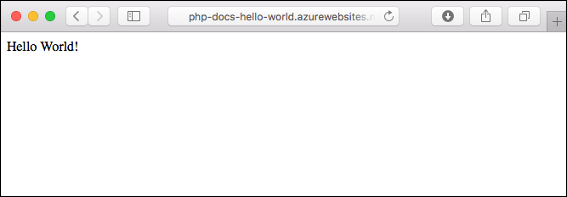
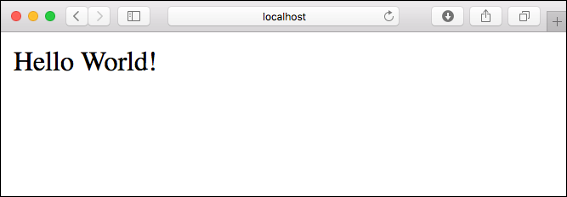
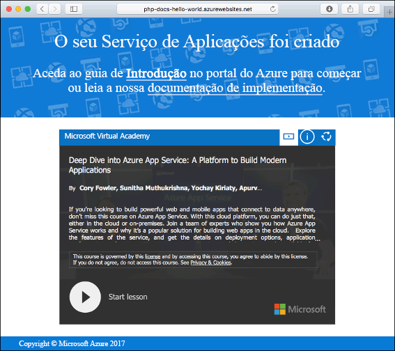
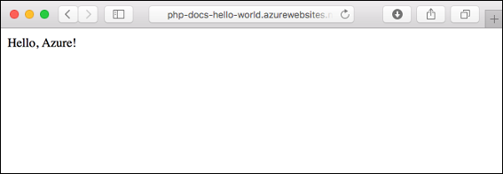
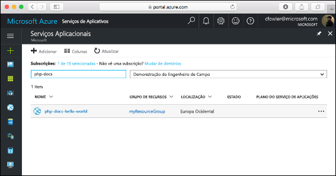
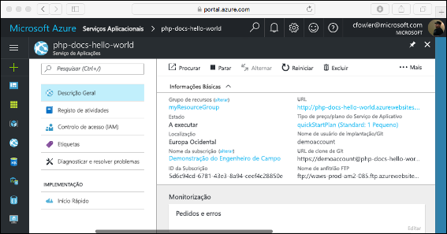

# <a name="create-a-php-app-in-app-service-on-linux"></a>Crie uma app PHP no App Service no Linux

> [!NOTE]
> Este artigo implementa uma aplicação para o Serviço de Aplicações no Linux. Para implementar no Serviço de Aplicações no _Windows,_ consulte [Criar uma aplicação PHP no Azure](../app-service-web-get-started-php.md).
>

[O Serviço de Aplicações no Linux](app-service-linux-intro.md) fornece um serviço de hospedagem web altamente escalável e auto-remendado utilizando o sistema operativo Linux. Este tutorial de arranque rápido mostra como implementar uma aplicação PHP para o Azure App Service no Linux usando a [Cloud Shell](https://docs.microsoft.com/azure/cloud-shell/overview).



Pode seguir os passos deste artigo num computador Mac, Windows ou Linux.

[!INCLUDE [quickstarts-free-trial-note](../../../includes/quickstarts-free-trial-note.md)]

## <a name="prerequisites"></a>Pré-requisitos

Para concluir este guia de início rápido:

* <a href="https://git-scm.com/" target="_blank">Instalar o Git</a>
* <a href="https://php.net" target="_blank">Instalar PHP</a>

## <a name="download-the-sample"></a>Transferir o exemplo

Numa janela do terminal, execute os seguintes comandos para clonar o exemplo de aplicação no seu computador local e é navegue para o diretório que contém o código de exemplo.

```bash
git clone https://github.com/Azure-Samples/php-docs-hello-world
cd php-docs-hello-world
```

## <a name="run-the-app-locally"></a>Executar a aplicação localmente

Execute a aplicação localmente, para ver que aspeto deveria ter quando a implemente no Azure. Abra uma janela do terminal e use o comando `php` para iniciar o servidor Web PHP incorporado.

```bash
php -S localhost:8080
```

Abra um browser e navegue para a aplicação de exemplo em `http://localhost:8080`.

Pode ver a mensagem **Olá, mundo!** da aplicação de exemplo apresentada na página.



Na janela do terminal, prima **Ctrl+C** para sair do servidor Web.

[!INCLUDE [cloud-shell-try-it.md](../../../includes/cloud-shell-try-it.md)]

[!INCLUDE [Configure deployment user](../../../includes/configure-deployment-user.md)]

[!INCLUDE [Create resource group](../../../includes/app-service-web-create-resource-group-linux.md)]

[!INCLUDE [Create app service plan](../../../includes/app-service-web-create-app-service-plan-linux.md)]

## <a name="create-a-web-app"></a>Criar uma aplicação Web

[!INCLUDE [Create web app](../../../includes/app-service-web-create-web-app-php-linux-no-h.md)] 

Navegue no site para ver a sua aplicação recém-criada com imagem incorporada. Substitua o _ &lt;nome da aplicação>_ pelo nome da sua aplicação.

```bash
http://<app_name>.azurewebsites.net
```

Aqui está o aspeto da sua nova aplicação:



[!INCLUDE [Push to Azure](../../../includes/app-service-web-git-push-to-azure.md)] 

```bash
Counting objects: 2, done.
Delta compression using up to 4 threads.
Compressing objects: 100% (2/2), done.
Writing objects: 100% (2/2), 352 bytes | 0 bytes/s, done.
Total 2 (delta 1), reused 0 (delta 0)
remote: Updating branch 'master'.
remote: Updating submodules.
remote: Preparing deployment for commit id '25f18051e9'.
remote: Generating deployment script.
remote: Running deployment command...
remote: Handling Basic Web Site deployment.
remote: Kudu sync from: '/home/site/repository' to: '/home/site/wwwroot'
remote: Copying file: '.gitignore'
remote: Copying file: 'LICENSE'
remote: Copying file: 'README.md'
remote: Copying file: 'index.php'
remote: Ignoring: .git
remote: Finished successfully.
remote: Running post deployment command(s)...
remote: Deployment successful.
To https://<app_name>.scm.azurewebsites.net/<app_name>.git
   cc39b1e..25f1805  master -> master
```

## <a name="browse-to-the-app"></a>Navegar para a aplicação

Utilize o browser para navegar para a aplicação implementada.

```bash
http://<app_name>.azurewebsites.net
```

O código de amostra PHP está em execução no Serviço de Aplicações em Linux com imagem incorporada.


**Parabéns!** Implementou a sua primeira aplicação PHP no Serviço de Aplicações no Linux.

## <a name="update-locally-and-redeploy-the-code"></a>Atualizar localmente e reimplementar o código

No diretório local, abra o ficheiro `index.php` na aplicação PHP e faça uma pequena alteração ao texto na cadeia junto a `echo`:

```php
echo "Hello Azure!";
```

Consolide as suas alterações no Git e envie as alterações ao código para o Azure.

```bash
git commit -am "updated output"
git push azure master
```

Depois de concluída a implementação, volte para a janela do browser aberta que abriu no passo **Navegar para a aplicação** e atualize a página.



## <a name="manage-your-new-azure-app"></a>Gerencie a sua nova app Azure

Vá ao <a href="https://portal.azure.com" target="_blank">portal Azure</a> para gerir a app que criou.

A partir do menu esquerdo, clique em **Serviços de Aplicações**e, em seguida, clique no nome da sua aplicação Azure.



Veja a página de visão geral da sua aplicação. Aqui, pode realizar tarefas de gestão básicas, como navegar, parar, iniciar, reiniciar e eliminar.



O menu à esquerda fornece diferentes páginas para configurar a sua aplicação. 

[!INCLUDE [cli-samples-clean-up](../../../includes/cli-samples-clean-up.md)]

## <a name="next-steps"></a>Passos seguintes

> [!div class="nextstepaction"]
> [Tutorial: app PHP com MySQL](tutorial-php-mysql-app.md)

> [!div class="nextstepaction"]
> [Configure app PHP](configure-language-php.md)
