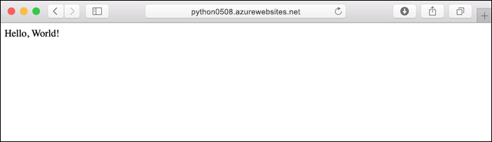
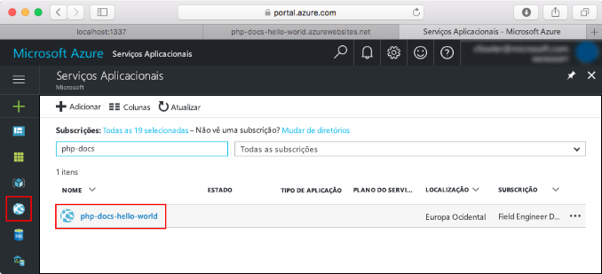
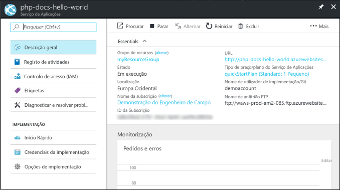

# <a name="create-a-python-app-in-azure-app-service-on-linux"></a>Criar um aplicativo Python no serviço de Azure App no Linux

Neste guia de início rápido, você implanta um aplicativo Python simples [no serviço de aplicativo no Linux](app-service-linux-intro.md), que fornece um serviço de hospedagem na Web altamente escalonável e com aplicação de patch automática. Use a interface de linha de comando do Azure (o [CLI do Azure](/cli/azure/install-azure-cli)) por meio do Azure cloud shell interativo baseado em navegador, para que você possa seguir as etapas usar um computador Mac, Linux ou Windows.



[!INCLUDE [quickstarts-free-trial-note](../../../includes/quickstarts-free-trial-note.md)]

[!INCLUDE [cloud-shell-try-it.md](../../../includes/cloud-shell-try-it.md)]

## <a name="download-the-sample"></a>Transferir o exemplo

No Cloud Shell, crie um diretório de início rápido e, em seguida, altere-o.

```bash
mkdir quickstart

cd $HOME/quickstart
```

Em seguida, execute o seguinte comando para clonar o repositório da aplicação de exemplo para o seu diretório de início rápido.

```bash
git clone https://github.com/Azure-Samples/python-docs-hello-world
```

Ao executar, apresenta informações semelhantes ao exemplo seguinte:

```bash
Cloning into 'python-docs-hello-world'...
remote: Enumerating objects: 43, done.
remote: Total 43 (delta 0), reused 0 (delta 0), pack-reused 43
Unpacking objects: 100% (43/43), done.
Checking connectivity... done.
```

## <a name="create-a-web-app"></a>Criar uma aplicação Web

Mude para o diretório que contém o código de exemplo e execute o comando `az webapp up`.

No exemplo a seguir, substitua *\<app_name>* com um nome de aplicação globalmente exclusivo (os carateres válidos são `a-z`, `0-9` e `-`).

```bash
cd python-docs-hello-world

az webapp up -n <app_name>
```

Este comando pode demorar alguns minutos a ser executado. Ao executar, apresenta informações semelhantes ao exemplo seguinte:

```json
The behavior of this command has been altered by the following extension: webapp
Creating Resource group 'appsvc_rg_Linux_CentralUS' ...
Resource group creation complete
Creating App service plan 'appsvc_asp_Linux_CentralUS' ...
App service plan creation complete
Creating app '<app_name>' ....
Webapp creation complete
Creating zip with contents of dir /home/username/quickstart/python-docs-hello-world ...
Preparing to deploy contents to app.
All done.
{
  "app_url": "https:/<app_name>.azurewebsites.net",
  "location": "Central US",
  "name": "<app_name>",
  "os": "Linux",
  "resourcegroup": "appsvc_rg_Linux_CentralUS ",
  "serverfarm": "appsvc_asp_Linux_CentralUS",
  "sku": "BASIC",
  "src_path": "/home/username/quickstart/python-docs-hello-world ",
  "version_detected": "-",
  "version_to_create": "python|3.7"
}
```

O comando `az webapp up` executa as seguintes ações:

- Cria um grupo de recursos predefinido.

- Cria um plano do serviço de aplicações predefinido.

- Cria uma aplicação com o nome especificado.

- [Compacte](https://docs.microsoft.com/azure/app-service/deploy-zip) arquivos de implantação do diretório de trabalho atual para o aplicativo.

## <a name="browse-to-the-app"></a>Navegar para a aplicação

Utilize o browser para navegar para a aplicação implementada.

```bash
http://<app_name>.azurewebsites.net
```

O código de exemplo do Python está em execução no serviço de aplicativo no Linux com uma imagem interna.


**Parabéns!** Implementou a sua primeira aplicação Python no Serviço de Aplicações no Linux.

## <a name="update-and-redeploy-the-code"></a>Atualizar e voltar a implementar o código

Na Cloud Shell, digite `code application.py` para abrir o editor de Cloud Shell.


 Faça uma pequena alteração no texto da chamada de `return`:

```python
return "Hello Azure!"
```

Salve as alterações e saia do editor. Utilize o comando `^S` para guardar e `^Q` para sair.

Agora vai reimplementar a aplicação. Substitua `<app_name>` pelo seu aplicativo.

```bash
az webapp up -n <app_name>
```

Depois de concluída a implementação, volte para a janela do browser aberta que abriu no passo **Navegar para a aplicação** e atualize a página.


## <a name="manage-your-new-azure-app"></a>Gerenciar seu novo aplicativo do Azure

Vá para o <a href="https://portal.azure.com" target="_blank">portal do Azure</a> para gerenciar o aplicativo que você criou.

No menu à esquerda, clique em **serviços de aplicativos**e, em seguida, clique no nome do seu aplicativo do Azure.



Você vê a página de visão geral do seu aplicativo. Aqui, pode realizar tarefas de gestão básicas, como navegar, parar, iniciar, reiniciar e eliminar.



O menu à esquerda fornece diferentes páginas para configurar a sua aplicação. 

[!INCLUDE [cli-samples-clean-up](../../../includes/cli-samples-clean-up.md)]

## <a name="next-steps"></a>Passos seguintes

> [!div class="nextstepaction"]
> [Tutorial: aplicativo Python com PostgreSQL](tutorial-python-postgresql-app.md)

> [!div class="nextstepaction"]
> [Configurar o aplicativo Python](how-to-configure-python.md)

> [!div class="nextstepaction"]
> [Tutorial: implantar do repositório de contêiner privado](tutorial-custom-docker-image.md)
