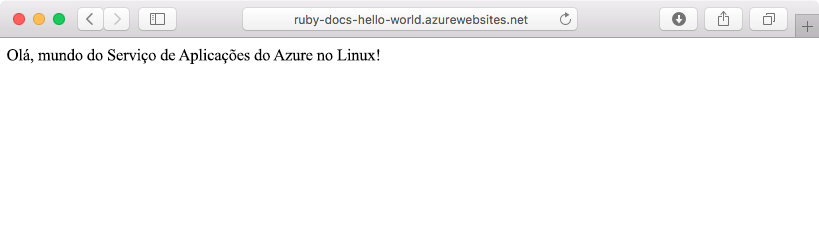
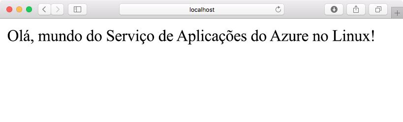
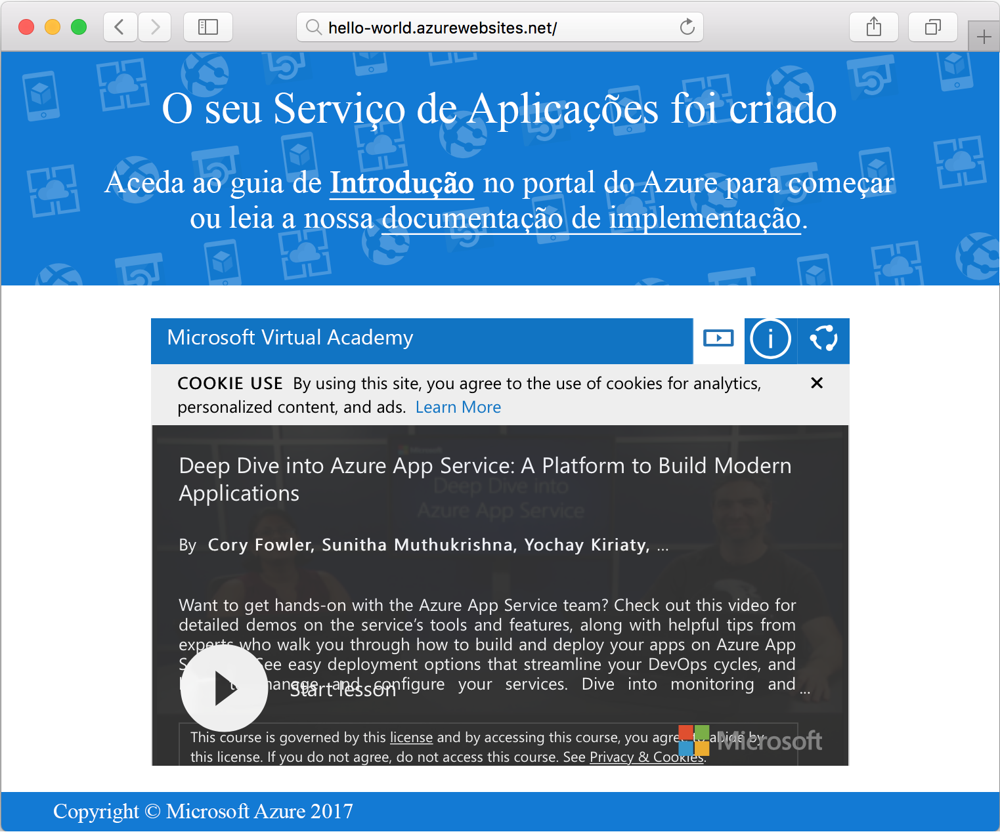

# <a name="create-a-ruby-on-rails-app-in-app-service-on-linux"></a>Criar uma aplicação Ruby on Rails com o Serviço de Aplicações no Linux

O [Serviço de Aplicações no Linux](app-service-linux-intro.md) oferece um serviço de alojamento na Web altamente dimensionável e com correção automática através do sistema operativo Linux. Este tutorial de início rápido mostra como implantar um aplicativo Ruby on Rails para Azure App serviço no Linux usando o [Cloud Shell](https://docs.microsoft.com/azure/cloud-shell/overview).

> [!NOTE]
> A pilha de desenvolvimento Ruby só suporta o Ruby on Rails neste momento. Se você quiser usar uma plataforma diferente, como Sinatra, ou se quiser usar uma [versão do Ruby sem suporte](app-service-linux-intro.md), será necessário [executá-la em um contêiner personalizado](quickstart-docker-go.md).



[!INCLUDE [quickstarts-free-trial-note](../../../includes/quickstarts-free-trial-note.md)]

## <a name="prerequisites"></a>Pré-requisitos

* <a href="https://www.ruby-lang.org/en/documentation/installation/#rubyinstaller" target="_blank">Instalar o Ruby 2,6 ou superior</a>
* <a href="https://git-scm.com/" target="_blank">Instalar o Git</a>

## <a name="download-the-sample"></a>Transferir o exemplo

Numa janela do terminal, execute o seguinte comando para clonar o repositório da aplicação de exemplo para o seu computador local:

```bash
git clone https://github.com/Azure-Samples/ruby-docs-hello-world
```

## <a name="run-the-application-locally"></a>Executar a aplicação localmente

Execute a aplicação localmente, para ver que aspeto deveria ter quando a implemente no Azure. Abra uma janela de terminal, mude para o diretório `hello-world` e utilize o comando `rails server` para iniciar o servidor.

O primeiro passo é instalar os gems necessários. Há um `Gemfile` incluído no exemplo, portanto, basta executar o seguinte comando:

```bash
bundle install
```

Quando os gems estiverem instalados, vamos utilizar o bundler para iniciar a aplicação:

```bash
bundle exec rails server
```

Com o seu browser, navegue para `http://localhost:3000` para testar a aplicação localmente.



[!INCLUDE [Try Cloud Shell](../../../includes/cloud-shell-try-it.md)]

[!INCLUDE [Configure deployment user](../../../includes/configure-deployment-user.md)]

[!INCLUDE [Create resource group](../../../includes/app-service-web-create-resource-group-linux.md)]

[!INCLUDE [Create app service plan](../../../includes/app-service-web-create-app-service-plan-linux.md)]

## <a name="create-a-web-app"></a>Criar uma aplicação Web

[!INCLUDE [Create web app](../../../includes/app-service-web-create-web-app-ruby-linux-no-h.md)] 

Navegue até o aplicativo para ver seu aplicativo Web criado recentemente com a imagem interna. Substitua _&lt;nome da aplicação>_ pelo nome da sua aplicação Web.

```bash
http://<app_name>.azurewebsites.net
```

A aplicação Web deve ter o seguinte aspeto:



## <a name="deploy-your-application"></a>Implementar a sua aplicação

Execute os seguintes comandos para implantar o aplicativo local em seu aplicativo Web do Azure:

```bash
git remote add azure <Git deployment URL from above>
git push azure master
```

Certifique-se de que as operações de implementação remota são bem-sucedidas. Os comandos produzem um resultado semelhante ao seguinte texto:

```bash
remote: Using turbolinks 5.2.0
remote: Using uglifier 4.1.20
remote: Using web-console 3.7.0
remote: Bundle complete! 18 Gemfile dependencies, 78 gems now installed.
remote: Bundled gems are installed into `/tmp/bundle`
remote: Zipping up bundle contents
remote: .......
remote: ~/site/repository
remote: Finished successfully.
remote: Running post deployment command(s)...
remote: Deployment successful.
remote: App container will begin restart within 10 seconds.
To https://<app-name>.scm.azurewebsites.net/<app-name>.git
   a6e73a2..ae34be9  master -> master
```

Depois que a implantação for concluída, aguarde cerca de 10 segundos para que o aplicativo Web seja reiniciado e, em seguida, navegue até o aplicativo Web e verifique os resultados.

```bash
http://<app-name>.azurewebsites.net
```


> [!NOTE]
> Enquanto o aplicativo estiver reiniciando, você poderá observar o código `Error 503 Server unavailable` de status HTTP no navegador ou a `Hey, Ruby developers!` página padrão. Pode levar alguns minutos para o aplicativo reiniciar completamente.
>

[!INCLUDE [Clean-up section](../../../includes/cli-script-clean-up.md)]

## <a name="next-steps"></a>Passos Seguintes

> [!div class="nextstepaction"]
> [Tutorial: Ruby on Rails com postgres](tutorial-ruby-postgres-app.md)

> [!div class="nextstepaction"]
> [Configurar aplicativo Ruby](configure-language-ruby.md)
