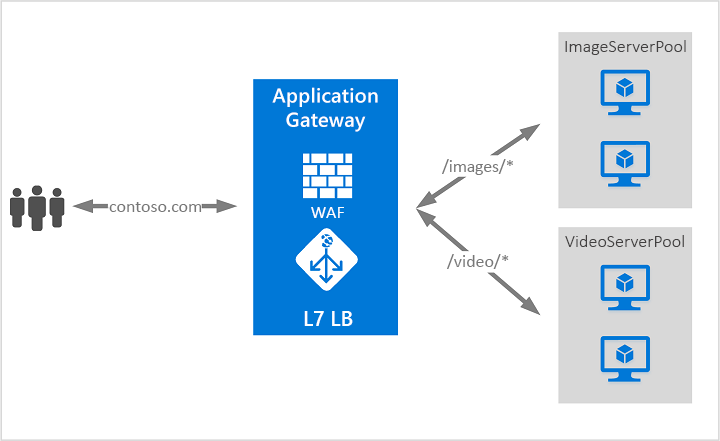

# O que é o Gateway de Aplicação do Azure?

O Gateway de Aplicação do Azure é um balanceador de carga do tráfego da Web que lhe permite gerir o tráfego para as suas aplicações Web. Os balanceadores de carga tradicionais funcionam na camada de transporte (camada OSI 4 - TCP e UDP) e encaminham o tráfego com base no endereço IP de origem e porta, para uma porta e um endereço IP de destino.

O Application Gateway pode tomar decisões de encaminhamento com base em atributos adicionais de um pedido HTTP, por exemplo, caminho URI ou cabeçalhos de anfitrião. Por exemplo, pode encaminhar tráfego com base no URL de origem. Por isso, se `/images` estiver no URL de origem, pode encaminhar o tráfego para um conjunto específico de servidores (conhecido como agrupamento) configurado para imagens. Se `/video` estiver na URL, esse tráfego é encaminhado para outra piscina que está otimizada para vídeos.

Este tipo de encaminhamento é conhecido como balanceamento de carga da camada de aplicação (camada OSI 7). O Gateway de Aplicação do Azure pode fazer encaminhamento com base no URL e muito mais.

>[!NOTE]
> O Azure oferece um conjunto de soluções de balanceamento de carga totalmente geridas para os seus cenários. 
> * Se estiver a procurar fazer o encaminhamento global baseado em DNS e **não** tiver requisitos para a rescisão do protocolo de Segurança da Camada de Transporte (TLS) ("descarga SSL"), por pedido HTTP/HTTPS ou processamento de camadas de aplicação, reveja [o Gestor de Tráfego.](../traffic-manager/traffic-manager-overview.md) 
> * Se precisar de otimizar o encaminhamento global do seu tráfego web e otimizar o desempenho e fiabilidade do utilizador final de topo através de uma rápida falha global, consulte [a Porta da Frente](../frontdoor/front-door-overview.md).
> * Para equilibrar a carga da camada de rede, reveja [o Balanceador de Carga](../load-balancer/load-balancer-overview.md). 
> 
> Os seus cenários de ponta a ponta podem beneficiar de combinar estas soluções conforme necessário.
> Para uma comparação de opções de equilíbrio de carga Azure, consulte [a visão geral das opções de equilíbrio de carga em Azure](/azure/architecture/guide/technology-choices/load-balancing-overview).

## Funcionalidades

Para saber mais sobre as funcionalidades do Gateway de Aplicações, consulte [as funcionalidades do Gateway de Aplicações Azure](features.md).

## Preços e SLA

Para obter informações sobre preços do Gateway de aplicação, consulte [os preços do Gateway de Aplicação](https://azure.microsoft.com/pricing/details/application-gateway/).

Para obter informações sobre o Gateway SLA, consulte [o Gateway SLA](https://azure.microsoft.com/support/legal/sla/application-gateway/v1_2/)da aplicação .

## Novidades

Para saber quais as novidades com o Azure Application Gateway, consulte as atualizações do [Azure](https://azure.microsoft.com/updates/?category=networking&query=Application%20Gateway).

## Passos seguintes

Dependendo dos seus requisitos e ambiente, pode criar um Portal de Aplicação de teste utilizando o portal Azure PowerShell ou O Azure CLI.

- [Início Rápido: Direcionar tráfego da Web com o Gateway de Aplicação do Azure - portal do Azure](quick-create-portal.md)
- [Início Rápido: Direcionar tráfego da Web com o Gateway de Aplicação do Azure - Azure PowerShell](quick-create-powershell.md)
- [Início Rápido: Direcionar tráfego da Web com o Gateway de Aplicação do Azure - CLI do Azure](quick-create-cli.md)