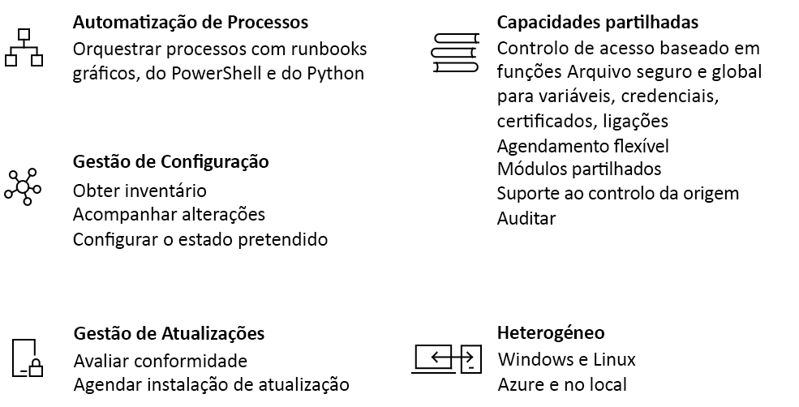

# Uma introdução à Automatização do Azure

A Azure Automation oferece um serviço de automação e configuração baseado na nuvem que suporta uma gestão consistente em todos os seus ambientes Azure e não-Azure. Inclui automatização de processos, gestão de configuração, gestão de atualizações, capacidades partilhadas e funcionalidades heterogéneas. A automatização dá-lhe controlo total durante a implantação, operações e desmantelamento de cargas de trabalho e recursos.

## Automatização de Processos

A automatização de processos na Azure Automation permite automatizar tarefas frequentes, demoradas e propensas a erros na gestão da nuvem. Este serviço ajuda-o a focar-se no trabalho que acrescenta valor ao negócio. A redução de erros e o reforço da eficiência também ajudam a baixar os custos operacionais. O ambiente operacional de automatização de processos é detalhado na [execução do Runbook na Azure Automation.](automation-runbook-execution.md)

A automatização de processos apoia a integração dos serviços Azure e de outros sistemas públicos necessários para implementar, configurar e gerir os seus processos de ponta a ponta. O serviço permite-lhe [autoriar livros de execução](automation-runbook-types.md) graficamente, em PowerShell, ou usando Python. Ao utilizar um [Trabalhador De Runbook Híbrido,](automation-hybrid-runbook-worker.md)pode unificar a gestão orquestrando ambientes no local. [Os Webhooks](automation-webhooks.md) permitem-lhe cumprir os pedidos e garantir a entrega e operações contínuas, desencadeando automatização a partir de sistemas ITSM, DevOps e monitores. 

## Gestão da Configuração

A Gestão de Configuração na Azure Automation permite o acesso a duas funcionalidades:

* Controlo de Alterações e Inventário
* State Configuration da Automatização do Azure

### Controlo de Alterações e Inventário

O Change Tracking and Inventory combina funções de rastreio e inventário de alterações para permitir rastrear alterações de infraestrutura de máquinas virtuais e servidores. O serviço suporta o rastreio de alterações através de serviços, daemons, software, registro e ficheiros no seu ambiente para ajudá-lo a diagnosticar alterações indesejadas e elevar alertas. O suporte ao inventário permite-lhe consultar os recursos in-guest para visibilidade em aplicações instaladas e outros itens de configuração. Para mais detalhes sobre esta funcionalidade, consulte [Change Tracking and Inventory](change-tracking/overview.md).

### State Configuration da Automatização do Azure

[A Azure Automation State Configuration](automation-dsc-overview.md) é uma funcionalidade baseada na nuvem para a configuração de estado desejada pela PowerShell (DSC) que fornece serviços para ambientes empresariais. Utilizando esta funcionalidade, pode gerir os seus recursos DSC na Azure Automation e aplicar configurações em máquinas virtuais ou físicas a partir de um servidor de puxar DSC na nuvem Azure. 

## Gestão de atualizações

A Azure Automation inclui a funcionalidade [de Gestão de Atualização](./update-management/overview.md) para sistemas Windows e Linux em ambientes híbridos. A Gestão de Atualização dá-lhe visibilidade para atualizar a conformidade entre O Azure e outras nuvens, e no local. A funcionalidade permite criar implementações programadas que orquestram a instalação de atualizações dentro de uma janela de manutenção definida. Se uma atualização não for instalada numa máquina, pode utilizar a funcionalidade De Gestão de Atualização para a excluir de uma implementação.

## Capacidades partilhadas

A Azure Automation oferece uma série de capacidades partilhadas, incluindo recursos partilhados, controlo de acesso baseado em funções, agendamento flexível, integração de controlo de fontes, auditoria e marcação.

### Recursos partilhados

A Automatização do Azure é composta por um conjunto de recursos partilhados que facilitam a automatização e configuração dos seus ambientes à escala.

* **[Horários](./shared-resources/schedules.md)** - Desencadear operações de Automação em horários predefinidos.
* **[Módulos](./shared-resources/modules.md)** - Gerir o Azure e outros sistemas. Pode importar módulos para a conta de Automação para a Microsoft, terceiros, comunidade e cmdlets e recursos DSC definidos sob medida.
* **[Galeria de Módulos](automation-runbook-gallery.md)** - Suporta a integração nativa com a PowerShell Gallery para permitir que veja os runbooks e os importe na conta Automation. A galeria permite-lhe começar rapidamente a integrar e a autorizar os seus processos a partir da galeria PowerShell e do Microsoft Script Center.
* **[Pacotes Python 2](python-packages.md)** - Suporte os livros Python 2 para a sua conta Dem automação.
* **[Credenciais](./shared-resources/credentials.md)** - Armazenar de forma segura informações sensíveis que os runbooks e configurações podem utilizar no tempo de execução.
* **[Conexões](automation-connections.md)** - Armazenar pares de informações comuns para ligações a sistemas. O autor do módulo define ligações em runbooks e configurações para utilização em tempo de execução.
* **[Certificados](./shared-resources/certificates.md)** - Defina informações a utilizar na autenticação e na segurança de recursos implantados quando acedidos por runbooks ou configurações DSC em tempo de execução. 
* **[Variáveis](./shared-resources/variables.md)** - Mantenha o conteúdo que pode ser usado em todos os runbooks e configurações. Pode alterar valores variáveis sem ter de modificar nenhum dos livros de execução ou configurações que os referenciam.

### Controlo de acesso baseado em funções

A Azure Automation suporta o controlo de acesso baseado em funções (Azure RBAC) para regular o acesso à conta Automation e aos seus recursos. Para saber mais sobre a configuração do Azure RBAC na sua conta de Automação, livros e empregos, consulte [o controlo de acesso baseado em funções para a Azure Automation](automation-role-based-access-control.md).

### Integração do controlo de origem

A Azure Automation suporta [a integração do controlo de fontes.](source-control-integration.md) Esta funcionalidade promove a configuração como código onde os livros ou configurações podem ser verificados num sistema de controlo de fontes.

## Suporte heterogéneo (Windows e Linux)

A automatização foi concebida para funcionar em todo o seu ambiente de nuvem híbrida e também nos seus sistemas Windows e Linux. Oferece uma forma consistente de automatizar e configurar cargas de trabalho implementadas e os sistemas operativos que as executam.

## Cenários comuns para a Automatização

A Azure Automation suporta a gestão ao longo do ciclo de vida da sua infraestrutura e aplicações. Os cenários comuns incluem:

* **Escreva livros -** Author PowerShell, PowerShell Workflow, graphical, Python 2 e DSC runbooks em línguas comuns. 
* **Construa e implemente recursos** - Implemente máquinas virtuais em um ambiente híbrido usando runbooks e modelos de Gestor de Recursos Azure. Integre-se em ferramentas de desenvolvimento, como Jenkins e Azure DevOps.
* **Configure VMs** - Avaliar e configurar máquinas Windows e Linux com configurações para a infraestrutura e aplicação.
* **Partilhar conhecimentos** - Transfira conhecimento para o sistema sobre a forma como a sua organização entrega e mantém cargas de trabalho. 
* **Obter** um inventário completo dos recursos implantados para direcionar, reportar e cumprir. 
* **Encontrar alterações** - Identificar alterações que possam causar uma configuração errada e melhorar a conformidade operacional.
* **Monitor** - Isolar as alterações da máquina que estão a causar problemas e remediar ou acalá-las aos sistemas de gestão.
* **Proteger** - Máquinas de quarentena se os alertas de segurança forem levantados. Defina requisitos no convidado.
* **Governar** - Criar o Azure RBAC para equipas. Recupere recursos não utilizados.

[!INCLUDE [azure-lighthouse-supported-service](../../includes/azure-lighthouse-supported-service.md)]

## Preços para Azure Automation

Pode rever os preços associados à Azure Automation na página [de preços.](https://azure.microsoft.com/pricing/details/automation/)

## Passos seguintes

> [!div class="nextstepaction"]
> [Criar uma conta de Automatização](automation-quickstart-create-account.md)