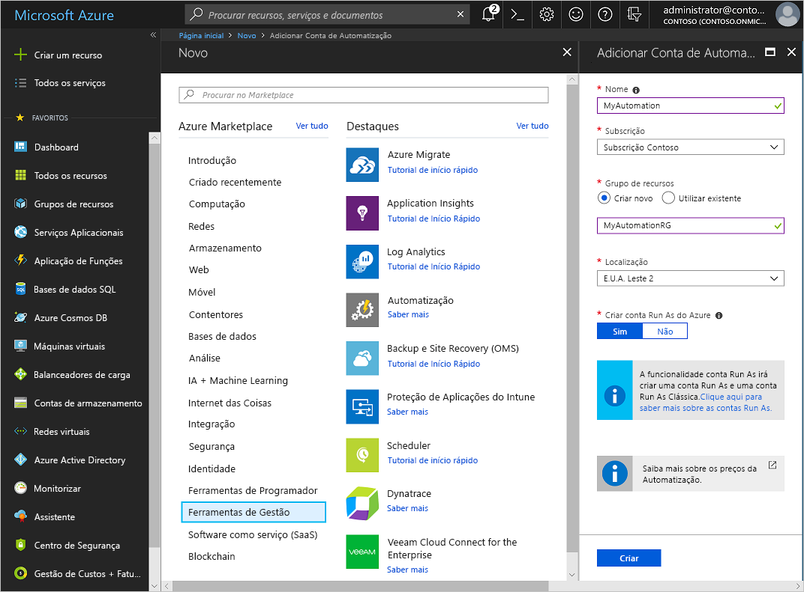
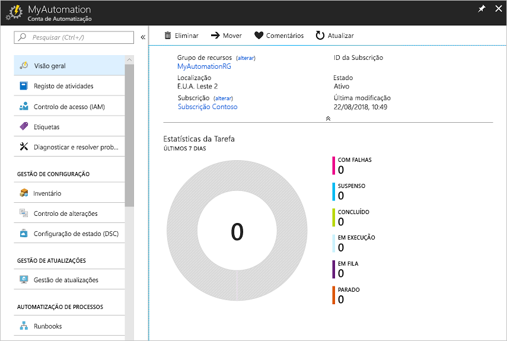
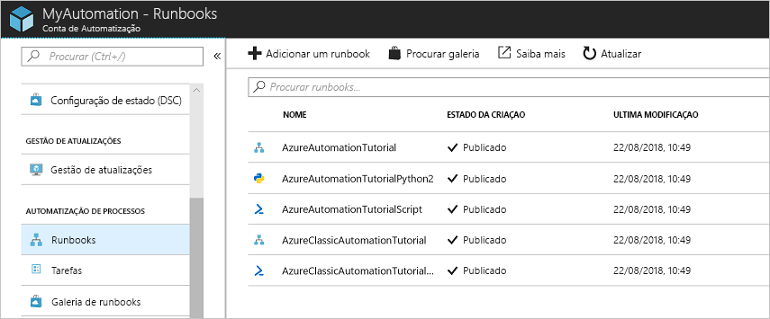
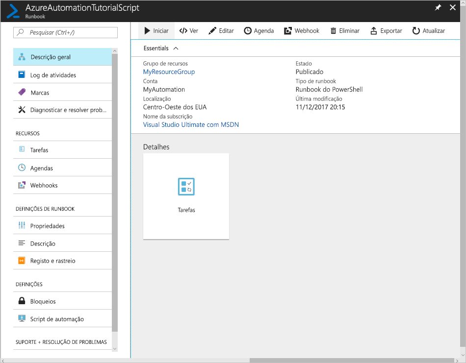
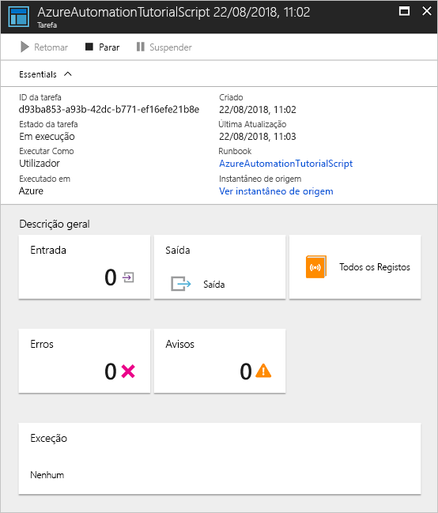

# Crie uma conta de Automatização do Azure

Pode criar uma conta Azure Automation através do Azure, utilizando o portal Azure, uma interface de utilizador baseada no navegador que permite o acesso a uma série de recursos. Uma conta Automation pode gerir recursos em todas as regiões e subscrições para um determinado inquilino. 

Este quickstart guia-o na criação de uma conta Automation e na execução de um runbook na conta. Se não tiver uma subscrição do Azure, crie uma [conta do Azure gratuita](https://azure.microsoft.com/free/?WT.mc_id=A261C142F) antes de começar.

## Iniciar sessão no Azure

[Inicie sessão no Azure](https://portal.azure.com).

## Criar conta de Automatização

1. Escolha um nome para a sua conta Azure. Os nomes das contas de automação são únicos por região e grupo de recursos. Os nomes das contas automations que foram eliminadas podem não estar imediatamente disponíveis.

    > [!NOTE]
    > Não é possível alterar o nome da conta uma vez introduzido na interface do utilizador. 

2. Clique no botão Criar um botão **de recurso** encontrado no canto superior esquerdo do portal Azure.

3. Selecione **IT & Management Tools** e, em seguida, selecione **Automação**.

4. Introduza a informação da conta, incluindo o nome da conta selecionada. Para **Criar uma conta Run As do Azure**, escolha **Sim** para que os artefactos para simplificar a autenticação no Azure sejam ativados automaticamente. Quando a informação estiver concluída, clique em **Criar** para iniciar a implementação da conta Automation.

      

    > [!NOTE]
    > Para obter uma lista atualizada de locais a que pode implementar uma conta Demôm automação, consulte [produtos disponíveis por região.](https://azure.microsoft.com/global-infrastructure/services/?products=automation&regions=all)

5. Quando a implementação estiver concluída, clique em **Todos os Serviços**.

6. Selecione **Contas de Automação** e, em seguida, escolha a conta Automation que criou.

    

## Executar um runbook

Execute um dos runbooks do tutorial.

1. Clique **em Runbooks** em **Automação de Processos.** A lista de runbooks é apresentada. Por predefinição, vários livros de execução tutoriais estão ativados na conta.

    

1. Selecione o runbook **AzureAutomationTutorialScript**. Esta ação abre a página de descrição geral do runbook.

    

1. Clique em **Iniciar** e na página Iniciar Runbook, clique em **OK** para iniciar o runbook.

    

1. Após a situação do `Running` trabalho, clique em **Saída** ou **Em Todos os Registos** para visualizar a saída de trabalho do runbook. Para este runbook do tutorial, o resultado é uma lista dos seus recursos Azure.

## Passos seguintes

Neste guia de introdução, implementou uma conta de Automatização, iniciou uma tarefa de runbook e visualizou os resultados das tarefas. Para saber mais sobre a Automatização do Azure, avance para o início rápido para criar o seu primeiro runbook.

> [!div class="nextstepaction"]
> [Automation Quickstart - Criar um runbook Azure Automation](./automation-quickstart-create-runbook.md)

