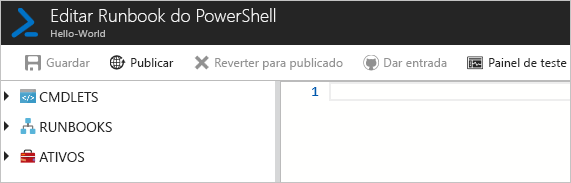
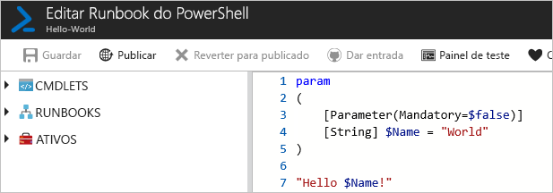
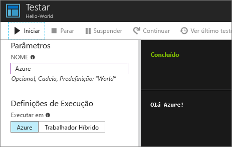
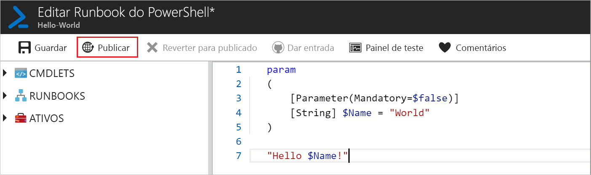
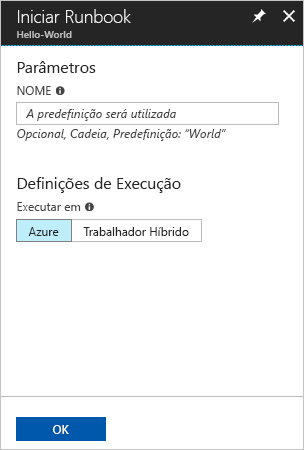
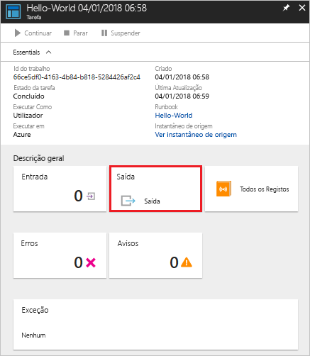
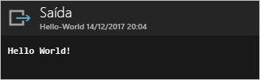

# <a name="create-an-azure-automation-runbook"></a>Crie um runbook de Automatização do Azure

Os runbooks de Automatização do Azure podem ser criados através do Azure. Este método oferece uma interface de utilizador baseada no browser para criar runbooks de Automatização. Este guia rápido irá ajudá-lo a criar, editar, testar e publicar um runbook de Automatização do PowerShell.

Se não tiver uma subscrição do Azure, crie uma [conta do Azure gratuita](https://azure.microsoft.com/free/?WT.mc_id=A261C142F) antes de começar.

## <a name="sign-in-to-azure"></a>Iniciar sessão no Azure

Inscreva-se no Azure em https://portal.azure.com .

## <a name="create-the-runbook"></a>Criar o livro de corridas

Primeiro, crie um runbook. O runbook de exemplo criado neste guia rápido devolve `Hello World` por predefinição.

1. Abra a sua conta de Automatização.

1. Clique em **Runbooks** em **Automação de Processos**. A lista de runbooks é apresentada.

1. Clique em Criar um livro de **corridas** no topo da lista.

1. Introduza para o nome do livro de `Hello-World` execução no campo **Nome** e selecione **PowerShell** para o campo **do tipo Runbook.** 

   

1. Clique em **Criar**. O runbook é criado e a página Editar Runbook do PowerShell é aberta.

    

1. Escreva ou copie e cole o seguinte código no painel de edição. Cria um parâmetro de entrada opcional chamado `Name` com um valor predefinido de, e produz uma cadeia que utiliza este valor de `World` entrada:

   ```powershell-interactive
   param
   (
       [Parameter(Mandatory=$false)]
       [String] $Name = "World"
   )

   "Hello $Name!"
   ```

1. Clique em **Guardar** para guardar uma cópia do livro de execução.

    

## <a name="test-the-runbook"></a>Testar o runbook

Uma vez criado o livro de execução, é necessário testar o livro de execução para validar que funciona.

1. Clique em **Painel de teste** para abrir o Painel de teste.

1. Introduza um valor para **Nome** e clique em **Iniciar**. A tarefa de teste inicia e o estado da tarefa e o resultado são apresentados.

    

1. Feche o painel de teste clicando no **X** no canto superior direito. Selecione **OK** na caixa que aparece.

1. Na página Editar Runbook do PowerShell, clique em **Publicar** para publicar o runbook como a versão oficial do runbook na conta.

   

## <a name="run-the-runbook"></a>Executar o runbook

Assim que o runbook é publicado, é apresentada a página de descrição geral.

1. Na página de descrição geral do runbook, clique em **Iniciar** para abrir a página de configuração Iniciar Runbook para este runbook.

   

1. Deixe o **Nome** em branco, para que o valor predefinido seja utilizado e clique em **OK**. O trabalho do livro de execução é submetido, e a página de trabalho aparece.

   

1. Quando o estado de trabalho estiver `Running` ou , clique em `Completed` **Saída** para abrir o painel de saída e ver a saída do livro de saída.

   

## <a name="clean-up-resources"></a>Limpar recursos

Quando já não precisar, elimine o runbook. Para tal, selecione o runbook na lista de runbooks e clique em **Eliminar**.

## <a name="next-steps"></a>Passos seguintes

Neste guia rápido, criou, editou, testou e publicou um runbook e iniciou uma tarefa de runbook. Para obter mais informações sobre Runbooks de automatização, avance para o artigo sobre os diferentes tipos de runbooks que pode criar e utilizar na Automatização.

> [!div class="nextstepaction"]
> [Tipos de livro de execução da Automação Azure](./automation-runbook-types.md)
