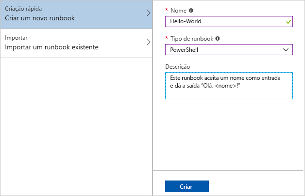

# <a name="create-an-azure-automation-runbook"></a>Crie um runbook de Automatização do Azure

Os runbooks de Automatização do Azure podem ser criados através do Azure. Este método oferece uma interface de utilizador baseada no browser para criar runbooks de Automatização. Este guia rápido irá ajudá-lo a criar, editar, testar e publicar um runbook de Automatização do PowerShell.

Se não tiver uma subscrição do Azure, crie uma [conta do Azure gratuita](https://azure.microsoft.com/free/?WT.mc_id=A261C142F) antes de começar.

## <a name="sign-in-to-azure"></a>Iniciar sessão no Azure

Inscreva-se no Azure at https://portal.azure.com .

## <a name="create-the-runbook"></a>Criar o livro de execução

Primeiro, crie um runbook. O runbook de exemplo criado neste guia rápido devolve `Hello World` por predefinição.

1. Abra a sua conta de Automatização.

1. Clique **em Runbooks** em **Automação de Processos.** A lista de runbooks é apresentada.

1. Clique em **Criar um livro de execução** no topo da lista.

1. Introduza `Hello-World` o nome do livro de execuções no campo **Nome** e selecione **PowerShell** para o campo **do tipo Runbook.** 

   

1. Clique em **Criar**. O runbook é criado e a página Editar Runbook do PowerShell é aberta.

    :::image type="content" source="./media/automation-quickstart-create-runbook/automation-edit-runbook-empty.png" alt-text="Screenshot da página Edit PowerShell Runbook.":::

1. Escreva ou copie e cole o seguinte código no painel de edição. Cria um parâmetro de entrada opcional chamado `Name` com um valor padrão de , e `World` produz uma cadeia que utiliza este valor de entrada:

   ```powershell-interactive
   param
   (
       [Parameter(Mandatory=$false)]
       [String] $Name = "World"
   )

   "Hello $Name!"
   ```

1. Clique **em Guardar** para guardar uma cópia do rascunho do livro de recortes.

    :::image type="content" source="./media/automation-quickstart-create-runbook/automation-edit-runbook.png" alt-text="Screenshot da página Editar PowerShell Runbook com um exemplo de código na janela direita.":::

## <a name="test-the-runbook"></a>Testar o runbook

Uma vez criado o livro de recortes, tem de testar o livro de recortes para validar o seu funcionamento.

1. Clique em **Painel de teste** para abrir o Painel de teste.

1. Introduza um valor para **Nome** e clique em **Iniciar**. A tarefa de teste inicia e o estado da tarefa e o resultado são apresentados.

    :::image type="content" source="./media/automation-quickstart-create-runbook/automation-test-runbook.png" alt-text="Screenshot do painel de teste com um valor de exemplo no campo de nomes.":::

1. Feche o painel de teste clicando no **X** no canto superior direito. Selecione **OK** na caixa que aparece.

1. Na página Editar Runbook do PowerShell, clique em **Publicar** para publicar o runbook como a versão oficial do runbook na conta.

   :::image type="content" source="./media/automation-quickstart-create-runbook/automation-hello-world-runbook-job.png" alt-text="Screenshot da página EditAr PowerShell Runbook mostrando o botão Publicar selecionado.":::

## <a name="run-the-runbook"></a>Executar o runbook

Assim que o runbook é publicado, é apresentada a página de descrição geral.

1. Na página de descrição geral do runbook, clique em **Iniciar** para abrir a página de configuração Iniciar Runbook para este runbook.

   :::image type="content" source="./media/automation-quickstart-create-runbook/automation-hello-world-runbook-start.png" alt-text="Screenshot da página de configuração do Start Runbook.":::

1. Deixe o **Nome** em branco, para que o valor predefinido seja utilizado e clique em **OK**. O trabalho de runbook é submetido e a página De Trabalho aparece.

   :::image type="content" source="./media/automation-quickstart-create-runbook/automation-job-page.png" alt-text="Screenshot da página de Trabalho mostrando o botão de saída selecionado.":::

1. Quando o estado do trabalho estiver `Running` `Completed` ou, clique em **Saída** para abrir o painel de saída e ver a saída do livro de execução.

   :::image type="content" source="./media/automation-quickstart-create-runbook/automation-hello-world-runbook-job-output.png" alt-text="Screenshot do painel de saída mostrando a saída do runbook.":::

## <a name="clean-up-resources"></a>Limpar os recursos

Quando já não precisar, elimine o runbook. Para tal, selecione o runbook na lista de runbooks e clique em **Eliminar**.

## <a name="next-steps"></a>Passos seguintes

Neste guia rápido, criou, editou, testou e publicou um runbook e iniciou uma tarefa de runbook. Para obter mais informações sobre Runbooks de automatização, avance para o artigo sobre os diferentes tipos de runbooks que pode criar e utilizar na Automatização.

> [!div class="nextstepaction"]
> [Tipos de runbook Azure Automation](./automation-runbook-types.md)
