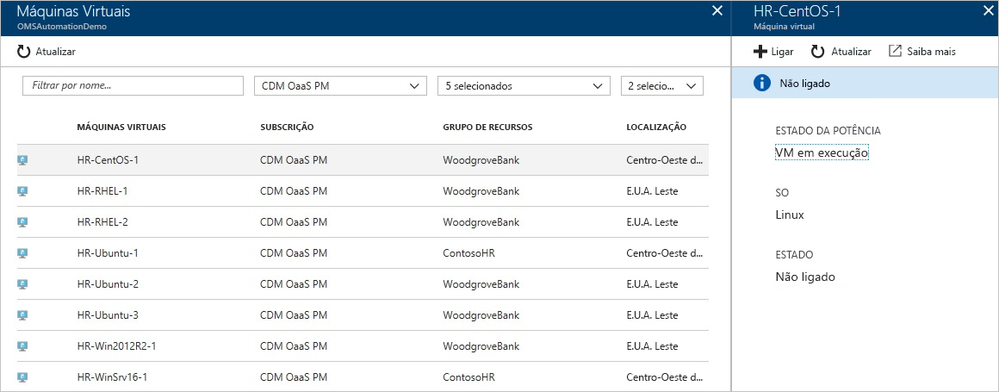
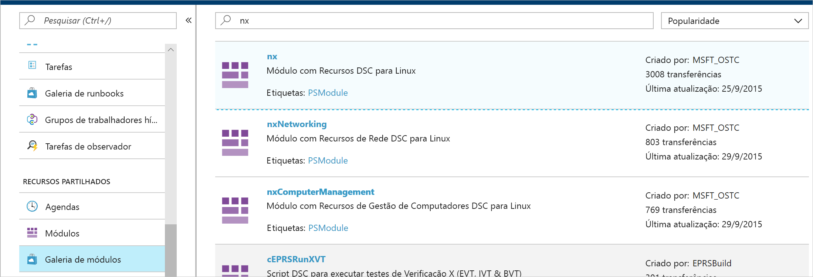
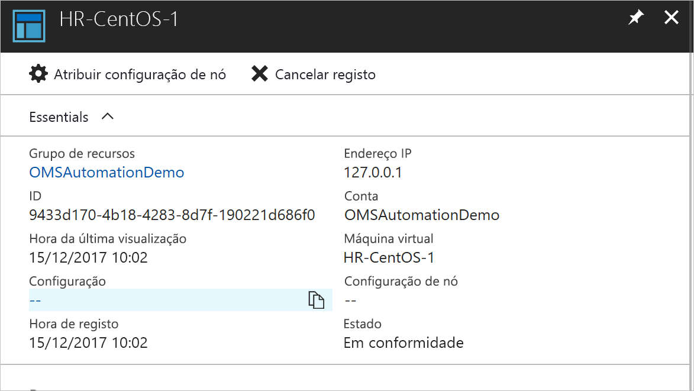
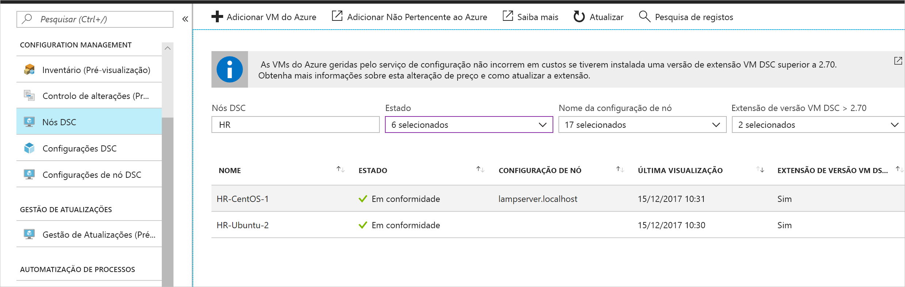

# <a name="configure-a-vm-with-desired-state-configuration"></a>Configure um VM com configuração de estado desejada

Ao ativar a configuração do Estado da Automação Azure, pode gerir e monitorizar as configurações dos seus servidores Windows e Linux utilizando a Configuração de Estado Desejada (DSC). As configurações que derivam de uma configuração desejada podem ser identificadas ou corrigidas automaticamente. Este arranque rápido passa por ativar um VM Linux e implantar uma pilha DE LÂMPADA utilizando a Configuração do Estado da Automação Azure.

## <a name="prerequisites"></a>Pré-requisitos

Para concluir este guia de início rápido, precisa de:

* Uma subscrição do Azure. Se não tiver uma subscrição do Azure, [crie uma conta gratuita](https://azure.microsoft.com/free/).
* Uma conta de Automatização do Azure. Para obter instruções sobre como criar uma conta Run As de Automatização do Azure, veja [Conta Run As do Azure](./manage-runas-account.md).
* Um VM (não clássico) a executar Red Hat Enterprise Linux, CentOS ou Oracle Linux. Para obter instruções sobre como criar uma VM, veja [Criar a sua primeira máquina virtual do Linux no portal do Azure](../virtual-machines/linux/quick-create-portal.md)

## <a name="sign-in-to-azure"></a>Iniciar sessão no Azure
Inscreva-se no Azure at https://portal.azure.com .

## <a name="enable-a-virtual-machine"></a>Ativar uma máquina virtual

Existem muitos métodos diferentes para permitir uma máquina para a funcionalidade de Configuração do Estado. Este quickstart diz como ativar a funcionalidade para um VM utilizando uma conta Automation. Pode aprender mais sobre diferentes métodos para ativar as suas máquinas para configuração do Estado, lendo [Ativar máquinas para gestão através da Configuração do Estado da Automação Azure](./automation-dsc-onboarding.md).

1. No painel esquerdo do portal do Azure, selecione **Contas de Automatização**. Se não for visível no painel esquerdo, clique em **Todos os serviços** e procure na vista resultante.
1. Na lista, selecione uma conta de Automatização.
1. No painel esquerdo da conta de Automatização, selecione **Configuração de estado (DSC)**.
2. Clique em **Adicionar** para abrir a página de seleção de VM.
3. Encontre a máquina virtual para a qual ativa o DSC. Pode utilizar as opções de campo de pesquisa e de filtro para encontrar uma máquina virtual específica.
4. Clique na máquina virtual e, em seguida, clique em **Connect**
5. Selecione as definições de DSC adequadas para a máquina virtual. Se já preparou uma configuração, pode especificá-la como `Node Configuration Name` . Pode definir o [modo de configuração](/powershell/scripting/dsc/managing-nodes/metaConfig) para controlar o comportamento de configuração da máquina.
6. Clique em **OK**. Enquanto a extensão DSC é implantada na máquina virtual, o estado aparece como `Connecting` .



## <a name="import-modules"></a>Importar módulos

Os módulos contêm recursos DSC e muitos podem ser encontrados na [PowerShell Gallery.](https://www.powershellgallery.com) Todos os recursos utilizados nas suas configurações devem ser importados para a conta Automation antes de compilar. Para este tutorial, é preciso o módulo denominado **nx**.

1. No painel esquerdo da conta Automation, selecione **Modules Gallery** em **Recursos Partilhados.**
1. Procure o módulo para importar digitando parte do seu nome: `nx` .
1. Clique no módulo para importar.
1. Clique **em Importar.**



## <a name="import-the-configuration"></a>Importar a configuração

Este guia rápido utiliza uma configuração de DSC que configura o Apache HTTP Server, o MySQL e o PHP na máquina. Ver [configurações de DSC](/powershell/scripting/dsc/configurations/configurations).

Num editor de texto, escreva o seguinte e guarde-o localmente como **AMPServer.ps1**.

```powershell-interactive
configuration LAMPServer {
   Import-DSCResource -module "nx"

   Node localhost {

        $requiredPackages = @("httpd","mod_ssl","php","php-mysql","mariadb","mariadb-server")
        $enabledServices = @("httpd","mariadb")

        #Ensure packages are installed
        ForEach ($package in $requiredPackages){
            nxPackage $Package{
                Ensure = "Present"
                Name = $Package
                PackageManager = "yum"
            }
        }

        #Ensure daemons are enabled
        ForEach ($service in $enabledServices){
            nxService $service{
                Enabled = $true
                Name = $service
                Controller = "SystemD"
                State = "running"
            }
        }
   }
}
```

Para importar a configuração:

1. No painel esquerdo da conta de Automatização, selecione **Configuração de estado (DSC)** e, em seguida, clique no separador **Configurações**.
2. Clique em **+ Adicionar**.
3. Selecione o ficheiro de configuração que guardou no passo anterior.
4. Clique em **OK**.

## <a name="compile-a-configuration"></a>Compilar uma configuração

Tem de compilar uma configuração DSC para uma configuração de nó (documento MOF) antes de poder ser atribuída a um nó. A compilação valida a configuração e permite a entrada de valores de parâmetros. Para saber mais sobre a compilação de uma configuração, consulte [configurações de compilação na Configuração do Estado](automation-dsc-compile.md).

1. No painel esquerdo da conta Automação, selecione **a Configuração do Estado (DSC)** e, em seguida, clique no **separador Configurações.**
1. Selecione a configuração `LAMPServer` .
1. A partir das opções do menu, **selecione Compile** e, em seguida, clique em **Sim**.
1. Na vista Configuração, vê-se um novo trabalho de compilação na fila. Quando a tarefa for concluída com êxito, está pronta para avançar para o passo seguinte. Se houver falhas, pode clicar no trabalho de compilação para obter detalhes.

## <a name="assign-a-node-configuration"></a>Atribuir uma configuração de nó

Pode atribuir uma configuração de nó compilado a um nó DSC. A atribuição aplica a configuração à máquina e monitores ou corre automaticamente para qualquer deriva dessa configuração.

1. No painel esquerdo da conta Automation, selecione **Configuração de Estado (DSC)** e, em seguida, clique no **separador Nodes.**
1. Selecione o nó para atribuir uma configuração.
1. Clique em **Atribuir Configuração do Nó**
1. Selecione a configuração do nó `LAMPServer.localhost` e clique em **OK**. A Configuração do Estado atribui agora a configuração compilada ao nó, e o estado do nó muda para `Pending` . Na próxima verificação periódica, o nó recupera a configuração, aplica-a e reporta o estado. Pode levar até 30 minutos para o nó recuperar a configuração, dependendo das definições do nó. 
1. Para forçar uma verificação de imediato, pode executar o comando seguinte localmente na máquina virtual Linux: `sudo /opt/microsoft/dsc/Scripts/PerformRequiredConfigurationChecks.py`



## <a name="view-node-status"></a>Ver estado do nó

Pode ver o estado de todos os nós geridos pela Configuração do Estado na sua conta Demômes. A informação é apresentada escolhendo a **Configuração do Estado (DSC)** e clicando no **separador Nodes.** Pode filtrar o visor por estado, configuração de nó ou pesquisa de nome.



## <a name="next-steps"></a>Passos seguintes

Neste arranque rápido, ativou um Linux VM para configuração estatal, criou uma configuração para uma pilha de LÂMPADAs e implementou a configuração para o VM. Para saber como pode utilizar a Configuração do Estado da Automação Azure para permitir a implementação contínua, continue ao artigo:

> [!div class="nextstepaction"]
> [Configurar a implementação contínua com o Chocolatey](./automation-dsc-cd-chocolatey.md)
