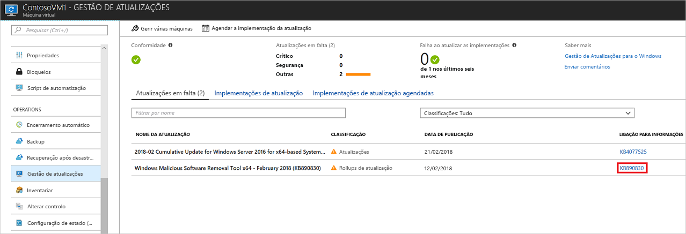
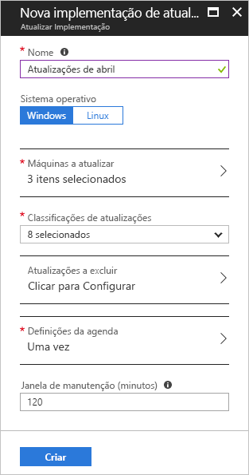
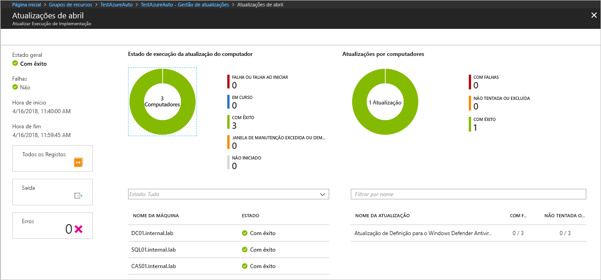

# Gerencie atualizações e patches para os seus VMs Azure

Este artigo descreve como pode utilizar a funcionalidade De Gestão de [Atualizações](automation-update-management.md) de Automação Do Azure para gerir atualizações e patches para os seus VMs Azure. Para obter informações sobre preços, veja [Preços de Automatização para Gestão de Atualizações](https://azure.microsoft.com/pricing/details/automation/).

> [!NOTE]
> A Update Management apoia a implementação de atualizações de primeira parte e o pré-download de patches. Este suporte requer alterações nos sistemas que estão a ser corrigidos. Consulte as definições de Atualização do Windows para a Atualização de [Automação Do Azure](automation-configure-windows-update.md) para saber como configurar estas definições nos seus sistemas.

Antes de utilizar os procedimentos neste artigo, certifique-se de que ativou a Gestão de Atualizações nos seus VMs utilizando uma destas técnicas:

* [Ativar a Gestão de Atualizações a partir de uma conta de Automatização](automation-onboard-solutions-from-automation-account.md)
* [Ativar a Gestão de Atualizações navegando no portal Azure](automation-onboard-solutions-from-browse.md)
* [Ativar a Gestão de Atualizações a partir de um runbook](automation-onboard-solutions.md)
* [Ativar a Gestão de Atualizações a partir de uma VM do Azure](automation-onboard-solutions-from-vm.md)

## Ver avaliação de atualizações

Para visualizar uma avaliação de atualização:

1. Na sua conta Automation, selecione **Gestão de Atualização** sob gestão de **Atualização**. 

2. As atualizações para o seu ambiente estão listadas na página de gestão da Atualização. Se alguma atualização for identificada como desaparecida, uma lista de atualizações em falta é mostrada no separador **de atualizações Em falta.**

3. No **link Informação,** selecione o link para uma atualização para abrir o artigo de suporte que lhe forneça informações importantes sobre a atualização.

    

4. Clique em qualquer outro lugar da atualização para abrir o painel de pesquisa de registo. A consulta para a pesquisa de registos está predefinida para essa atualização específica. Pode modificar esta consulta ou criar a sua própria consulta para visualizar informações detalhadas.

    

## Configurar alertas

Siga os passos abaixo para configurar alertas para que saiba o estado de uma implementação de atualização:

1. Na sua conta de Automação, vá a **Alertas** sob **Monitorização**e, em seguida, clique em **Nova regra**de alerta .

2. Na página de 'Criar', a sua conta De sição já está selecionada como recurso. Se quiser mudá-lo, clique em **Editar recurso**. 

3. Na página Selecione uma página de recursos, escolha **Contas de Automação** do Filtro por menu de dropdown **do tipo de recurso.** 

4. Selecione a conta Automation que pretende utilizar e, em seguida, clique em **Done**.

5. Clique em **Adicionar condição** para selecionar o sinal adequado para a sua implementação da atualização. A tabela seguinte mostra os detalhes dos dois sinais disponíveis.

    |Nome do sinal|Dimensões|Descrição
    |---|---|---|
    |`Total Update Deployment Runs`|- Nome de implementação de atualização - Estatuto    |Alertas sobre o estado geral de uma implementação de atualização.|
    |`Total Update Deployment Machine Runs`|- Nome de implementação de atualização - Estatuto - Computador-alvo - Id de execução de implementação de atualização    |Alertas sobre o estado de uma implementação de atualização direcionada para máquinas específicas.|

6. Para uma dimensão, selecione um valor válido da lista. Se o valor que deseja não estiver na lista, clique ao **\+** lado da dimensão e escreva o nome personalizado. Em seguida, selecione o valor a procurar. Se pretender selecionar todos os valores para uma dimensão, clique no botão **Select. \* ** Se não escolher um valor para uma dimensão, a Atualização de Gestão ignora essa dimensão.

    

7. Sob **a lógica de Alerta,** introduza valores nos campos de **agregação** do tempo e **limiar** e, em seguida, clique **em Done**.

8. No painel seguinte, insira um nome e uma descrição para o alerta.

9. Detete o campo **Deseveridade** para **Uma** execução bem sucedida ou **informacional (Sev 1)** para uma execução falhada.

    

10. Clique em **Sim** ou **Não,** dependendo de como pretende ativar a regra de alerta.

11. Se não quiser ter alertas para esta regra, selecione **Alertas De Supressão**.

## Configure grupos de ação para os seus alertas

Assim que tiver os seus alertas configurados, pode configurar um grupo de ação, que é um grupo de ações para usar em vários alertas. As ações podem incluir notificações de e-mail, livros de execução, webhooks e muito mais. Para saber mais sobre grupos de ação, veja [Criar e gerir grupos de ações](../azure-monitor/platform/action-groups.md).

1. Selecione um alerta e, em seguida, selecione **Criar Novo** em **Grupos de Ação**. 

2. Introduza um nome completo e um pequeno nome para o grupo de ação. A Atualização Management utiliza o nome curto ao enviar notificações utilizando o grupo especificado.

3. No âmbito **de Ações**, insira um nome que especifique a ação, por exemplo, Notificação de **E-mail**. 

4. Para **o Tipo de Ação,** selecione o tipo apropriado, por exemplo, **e-mail/SMS/Push/Voice**. 

5. Clique em **editar detalhes**.

6. Preencha o painel para o seu tipo de ação. Por exemplo, se utilizar **o Email/SMS/Push/Voice,** introduza um nome de ação, selecione a caixa de verificação de **e-mail,** introduza um endereço de e-mail válido e, em seguida, clique em **OK**.

    

7. No painel do grupo de ação Add, clique em **OK**.

8. Para um e-mail de alerta, pode personalizar o assunto do e-mail. **Selecione Personalizar as ações** sob a regra **Criar**e, em seguida, selecione o assunto **do e-mail**. 

9. Quando terminar, clique em **Criar a regra**de alerta . 

## Agendar uma implementação de atualizações

Agendar uma implementação de atualização cria um recurso de [agenda](shared-resources/schedules.md) ligado ao livro de execução **Patch-MicrosoftOMSComputers** que trata da implementação da atualização nas máquinas-alvo. Deve agendar uma implementação que siga o seu horário de lançamento e janela de serviço para instalar atualizações. Pode escolher os tipos de atualização para incluir na implementação. Por exemplo, pode incluir atualizações de segurança ou críticas e excluir update rollups.

>[!NOTE]
>Se eliminar o recurso de agenda do portal Azure ou utilizar o PowerShell após a criação da implementação, a eliminação quebra a implementação da atualização programada e apresenta um erro ao tentar reconfigurar o recurso de agenda a partir do portal. Só é possível eliminar o recurso de agenda eliminando o calendário de implementação correspondente.  

Para agendar uma nova implementação de atualização:

1. Na sua conta De automatização, vá à **gestão de Atualizações** sob gestão de **Atualizações**, e, em seguida, selecione a implementação da **atualização do Schedule**.

2. Em nova implementação de **atualização,** utilize o campo **Nome** para introduzir um nome único para a sua implementação.

3. Selecione o sistema operativo para direcionar para a implementação da atualização.

4. Nos **Grupos para atualizar (pré-visualização)** região, defina uma consulta que combine subscrição, grupos de recursos, localizações e tags para construir um grupo dinâmico de VMs Azure para incluir na sua implementação. Para saber mais, consulte [Utilize grupos dinâmicos com Gestão de Atualizações.](automation-update-management-groups.md)

5. Nas **Máquinas para atualizar a** região, selecione uma pesquisa guardada, um grupo importado ou escolha **Máquinas** do menu suspenso e selecione máquinas individuais. Com esta opção, pode ver a prontidão do agente Log Analytics para cada máquina. Para conhecer os diferentes métodos de criação de grupos informáticos nos registos do Monitor Azure, consulte [grupos informáticos nos registos do Monitor Azure](../azure-monitor/platform/computer-groups.md).

6. Utilize a região de **classificações de Atualização** para especificar classificações de [atualização](automation-view-update-assessments.md#work-with-update-classifications) para produtos. Para cada produto, desmarque todas as classificações de atualização suportadas, mas as que incluirão na sua implementação da atualização.

7. Utilize a região **de Incluir/excluir atualizações** para selecionar atualizações específicas para a implementação. A página Incluir/Excluir exibe as atualizações pelos números de ID do artigo KB para incluir ou excluir. 
    
   > [!IMPORTANT]
   > Lembre-se que as exclusões sobrepõem-se às inclusãos. Por exemplo, se definir uma regra de exclusão de , A Gestão de `*` Atualização exclui todos os patches ou pacotes da instalação. Os patches excluídos continuam a mostrar como desaparecidos das máquinas. Para as máquinas Linux, se incluir um pacote que tenha um pacote dependente que tenha sido excluído, a Update Management não instala o pacote principal.

   > [!NOTE]
   > Não é possível especificar atualizações que tenham sido substituídos para incluir na implementação da atualização.

8. Selecione **as definições de agenda**. A hora de início predefinida é 30 minutos depois da hora atual. Pode definir a hora de início para qualquer hora a partir de 10 minutos no futuro.

9. Utilize o campo **Recurrence** para especificar se a implementação ocorre uma vez ou se utiliza um horário recorrente, em seguida, clique EM **OK**.

10. Na região de **Pré-scripts + Post-scripts (Preview),** selecione os scripts a executar antes e depois da sua implementação. Para saber mais, consulte [Gerir pré-scripts e pós-scripts.](pre-post-scripts.md)
    
11. Utilize o campo da **janela de manutenção (minutos)** para especificar a quantidade de tempo permitida para as atualizações instalarem. Considere os seguintes detalhes ao especificar uma janela de manutenção:

    * As janelas de manutenção controlam quantas atualizações estão instaladas.
    * A Atualização A Gestão não para de instalar novas atualizações se se aproximar do fim de uma janela de manutenção.
    * A Atualização De gestão não encerra atualizações em curso se a janela de manutenção for excedida.
    * Se a janela de manutenção for excedida no Windows, é frequente porque uma atualização de pacote de serviço está a demorar muito tempo a instalar.

    > [!NOTE]
    > Para evitar que sejam aplicadas atualizações fora de uma janela de manutenção em Ubuntu, reconfigure a `Unattended-Upgrade` embalagem para desativar as atualizações automáticas. Para obter informações sobre como configurar o pacote, consulte o tópico de [atualizações automáticas no Guia do Servidor Ubuntu](https://help.ubuntu.com/lts/serverguide/automatic-updates.html).

12. Utilize o campo de **opções de Reiniciar** para especificar a forma de lidar com as reinicializações durante a implementação. Estão disponíveis as seguintes opções: 
    * Reiniciar se necessário (padrão)
    * Reiniciar sempre
    * Nunca reiniciar
    * Apenas reiniciar; esta opção não instala atualizações

    > [!NOTE]
    > As teclas de registo listadas nas [teclas do Registo utilizadas para gerir](/windows/deployment/update/waas-restart#registry-keys-used-to-manage-restart) o reinício podem causar um evento de reinício se as **opções de Reboot** estiverem definidas para nunca **reiniciar**.

13. Quando terminar de configurar o calendário de implementação, clique em **Criar**.

    

14. Volta ao dashboard de estado. Selecione **as implementações de Atualização Programada** para mostrar o calendário de implementação que criou.

## Agendar uma implementação de atualização programática

Para aprender a criar uma implementação de atualização com a Rest API, consulte configurações de [atualização](/rest/api/automation/softwareupdateconfigurations/create)de software - Criar . 

Pode utilizar um livro de amostras para criar uma implementação semanal de atualização. Para saber mais sobre este livro de execução, consulte Criar uma implementação semanal de [atualização para um ou mais VMs num grupo](https://gallery.technet.microsoft.com/scriptcenter/Create-a-weekly-update-2ad359a1)de recursos .

## Verifique o estado de implantação

Após o início da sua implementação programada, pode ver o seu estado no separador de **implementações de atualizações** sob gestão de **Atualização**. O estado será **Em curso**, se a implementação estiver em execução. Quando a implementação termina com sucesso, o estado muda para **Succeed .** Se houver falhas com uma ou mais atualizações na implementação, o estado é **parcialmente falhado**.

## Ver resultados de uma implementação completa da atualização

Quando a implantação estiver terminada, pode selecioná-la para ver o seu painel de instrumentos.

Nos resultados da **Atualização,** um resumo fornece o número total de atualizações e resultados de implementação nos VMs-alvo. A tabela à direita mostra uma desagregação detalhada das atualizações e dos resultados da instalação para cada um.

Os valores disponíveis são:

* **Não foi tentado** - A atualização não foi instalada porque não havia tempo disponível, com base na duração definida da janela de manutenção.
* **Não selecionado** - A atualização não foi selecionada para implementação.
* **Sucesso** - A atualização foi bem sucedida.
* **Falha -** A atualização falhou.

Selecione **Todos os registos** para ver todas as entradas de registo que a implementação criou.

Selecione **Output** para ver o fluxo de trabalho do livro de execução responsável pela gestão da implementação da atualização nos VMs-alvo.

Selecione **Erros** para ver informações detalhadas sobre os erros da implementação.

## Ver o alerta de implantação

Quando a sua atualização estiver concluída, recebe o alerta que especificou durante a configuração para a implementação. Por exemplo, aqui está um e-mail confirmando um patch.

## Próximos passos

* Se terminar com as implementações, consulte o [espaço de trabalho unlink da Área de Automação para gestão](automation-unlink-workspace-update-management.md)de atualizações .
* Para eliminar os seus VMs da Atualização, consulte [Remover VMs da Gestão de Atualizações](automation-remove-vms-from-update-management.md).