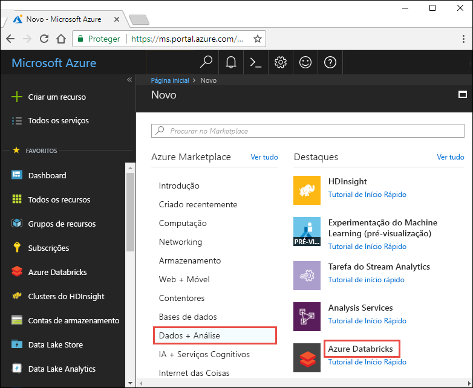
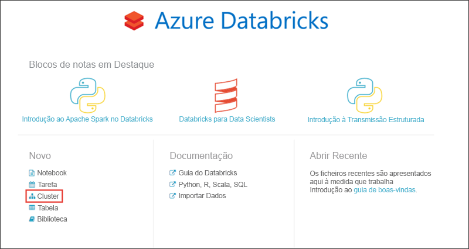
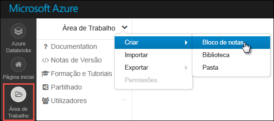
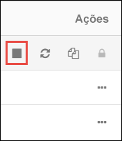

# <a name="tutorial-stream-data-into-azure-databricks-using-event-hubs"></a>Tutorial: Transmitir em fluxo dados para o Azure Databricks com os Hubs de Eventos

> [!IMPORTANT]
> Este tutorial funciona com a versão do Azure Databricks Runtime 5,2.

Neste tutorial, vai ligar um sistema de ingestão de dados com o Azure Databricks para transmitir dados para um cluster do Apache Spark em quase tempo real. Vai configurar o sistema de ingestão de dados com os Hubs de Eventos do Azure e, em seguida, ligá-lo ao Azure Databricks para processar as mensagens recebidas. Para aceder a uma transmissão de dados, utilize as APIs do Twitter para ingerir os tweets nos Hubs de Eventos. Depois de ter os dados no Azure Databricks, pode executar tarefas analíticas para analisar os dados mais detalhadamente.

No final deste tutorial, deverá ter transmitido tweets do Twitter em fluxo, (que incluem o termo "Azure" nos mesmos) e ler os tweets no Azure Databricks.

A ilustração seguinte mostra o fluxo da aplicação:


Este tutorial abrange as seguintes tarefas:

> [!div class="checklist"]
> * Criar uma área de trabalho do Azure Databricks
> * Criar um cluster do Spark no Azure Databricks
> * Criar uma aplicação no Twitter para aceder a dados de transmissão
> * Criar blocos de notas no Azure Databricks
> * Anexar bibliotecas aos Hubs de Eventos e à API do Twitter
> * Enviar tweets para os Hubs de Eventos
> * Ler tweets dos Hubs de Eventos

Se não tiver uma subscrição do Azure, [crie uma conta gratuita](https://azure.microsoft.com/free/) antes de começar.

> [!Note]
> Este tutorial não pode ser executado usando a **assinatura de avaliação gratuita do Azure**.
> Se você tiver uma conta gratuita, vá para seu perfil e altere sua assinatura para pré- **pago**. Para obter mais informações, veja [Conta gratuita do Azure](https://azure.microsoft.com/free/). Em seguida, [remova o limite de gastos](https://docs.microsoft.com/azure/billing/billing-spending-limit#remove-the-spending-limit-in-account-center)e [solicite um aumento de cota](https://docs.microsoft.com/azure/azure-supportability/resource-manager-core-quotas-request) para vCPUs em sua região. Ao criar seu espaço de trabalho Azure Databricks, você pode selecionar o tipo de preço de **avaliação (Premium-14 dias gratuitos DBUs)** para dar ao espaço de trabalho o acesso Premium Azure Databricks DBUs por 14 dias.

## <a name="prerequisites"></a>Pré-requisitos

Antes de começar este tutorial, certifique-se de que cumpre os seguintes requisitos:
- Um espaço de nomes dos Hubs de Eventos do Azure.
- Um Hub de Eventos no espaço de nomes.
- Cadeia de ligação para aceder ao espaço de nomes dos Hubs de Eventos. A cadeia de ligação deve ter um formato semelhante a `Endpoint=sb://<namespace>.servicebus.windows.net/;SharedAccessKeyName=<key name>;SharedAccessKey=<key value>`.
- O nome da política de acesso partilhado e a chave da política dos Hubs de Eventos.

Pode satisfazer estes requisitos, efetuando os passos no artigo, [Criar um espaço de nomes e um hub de eventos dos Hubs de Eventos do Azure](../event-hubs/event-hubs-create.md).

## <a name="sign-in-to-the-azure-portal"></a>Iniciar sessão no portal do Azure

Inicie sessão no [portal do Azure](https://portal.azure.com/).

## <a name="create-an-azure-databricks-workspace"></a>Criar uma área de trabalho do Azure Databricks

Nesta secção, vai criar uma área de trabalho do Azure Databricks com o portal do Azure.

1. No Portal do Azure, selecione **Criar um recurso** > **Dados + Análise** > **Azure Databricks**.

    

3. Em **Serviço Azure Databricks**, forneça os valores para criar uma área de trabalho do Databricks.

    

    Forneça os seguintes valores:

    |Propriedade  |Descrição  |
    |---------|---------|
    |**Nome da área de trabalho**     | Indique um nome para a sua área de trabalho do Databricks        |
    |**Subscrição**     | Na lista pendente, selecione a sua subscrição do Azure.        |
    |**Grupo de recursos**     | Especifique se quer criar um novo grupo de recursos ou utilizar um existente. Um grupo de recursos é um contentor que mantém recursos relacionados para uma solução do Azure. Para obter mais informações, veja [Descrição geral do Grupo de Recursos do Azure](../azure-resource-manager/resource-group-overview.md). |
    |**Localização**     | Selecione **E.U.A. Leste 2**. Para outras regiões disponíveis, veja [Serviços do Azure disponíveis por região](https://azure.microsoft.com/regions/services/).        |
    |**Escalão de Preço**     |  Escolha entre **Standard** ou **Premium**. Para obter mais informações sobre estes escalões, veja [Página de preços do Databricks](https://azure.microsoft.com/pricing/details/databricks/).       |

    Selecione **Afixar ao dashboard** e, em seguida, selecione **Criar**.

4. A criação da conta demora alguns minutos. Durante a criação da conta, o portal apresenta o mosaico **Submeter a implementação para o Azure Databricks** no lado direito. Pode ter de se deslocar para a direita no dashboard para ver o mosaico. É também apresentada uma barra de progresso junto à parte superior do ecrã. Pode ver qualquer área de progresso.

    

## <a name="create-a-spark-cluster-in-databricks"></a>Criar um cluster do Spark no Databricks

1. No portal do Azure, aceda à área de trabalho do Databricks que criou e, em seguida, selecione **Iniciar Área de Trabalho**.

2. Será redirecionado para o portal do Azure Databricks. No portal, selecione **Cluster**.

    

3. Na página **Novo cluster**, indique os valores para criar um cluster.

    

    Aceite todos os outros valores predefinidos que não sejam os seguintes:

   * Introduza um nome para o cluster.
   * Para este artigo, crie um cluster com o tempo de execução **5,2** .
   * Certifique-se de que seleciona a caixa de verificação **Terminar após \_\_ minutos de atividade**. Indique uma duração (em minutos) para terminar o cluster, caso não esteja a ser utilizado.

   Selecione o tamanho de nó de operador e de trabalho do cluster adequado para seus critérios técnicos e [orçamento](https://azure.microsoft.com/en-us/pricing/details/databricks/).

     Selecione **Criar cluster**. Depois de o cluster estar em execução, pode anexar blocos de notas ao cluster e executar tarefas do Spark.

## <a name="create-a-twitter-application"></a>Criar uma aplicação do Twitter

Para receber um fluxo de tweets, crie uma aplicação no Twitter. Siga as instruções para criar uma aplicação no Twitter e registe os valores que precisa para concluir este tutorial.

1. Em um navegador da Web, vá para [Twitter para desenvolvedores](https://developer.twitter.com/en/apps)e selecione **criar um aplicativo**. Você pode ver uma mensagem dizendo que precisa ser aplicada a uma conta de desenvolvedor do Twitter. Fique à vontade para fazer isso e, depois que seu aplicativo tiver sido aprovado, você deverá ver um email de confirmação. Pode levar vários dias para ser aprovado para uma conta de desenvolvedor.

    

2. Na página **Criar uma aplicação**, forneça os detalhes da nova aplicação e, em seguida, selecione **Criar a sua aplicação do Twitter**.

    

    

3. Na página do aplicativo, selecione a guia **chaves e tokens** e copie os valores da **chave de API do consumidor** e da **chave secreta da API do consumidor**. Além disso, selecione **criar** sob **token de acesso e segredo de token de acesso** para gerar os tokens de acesso. Copie os valores de **Token de Acesso** e **Segredo de Token de Acesso**.

    

Guarde os valores que obteve da aplicação do Twitter. Vai precisar dos valores mais tarde no tutorial.

## <a name="attach-libraries-to-spark-cluster"></a>Anexar bibliotecas ao cluster do Spark

Neste tutorial, vai utilizar as APIs do Twitter para enviar tweets para os Hubs de Eventos. Também pode utilizar o [Conector de Hubs de eventos do Spark](https://github.com/Azure/azure-event-hubs-spark) para ler e escrever dados em Hubs de Eventos do Azure. Para usar essas APIs como parte do cluster, adicione-as como bibliotecas para Azure Databricks e associá-las ao cluster do Spark. As instruções a seguir mostram como adicionar uma biblioteca.

1. No espaço de trabalho Azure Databricks, selecione **clusters**e escolha o cluster Spark existente. No menu do cluster, escolha **bibliotecas** e clique em **instalar novo**.

   

   

2. Na página nova biblioteca, para **origem** , selecione **Maven**. Para **coordenar**, clique em **Pesquisar pacotes** para o pacote que você deseja adicionar. Eis as coordenadas do Maven para as bibliotecas utilizadas neste tutorial:

   * Conector de Hubs de Eventos do Spark – `com.microsoft.azure:azure-eventhubs-spark_2.11:2.3.10`
   * API do Twitter – `org.twitter4j:twitter4j-core:4.0.7`

     

     

3. Selecione **Instalar**.

4. No menu do cluster, verifique se ambas as bibliotecas estão instaladas e conectadas corretamente.

    

6. Repita estes passos para o pacote do Twitter, `twitter4j-core:4.0.7`.

## <a name="create-notebooks-in-databricks"></a>Criar blocos de notas no Databricks

Nesta secção, vai criar dois blocos de notas na área de trabalho do Databricks, com os seguintes nomes:

- **SendTweetsToEventHub** – Um bloco de notas de produtor que utiliza para obter tweets do Twitter e transmiti-los para os Hubs de Eventos.
- **ReadTweetsFromEventHub** – Um bloco de notas de consumidor que utiliza para ler os tweets dos Hubs de Eventos.

1. No painel esquerdo, selecione **Área de Trabalho**. No menu pendente **Área de Trabalho**, selecione **Criar** > **Bloco de Notas**.

    

2. Na caixa de diálogo **Criar Bloco de Notas**, introduza **SendTweetsToEventHub**, selecione **Scala** como linguagem e selecione o cluster do Spark que criou anteriormente.

    

    Selecione **Criar**.

3. Repita os passos para criar o bloco de notas **ReadTweetsFromEventHub**.

## <a name="send-tweets-to-event-hubs"></a>Enviar tweets para os Hubs de Eventos

No notebook **SendTweetsToEventHub** , Cole o código a seguir e substitua os espaços reservados por valores para seu namespace de hubs de eventos e o aplicativo do Twitter que você criou anteriormente. Este bloco de notas transmite os tweets com a palavra-chave "Azure" para os Hubs de Eventos em tempo real.

> [!NOTE]
> A API do Twitter tem determinadas restrições de solicitação e [cotas](https://developer.twitter.com/en/docs/basics/rate-limiting.html). Se você não estiver satisfeito com a limitação de taxa padrão na API do Twitter, poderá gerar conteúdo de texto sem usar a API do Twitter neste exemplo. Para fazer isso, defina **DataSource** de variável `test` como em `twitter` vez de e preencha o **TestName** da lista com a entrada de teste preferencial.

```scala
    import scala.collection.JavaConverters._
    import com.microsoft.azure.eventhubs._
    import java.util.concurrent._
    import scala.collection.immutable._
    import scala.concurrent.Future
    import scala.concurrent.ExecutionContext.Implicits.global

    val namespaceName = "<EVENT HUBS NAMESPACE>"
    val eventHubName = "<EVENT HUB NAME>"
    val sasKeyName = "<POLICY NAME>"
    val sasKey = "<POLICY KEY>"
    val connStr = new ConnectionStringBuilder()
                .setNamespaceName(namespaceName)
                .setEventHubName(eventHubName)
                .setSasKeyName(sasKeyName)
                .setSasKey(sasKey)

    val pool = Executors.newScheduledThreadPool(1)
    val eventHubClient = EventHubClient.create(connStr.toString(), pool)

    def sleep(time: Long): Unit = Thread.sleep(time)

    def sendEvent(message: String, delay: Long) = {
      sleep(delay)
      val messageData = EventData.create(message.getBytes("UTF-8"))
      eventHubClient.get().send(messageData)
      System.out.println("Sent event: " + message + "\n")
    }

    // Add your own values to the list
    val testSource = List("Azure is the greatest!", "Azure isn't working :(", "Azure is okay.")

    // Specify 'test' if you prefer to not use Twitter API and loop through a list of values you define in `testSource`
    // Otherwise specify 'twitter'
    val dataSource = "test"

    if (dataSource == "twitter") {

      import twitter4j._
      import twitter4j.TwitterFactory
      import twitter4j.Twitter
      import twitter4j.conf.ConfigurationBuilder

      // Twitter configuration!
      // Replace values below with you

      val twitterConsumerKey = "<CONSUMER API KEY>"
      val twitterConsumerSecret = "<CONSUMER API SECRET>"
      val twitterOauthAccessToken = "<ACCESS TOKEN>"
      val twitterOauthTokenSecret = "<TOKEN SECRET>"

      val cb = new ConfigurationBuilder()
        cb.setDebugEnabled(true)
        .setOAuthConsumerKey(twitterConsumerKey)
        .setOAuthConsumerSecret(twitterConsumerSecret)
        .setOAuthAccessToken(twitterOauthAccessToken)
        .setOAuthAccessTokenSecret(twitterOauthTokenSecret)

      val twitterFactory = new TwitterFactory(cb.build())
      val twitter = twitterFactory.getInstance()

      // Getting tweets with keyword "Azure" and sending them to the Event Hub in realtime!
      val query = new Query(" #Azure ")
      query.setCount(100)
      query.lang("en")
      var finished = false
      while (!finished) {
        val result = twitter.search(query)
        val statuses = result.getTweets()
        var lowestStatusId = Long.MaxValue
        for (status <- statuses.asScala) {
          if(!status.isRetweet()){
            sendEvent(status.getText(), 5000)
          }
          lowestStatusId = Math.min(status.getId(), lowestStatusId)
        }
        query.setMaxId(lowestStatusId - 1)
      }

    } else if (dataSource == "test") {
      // Loop through the list of test input data
      while (true) {
        testSource.foreach {
          sendEvent(_,5000)
        }
      }

    } else {
      System.out.println("Unsupported Data Source. Set 'dataSource' to \"twitter\" or \"test\"")
    }

    // Closing connection to the Event Hub
    eventHubClient.get().close()
```

Para executar o bloco de notas, prima **SHIFT + ENTER**. Pode ver um resultado como o fragmento abaixo. Cada evento no resultado é um tweet que é ingerido nos Hubs de Eventos com o termo "Azure".

    Sent event: @Microsoft and @Esri launch Geospatial AI on Azure https://t.co/VmLUCiPm6q via @geoworldmedia #geoai #azure #gis #ArtificialIntelligence

    Sent event: Public preview of Java on App Service, built-in support for Tomcat and OpenJDK
    https://t.co/7vs7cKtvah
    #cloudcomputing #Azure

    Sent event: 4 Killer #Azure Features for #Data #Performance https://t.co/kpIb7hFO2j by @RedPixie

    Sent event: Migrate your databases to a fully managed service with Azure SQL Database Managed Instance | #Azure | #Cloud https://t.co/sJHXN4trDk

    Sent event: Top 10 Tricks to #Save Money with #Azure Virtual Machines https://t.co/F2wshBXdoz #Cloud

    ...
    ...

## <a name="read-tweets-from-event-hubs"></a>Ler tweets dos Hubs de Eventos

No bloco de notas **ReadTweetsFromEventHub**, cole o seguinte código e substitua o marcador de posição pelos valores dos Hubs de Eventos do Azure que criou anteriormente. Este bloco de notas lê os tweets que transmitiu anteriormente para os Hubs de Eventos através do bloco de notas **SendTweetsToEventHub**.

```scala

    import org.apache.spark.eventhubs._
    import com.microsoft.azure.eventhubs._

    // Build connection string with the above information
    val namespaceName = "<EVENT HUBS NAMESPACE>"
    val eventHubName = "<EVENT HUB NAME>"
    val sasKeyName = "<POLICY NAME>"
    val sasKey = "<POLICY KEY>"
    val connStr = new com.microsoft.azure.eventhubs.ConnectionStringBuilder()
                .setNamespaceName(namespaceName)
                .setEventHubName(eventHubName)
                .setSasKeyName(sasKeyName)
                .setSasKey(sasKey)

    val customEventhubParameters =
      EventHubsConf(connStr.toString())
      .setMaxEventsPerTrigger(5)

    val incomingStream = spark.readStream.format("eventhubs").options(customEventhubParameters.toMap).load()

    incomingStream.printSchema

    // Sending the incoming stream into the console.
    // Data comes in batches!
    incomingStream.writeStream.outputMode("append").format("console").option("truncate", false).start().awaitTermination()
```

Obtém o resultado seguinte:


    root
     |-- body: binary (nullable = true)
     |-- offset: long (nullable = true)
     |-- seqNumber: long (nullable = true)
     |-- enqueuedTime: long (nullable = true)
     |-- publisher: string (nullable = true)
     |-- partitionKey: string (nullable = true)

    -------------------------------------------
    Batch: 0
    -------------------------------------------
    +------+------+--------------+---------------+---------+------------+
    |body  |offset|sequenceNumber|enqueuedTime   |publisher|partitionKey|
    +------+------+--------------+---------------+---------+------------+
    |[50 75 62 6C 69 63 20 70 72 65 76 69 65 77 20 6F 66 20 4A 61 76 61 20 6F 6E 20 41 70 70 20 53 65 72 76 69 63 65 2C 20 62 75 69 6C 74 2D 69 6E 20 73 75 70 70 6F 72 74 20 66 6F 72 20 54 6F 6D 63 61 74 20 61 6E 64 20 4F 70 65 6E 4A 44 4B 0A 68 74 74 70 73 3A 2F 2F 74 2E 63 6F 2F 37 76 73 37 63 4B 74 76 61 68 20 0A 23 63 6C 6F 75 64 63 6F 6D 70 75 74 69 6E 67 20 23 41 7A 75 72 65]                              |0     |0             |2018-03-09 05:49:08.86 |null     |null        |
    |[4D 69 67 72 61 74 65 20 79 6F 75 72 20 64 61 74 61 62 61 73 65 73 20 74 6F 20 61 20 66 75 6C 6C 79 20 6D 61 6E 61 67 65 64 20 73 65 72 76 69 63 65 20 77 69 74 68 20 41 7A 75 72 65 20 53 51 4C 20 44 61 74 61 62 61 73 65 20 4D 61 6E 61 67 65 64 20 49 6E 73 74 61 6E 63 65 20 7C 20 23 41 7A 75 72 65 20 7C 20 23 43 6C 6F 75 64 20 68 74 74 70 73 3A 2F 2F 74 2E 63 6F 2F 73 4A 48 58 4E 34 74 72 44 6B]            |168   |1             |2018-03-09 05:49:24.752|null     |null        |
    +------+------+--------------+---------------+---------+------------+

    -------------------------------------------
    Batch: 1
    -------------------------------------------
    ...
    ...

Dado que o resultado está num modo binário, utilize o seguinte fragmento para convertê-lo numa cadeia.

```scala
    import org.apache.spark.sql.types._
    import org.apache.spark.sql.functions._

    // Event Hub message format is JSON and contains "body" field
    // Body is binary, so we cast it to string to see the actual content of the message
    val messages =
      incomingStream
      .withColumn("Offset", $"offset".cast(LongType))
      .withColumn("Time (readable)", $"enqueuedTime".cast(TimestampType))
      .withColumn("Timestamp", $"enqueuedTime".cast(LongType))
      .withColumn("Body", $"body".cast(StringType))
      .select("Offset", "Time (readable)", "Timestamp", "Body")

    messages.printSchema

    messages.writeStream.outputMode("append").format("console").option("truncate", false).start().awaitTermination()
```

O resultado assemelha-se agora ao seguinte fragmento:

    root
     |-- Offset: long (nullable = true)
     |-- Time (readable): timestamp (nullable = true)
     |-- Timestamp: long (nullable = true)
     |-- Body: string (nullable = true)

    -------------------------------------------
    Batch: 0
    -------------------------------------------
    +------+-----------------+----------+-------+
    |Offset|Time (readable)  |Timestamp |Body
    +------+-----------------+----------+-------+
    |0     |2018-03-09 05:49:08.86 |1520574548|Public preview of Java on App Service, built-in support for Tomcat and OpenJDK
    https://t.co/7vs7cKtvah
    #cloudcomputing #Azure          |
    |168   |2018-03-09 05:49:24.752|1520574564|Migrate your databases to a fully managed service with Azure SQL Database Managed Instance | #Azure | #Cloud https://t.co/sJHXN4trDk    |
    |0     |2018-03-09 05:49:02.936|1520574542|@Microsoft and @Esri launch Geospatial AI on Azure https://t.co/VmLUCiPm6q via @geoworldmedia #geoai #azure #gis #ArtificialIntelligence|
    |176   |2018-03-09 05:49:20.801|1520574560|4 Killer #Azure Features for #Data #Performance https://t.co/kpIb7hFO2j by @RedPixie                                                    |
    +------+-----------------+----------+-------+
    -------------------------------------------
    Batch: 1
    -------------------------------------------
    ...
    ...

Já está! Ao utilizar o Azure Databricks, transmitiu com êxito os dados para os Hubs de Eventos do Azure em quase tempo real. Em seguida, consumiu os dados de transmissão através do conector dos Hubs de Eventos para o Apache Spark. Para obter mais informações sobre como utilizar o conector Hubs de Eventos para Spark, veja a [documentação do conector](https://github.com/Azure/azure-event-hubs-spark/tree/master/docs).

## <a name="clean-up-resources"></a>Limpar recursos

Depois de executar o tutorial, pode terminar o cluster. Para tal, na área de trabalho do Azure Databricks, no painel esquerdo, selecione **Clusters**. Para o cluster que quer terminar, mova o cursor sobre o botão de reticências na coluna **Ações** e selecione o ícone **Terminar**.



Se não terminar manualmente o cluster, este irá parar automaticamente, desde que tenha selecionado a **terminar após \_ \_ minutos de inatividade** caixa de verificação ao criar o cluster. Nesse caso, o cluster para automaticamente se tiver estado inativo durante o período de tempo especificado.

## <a name="next-steps"></a>Passos seguintes
Neste tutorial, ficou a saber como:

> [!div class="checklist"]
> * Criar uma área de trabalho do Azure Databricks
> * Criar um cluster do Spark no Azure Databricks
> * Criar uma aplicação no Twitter para gerar dados de transmissão
> * Criar blocos de notas no Azure Databricks
> * Adicionar bibliotecas para a API do Twitter e dos Hubs de Eventos
> * Enviar tweets para os Hubs de Eventos
> * Ler tweets dos Hubs de Eventos

Avance para o próximo tutorial para saber mais sobre como executar a análise de sentimentos sobre os dados transmitidos usando Azure Databricks e a [API de serviços cognitivas](../cognitive-services/text-analytics/overview.md).

> [!div class="nextstepaction"]
>[Análise de sentimentos sobre streaming de dados usando Azure Databricks](databricks-sentiment-analysis-cognitive-services.md)
