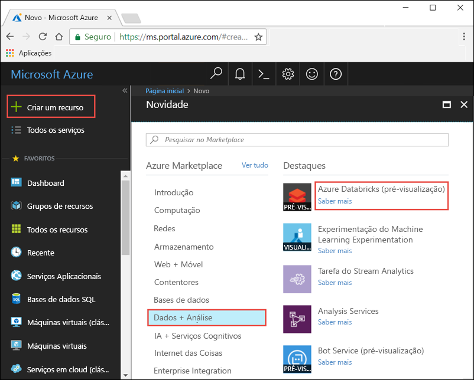
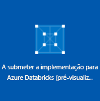
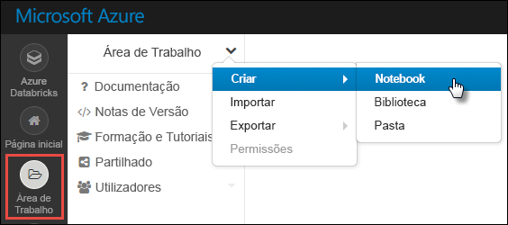
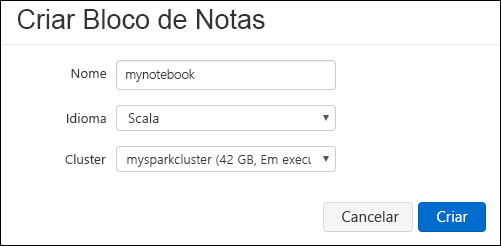
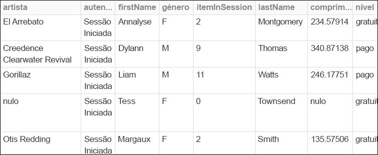
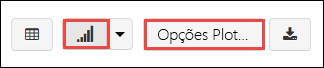

# <a name="quickstart-run-a-spark-job-on-azure-databricks-using-the-azure-portal"></a>Início rápido: Executar uma tarefa do Spark no Azure Databricks com o portal do Azure

Neste guia de início rápido, você usa o portal do Azure para criar um espaço de trabalho Azure Databricks com um cluster Apache Spark. Você executa um trabalho no cluster e usa gráficos personalizados para produzir relatórios em tempo real de dados de segurança do Boston.

## <a name="prerequisites"></a>Pré-requisitos

- Assinatura do Azure- [crie uma gratuitamente](https://azure.microsoft.com/free/)

## <a name="sign-in-to-the-azure-portal"></a>Iniciar sessão no portal do Azure

Inicie sessão no [portal do Azure](https://portal.azure.com).

> [!Note]
> Este tutorial não pode ser executado usando a **assinatura de avaliação gratuita do Azure**.
> Se você tiver uma conta gratuita, vá para seu perfil e altere sua assinatura para pré- **pago**. Para obter mais informações, veja [Conta gratuita do Azure](https://azure.microsoft.com/free/). Em seguida, [remova o limite de gastos](https://docs.microsoft.com/azure/billing/billing-spending-limit#why-you-might-want-to-remove-the-spending-limit)e [solicite um aumento de cota](https://docs.microsoft.com/azure/azure-supportability/resource-manager-core-quotas-request) para vCPUs em sua região. Ao criar seu espaço de trabalho Azure Databricks, você pode selecionar o tipo de preço de **avaliação (Premium-14 dias gratuitos DBUs)** para dar ao espaço de trabalho o acesso Premium Azure Databricks DBUs por 14 dias.

## <a name="create-an-azure-databricks-workspace"></a>Criar uma área de trabalho do Azure Databricks

Nesta secção, vai criar uma área de trabalho do Azure Databricks com o portal do Azure.

1. No Portal do Azure, selecione **Criar um recurso** > **Análise** > **Azure Databricks**.

    

2. Em **Serviço Azure Databricks**, forneça os valores para criar uma área de trabalho do Databricks.

    

    Forneça os seguintes valores:
    
    |Propriedade  |Descrição  |
    |---------|---------|
    |**Nome da área de trabalho**     | Indique um nome para a sua área de trabalho do Databricks        |
    |**Subscrição**     | Na lista pendente, selecione a sua subscrição do Azure.        |
    |**Grupo de recursos**     | Especifique se quer criar um novo grupo de recursos ou utilizar um existente. Um grupo de recursos é um contentor que mantém recursos relacionados para uma solução do Azure. Para obter mais informações, veja [Descrição geral do Grupo de Recursos do Azure](../azure-resource-manager/resource-group-overview.md). |
    |**Localização**     | Selecione **E.U.A. Oeste 2**. Para outras regiões disponíveis, veja [Serviços do Azure disponíveis por região](https://azure.microsoft.com/regions/services/).        |
    |**Escalão de Preço**     |  Escolha entre **Standard**, **Premium**ou **avaliação**. Para obter mais informações sobre estes escalões, veja [Página de preços do Databricks](https://azure.microsoft.com/pricing/details/databricks/).       |
    |**Rede Virtual**     |  Escolha implantar um espaço de trabalho Azure Databricks em sua própria rede virtual (VNet). Para obter mais informações, consulte [implantar Azure Databricks em sua rede virtual do Azure (injeção de VNet)](/azure/databricks/administration-guide/cloud-configurations/azure/vnet-inject).        |

    Selecione **Criar**.

4. A criação da área de trabalho demora alguns minutos. Durante a criação do espaço de trabalho, você pode exibir o status da implantação em **notificações**.

    

## <a name="create-a-spark-cluster-in-databricks"></a>Criar um cluster do Spark no Databricks

> [!NOTE]
> Para utilizar uma conta gratuita para criar o cluster do Azure Databricks, antes de criar o cluster, aceda ao seu perfil e altere a subscrição para **pay as you go**. Para obter mais informações, veja [Conta gratuita do Azure](https://azure.microsoft.com/free/).

1. No portal do Azure, aceda à área de trabalho do Databricks que criou e, em seguida, clique em **Iniciar Área de Trabalho**.

2. Será redirecionado para o portal do Azure Databricks. No portal, clique em **novo cluster**.

    

3. Na página **Novo cluster**, indique os valores para criar um cluster.

    

    Aceite todos os outros valores predefinidos que não sejam os seguintes:

   * Introduza um nome para o cluster.
   * Para este artigo, crie um cluster com o tempo de execução **5,3** .
   * Certifique-se de que seleciona a caixa de verificação **Terminar após \_\_ minutos de atividade**. Indique uma duração (em minutos) para terminar o cluster, caso não esteja a ser utilizado.
    
     Selecione **Criar cluster**. Depois de o cluster estar em execução, pode anexar blocos de notas ao cluster e executar tarefas do Spark.

Para obter mais informações sobre a criação de clusters, veja [Criar um cluster do Spark no Azure Databricks](https://docs.azuredatabricks.net/user-guide/clusters/create.html).

## <a name="run-a-spark-sql-job"></a>Executar uma tarefa SQL do Spark

Execute as tarefas a seguir para criar um bloco de anotações no databricks, configurar o bloco de anotações para ler dados de um Azure Open DataSets e, em seguida, executar um trabalho SQL do Spark nos dados.

1. No painel esquerdo, selecione **Azure Databricks**. Nas **tarefas comuns**, selecione **novo bloco de anotações**.

    

2. Na caixa de diálogo **criar bloco de anotações** , insira um nome, selecione **Python** como o idioma e selecione o cluster Spark que você criou anteriormente.

    

    Selecione **Criar**.

3. Nesta etapa, crie um dataframe do Spark com dados de segurança do Boston a partir do [Azure Open Data Sets](https://azure.microsoft.com/services/open-datasets/catalog/boston-safety-data/#AzureDatabricks)e use o SQL para consultar os dados.

   O comando a seguir define as informações de acesso de armazenamento do Azure. Cole esse código PySpark na primeira célula e use **Shift + Enter** para executar o código.

   ```python
   blob_account_name = "azureopendatastorage"
   blob_container_name = "citydatacontainer"
   blob_relative_path = "Safety/Release/city=Boston"
   blob_sas_token = r"?st=2019-02-26T02%3A34%3A32Z&se=2119-02-27T02%3A34%3A00Z&sp=rl&sv=2018-03-28&sr=c&sig=XlJVWA7fMXCSxCKqJm8psMOh0W4h7cSYO28coRqF2fs%3D"
   ```

   O comando a seguir permite que o Spark Leia a partir do armazenamento de BLOBs remotamente. Cole esse código PySpark na próxima célula e use **Shift + Enter** para executar o código.

   ```python
   wasbs_path = 'wasbs://%s@%s.blob.core.windows.net/%s' % (blob_container_name, blob_account_name, blob_relative_path)
   spark.conf.set('fs.azure.sas.%s.%s.blob.core.windows.net' % (blob_container_name, blob_account_name), blob_sas_token)
   print('Remote blob path: ' + wasbs_path)
   ```

   O comando a seguir cria um dataframe. Cole esse código PySpark na próxima célula e use **Shift + Enter** para executar o código.

   ```python
   df = spark.read.parquet(wasbs_path)
   print('Register the DataFrame as a SQL temporary view: source')
   df.createOrReplaceTempView('source')
   ```

4. Executar uma instrução SQL retorna as 10 principais linhas de dados da exibição temporária chamada **Source**. Cole esse código PySpark na próxima célula e use **Shift + Enter** para executar o código.

   ```python
   print('Displaying top 10 rows: ')
   display(spark.sql('SELECT * FROM source LIMIT 10'))
   ```

5. Verá uma saída tabular, como a apresentada na captura de ecrã seguinte, (apenas são apresentadas algumas colunas):

    

6. Agora você cria uma representação visual desses dados para mostrar quantos eventos de segurança são relatados usando o aplicativo cidadãos-Connect e o aplicativo City Worker em vez de outras fontes. Na parte inferior da saída tabular, selecione o ícone de **gráfico de barras** e clique em **Opções de plotagem**.

    

8. Em **Personalizar Desenho**, arraste e largue os valores, conforme mostra a captura de ecrã.

    

   * Defina **as chaves** como **origem**.
   * Defina **valores** como **< \id >** .
   * Defina **Agregação** como **CONTAGEM**.
   * Defina **tipo de exibição** como **gráfico de pizza**.

     Clique em **Aplicar**.

## <a name="clean-up-resources"></a>Limpar recursos

Depois de ler o artigo, pode terminar o cluster. Para tal, na área de trabalho do Azure Databricks, no painel esquerdo, selecione **Clusters**. Para o cluster que quer terminar, mova o cursor sobre o botão de reticências na coluna **Ações** e selecione o ícone **Terminar**.


Se você não encerrar manualmente o cluster, ele será interrompido automaticamente, desde que você tenha selecionado a caixa de seleção **terminar depois de \_\_ minutos de inatividade** ao criar o cluster. Nesse caso, o cluster para automaticamente se tiver estado inativo durante o período de tempo especificado.

## <a name="next-steps"></a>Passos seguintes

Neste artigo, você criou um cluster Spark no Azure Databricks e executou um trabalho do Spark usando dados de conjuntos de dados abertos do Azure. Também pode ver a página [Origens de dados do Spark](https://docs.azuredatabricks.net/spark/latest/data-sources/index.html) para saber como importar dados de outras origens de dados para o Azure Databricks. Avance para o artigo seguinte para saber como executar uma operação de ETL (extração, transformação e carregamento de dados) com o Azure Databricks.

> [!div class="nextstepaction"]
>[Extrair, transformar e carregar dados com o Azure Databricks](databricks-extract-load-sql-data-warehouse.md)
